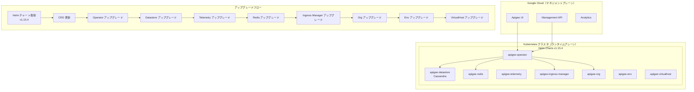

# Apigee hybrid: v1.15.4 セキュリティパッチリリース

**リリース日**: 2026-05-30

**サービス**: Apigee hybrid

**機能**: v1.15.4 セキュリティおよび CVE 修正パッチ

**ステータス**: 提供開始

📊 [このアップデートのインフォグラフィックを見る](https://takech9203.github.io/google-cloud-news-summary/20260530-apigee-hybrid-v1-15-4-security.html)

## 概要

2026年5月30日、Google Cloud は Apigee hybrid ソフトウェアの更新版 v1.15.4 をリリースしました。本リリースはセキュリティパッチリリースであり、各種セキュリティ修正および CVE（Common Vulnerabilities and Exposures）対応が含まれています。

Apigee hybrid のパッチリリースでは、使用されるコンテナイメージが Helm チャートに統合されています。そのため、Helm チャートを通じてパッチバージョンへアップグレードすると、コンテナイメージも自動的に更新されます。通常、手動でのイメージ変更は不要です。

v1.15 系列は現在もサポートされているバージョンであり、本パッチはランタイムプレーンのセキュリティポスチャを最新の状態に保つために重要なアップデートです。Apigee hybrid をオンプレミスまたはマルチクラウド環境で運用しているすべてのユーザーに対して、早期の適用が推奨されます。

**アップデート前の課題**

- 既知のセキュリティ脆弱性（CVE）がコンテナイメージに含まれている可能性がある
- セキュリティリスクへの露出が継続している状態
- コンプライアンス要件を満たすために最新のパッチ適用が必要

**アップデート後の改善**

- 各種 CVE に対するセキュリティ修正が適用され、脆弱性が解消される
- Helm チャート経由の自動イメージ更新により、手動介入なしでパッチ適用が完了する
- セキュリティコンプライアンス要件への準拠が維持される

## アーキテクチャ図



上図は Apigee hybrid のアーキテクチャコンポーネントと、Helm チャートによるパッチアップグレードの順序を示しています。マネジメントプレーンは Google Cloud で管理され、ランタイムプレーンはユーザーの Kubernetes クラスタ上で動作します。

## サービスアップデートの詳細

### 主要機能

1. **セキュリティおよび CVE 修正**
   - 各種セキュリティ脆弱性に対するパッチが適用
   - コンテナイメージのベースイメージおよび依存ライブラリのセキュリティ更新
   - ランタイムコンポーネント全体にわたるセキュリティ強化

2. **Helm チャート統合によるイメージ自動更新**
   - パッチリリースのコンテナイメージは Helm チャートに統合済み
   - `helm upgrade` コマンドによりイメージが自動的に最新版に更新
   - 手動でのイメージタグ変更やコンテナレジストリ操作が不要

## 技術仕様

### サポートされるコンポーネントバージョン

| コンポーネント | 対応バージョン |
|------|------|
| Kubernetes | 1.29.x - 1.33.x |
| Helm | 3.14.2+ |
| cert-manager | 1.16.x / 1.17.x |
| Cassandra | 4.0 |
| JDK | JDK 11 |
| Cloud Service Mesh | 1.22.x |
| Secret Store CSI driver | 1.4.6+ |
| Vault | 1.17.2 |

### コンテナイメージリポジトリ

```
gcr.io/apigee-release/hybrid/
```

## 設定方法

### 前提条件

1. 既存の Apigee hybrid v1.15.x 環境が稼働していること
2. Helm v3.14.2 以上がインストールされていること
3. 対応バージョンの kubectl が利用可能であること

### 手順

#### ステップ 1: Helm チャートの取得

```bash
export CHART_REPO=oci://us-docker.pkg.dev/apigee-release/apigee-hybrid-helm-charts
export CHART_VERSION=1.15.4

helm pull $CHART_REPO/apigee-operator --version $CHART_VERSION --untar
helm pull $CHART_REPO/apigee-datastore --version $CHART_VERSION --untar
helm pull $CHART_REPO/apigee-env --version $CHART_VERSION --untar
helm pull $CHART_REPO/apigee-ingress-manager --version $CHART_VERSION --untar
helm pull $CHART_REPO/apigee-org --version $CHART_VERSION --untar
helm pull $CHART_REPO/apigee-redis --version $CHART_VERSION --untar
helm pull $CHART_REPO/apigee-telemetry --version $CHART_VERSION --untar
helm pull $CHART_REPO/apigee-virtualhost --version $CHART_VERSION --untar
```

#### ステップ 2: CRD の更新

```bash
kubectl apply -k apigee-operator/etc/crds/default/ \
  --server-side \
  --force-conflicts \
  --validate=false
```

#### ステップ 3: 各コンポーネントの順次アップグレード

```bash
# Operator のアップグレード
helm upgrade operator apigee-operator/ \
  --install \
  --namespace APIGEE_NAMESPACE \
  -f OVERRIDES_FILE

# Datastore のアップグレード
helm upgrade datastore apigee-datastore/ \
  --install \
  --namespace APIGEE_NAMESPACE \
  -f OVERRIDES_FILE

# Telemetry のアップグレード
helm upgrade telemetry apigee-telemetry/ \
  --install \
  --namespace APIGEE_NAMESPACE \
  -f OVERRIDES_FILE

# Redis のアップグレード
helm upgrade redis apigee-redis/ \
  --install \
  --namespace APIGEE_NAMESPACE \
  -f OVERRIDES_FILE

# Ingress Manager のアップグレード
helm upgrade ingress-manager apigee-ingress-manager/ \
  --install \
  --namespace APIGEE_NAMESPACE \
  -f OVERRIDES_FILE

# Org のアップグレード
helm upgrade ORG_NAME apigee-org/ \
  --install \
  --namespace APIGEE_NAMESPACE \
  -f OVERRIDES_FILE

# Env のアップグレード（環境ごとに実行）
helm upgrade ENV_RELEASE_NAME apigee-env/ \
  --install \
  --namespace APIGEE_NAMESPACE \
  --set env=ENV_NAME \
  -f OVERRIDES_FILE

# VirtualHost のアップグレード（環境グループごとに実行）
helm upgrade ENV_GROUP_RELEASE_NAME apigee-virtualhost/ \
  --install \
  --namespace APIGEE_NAMESPACE \
  --set envgroup=ENV_GROUP_NAME \
  -f OVERRIDES_FILE
```

#### ステップ 4: アップグレードの確認

```bash
# Operator の確認
kubectl -n APIGEE_NAMESPACE get deploy apigee-controller-manager

# Datastore の確認
kubectl -n APIGEE_NAMESPACE get apigeedatastore default

# 全体の Helm リリース確認
helm ls -n APIGEE_NAMESPACE
```

## メリット

### ビジネス面

- **コンプライアンス維持**: セキュリティパッチの迅速な適用により、PCI DSS、SOC 2 等のコンプライアンス要件を継続的に満たすことが可能
- **リスク軽減**: 既知の CVE への対応により、セキュリティインシデントのリスクを低減

### 技術面

- **自動化されたイメージ更新**: Helm チャート経由でコンテナイメージが自動更新されるため、運用負荷が最小限
- **ローリングアップデート対応**: Kubernetes のローリングアップデート機構を活用し、ダウンタイムを最小化
- **ロールバック可能**: 問題発生時は `helm rollback` で以前のバージョンに戻すことが可能

## デメリット・制約事項

### 制限事項

- 本パッチは v1.15.x 系列のみに適用可能（v1.14 以前からの直接アップグレードは不可）
- アップグレード中はランタイムコンポーネントのローリングリスタートが発生する

### 考慮すべき点

- 本番環境でのアップグレード時は、複数クラスタ構成においてトラフィックを別クラスタに切り替えてから実施することを推奨
- アップグレード前に Cassandra データベースのバックアップを取得することを推奨
- dry-run オプション（`--dry-run=server`）を事前に実行し、問題がないことを確認すること

## ユースケース

### ユースケース 1: 定期セキュリティパッチ適用

**シナリオ**: 金融機関が PCI DSS 準拠のために毎月のセキュリティパッチ適用を義務付けられている環境で、Apigee hybrid を API ゲートウェイとして使用している。

**効果**: Helm チャート経由の自動更新により、運用チームの作業を最小限に抑えながら、コンプライアンス要件を満たすパッチ適用が実現される。

### ユースケース 2: マルチクラウド環境でのセキュリティ統制

**シナリオ**: AWS EKS と GKE の両方で Apigee hybrid を運用している企業が、全クラスタにわたるセキュリティポリシーを一貫して適用したい。

**効果**: 同一の Helm チャートとアップグレード手順により、プラットフォーム非依存で統一的なセキュリティパッチ適用が可能。

## 料金

Apigee hybrid のパッチアップグレード自体に追加料金は発生しません。Apigee hybrid の料金は既存のサブスクリプションプランに基づきます。

## 関連サービス・機能

- **Apigee hybrid v1.16.x**: 最新のメジャーバージョン。v1.15 からのアップグレードパスが用意されている
- **Apigee hybrid v1.14.5**: 同日近傍にリリースされた v1.14 系列のセキュリティパッチ
- **Google Artifact Registry**: Helm チャートのホスティングに使用（`oci://us-docker.pkg.dev/apigee-release/apigee-hybrid-helm-charts`）
- **cert-manager**: Apigee hybrid の TLS 証明書管理に必要なコンポーネント

## 参考リンク

- 📊 [インフォグラフィック](https://takech9203.github.io/google-cloud-news-summary/20260530-apigee-hybrid-v1-15-4-security.html)
- [公式リリースノート](https://docs.cloud.google.com/release-notes#May_30_2026)
- [Apigee hybrid リリースノート](https://docs.cloud.google.com/apigee/docs/hybrid/release-notes)
- [Apigee hybrid v1.15 アップグレードガイド](https://docs.cloud.google.com/apigee/docs/hybrid/v1.15/upgrade)
- [Apigee hybrid v1.15 概要](https://docs.cloud.google.com/apigee/docs/hybrid/v1.15/what-is-hybrid)
- [サポートされるプラットフォームとバージョン](https://docs.cloud.google.com/apigee/docs/hybrid/supported-platforms)
- [Apigee リリースプロセス](https://docs.cloud.google.com/apigee/docs/release/apigee-release-process#apigee-hybrid-container-images)

## まとめ

Apigee hybrid v1.15.4 は、セキュリティ脆弱性の修正を中心としたパッチリリースです。Helm チャートを通じた自動イメージ更新により、運用負荷を最小限に抑えつつランタイムプレーンのセキュリティを最新状態に保つことができます。v1.15 系列を運用中のすべてのユーザーは、セキュリティリスク軽減のために早期のアップグレードを推奨します。

---

**タグ**: #Apigee #ApigeeHybrid #Security #CVE #PatchRelease #Helm #Kubernetes #APIManagement #v1.15.4
