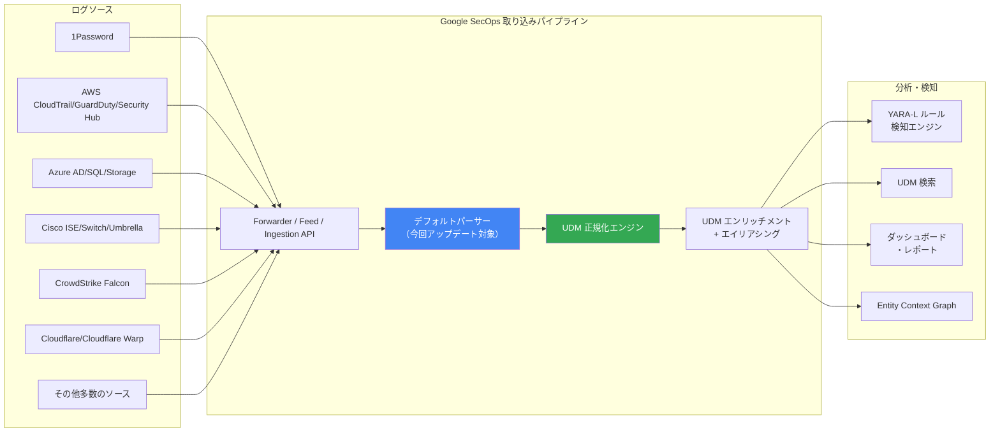

# Google SecOps (SIEM): デフォルトパーサーの一括アップデート

**リリース日**: 2026-05-31

**サービス**: Google SecOps (SIEM)

**機能**: サポート対象デフォルトパーサーの更新

**ステータス**: 段階的ロールアウト中（反映まで1〜4日）

📊 [このアップデートのインフォグラフィックを見る](https://takech9203.github.io/google-cloud-news-summary/20260531-google-secops-parser-updates.html)

## 概要

Google SecOps (旧 Chronicle SIEM) において、サポート対象のデフォルトパーサーリストが大規模に更新されました。デフォルトパーサーは、各種セキュリティデバイスやクラウドサービスから取得した生ログデータを、Google SecOps の統一データモデル (UDM: Unified Data Model) 形式に正規化（パース）するための事前構築済みコンポーネントです。

今回のアップデートでは、1Password、Apache、AWS 系サービス、Azure 系サービス、Cisco 系製品、CrowdStrike、Cloudflare など、広範なカテゴリにわたる多数のパーサーが更新されています。これにより、各種ログソースの最新フォーマットへの対応強化、パース精度の向上、新規フィールドのマッピング追加などが期待されます。

パーサーの更新は段階的にリージョンへ展開されるため、変更がお客様の環境に反映されるまで1〜4日かかる場合があります。更新は新規に取り込まれるログに対して適用され、過去に取り込み済みのログには遡及適用されません。

**アップデート前の課題**

- 一部のログソースにおいて、フォーマット変更や新規フィールド追加に対するパーサーが未対応であった
- 特定のベンダー製品からのログで、正規化の精度に改善の余地があった
- 新しいバージョンのログフォーマットに対して UDM マッピングが不完全な場合があった

**アップデート後の改善**

- 対象となる各パーサーの最新ログフォーマットへの対応が強化された
- UDM へのマッピング精度が向上し、より多くのフィールドが構造化データとして活用可能になった
- セキュリティ検知ルールや YARA-L ルールが、より正確なイベントデータに基づいて動作する

## アーキテクチャ図

生ログは各種ソースから Forwarder、Feed、または Ingestion API を通じて Google SecOps に取り込まれ、デフォルトパーサーが UDM 形式への正規化を行います。今回のアップデートは、この正規化プロセスを担うデフォルトパーサーの更新です。

## サービスアップデートの詳細

### 主要機能

1. **デフォルトパーサーの自動更新**
   - Google SecOps が管理する事前構築済みパーサーが自動的にアップデートされる
   - ユーザー側での作業は不要で、段階的に各リージョンへ反映される
   - 更新反映には1〜4日かかる場合がある

2. **広範なログソースカテゴリへの対応**
   - クラウドサービス (AWS, Azure, GCP)
   - エンドポイントセキュリティ (CrowdStrike, Cisco)
   - ネットワークセキュリティ (Cloudflare, Blue Coat, Barracuda)
   - ID/アクセス管理 (1Password, Azure AD)
   - インフラストラクチャ (Apache, AIX, Citrix)

3. **UDM 正規化品質の向上**
   - 各パーサーのフィールドマッピングが改善され、UDM レコードの網羅性が向上
   - 新規フィールドの追加により、検知ルールや検索の精度が向上

### 更新対象パーサー一覧（一部抜粋）

| カテゴリ | パーサー名 |
|----------|------------|
| ID/アクセス管理 | 1Password Audit Events |
| OS/インフラ | AIX system |
| Web サーバー | Apache |
| SD-WAN | Aruba EdgeConnect SD-WAN |
| 通信基盤 | Avaya Aura Experience Portal |
| AWS | AWS CloudFront, AWS CloudTrail, AWS GuardDuty, AWS Security Hub |
| Azure | Azure AD, Azure AD Organizational Context, Azure AD Sign-In, Azure SQL, Azure Storage Audit |
| WAF | Barracuda WAF |
| プロキシ | Blue Coat Proxy |
| エンドポイント | Chrome Management |
| ネットワーク | Cisco ACS, Cisco ISE, Cisco Secure Access, Cisco Secure Workload, Cisco Switch, Cisco Umbrella Audit |
| ADC | Citrix Netscaler |
| OT セキュリティ | Claroty Xdome |
| AI/コンプライアンス | Claude Compliance Logs |
| CDN/セキュリティ | Cloudflare, Cloudflare Warp |
| NDR | Corelight |
| EDR | CrowdStrike Alerts API, CrowdStrike Falcon |

## 技術仕様

### パーサーの動作原理

| 項目 | 詳細 |
|------|------|
| 入力形式 | CSV, JSON, SYSLOG, KV, XML, CEF, LEEF 等 |
| 出力形式 | UDM (Unified Data Model) 構造化レコード |
| 適用対象 | 新規取り込みログのみ（遡及適用なし） |
| 展開方式 | 段階的ロールアウト（1〜4日） |
| カスタマイズ | パーサー拡張機能による追加マッピング可能 |

### パーサーと LogType の関係

各デフォルトパーサーは特定の LogType と1対1で紐付けられています。LogType はログを生成するベンダーとデバイスを一意に識別し、対応するパーサーが生ログから UDM レコードへの変換ルールを定義します。

### カスタムパーサーへの影響

カスタムパーサーを作成しているユーザーは、今回のデフォルトパーサー更新の影響を受けません。カスタムパーサーはデフォルトパーサーより優先されます。ただし、パーサー拡張機能（Parser Extensions）を使用している場合は、デフォルトパーサーの更新により拡張部分の動作に影響が出る可能性があるため、確認を推奨します。

## メリット

### ビジネス面

- **セキュリティ可視性の向上**: 最新のログフォーマットに対応することで、セキュリティイベントの検知漏れを低減
- **運用負荷の軽減**: パーサーの更新が自動で適用されるため、セキュリティチームの手動作業が不要
- **コンプライアンス対応**: より多くのフィールドが正規化されることで、監査レポートの精度が向上

### 技術面

- **検知ルールの精度向上**: UDM フィールドの充実により、YARA-L ルールがより的確に脅威を検知
- **検索パフォーマンスの改善**: 構造化された UDM データによる高速な検索が可能
- **マルチベンダー統合**: 異なるベンダーのログが統一スキーマで扱えるため、相関分析が容易

## デメリット・制約事項

### 制限事項

- パーサー更新が環境に反映されるまで1〜4日のタイムラグがある
- 過去に取り込み済みのログには更新が遡及適用されない
- リージョンによって反映タイミングが異なるため、マルチリージョン運用時は一時的な不整合が発生する可能性がある

### 考慮すべき点

- パーサー拡張機能を使用している場合、デフォルトパーサーの変更により拡張部分の動作確認が必要
- パーサー更新後にパースエラーが増加した場合は、ログソース側のフォーマット変更との競合を確認する必要がある
- デフォルトパーサーの更新を適用したくない場合は、カスタムパーサーを作成することでオプトアウトが可能

## ユースケース

### ユースケース 1: マルチクラウド環境のセキュリティ監視

**シナリオ**: AWS、Azure、GCP を併用する企業が、すべてのクラウド環境のセキュリティログを Google SecOps に集約して統合監視を行っている。

**効果**: AWS CloudTrail、Azure AD、GCP 関連の各パーサーが更新されることで、最新のログフォーマットに対応し、クラウド環境全体のセキュリティイベントを漏れなく検知可能になる。

### ユースケース 2: エンドポイント脅威検知の強化

**シナリオ**: CrowdStrike Falcon と Cisco Secure Workload を導入し、エンドポイントの脅威検知を行っている SOC チームが、Google SecOps で相関分析を実施している。

**効果**: CrowdStrike Falcon パーサーと Cisco 系パーサーの更新により、新しいアラートフィールドや追加のコンテキスト情報が UDM に正規化され、より高精度な脅威ハンティングが可能になる。

### ユースケース 3: ゼロトラスト環境のアクセスログ分析

**シナリオ**: 1Password、Azure AD、Cisco ISE を組み合わせたゼロトラストアーキテクチャを運用し、不正アクセスの検知と対応を自動化している。

**効果**: ID/アクセス管理関連のパーサー更新により、認証イベントのパース精度が向上し、異常なアクセスパターンをより早期に検知できるようになる。

## 料金

デフォルトパーサーの更新は Google SecOps のサービスに含まれており、追加料金は発生しません。Google SecOps の料金は取り込みデータ量に基づくため、パーサー更新による直接的なコスト影響はありません。

## 関連サービス・機能

- **Google SecOps SOAR**: パーサーで正規化されたイベントに基づいて Playbook による自動対応を実行
- **YARA-L 検知ルール**: UDM 正規化データを対象とした検知ルール。パーサーの精度向上により検知精度も向上
- **パーサー拡張機能 (Parser Extensions)**: デフォルトパーサーに追加のマッピング指示を定義し、独自フィールドを UDM に含める機能
- **カスタムパーサー**: デフォルトパーサーの代わりに独自のパース処理を定義する機能
- **UDM エンリッチメント**: パース後の UDM イベントにコンテキスト情報（資産情報、ユーザー情報、脅威インテリジェンス）を付加
- **Entity Context Graph (ECG)**: UDM イベントから構築されるエンティティグラフ。パーサー更新により入力データの品質が向上

## 参考リンク

- 📊 [インフォグラフィック](https://takech9203.github.io/google-cloud-news-summary/20260531-google-secops-parser-updates.html)
- [公式リリースノート](https://docs.cloud.google.com/release-notes#May_31_2026)
- [サポート対象デフォルトパーサー一覧](https://docs.cloud.google.com/chronicle/docs/ingestion/parser-list/supported-default-parsers)
- [ログパースの概要](https://docs.cloud.google.com/chronicle/docs/event-processing/parsing-overview)
- [パーサーの管理（プリビルト・カスタム）](https://docs.cloud.google.com/chronicle/docs/event-processing/manage-parser-updates)
- [UDM 概要](https://docs.cloud.google.com/chronicle/docs/event-processing/udm-overview)

## まとめ

Google SecOps のデフォルトパーサーが広範囲にわたって更新され、1Password、AWS、Azure、Cisco、CrowdStrike、Cloudflare をはじめとする多数のログソースに対するパース精度と対応範囲が強化されました。この更新は自動的に段階展開されるため、ユーザー側のアクションは基本的に不要ですが、パーサー拡張機能を利用している場合は動作確認を推奨します。セキュリティ監視の基盤であるログ正規化の品質向上は、脅威検知精度の改善に直結する重要なアップデートです。

---

**タグ**: #google-secops #siem #parser #log-ingestion #udm #security
