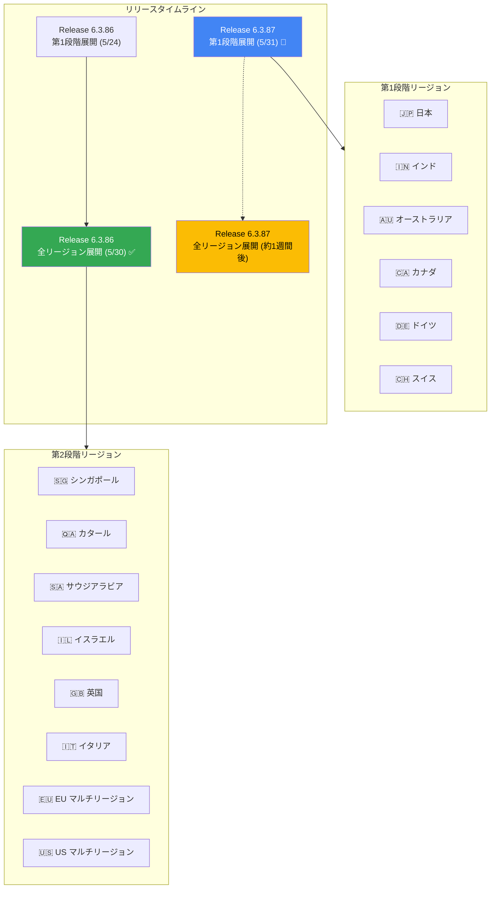

# Google SecOps SOAR: Release 6.3.86 全リージョン展開完了 / Release 6.3.87 第1段階展開開始

**リリース日**: 2026-05-30 / 2026-05-31

**サービス**: Google SecOps SOAR

**機能**: Release 6.3.86 全リージョン展開 / Release 6.3.87 段階的ロールアウト開始

**ステータス**: 6.3.86 全リージョン利用可能 / 6.3.87 ロールアウト中（第1段階）

📊 [このアップデートのインフォグラフィックを見る](https://takech9203.github.io/google-cloud-news-summary/20260531-google-secops-soar-release-6-3-86-87.html)

## 概要

Google Security Operations (SecOps) SOAR プラットフォームにおいて、2 つのリリースに関するアップデートが連続して発表されました。5 月 30 日に Release 6.3.86 が全リージョンで利用可能になり、翌 5 月 31 日には Release 6.3.87 が第1段階のリージョンへのロールアウトを開始しています。

両リリースともに内部バグ修正およびお客様報告のバグ修正を含むメンテナンスリリースです。Google SecOps SOAR は段階的ロールアウトプロセスを採用しており、まず第1段階のリージョン（日本、インド、オーストラリア、カナダ、ドイツ、スイス）に展開し、安定性が確認された後に第2段階のリージョン（シンガポール、カタール、サウジアラビア、イスラエル、英国、イタリア、EU マルチリージョン、US マルチリージョン）へ展開します。

先週の Release 6.3.85 の全リージョン展開（5 月 23 日）、Release 6.3.86 の第1段階展開（5 月 24 日）に続く定期的なアップデートサイクルの一環であり、SOAR プラットフォームの安定性とパフォーマンスの継続的な向上を目的としています。

## アーキテクチャ図

Google SecOps SOAR のリリースは 2 段階のロールアウトプロセスに従い、毎週日曜日にアップデートが適用されます。第1段階のリージョンで安定性が確認された後、約1週間後に第2段階のリージョンへ展開されます。

## サービスアップデートの詳細

### Release 6.3.86 - 全リージョン展開完了（2026-05-30）

1. **全リージョンへの展開完了**
   - 5 月 24 日に第1段階リージョンへ展開が開始された Release 6.3.86 が、全リージョンで利用可能になりました
   - 第2段階リージョン（シンガポール、カタール、サウジアラビア、イスラエル、英国、イタリア、EU/US マルチリージョン）への展開が完了

2. **含まれる修正内容**
   - 内部バグ修正
   - お客様報告のバグ修正

### Release 6.3.87 - 第1段階リージョン展開開始（2026-05-31）

1. **第1段階リージョンへの展開開始**
   - 日本、インド、オーストラリア、カナダ、ドイツ、スイスへのロールアウトを開始
   - 約1週間後に第2段階リージョンへ展開予定

2. **含まれる修正内容**
   - 内部バグ修正
   - お客様報告のバグ修正

## 技術仕様

| 項目 | Release 6.3.86 | Release 6.3.87 |
|------|---------------|---------------|
| リリースタイプ | メンテナンスリリース（バグ修正） | メンテナンスリリース（バグ修正） |
| 第1段階展開日 | 2026-05-24 | 2026-05-31 |
| 全リージョン展開日 | 2026-05-30 | 約1週間後（予定） |
| メンテナンスウィンドウ | 毎週日曜日 | 毎週日曜日 |

### 段階的ロールアウトスケジュール

| 段階 | リージョン | 説明 |
|------|-----------|------|
| 第1段階 | 日本、インド、オーストラリア、カナダ、ドイツ、スイス | 新リリースの先行展開リージョン |
| 第2段階 | シンガポール、カタール、サウジアラビア、イスラエル、英国（ロンドン）、イタリア、EU（マルチリージョン）、US（マルチリージョン） | 第1段階の安定性確認後に展開 |

## メリット

### 運用面

- **段階的ロールアウトによるリスク軽減**: 第1段階リージョンでの検証を経てから全リージョンに展開するため、問題の早期検出と影響範囲の最小化が可能
- **定期的なバグ修正サイクル**: 週次のリリースサイクルにより、報告された問題が迅速に修正される

### 技術面

- **プラットフォーム安定性の向上**: 内部バグ修正により、Playbook エンジンやインテグレーションの信頼性が継続的に改善
- **お客様報告の問題解決**: ユーザーから報告された具体的な問題に対応し、運用上の障害を排除

## 関連サービス・機能

- **Google SecOps SIEM**: セキュリティ情報・イベント管理。SOAR と統合されたプラットフォームとして脅威検出を担当
- **Google SecOps Playbook エンジン**: セキュリティ対応の自動化ワークフローを構築・実行するエンジン
- **Google SecOps Marketplace**: 300 以上の SOAR インテグレーションを提供するマーケットプレイス
- **Gemini in Security Operations**: AI を活用した Playbook 作成、調査支援、レスポンス推奨
- **Chronicle API**: 5 月 28 日に統合・アップグレードされた SOAR API リソースを含む統合 API

## 参考リンク

- 📊 [インフォグラフィック](https://takech9203.github.io/google-cloud-news-summary/20260531-google-secops-soar-release-6-3-86-87.html)
- [公式リリースノート](https://docs.cloud.google.com/release-notes#May_31_2026)
- [Google SecOps SOAR リリースノート](https://docs.cloud.google.com/chronicle/docs/soar/release-notes)
- [段階的リリース計画](https://docs.cloud.google.com/chronicle/docs/soar/overview-and-introduction/soar-gradual-release)
- [Google SecOps SOAR 概要](https://docs.cloud.google.com/chronicle/docs/soar/overview-and-introduction/soar-overview)

## まとめ

Google SecOps SOAR の Release 6.3.86 が全リージョンで利用可能になり、続けて Release 6.3.87 が第1段階リージョンへの展開を開始しました。両リリースともにバグ修正を含むメンテナンスリリースであり、SOAR プラットフォームの安定性向上に寄与します。第1段階リージョン（日本を含む）のユーザーは既に 6.3.87 への更新が適用されます。第2段階リージョンのユーザーは約1週間後に自動アップデートが適用される予定です。

---

**タグ**: #google-secops #soar #bug-fix #release
