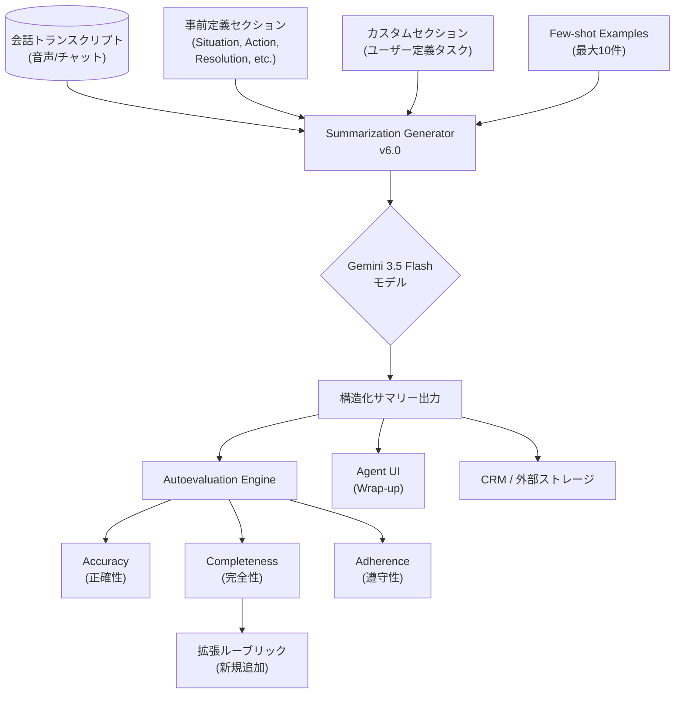

# Agent Assist: Summarization with Custom Sections v6.0 GA

**リリース日**: 2026-06-01

**サービス**: Agent Assist (Gemini Enterprise for Customer Experience)

**機能**: Summarization with Custom Sections v6.0 / Autoevaluation リージョン拡大

**ステータス**: GA (一般提供開始)

[このアップデートのインフォグラフィックを見る](https://takech9203.github.io/google-cloud-news-summary/20260601-agent-assist-summarization-custom-sections-6.html)

## 概要

Agent Assist の Summarization with Custom Sections が v6.0 として GA (一般提供) になった。v6.0 は Gemini 3.5 Flash をベースモデルとして採用しており、すべての Agent Assist リージョンで利用可能である。これにより、コンタクトセンターのエージェントは通話やチャット終了後に、カスタムセクション定義に基づいた高品質な会話要約を自動生成できるようになる。

同時に、Summarization Autoevaluation (自動評価) 機能にも改善が加わった。完全性 (Completeness) の評価に使用するルーブリックが追加され、より詳細な品質評価が可能になった。また、Overall Performance ビューにおける N/A の表示について説明が追加され、カテゴリカルなセクションでは Completeness が N/A、事前定義セクションでは Adherence が N/A となる理由が明確化された。

さらに、Autoevaluation 機能が新たに 10 リージョンで利用可能になり、グローバルなコンタクトセンター運用においてより身近な場所でサマリー品質の評価ができるようになった。

**アップデート前の課題**

- v5.0 以前のバージョンではモデル性能に制限があり、長い会話や複雑なカスタムセクション定義に対して最適な要約品質を得るのが困難だった
- Autoevaluation の Completeness 評価ルーブリックが限定的で、要約の完全性を多角的に評価することが難しかった
- Autoevaluation が利用可能なリージョンが限られており (従来は us-central1、us-west1、global のみ)、データレジデンシー要件のある組織では利用が困難だった
- Overall Performance ビューで N/A が表示される理由が不明確で、運用者が混乱する場面があった

**アップデート後の改善**

- Gemini 3.5 Flash ベースの v6.0 により、より高精度で低レイテンシの会話要約を全リージョンで生成可能になった
- Completeness 評価のルーブリックが拡充され、要約がどの程度会話内容を網羅しているかをより詳細に評価できるようになった
- Autoevaluation が 10 の新リージョンに展開され、グローバルなデータレジデンシー要件に対応可能になった
- N/A 表示の理由が明文化され、運用上の混乱が解消された

## アーキテクチャ図



Summarization with Custom Sections v6.0 は、会話トランスクリプトと事前定義/カスタムセクション定義を入力として Gemini 3.5 Flash モデルで要約を生成し、Autoevaluation エンジンで品質を自動評価するパイプラインを構成する。

## サービスアップデートの詳細

### 主要機能

1. **Summarization with Custom Sections v6.0 (GA)**
   - Gemini 3.5 Flash をベースモデルとして採用
   - すべての Agent Assist リージョンで利用可能
   - 事前定義セクション (Situation, Action, Resolution, Customer Satisfaction, Reason for Cancellation, Entities) を継続サポート
   - カスタムセクション定義による柔軟な要約タスク設定
   - Few-shot Examples による要約品質の向上 (最大 10 件)

2. **Autoevaluation Completeness ルーブリック拡充**
   - 完全性評価のためのルーブリックが追加
   - 会話内容のカバー率をより詳細に分析可能
   - `transcript_content` と `related_content_from_summary` の対応付けによる根拠提示
   - 空の `content_list` はペナルティなしとして最終スコアから除外

3. **N/A 表示の明確化**
   - Adherence: 事前定義セクションのみの場合は N/A (カスタムセクション使用時のみ評価)
   - Completeness: カテゴリカルなセクション (解決状況、顧客満足度など) では N/A (自由テキスト形式のみ評価)

4. **Autoevaluation リージョン拡大**
   - 新規対応リージョン: us-east1, northamerica-northeast1, eu-west1, eu-west2, eu-west3, eu-west4, asia-southeast1, asia-northeast1, asia-south1, australia-southeast1
   - 従来の対応リージョン (us-central1, us-west1, global) に加え、合計 13 リージョンで利用可能

## 技術仕様

### バージョン比較

| 項目 | v5.0 | v6.0 |
|------|------|------|
| ベースモデル | (前世代モデル) | Gemini 3.5 Flash |
| 利用可能リージョン | 全 Agent Assist リージョン | 全 Agent Assist リージョン |
| ステータス | GA | GA |
| 事前定義セクション | 6 種類 | 6 種類 |
| カスタムセクション | 対応 | 対応 |
| Few-shot Examples | 最大 10 件 | 最大 10 件 |

### 事前定義セクション一覧

| セクション名 | 説明 | 出力形式 |
|-------------|------|---------|
| Situation | 顧客が支援を必要としている内容 | 自由テキスト (簡潔な要約推奨) |
| Action | エージェントが顧客を支援するために行ったこと | 自由テキスト (簡潔な要約推奨) |
| Resolution | 問題解決の状況 | カテゴリカル (Y/P/N/N/A) |
| Customer Satisfaction | 顧客満足度 | カテゴリカル (D/N) |
| Reason for Cancellation | キャンセルの理由 | 自由テキスト / N/A |
| Entities | 会話から抽出されたキーバリューペア | 構造化テキスト |

### API リクエスト例

```json
{
  "parent": "projects/PROJECT_ID/locations/LOCATION_ID",
  "description": "summarization-v6-generator",
  "triggerEvent": "MANUAL_CALL",
  "summarizationContext": {
    "summarizationSections": [
      { "type": "SITUATION" },
      { "type": "ACTION" },
      { "type": "RESOLUTION" },
      { "type": "ENTITIES" },
      {
        "key": "next_steps",
        "definition": "Summarize the next steps agreed upon by the agent and customer.",
        "type": "CUSTOMER_DEFINED"
      }
    ],
    "version": "6.0",
    "outputLanguageCode": "ja-JP"
  }
}
```

## 設定方法

### 前提条件

1. Google Cloud プロジェクトで Agent Assist API が有効化されていること
2. 適切な IAM ロール (Dialogflow Agent Assist Admin) が付与されていること
3. Conversation Profile が作成済みであること

### 手順

#### ステップ 1: Summarization Generator の作成 (コンソール)

1. [Agent Assist コンソール](https://agentassist.cloud.google.com) にアクセス
2. Summarization ページで「Generator」を選択
3. Generator 名を入力
4. Version で「6.0」を選択
5. 出力言語を選択
6. Predefined sections から使用するセクションを選択
7. Custom sections でカスタムタスク定義を追加
8. 「Save」をクリック

#### ステップ 2: Summarization Generator の作成 (REST API)

```bash
curl -X POST \
  -H "Authorization: Bearer $(gcloud auth print-access-token)" \
  -H "x-goog-user-project: PROJECT_ID" \
  -H "Content-Type: application/json; charset=utf-8" \
  -d @request.json \
  "https://LOCATION_ID-dialogflow.googleapis.com/v2/projects/PROJECT_ID/locations/LOCATION_ID/generators"
```

#### ステップ 3: Conversation Profile への関連付け

```bash
curl -X POST \
  -H "Authorization: Bearer $(gcloud auth print-access-token)" \
  -H "x-goog-user-project: PROJECT_ID" \
  -H "Content-Type: application/json; charset=utf-8" \
  -d '{
    "displayName": "conversation-profile-with-v6-generator",
    "humanAgentAssistantConfig": {
      "humanAgentSuggestionConfig": {
        "generators": "projects/PROJECT_ID/locations/LOCATION_ID/generators/GENERATOR_ID"
      }
    },
    "languageCode": "ja-JP"
  }' \
  "https://LOCATION_ID-dialogflow.googleapis.com/v2/projects/PROJECT_ID/locations/LOCATION_ID/conversationProfiles"
```

#### ステップ 4: Autoevaluation の設定

1. Agent Assist コンソールで「Evaluations」>「New evaluation」を選択
2. Display Name を入力し、v6.0 Generator を選択
3. 評価データセットを選択 (日付範囲からのランダムサンプル、または特定のデータセット)
4. サマリーソースを選択
5. Cloud Storage のフォルダを選択して結果を保存
6. 「Run」をクリック

## メリット

### ビジネス面

- **要約品質の向上**: Gemini 3.5 Flash の採用により、より正確で文脈に沿った会話要約が生成され、After Call Work (ACW) の時間短縮と品質向上を両立
- **グローバル展開の容易さ**: 全リージョンでの GA 提供と Autoevaluation のリージョン拡大により、多国籍コンタクトセンター運用におけるデータレジデンシー要件に容易に対応可能
- **品質管理の効率化**: 拡張された Completeness ルーブリックにより、サマリー品質の問題箇所を自動的に特定し、セクション定義の改善サイクルを加速

### 技術面

- **最新モデルの活用**: Gemini 3.5 Flash による推論性能の向上とレイテンシの低減
- **反復的な改善プロセス**: Autoevaluation の詳細なルーブリック結果を基に、カスタムセクション定義を体系的に改善可能
- **バージョン間比較**: Autoevaluation で v5.0 と v6.0 の出力品質を同一データセットで定量比較可能

## デメリット・制約事項

### 制限事項

- Agent Assist コンソールはリージョナライゼーションをサポートしていないため、リージョン指定は API を直接呼び出す必要がある
- Summarization Autoevaluation は VPC Service Controls をサポートしていない
- モデルトレーニングはリージョナライゼーションをサポートしておらず、トレーニング中にデータがリージョン外にルーティングされる可能性がある
- Few-shot Examples は最大 10 件まで

### 考慮すべき点

- v5.0 から v6.0 へのアップグレード時は、既存のカスタムセクション定義の動作が変わる可能性があるため、Autoevaluation で品質を事前検証することを推奨
- Gemini 3.5 Flash の特性上、非常に長い会話トランスクリプトでは出力トークン制限 (デフォルト 1024) に注意が必要
- AI/ML Data Location (DRZ) コミットメントは US および EU リージョン内のみサポート

## ユースケース

### ユースケース 1: コンタクトセンターの ACW 自動化

**シナリオ**: 金融サービスのコンタクトセンターで、エージェントが通話終了後に手動で記録していた会話サマリーを自動化したい。カスタムセクションで「口座番号」「取引種別」「エスカレーション理由」を自動抽出する。

**実装例**:
```json
{
  "summarizationSections": [
    { "type": "SITUATION" },
    { "type": "ACTION" },
    { "type": "RESOLUTION" },
    {
      "key": "account_info",
      "definition": "Extract the customer's account number and account type mentioned in the conversation. Format: Account Number: [number], Account Type: [type]",
      "type": "CUSTOMER_DEFINED"
    },
    {
      "key": "escalation_reason",
      "definition": "If the conversation was escalated or needs follow-up, summarize the reason. Output N/A if no escalation occurred.",
      "type": "CUSTOMER_DEFINED"
    }
  ],
  "version": "6.0",
  "outputLanguageCode": "ja-JP"
}
```

**効果**: ACW 時間を平均 60% 削減し、CRM への記録の一貫性と正確性を向上

### ユースケース 2: 多リージョン展開での品質統一管理

**シナリオ**: アジア太平洋地域と欧州地域で運営するコンタクトセンターにおいて、各リージョンのサマリー品質を Autoevaluation で統一的に管理し、セクション定義の改善を継続的に行いたい。

**効果**: Autoevaluation のリージョン拡大により、asia-northeast1 (東京) や europe-west1 (ベルギー) など各拠点の近くで評価を実行でき、データレジデンシー要件を満たしつつ品質管理を統一化

## 料金

Agent Assist は通信チャネルに基づいた月額料金体系である。

### 料金例

| 通信チャネル | 料金 |
|-------------|------|
| Agent Assist for Chat | $0.06 / セッション |
| Agent Assist for Voice | Google Cloud 営業担当への問い合わせが必要 |

Summarization の利用にはセッション料金に加え、要約生成コストが発生する。Autoevaluation の実行にも別途コストが発生する。詳細は [Agent Assist 料金ページ](https://cloud.google.com/agent-assist/pricing) を参照。

## 利用可能リージョン

### Summarization with Custom Sections v6.0

全 Agent Assist リージョンで利用可能:

| リージョングループ | リージョン ID | 地理的場所 |
|------------------|-------------|-----------|
| Americas | us-central1 | アイオワ |
| Americas | us-east1 | サウスカロライナ |
| Americas | us-west1 | オレゴン |
| Americas | us | 米国マルチリージョン |
| Americas | northamerica-northeast1 | モントリオール |
| Europe | europe-west1 | ベルギー |
| Europe | europe-west2 | ロンドン |
| Europe | europe-west3 | フランクフルト |
| Europe | europe-west4 | エームスハーフェン |
| Europe | europe-west6 | チューリッヒ |
| Asia Pacific | asia-southeast1 | シンガポール |
| Asia Pacific | asia-southeast2 | ジャカルタ |
| Asia Pacific | asia-northeast1 | 東京 |
| Asia Pacific | asia-south1 | ムンバイ |
| Asia Pacific | australia-southeast1 | シドニー |
| Global | global | グローバル |

### Summarization Autoevaluation (新規追加リージョン)

| 新規リージョン | 地理的場所 |
|--------------|-----------|
| us-east1 | サウスカロライナ |
| northamerica-northeast1 | モントリオール |
| eu-west1 (europe-west1) | ベルギー |
| eu-west2 (europe-west2) | ロンドン |
| eu-west3 (europe-west3) | フランクフルト |
| eu-west4 (europe-west4) | エームスハーフェン |
| asia-southeast1 | シンガポール |
| asia-northeast1 | 東京 |
| asia-south1 | ムンバイ |
| australia-southeast1 | シドニー |

## 関連サービス・機能

- **Gemini Enterprise for Customer Experience**: Agent Assist を含む包括的なカスタマーエクスペリエンス AI プラットフォーム
- **Contact Center AI Insights**: 会話データセットの管理と分析。Autoevaluation のデータセット作成に使用
- **Cloud Storage**: Autoevaluation 結果の CSV ファイル保存先
- **Dialogflow ES/CX**: Agent Assist の基盤となる対話プラットフォーム。Conversation Profile や Generator の管理に使用
- **Gemini 3.5 Flash**: v6.0 のベースとなる LLM モデル。高速な推論と高品質な出力を提供
- **Generative Knowledge Assist**: Agent Assist のもう一つの主要機能。会話中のリアルタイムナレッジ提案

## 参考リンク

- [インフォグラフィック](https://takech9203.github.io/google-cloud-news-summary/20260601-agent-assist-summarization-custom-sections-6.html)
- [公式リリースノート](https://docs.cloud.google.com/release-notes#June_01_2026)
- [Summarization with Custom Sections ドキュメント](https://docs.cloud.google.com/agent-assist/docs/summarization-with-custom-sections)
- [Summarization Autoevaluation メトリクス](https://docs.cloud.google.com/agent-assist/docs/summarization-autoeval-metrics)
- [リージョナライゼーション](https://docs.cloud.google.com/agent-assist/docs/regionalization)
- [Agent Assist 料金ページ](https://cloud.google.com/agent-assist/pricing)
- [カスタムセクションのベストプラクティス](https://docs.cloud.google.com/agent-assist/docs/summarization-with-custom-sections-best-practices)

## まとめ

Agent Assist Summarization with Custom Sections v6.0 の GA は、Gemini 3.5 Flash の採用によりコンタクトセンターの会話要約品質を大幅に向上させるアップデートである。同時に Autoevaluation のリージョン拡大と Completeness ルーブリックの拡充により、グローバルに展開するコンタクトセンターでもデータレジデンシー要件を満たしながら品質管理を効率化できる。既存の v5.0 ユーザーは、Autoevaluation を活用してバージョン間の品質比較を行い、段階的な移行を検討することを推奨する。

---

**タグ**: #AgentAssist #Summarization #CustomSections #GA #Gemini35Flash #Autoevaluation #ContactCenter #CCAI #NLP
