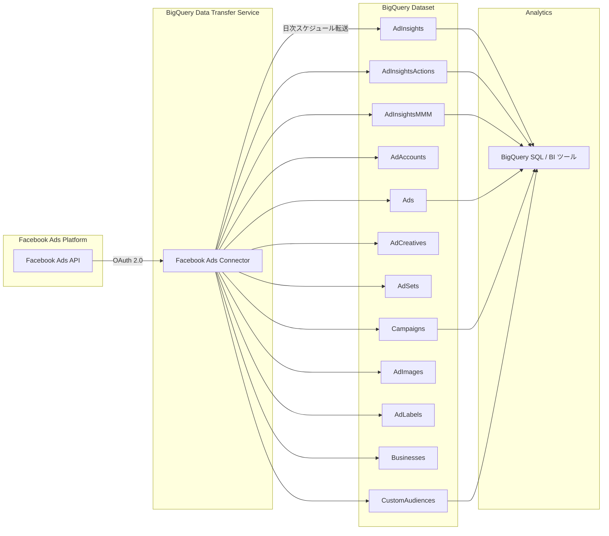

# BigQuery Data Transfer Service: Facebook Ads コネクタの対応レポート拡張

**リリース日**: 2026-06-01
**サービス**: BigQuery Data Transfer Service
**機能**: Facebook Ads コネクタの対応レポートタイプ拡張
**ステータス**: 変更（Change）

[このアップデートのインフォグラフィックを見る](https://takech9203.github.io/google-cloud-news-summary/20260601-bigquery-facebook-ads-connector-reports.html)

## 概要

BigQuery Data Transfer Service の Facebook Ads コネクタが、新たに9種類の Facebook Ads レポートからのデータ転送をサポートするようになりました。従来は AdAccounts、AdInsights、AdInsightsActions の3つのレポートのみに対応していましたが、今回のアップデートにより AdInsightsMMM、Ads、AdCreatives、AdSets、Campaigns、AdImages、AdLabels、Businesses、CustomAudiences が追加されました。

この拡張により、Facebook Ads のキャンペーン構造全体やクリエイティブ素材、カスタムオーディエンスなどの詳細データを BigQuery に直接取り込むことが可能になります。特に Marketing Mix Modeling（MMM）向けのインサイトデータ（AdInsightsMMM）が追加されたことで、マーケティング投資の最適化分析がより容易になります。

これまでは広告パフォーマンスデータ（インサイト）のみが転送対象でしたが、今後はキャンペーンの構造データやクリエイティブアセットのメタデータも BigQuery 上で一元管理・分析できるようになり、広告運用の全体像を把握するための分析基盤を構築しやすくなります。

**アップデート前の課題**
- Facebook Ads コネクタは AdAccounts、AdInsights、AdInsightsActions の3レポートのみサポート
- キャンペーン構造データ（Campaigns、AdSets、Ads）を取得するには別途 ETL パイプラインの構築が必要
- クリエイティブ素材やカスタムオーディエンスの情報を BigQuery に統合するには手動処理やサードパーティツールが必要
- MMM（Marketing Mix Modeling）用のデータ取得には追加の開発工数が必要

**アップデート後の改善**
- 9種類の新規レポートが追加され、Facebook Ads の包括的なデータ取得が可能に
- キャンペーン階層構造（Campaigns > AdSets > Ads）のデータを自動的に BigQuery に転送
- クリエイティブアセット（AdCreatives、AdImages）のメタデータを統合管理
- カスタムオーディエンスデータの分析が BigQuery 上で直接可能に
- AdInsightsMMM による Marketing Mix Modeling 向けデータの自動取得

## アーキテクチャ図



## サービスアップデートの詳細

### 主要機能

今回追加された9種類のレポートは以下の通りです。

| レポート名 | 説明 |
|---|---|
| AdInsightsMMM | Marketing Mix Modeling 向けの広告インサイトデータ |
| Ads | 個別広告の設定・ステータス情報 |
| AdCreatives | 広告クリエイティブのメタデータ（テキスト、画像URL等） |
| AdSets | 広告セットの設定（ターゲティング、予算、スケジュール等） |
| Campaigns | キャンペーンの設定・ステータス情報 |
| AdImages | 広告で使用される画像アセットの情報 |
| AdLabels | 広告に付与されたラベル（分類・整理用タグ） |
| Businesses | ビジネスアカウントの情報 |
| CustomAudiences | カスタムオーディエンス（リターゲティングリスト等）の定義情報 |

### 従来からサポートされていたレポート

| レポート名 | 説明 |
|---|---|
| AdAccounts | ユーザーが利用可能な広告アカウント情報 |
| AdInsights | 全広告アカウントの広告インサイトレポート |
| AdInsightsActions | 全広告アカウントの広告インサイトアクションレポート |

## 技術仕様

- **データソース識別子**: `facebook_ads` または `facebook-ads`
- **認証方式**: OAuth 2.0（長期ユーザーアクセストークン、有効期限60日）
- **転送頻度**: 日次（最小間隔24時間）
- **リフレッシュウィンドウ**: 最大30日（AdInsights、AdInsightsActions テーブル向け）
- **最大転送時間**: 6時間
- **必要な権限**: `ads_management`、`ads_read`、`business_management`

## 設定方法

### Google Cloud Console での設定

1. Google Cloud Console の「データ転送」ページに移動
2. 「転送を作成」をクリック
3. ソースタイプとして「Facebook Ads」を選択
4. データソースの詳細を設定:
   - Client ID（アプリ ID）を入力
   - Client secret（アプリシークレット）を入力
   - Refresh token（長期ユーザーアクセストークン）を入力
   - **Facebook Ads objects to transfer** で転送するレポートを選択（新規追加された9レポートを含む）
5. 転送先データセットを選択
6. スケジュールオプションを設定
7. 「保存」をクリック

### bq コマンドラインでの設定例

```bash
bq mk --transfer_config \
  --target_dataset=mydataset \
  --data_source=facebook_ads \
  --display_name='Facebook Ads Full Transfer' \
  --params='{
    "connector.authentication.oauth.clientId": "YOUR_APP_ID",
    "connector.authentication.oauth.clientSecret": "YOUR_APP_SECRET",
    "connector.authentication.oauth.refreshToken": "YOUR_LONG_LIVED_TOKEN",
    "connector.authorizedAdAccountsOnly": true,
    "connector.actionCollections": ["Actions", "Conversions"],
    "connector.genericBreakdowns": ["PublisherPlatform", "PlatformPosition"],
    "connector.actionBreakdowns": ["ActionDevice", "ActionType"]
  }'
```

## メリット

### ビジネス面
- **マーケティング分析の包括性向上**: キャンペーン構造からクリエイティブ、オーディエンスまで全データを BigQuery で統合分析可能
- **MMM（Marketing Mix Modeling）の実現**: AdInsightsMMM レポートにより、チャネル横断のマーケティング投資最適化が容易に
- **運用コスト削減**: サードパーティ ETL ツールや自前パイプラインが不要に
- **意思決定の迅速化**: クリエイティブパフォーマンスとキャンペーン構造の相関分析がリアルタイムに可能

### 技術面
- **コードレスデータ統合**: BigQuery Data Transfer Service のマネージドサービスとして提供されるため、開発工数ゼロで導入可能
- **自動スケジュール実行**: 日次の定期転送により常に最新データを維持
- **BigQuery エコシステムとの統合**: SQL クエリ、BigQuery ML、Looker Studio 等と直接連携可能
- **データの一貫性**: 日付パーティション分割と上書き方式により重複データを防止

## デメリット・制約事項

- 長期ユーザーアクセストークンは60日で失効するため、定期的な更新が必要
- 転送間隔の最小値は24時間（リアルタイム同期は不可）
- Facebook Ads API のレート制限に抵触する可能性がある（特に多くのアクションコレクションを指定した場合）
- カスタムレポートの作成は非サポート（固定テーブルセットのみ）
- 転送の最大実行時間は6時間で、超過すると失敗する
- Data Delivery SLO は非 Google Cloud ソース（Facebook Ads を含む）からの転送には適用されない
- ネットワークアタッチメント使用時、リージョンが異なる場合はクロスリージョンデータ移動が発生する可能性がある

## ユースケース

### 1. マーケティングミックスモデリング（MMM）
AdInsightsMMM レポートを活用し、Facebook Ads を含む複数チャネルのマーケティング投資対効果を統計モデルで分析。BigQuery ML と組み合わせることで、最適な予算配分の算出が可能。

### 2. クリエイティブパフォーマンス分析
AdCreatives と AdImages のデータを AdInsights と結合し、どのクリエイティブ素材がどのオーディエンスセグメントで最も効果的かを分析。A/B テストの結果を BigQuery 上で統合管理。

### 3. オーディエンスインサイト
CustomAudiences データと広告パフォーマンスデータを組み合わせ、最も効果的なオーディエンスセグメントを特定。Looker Studio でダッシュボード化し、マーケティングチームへリアルタイム共有。

### 4. キャンペーン構造の最適化
Campaigns、AdSets、Ads の階層データを分析し、キャンペーン構造のベストプラクティスを抽出。パフォーマンスが高い構造パターンを特定し、新規キャンペーン設計に活用。

### 5. クロスプラットフォーム広告分析
BigQuery Data Transfer Service の他コネクタ（Google Ads、Campaign Manager 等）と組み合わせ、Facebook Ads を含むマルチプラットフォームの広告パフォーマンスを統合分析。

## 料金

BigQuery Data Transfer Service 自体の利用料金については、[BigQuery 料金ページ](https://cloud.google.com/bigquery/pricing#data-transfer-service-pricing)を参照してください。データが BigQuery に転送された後は、標準の BigQuery [ストレージ料金](https://cloud.google.com/bigquery/pricing#storage)と[クエリ料金](https://cloud.google.com/bigquery/pricing#queries)が適用されます。

## 関連サービス・機能

- **BigQuery Data Transfer Service**: データ転送の基盤サービス
- **BigQuery ML**: 転送データを使った機械学習モデル構築
- **Looker Studio**: 転送データのダッシュボード化・可視化
- **Google Ads Data Transfer**: Google Ads データとの統合分析
- **Campaign Manager Data Transfer**: Campaign Manager データとの統合分析
- **Pub/Sub**: 転送実行通知の受信

## 参考リンク

- [インフォグラフィック](https://takech9203.github.io/google-cloud-news-summary/20260601-bigquery-facebook-ads-connector-reports.html)
- [公式リリースノート](https://docs.cloud.google.com/release-notes#June_01_2026)
- [Facebook Ads コネクタ ドキュメント](https://docs.cloud.google.com/bigquery/docs/facebook-ads-transfer)
- [Facebook Ads レポート変換](https://docs.cloud.google.com/bigquery/docs/facebook-ads-transformation)
- [BigQuery Data Transfer Service 概要](https://docs.cloud.google.com/bigquery/docs/dts-introduction)
- [BigQuery 料金](https://cloud.google.com/bigquery/pricing)

## まとめ

BigQuery Data Transfer Service の Facebook Ads コネクタが大幅に拡張され、従来の3レポート（AdAccounts、AdInsights、AdInsightsActions）に加えて、新たに9種類のレポート（AdInsightsMMM、Ads、AdCreatives、AdSets、Campaigns、AdImages、AdLabels、Businesses、CustomAudiences）からのデータ転送がサポートされました。この変更により、Facebook Ads プラットフォーム上の広告データをより包括的に BigQuery に取り込むことが可能になり、キャンペーン構造分析、クリエイティブ効果測定、MMM による投資最適化など、高度なマーケティング分析を実現できるようになります。マネージドサービスとしてコードレスで利用できる点も大きなメリットです。

---

**タグ**: #BigQuery #DataTransferService #FacebookAds #MarketingAnalytics #MMM #ETL #広告分析
