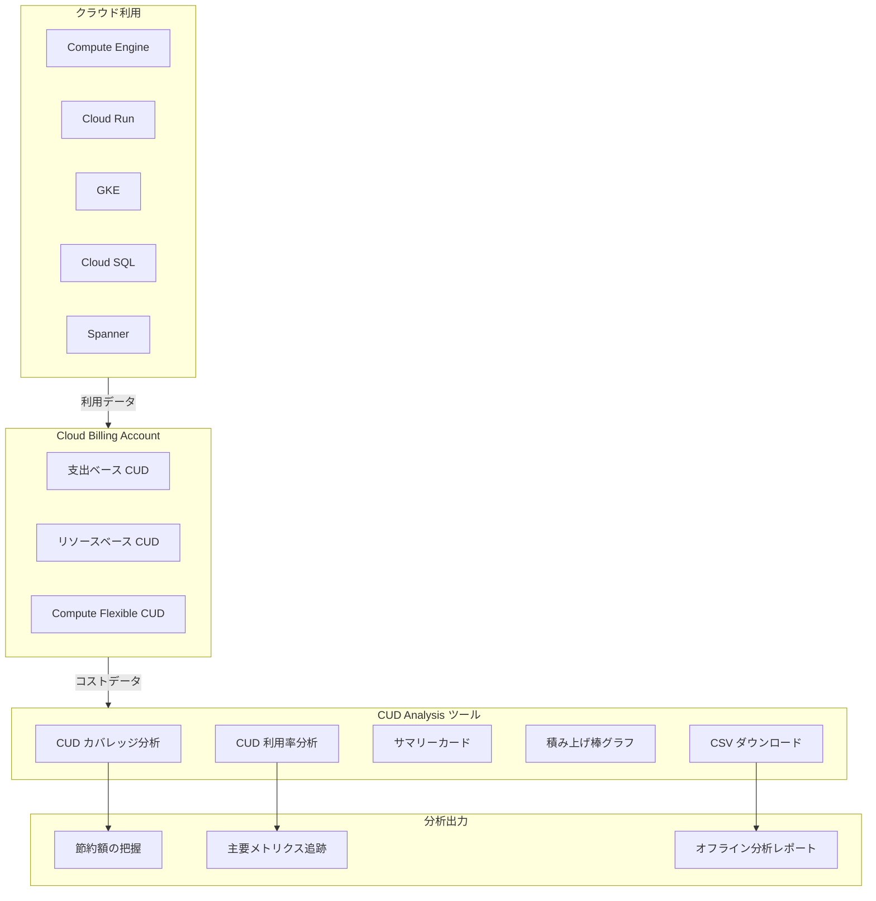

# Cloud Billing: CUD Analysis が一般提供 (GA) を開始

**リリース日**: 2026-06-01

**サービス**: Cloud Billing

**機能**: CUD Analysis (確約利用割引分析) の一般提供開始

**ステータス**: GA (一般提供)

[このアップデートのインフォグラフィックを見る](https://takech9203.github.io/google-cloud-news-summary/infographic/20260601-cloud-billing-cud-analysis-ga.html)

## 概要

Google Cloud は、CUD Analysis (確約利用割引分析) ツールの一般提供 (GA) を発表しました。このツールは、新しい支出ベース CUD モデルをサポートし、支出ベースとリソースベースの両方の確約利用割引 (CUD) を統合的に分析できるインターフェースを提供します。

CUD Analysis は、Compute Engine リソースに対する両方のタイプの CUD (リソースベースおよび支出ベース) の効果を統合的に可視化し、コスト最適化の意思決定を支援するツールです。これにより、組織は確約利用割引のパフォーマンスを詳細に把握し、節約額の最大化に向けた戦略的な判断が可能になります。

主な対象ユーザーは、Cloud Billing アカウント管理者、財務担当者、FinOps チーム、およびクラウドコスト最適化に関わるすべてのステークホルダーです。

**アップデート前の課題**

CUD Analysis が GA に到達する以前は、以下のような制限がありました。

- 支出ベース CUD と リソースベース CUD を個別に確認する必要があり、統合的な分析ビューが限定的だった
- 新しい支出ベース CUD モデル (割引ベース) への移行後、レガシーモデルとの混在環境での分析が複雑だった
- CUD のカバレッジと利用率を一元的に確認し、未活用のコミットメントを特定するための GA レベルのツールが不足していた

**アップデート後の改善**

今回の GA リリースにより、以下が可能になりました。

- 支出ベースとリソースベースの CUD を統合したビューで、Compute リソース全体の割引効果を一画面で確認可能
- CUD カバレッジと CUD 利用率の 2 つのタブにより、コスト削減額と利用効率を詳細に追跡可能
- 日次使用量データの CSV ダウンロードにより、オフラインでの分析・レポーティングが可能

## アーキテクチャ図



CUD Analysis は Cloud Billing アカウントに紐づくすべての CUD タイプとクラウド利用データを集約し、カバレッジと利用率の両面から分析結果を出力します。

## サービスアップデートの詳細

### 主要機能

1. **CUD カバレッジ分析**
   - 適格な支出のうち、CUD でカバーされている割合を表示
   - オンデマンド料金での利用額を正規化して表示し、支出ベース CUD の効果を可視化
   - 「CUD でどれだけカバーしているか」「オンデマンドでいくら支払っているか」「CUD でいくら節約しているか」の質問に回答

2. **CUD 利用率分析**
   - 既存コミットメントの利用効率をパーセンテージグラフで時系列表示
   - 支出ベース CUD は個別購入単位で利用率を表示 (新モデルのみ)
   - リソースベース CUD はアプリケーションスコープ別 (例: us-west1 の E2 コア) で表示

3. **統合リソースビュー**
   - リソースベース CUD と Compute Flexible CUD を組み合わせたビューを提供
   - 同一リソースに対する両方の CUD タイプの効果を重ねて表示
   - Compute Engine リソース全体での割引効果を一元的に把握可能

4. **CSV データダウンロード**
   - 棒グラフの右下にある CSV ボタンから日次使用量データをダウンロード
   - リソース SKU、サービス、消費モデル、開始/終了時間などを含む詳細データ
   - 最大 10,000 行のデータをオフライン分析用にエクスポート可能

## 技術仕様

### サマリーカード メトリクス

| メトリクス | 説明 |
|------|------|
| Active commitment | 現在アクティブなコミットメント数 (日付範囲に関係なく常に当日の値を表示) |
| CUD savings | 指定期間における CUD からの節約額 |
| CUD coverage | CUD でカバーされた適格支出の割合 (%) |
| Utilization of CUDs | 購入した CUD の利用率 (%) |
| Potential savings | 追加 CUD 購入による推定節約額 |

### サマリーテーブル列

| 列名 | 説明 |
|------|------|
| Cost at on-demand rate | CUD なしで支払う金額 |
| Commitment cost | コミットメント料金 (リソースベース/レガシー) または未利用分 (新支出ベース) |
| Effective discount | 節約額 / オンデマンド料金での費用 |
| Savings | オンデマンド費用とネット費用の差額 (負の値 = 未利用損失) |
| Net cost | オンデマンド + CUD 割引 + コミットメント費用の合計支払額 |

### 必要な権限

```json
{
  "required_roles": [
    "roles/billing.admin",
    "roles/billing.viewer"
  ],
  "required_permissions": [
    "billing.accounts.get",
    "billing.accounts.getSpendingInformation"
  ],
  "note": "Project Owner/Editor/Viewer ロールでは CUD Analysis にアクセスできません"
}
```

## 設定方法

### 前提条件

1. Cloud Billing アカウントの管理者または閲覧者ロールを持つこと
2. アクティブな CUD (支出ベースまたはリソースベース) が購入済みであること
3. Google Cloud コンソールへのアクセス権限

### 手順

#### ステップ 1: CUD Analysis ページへのアクセス

```
Google Cloud コンソール > ナビゲーションメニュー > お支払い > 確約利用割引 (CUD)
```

Google Cloud コンソールの CUD Analysis ページ (`console.cloud.google.com/billing/commitments/analysis`) に直接アクセスすることも可能です。

#### ステップ 2: レポートのフィルタリング

```
フィルタ設定:
- 期間: 事前定義またはカスタム範囲 (1日〜複数年)
- 分析対象: 支出ベースまたはリソースベース CUD を選択
- リソースタイプ: 特定のリソースを選択
- リージョン: 全リージョンまたは特定リージョン
- プロジェクト: 全プロジェクトまたは特定プロジェクト
```

フィルタを調整することで、分析対象の範囲を絞り込めます。データ粒度は日次 (デフォルト) または時間単位 (最大 30 日間) から選択可能です。

#### ステップ 3: CSV データのダウンロード

```
棒グラフ右下の「CSV」ボタンをクリック
→ 日次使用量データが CSV ファイルとしてダウンロードされます
（最大 10,000 行）
```

ダウンロードしたデータを使用して、スプレッドシートや BI ツールでのオフライン分析が可能です。

## メリット

### ビジネス面

- **統合コスト可視化**: 支出ベースとリソースベースの CUD を一画面で確認でき、コスト最適化の全体像を迅速に把握可能
- **ROI の定量化**: CUD 投資に対する実際の節約額を明確に数値化し、経営層への報告が容易
- **追加投資判断の支援**: Potential savings メトリクスにより、追加 CUD 購入の判断材料を自動算出
- **FinOps プラクティスの推進**: データドリブンなコスト最適化サイクルの確立を支援

### 技術面

- **GA レベルの信頼性**: SLA 付きのプロダクション対応ツールとして安定した運用が可能
- **新消費モデル対応**: レガシーのクレジットベースモデルから新しい割引ベースモデルへの移行を完全サポート
- **BigQuery エクスポートとの連携**: Cloud Billing データの BigQuery エクスポートと併用し、より高度な分析を実現
- **時間単位の粒度**: 時間ベースのデータ粒度により、CUD の時間別利用パターンを詳細に分析可能

## デメリット・制約事項

### 制限事項

- CUD Analysis はコストデータのみを使用しており、予約の有効性の判断には利用できない
- 複数タイプの CUD を集約した場合、リソース単位が異なるため利用率の計算ができない
- CSV ダウンロードは最大 10,000 行に制限されている
- 時間単位のデータ粒度は最大 30 日間のみ対応 (日次は最大 3 年間)
- データ遅延により、コミットメント料金や CUD クレジットの反映に最大 1.5 日かかる場合がある

### 考慮すべき点

- Project Owner/Editor/Viewer ロールでは CUD Analysis にアクセスできないため、別途 Billing ロールの付与が必要
- レガシーモデルと新モデルが混在する移行期間中は、表示される数値の解釈に注意が必要
- 統合ビュー (Resource based + Compute Flexible CUD) は新モデルでのみ正確な帰属を提供し、レガシーモデルでは節約額が過大に見える可能性がある
- 24 時間の期間は太平洋時間 (UTC-8) の深夜から開始されるため、日本時間とのズレに注意

## ユースケース

### ユースケース 1: 大規模 Compute Engine 環境でのコスト最適化

**シナリオ**: 数百台の VM を複数リージョンで運用する企業が、1 年間のリソースベース CUD と支出ベース CUD の両方を購入しているケース。

**実装例**:
```
1. CUD Analysis で「Resource based and Compute Flexible CUD」ビューを選択
2. 期間を過去 3 ヶ月に設定
3. CUD カバレッジタブで未カバーの支出を特定
4. CUD 利用率タブで未活用のコミットメントを確認
5. Potential savings を参照し、追加 CUD の購入を検討
```

**効果**: 統合ビューにより、リソースベースと Compute Flexible CUD の組み合わせ効果を正確に把握。未カバー領域への追加 CUD 購入により、さらに 20-40% のコスト削減を実現。

### ユースケース 2: FinOps チームによる月次コストレビュー

**シナリオ**: FinOps チームが毎月のコストレビューで、CUD の ROI を経営層に報告するケース。

**実装例**:
```
1. CUD Analysis ページにアクセス
2. 期間を前月に設定
3. サマリーカードから CUD savings と Utilization を確認
4. CSV ダウンロードでデータを取得
5. BI ツール (Looker, Data Studio) でダッシュボードに統合
```

**効果**: GA レベルの安定したデータにより、毎月一貫した KPI レポーティングを実現。利用率低下の早期検知と是正アクションが可能。

### ユースケース 3: マルチサービス環境での CUD 戦略策定

**シナリオ**: Compute Engine、Cloud SQL、Spanner を併用する企業が、各サービスの CUD 投資配分を最適化したいケース。

**効果**: サービス別のカバレッジと利用率を比較し、投資対効果の高い領域への CUD 追加購入を戦略的に判断。データに基づく予算配分の最適化を実現。

## 料金

CUD Analysis ツール自体の利用は無料です。Cloud Billing コンソールの機能として追加コストなしで使用できます。

### CUD の割引率参考

| CUD タイプ | 1 年契約の割引率 | 3 年契約の割引率 |
|--------|-----------------|-----------------|
| Compute Engine (リソースベース) | 最大 57% | 最大 70% |
| Spanner (支出ベース) | 20% | 40% |
| Cloud SQL (支出ベース) | サービスにより異なる | サービスにより異なる |
| その他支出ベース対象サービス | サービスにより異なる | サービスにより異なる |

**注意**: CUD は一度購入すると期間終了までキャンセルできません。購入前に過去の使用量パターンを十分に分析してください。

## 利用可能リージョン

CUD Analysis ツールはグローバルに利用可能です。Cloud Billing コンソールからすべてのリージョンの CUD を分析できます。ただし、リージョン固有の CUD (支出ベースの多くは購入時に選択したリージョンに限定) については、当該リージョンでの適格な利用のみがカバレッジの対象となります。

## 関連サービス・機能

- **Cloud Billing レポート**: CUD Analysis と連携して全体的なコストトレンドを把握。ただし、アクセスに必要な権限が異なる
- **BigQuery Billing Export**: Cloud Billing データを BigQuery にエクスポートし、CUD の fees/credits をカスタムクエリで詳細分析
- **CUD 共有 (リソースベース)**: プロジェクト間でリソースベース CUD を共有し、利用率を最大化する機能
- **Compute Engine 予約**: CUD と併用してキャパシティを保証。ただし CUD Analysis は予約の有効性は分析しない
- **コスト内訳レポート**: CUD を含む割引の適用状況を SKU レベルで確認可能
- **CUD レコメンデーション**: 過去の利用パターンに基づき、最適な CUD 購入額を自動提案

## 参考リンク

- [インフォグラフィック](https://takech9203.github.io/google-cloud-news-summary/infographic/20260601-cloud-billing-cud-analysis-ga.html)
- [公式リリースノート](https://docs.cloud.google.com/release-notes#June_01_2026)
- [CUD Analysis ドキュメント](https://docs.cloud.google.com/billing/docs/how-to/analyze-cuds)
- [支出ベース CUD ドキュメント](https://docs.cloud.google.com/docs/cuds-spend-based)
- [支出ベース CUD プログラム改善 (新消費モデル)](https://docs.cloud.google.com/docs/cuds-multiprice)
- [Cloud Billing の料金ページ](https://cloud.google.com/billing/docs)
- [確約利用割引の概要](https://docs.cloud.google.com/docs/cuds)
- [BigQuery への Billing データエクスポート](https://docs.cloud.google.com/billing/docs/how-to/export-data-bigquery)

## まとめ

CUD Analysis の GA リリースは、Google Cloud のコスト最適化ツールの成熟度を示す重要なマイルストーンです。支出ベースとリソースベースの CUD を統合的に分析できる本ツールにより、FinOps チームはデータに基づいた確約利用割引の戦略策定が可能になります。既に CUD を購入済みの組織は、直ちに CUD Analysis を活用して利用率と節約額を確認し、追加最適化の機会を特定することを推奨します。

---

**タグ**: #CloudBilling #CUD #CommittedUseDiscounts #CostOptimization #FinOps #GA #コスト最適化 #確約利用割引
