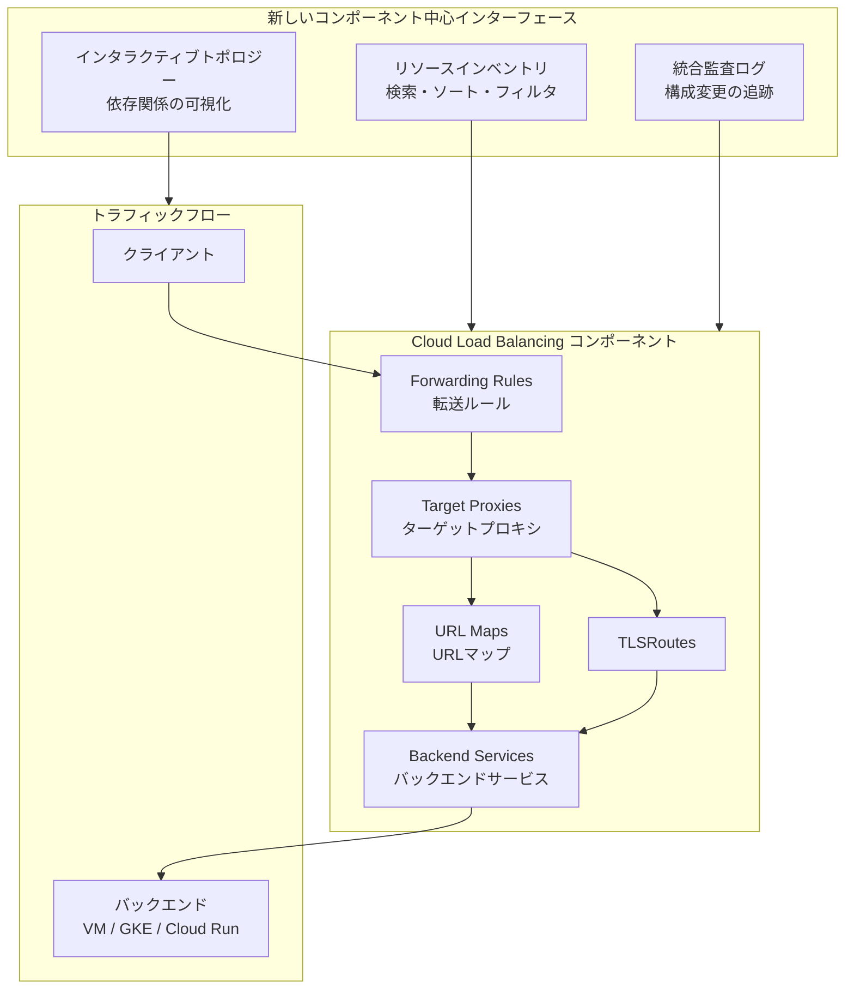

# Cloud Load Balancing: コンポーネント中心の新しいコンソールインターフェース

**リリース日**: 2026-06-01

**サービス**: Cloud Load Balancing

**機能**: コンポーネント中心インターフェース (Component-Centric Interface)

**ステータス**: Preview

📊 [このアップデートのインフォグラフィックを見る](https://takech9203.github.io/google-cloud-news-summary/20260601-cloud-load-balancing-component-centric-ui.html)

## 概要

Google Cloud は Cloud Load Balancing 向けに、モダナイズされたコンポーネント中心のインターフェースを Preview として公開しました。この新しいコンソール UI は、ロードバランシングインフラストラクチャを個々のコンポーネント単位で可視化し、転送ルール、ターゲットプロキシ、TLSRoute などの構成要素を一元的に管理できる環境を提供します。

従来の Cloud Load Balancing コンソールはロードバランサー単位のビューが中心であり、個別コンポーネントの状態や依存関係を把握するには複数の画面を行き来する必要がありました。今回の新インターフェースでは、リソースインベントリ、インタラクティブトポロジー、統合監査ログの3つの主要機能により、インフラの透明性が大幅に向上します。

この機能は、複数のロードバランサーを運用する中〜大規模な組織のネットワークエンジニア、SRE、プラットフォームチームを主な対象としています。コンポーネントレベルでの構成確認やトラブルシューティングが効率化され、障害対応時間の短縮が期待されます。

**アップデート前の課題**

- ロードバランサー単位のビューでは、個別の転送ルールやターゲットプロキシの状態を横断的に確認することが困難だった
- コンポーネント間の依存関係を把握するには、gcloud CLI や API で個別に情報を取得する必要があった
- 構成変更の履歴を確認するには Cloud Audit Logs を別画面で参照する必要があり、コンテキストが分断されていた
- トラフィックフローの全体像を視覚的に把握する手段がコンソール上に存在しなかった

**アップデート後の改善**

- 転送ルール、ターゲットプロキシ、TLSRoute を検索・ソート可能な統合ビューで一元管理できるようになった
- インタラクティブなトポロジーマップにより、転送ルールからプロキシ、バックエンドまでのトラフィックフローを視覚的に確認可能になった
- コンソール内に監査ログが統合され、構成変更の履歴をコンテキストを保ったまま追跡できるようになった

## アーキテクチャ図

新しいインターフェースは、コンポーネント群を3つの視点（インベントリ、トポロジー、監査ログ）から横断的に管理することを可能にします。トラフィックフローの可視化により、転送ルールからバックエンドまでの経路と依存関係を直感的に理解できます。

## サービスアップデートの詳細

### 主要機能

1. **包括的リソースインベントリ (Comprehensive Resource Inventory)**
   - 転送ルール、ターゲットプロキシ、TLSRoute などの粒度の細かいリソースを一元管理するレイヤーを提供
   - 検索・ソート機能により、大量のリソースから目的のコンポーネントを迅速に特定可能
   - リソースのステータスおよび相互依存関係の詳細なモニタリングを実現
   - プロジェクト内の全ロードバランシングリソースの棚卸しを容易にする

2. **インタラクティブリソーストポロジー (Interactive Resource Topology)**
   - コンテキストに応じた可視化ツールで、転送ルールからプロキシ経由でバックエンドに至るトラフィックフローをマッピング
   - 技術チームが依存関係を効率的に分析し、問題解決を加速するための視覚的インターフェース
   - コンポーネント間の接続関係をグラフィカルに表示し、構成の全体像を俯瞰可能
   - 問題発生時に影響範囲を即座に特定するための依存関係トレース機能

3. **統合監査ログ (Integrated Audit Logging)**
   - コンソール内に監査ログを直接埋め込み、画面遷移なしで構成変更履歴を確認可能
   - 過去の設定変更のモニタリングと追跡を行う統一モジュールを提供
   - いつ、誰が、どのコンポーネントをどのように変更したかを時系列で確認可能
   - コンプライアンス要件への対応やインシデント調査の効率化に貢献

## 技術仕様

### 管理対象コンポーネント

| コンポーネント | 説明 | 従来の管理方法 |
|------|------|------|
| Forwarding Rules (転送ルール) | IP アドレス、プロトコル、ポートを指定してトラフィックを受信するフロントエンド構成 | ロードバランサー詳細画面またはgcloud CLI |
| Target Proxies (ターゲットプロキシ) | クライアント接続を終端し、バックエンドへの新しい接続を作成 | ロードバランサー詳細画面またはgcloud CLI |
| TLSRoutes | SNI ベースのルーティングを行うための TLS ルート定義 | gcloud CLI / API |
| URL Maps | ホスト名と URL パスに基づくルーティングルールを定義 | ロードバランサー詳細画面 |
| Backend Services | リクエストを処理するバックエンドグループの構成 | ロードバランサー詳細画面 |

### 対応するロードバランサータイプ

Cloud Load Balancing のコンポーネント中心インターフェースは、以下のロードバランサーのコンポーネントを管理対象とします:

- Global external Application Load Balancer
- Regional external Application Load Balancer
- Internal Application Load Balancer (Regional / Cross-region)
- Proxy Network Load Balancer (External / Internal)

## メリット

### ビジネス面

- **障害対応時間の短縮**: トポロジービューにより影響範囲を即座に特定でき、MTTR (平均復旧時間) の削減が期待される
- **運用効率の向上**: 複数画面の行き来が不要になり、日常的な構成確認作業の工数を削減
- **コンプライアンス対応の簡素化**: 統合監査ログにより、構成変更の履歴をシームレスに追跡・レポート可能

### 技術面

- **依存関係の可視化**: コンポーネント間の接続関係をグラフィカルに確認でき、複雑な構成でも全体像を把握しやすい
- **リソースの横断検索**: プロジェクト内の全転送ルールやプロキシを一覧・検索でき、未使用リソースの特定にも有用
- **コンテキスト保持型の監査**: 監査ログがコンポーネントビューに統合されているため、変更の影響を即座に理解可能

## デメリット・制約事項

### 制限事項

- 現在 Preview 段階であり、本番環境での SLA は適用されない
- Preview 機能のため、GA 時にインターフェースや機能が変更される可能性がある
- コンソール UI の機能であり、API やgcloud CLI での自動化には直接的な影響はない

### 考慮すべき点

- Preview 段階のため、機能が不完全な部分や既知の制約が存在する可能性がある
- 従来のロードバランサー中心ビューも引き続き利用可能であり、既存のワークフローへの影響はない
- 大規模環境 (数百〜数千のリソース) でのパフォーマンス特性については今後の検証が必要

## ユースケース

### ユースケース 1: マルチサービス環境でのトラブルシューティング

**シナリオ**: 複数のマイクロサービスに対してそれぞれ異なるロードバランサーを構成している環境で、特定のサービスへのトラフィックが意図したバックエンドに到達しない問題が発生。

**効果**: インタラクティブトポロジーにより、対象の転送ルールからバックエンドまでの経路を視覚的にトレースし、誤った URL マップ設定やプロキシの構成ミスを迅速に特定できる。

### ユースケース 2: 未使用リソースのクリーンアップ

**シナリオ**: プロジェクトの運用が長期化し、不要になった転送ルールやターゲットプロキシが残存しているが、どれが使用中でどれが不要かの判別が困難。

**効果**: リソースインベントリで全コンポーネントを一覧化し、依存関係のないリソースや未接続のプロキシを特定。不要なリソースの削除によるコスト最適化と構成の簡素化を実現。

### ユースケース 3: セキュリティ監査と構成変更の追跡

**シナリオ**: セキュリティチームから、過去1週間の Cloud Load Balancing 構成変更の監査レポート提出を求められた。

**効果**: 統合監査ログにより、どのコンポーネントがいつ変更されたかを画面内で即座に確認でき、変更の意図や影響範囲をコンテキストと共に報告可能。

## 料金

今回の新しいコンポーネント中心インターフェースはコンソール UI の機能改善であり、追加料金は発生しません。Cloud Load Balancing 自体の料金は従来通り以下の構成に基づきます:

- 転送ルールの課金 (最初の5ルールと追加ルールで料金が異なる)
- 受信データ処理量に基づく課金
- 送信データ処理量に基づく課金 (リージョンにより $0.008 - $0.012/GB)

詳細な料金については [Cloud Load Balancing pricing](https://cloud.google.com/vpc/network-pricing#lb) を参照してください。

## 関連サービス・機能

- **Cloud Audit Logs**: 統合監査ログの基盤となるサービス。コンポーネントへの管理操作やデータアクセスを記録
- **Cloud Monitoring**: ロードバランサーのメトリクスを監視するサービス。新UIのトポロジービューと併用することで運用可視性が向上
- **Network Intelligence Center**: ネットワークの監視・検証・最適化プラットフォーム。トポロジービューと補完的な関係
- **Cloud Logging**: ロードバランサーのアクセスログを収集・分析するサービス
- **App Design Center**: ロードバランシングコンポーネントのテンプレート設計ツール。Terraform コード生成と連携

## 参考リンク

- 📊 [インフォグラフィック](https://takech9203.github.io/google-cloud-news-summary/20260601-cloud-load-balancing-component-centric-ui.html)
- [公式リリースノート](https://docs.cloud.google.com/release-notes#June_01_2026)
- [Cloud Load Balancing ドキュメント](https://docs.cloud.google.com/load-balancing/docs/load-balancing-overview)
- [Cloud Load Balancing リソースモデル](https://docs.cloud.google.com/load-balancing/docs/load-balancer-resource-model)
- [転送ルールの概要](https://docs.cloud.google.com/load-balancing/docs/forwarding-rule-concepts)
- [料金ページ](https://cloud.google.com/vpc/network-pricing#lb)

## まとめ

Cloud Load Balancing の新しいコンポーネント中心インターフェースは、複雑化するロードバランシングインフラの管理を大幅に効率化する UI 改善です。特にインタラクティブトポロジーによるトラフィックフロー可視化と統合監査ログは、トラブルシューティングとコンプライアンス対応の両面で実用的な価値を提供します。Preview 段階ではありますが、複数のロードバランサーを運用している組織では早期に評価することをお勧めします。

---

**タグ**: #CloudLoadBalancing #Networking #ConsoleUI #Preview #トポロジー #監査ログ #リソース管理
