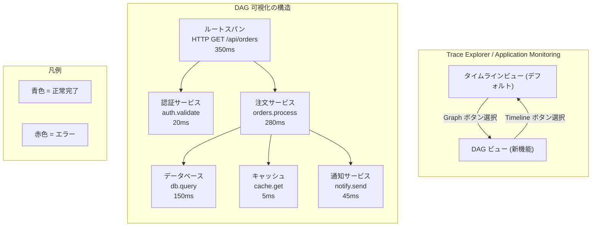

# Cloud Monitoring / Cloud Trace: トレースコール階層の DAG (有向非巡回グラフ) 可視化

**リリース日**: 2026-06-01

**サービス**: Cloud Monitoring / Cloud Trace

**機能**: スパン詳細ページにおけるトレースコール階層の DAG 表示

**ステータス**: Feature (GA)

📊 [このアップデートのインフォグラフィックを見る](https://takech9203.github.io/google-cloud-news-summary/20260601-cloud-monitoring-trace-dag-visualization.html)

## 概要

2026年6月1日、Google Cloud Observability の Cloud Monitoring および Cloud Trace において、トレースのコール階層を有向非巡回グラフ (DAG: Directed Acyclic Graph) として表示する新機能がリリースされました。従来はタイムライン形式のみで表示されていたスパンの呼び出し関係を、グラフ形式で視覚的に把握できるようになります。

この機能は Trace Explorer ページでスパンの詳細を表示する際に利用できるほか、Application Monitoring ダッシュボードからトレースデータを探索する際のフライアウトでも DAG オプションが選択可能です。ツールバーの「Graph」ボタンを選択するだけで、タイムラインビューから DAG ビューに切り替えることができます。

DAG ビューでは、各要素にスパン名とレイテンシーが表示され、色はスパンのステータス (成功: 青、エラー: 赤) を反映します。マウスのスクロールホイールでグラフサイズを変更でき、複雑なマイクロサービスアーキテクチャにおけるサービス間の呼び出し関係を直感的に理解することが可能です。

**アップデート前の課題**

- トレースのコール階層はタイムライン形式のみで表示されており、サービス間の依存関係や呼び出し構造を視覚的に把握することが困難だった
- 多数のスパンを持つ複雑なトレースでは、タイムラインだけでは親子関係の全体像を理解しにくかった
- サービス間の呼び出しパターンやボトルネックの特定に時間がかかっていた

**アップデート後の改善**

- DAG 形式でコール階層を表示でき、サービス間の依存関係をグラフとして直感的に理解可能になった
- Trace Explorer と Application Monitoring ダッシュボードの両方で DAG ビューが利用可能
- スパンのステータスが色で表現され、エラーの発生箇所を即座に特定可能
- マウスホイールでのズーム操作により、大規模なトレースでも柔軟に閲覧可能

## アーキテクチャ図

上図は、DAG ビューで表示されるトレースのコール階層の概念図です。各ノードがスパンを表し、矢印が呼び出し関係を示します。従来のタイムライン形式と DAG 形式をツールバーのボタンで切り替えて利用できます。

## サービスアップデートの詳細

### 主要機能

1. **DAG (有向非巡回グラフ) ビュー**
   - スパンの詳細ページでコール階層をグラフ形式で表示
   - 各ノードにスパン名とレイテンシーが表示される
   - スパンのステータスが色で表現される (青: 正常、赤: エラー)
   - マウスのスクロールホイールでグラフのズームイン・ズームアウトが可能

2. **Trace Explorer での利用**
   - Trace Explorer ページでスパンを選択し、詳細フライアウトを開く
   - ツールバーの「Graph」ボタンを選択することで DAG ビューに切り替え
   - タイムラインビューとの切り替えが自由に可能
   - 「Find in Trace」フィールドによるスパン検索機能と併用可能

3. **Application Monitoring ダッシュボードでの利用**
   - Application Monitoring ダッシュボードの Traces セクションからトレースを探索
   - インタラクティブフライアウト内で DAG オプションを選択可能
   - App Hub 登録サービスやワークロードのアイコン表示にも対応
   - 「View in Trace Explorer」ボタンで Trace Explorer への遷移も可能

4. **GenAI スパンとの統合**
   - GenAI アイコンが表示されるスパン (生成 AI イベントや属性を含む) も DAG 内で識別可能
   - AI エージェントアプリケーションのトレース解析に有効

## 技術仕様

### 表示要素

| 項目 | 詳細 |
|------|------|
| ビュー切替 | ツールバーの「Graph」/「Timeline」ボタン |
| ノード表示情報 | スパン名、レイテンシー |
| ステータス表現 | 色による表示 (青: 正常、赤: エラー) |
| ズーム操作 | マウスのスクロールホイール |
| 対応ページ | Trace Explorer、Application Monitoring ダッシュボード |

### コール階層で表示される情報

| 項目 | 詳細 |
|------|------|
| Name カラム | スパン名およびスパン/トレース ID |
| Service/workload カラム | サービスまたはワークロード名 (OpenTelemetry の `service.name` 属性) |
| レイテンシーバー | ステータスと所要時間を色と長さで表現 |
| ログ/イベント表示 | レイテンシーバー上の丸印でログエントリやイベントの存在を示す |
| GenAI アイコン | 生成 AI イベントまたは属性を含むスパンを識別 |

## 設定方法

### 前提条件

1. Google Cloud プロジェクトで Cloud Trace API が有効であること
2. 適切な IAM ロール (Cloud Trace の閲覧権限) が付与されていること
3. アプリケーションが OpenTelemetry などでインストルメンテーションされ、トレースデータが送信されていること

### 手順

#### ステップ 1: Trace Explorer からの利用

1. Google Cloud コンソールで **Trace Explorer** ページを開く
2. テーブルからスパンを選択するか、ツールバーの「Search for trace」アイコンをクリックしてトレース ID を入力
3. 詳細フライアウトが開き、デフォルトでタイムラインビューが表示される
4. ツールバーの **「Graph」** ボタンをクリックして DAG ビューに切り替え

#### ステップ 2: Application Monitoring からの利用

1. Google Cloud コンソールで **Application Monitoring** ダッシュボードを開く
2. Traces セクションでスパングループを選択
3. インタラクティブフライアウトが開き、コール階層が表示される
4. ツールバーの **「Graph」** ボタンをクリックして DAG ビューに切り替え

## メリット

### ビジネス面

- **トラブルシューティング時間の短縮**: サービス間の依存関係をグラフで即座に把握でき、障害の根本原因特定が迅速化
- **運用効率の向上**: 複雑なマイクロサービスアーキテクチャの全体像を直感的に理解可能
- **AI/ML ワークロードの可視性向上**: GenAI スパンを含むエージェントアプリケーションの動作フローを把握しやすくなる

### 技術面

- **依存関係の構造的理解**: タイムラインでは表現しにくいサービス間の親子関係・兄弟関係をグラフで明確に表現
- **ボトルネックの視覚的特定**: レイテンシー情報とステータスの色表現により、パフォーマンス問題箇所を即座に特定
- **スケーラブルな表示**: ズーム機能により、多数のスパンを持つ大規模トレースでも効率的に閲覧可能
- **既存ワークフローとの統合**: Application Monitoring と Trace Explorer の両方で利用でき、既存の運用フローを変更せずに活用可能

## デメリット・制約事項

### 考慮すべき点

- DAG ビューはコール階層の構造を表示するが、時間軸上のタイミングを確認するにはタイムラインビューとの併用が必要
- 非常に深いネストや多数の並列呼び出しを持つトレースでは、グラフが複雑になる可能性がある
- Application Monitoring での利用には、App Hub にサービスやワークロードが登録されている必要がある (Discovered サービスではトレースデータが表示されない)

## ユースケース

### ユースケース 1: マイクロサービスの障害分析

**シナリオ**: e コマースアプリケーションで注文処理のレスポンスタイムが増加。複数のマイクロサービスが連携する中で、どのサービスがボトルネックになっているかを特定したい。

**効果**: DAG ビューでトレースを表示することで、注文サービスから在庫サービス、決済サービス、通知サービスへの呼び出し構造を一目で把握。赤色のノードでエラー発生箇所を即座に特定し、レイテンシー表示でボトルネックを発見できる。

### ユースケース 2: AI エージェントアプリケーションのデバッグ

**シナリオ**: LangChain や LangGraph で構築した AI エージェントが予期しない動作をしている。エージェントがどのツールを呼び出し、どのような順序で処理しているかを確認したい。

**効果**: GenAI アイコン付きのスパンを含むトレースを DAG で表示し、エージェントのツール呼び出しパターンや MCP サーバーへのリクエストフローを視覚的に理解。タイムラインでは把握しにくい分岐や並列処理の構造を明確に確認できる。

### ユースケース 3: パフォーマンスチューニング

**シナリオ**: アプリケーションの P95 レイテンシーを改善するため、クリティカルパス上のサービス呼び出しを最適化したい。

**効果**: DAG ビューでクリティカルパスを視覚的に追跡し、直列化されている呼び出しの中で並列化可能なものを特定。依存関係の構造を理解した上で、キャッシュ導入やバッチ処理の適用箇所を効率的に判断できる。

## 料金

この DAG 可視化機能自体に追加料金は発生しません。Cloud Trace の利用料金は従来通り、取り込まれたトレーススパン数に基づいて課金されます。

| 項目 | 料金 |
|------|------|
| 最初の 250 万スパン/月 | 無料 |
| 250 万スパンを超える分 | $0.20 / 100 万スパン |

※ 最新の料金情報は [Cloud Trace 料金ページ](https://cloud.google.com/trace/pricing) をご確認ください。

## 関連サービス・機能

- **Cloud Trace**: トレースデータの収集・保存・分析を行うコアサービス。DAG ビューは Trace Explorer 内の機能
- **Cloud Monitoring (Application Monitoring)**: アプリケーションレベルのダッシュボードでトレースデータを表示。DAG ビューはフライアウト内で利用可能
- **Observability Analytics**: SQL でトレースデータを分析可能 (2026年5月26日 GA)。DAG ビューと併用してデータドリブンな分析が可能
- **OpenTelemetry**: トレースデータ収集の標準。`service.name` 属性が DAG のノード表示に使用される
- **App Hub**: サービスとワークロードの登録管理。Application Monitoring でトレースデータを表示するために必要

## 参考リンク

- 📊 [インフォグラフィック](https://takech9203.github.io/google-cloud-news-summary/20260601-cloud-monitoring-trace-dag-visualization.html)
- [公式リリースノート](https://docs.cloud.google.com/release-notes#June_01_2026)
- [Trace Explorer: Explore a trace](https://docs.cloud.google.com/trace/docs/finding-traces#explore)
- [Application Monitoring: Explore a trace](https://docs.cloud.google.com/monitoring/docs/application-monitoring#explore-trace)
- [Cloud Trace ドキュメント](https://docs.cloud.google.com/trace/docs)
- [Cloud Trace 料金](https://cloud.google.com/trace/pricing)

## まとめ

Cloud Monitoring と Cloud Trace に追加された DAG 可視化機能は、マイクロサービスアーキテクチャや AI エージェントアプリケーションのトレースデータを直感的に理解するための重要なアップデートです。タイムラインビューとの切り替えがワンクリックで行え、既存の運用ワークフローに自然に統合できます。特に複雑なサービス間依存関係を持つアプリケーションの障害分析やパフォーマンスチューニングにおいて、トラブルシューティングの効率を大幅に向上させることが期待されます。

---

**タグ**: #CloudMonitoring #CloudTrace #DAG #トレース可視化 #Observability #ApplicationMonitoring #TraceExplorer #マイクロサービス #パフォーマンス分析
