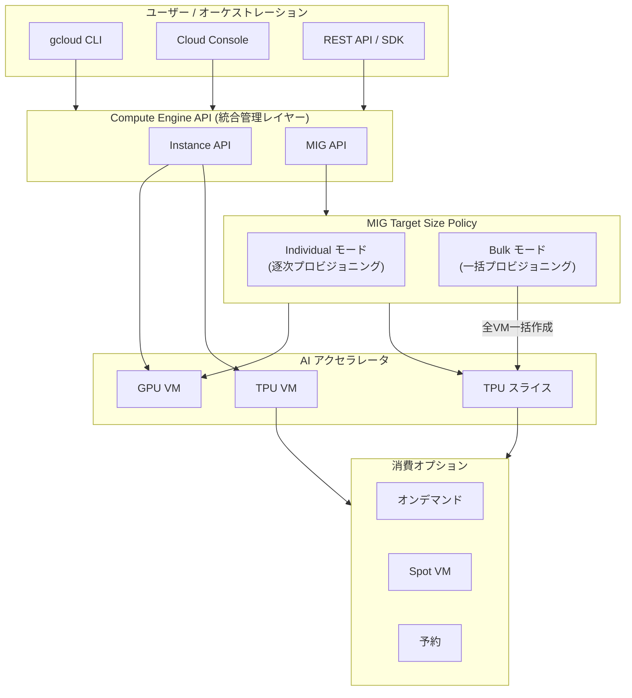

# Compute Engine: TPU 統合管理と MIG バルクモード

**リリース日**: 2026-06-01

**サービス**: Compute Engine

**機能**: TPU リソースの Compute Engine 統合管理 / MIG バルクモード (Target Size Policy)

**ステータス**: GA (一般提供)

[このアップデートのインフォグラフィックを見る](https://takech9203.github.io/google-cloud-news-summary/20260601-compute-engine-tpu-converged-mig-bulk-mode.html)

## 概要

Google Cloud は Compute Engine において 2 つの重要な機能を一般提供 (GA) として発表した。第一に、Google 独自開発の AI アクセラレータである Tensor Processing Unit (TPU) を Compute Engine のインスタンス API およびマネージドインスタンスグループ (MIG) API から直接作成・管理できるようになった。これにより、GPU と TPU を含むすべての AI アクセラレータを単一の Compute Engine インターフェースから統合的に管理する「コンバージド体験」が実現する。

第二に、MIG において Target Size Policy のバルクモードが GA となった。バルクモードを使用すると、MIG 内で要求されたすべての VM インスタンスを一括で取得でき、部分的な VM プロビジョニングを回避できる。これは HPC (高性能コンピューティング) や分散トレーニングなど、処理開始前にフルキャパシティが必要なバッチワークロードに特に有益である。

これら 2 つの機能の組み合わせにより、大規模な AI/ML ワークロードの管理が大幅に簡素化され、TPU スライスの作成からバッチジョブの一括プロビジョニングまで、Compute Engine の統一された API で完結するようになった。

**アップデート前の課題**

- TPU VM の管理には専用の Cloud TPU API (tpu.googleapis.com) を使用する必要があり、GPU VM とは異なる管理体系だった
- TPU と GPU で別々の API、CLI コマンド、ワークフローを習得・運用する必要があった
- MIG で VM を作成する際、リソースが利用可能になった順に個別にプロビジョニングされるため、バッチワークロードでは全ノードが揃うまで待機する必要があった
- 部分的なプロビジョニング状態でもコストが発生し、実質的な作業が開始できないという非効率があった

**アップデート後の改善**

- Compute Engine インスタンス API と MIG API から TPU VM を直接作成・管理でき、GPU と同じワークフローで運用可能になった
- カスタム OS の使用やブートディスクサイズの設定など、標準的な VM 構成を TPU VM に適用可能になった
- TPU スライスをオンデマンド、Spot、予約など全ての消費オプションで作成・管理可能になった
- MIG バルクモードにより、全 VM を一括で取得し、部分プロビジョニングによる無駄なコストを回避できるようになった

## アーキテクチャ図



上図は Compute Engine API を通じて GPU と TPU を統合管理するアーキテクチャと、MIG バルクモードによる一括プロビジョニングの概念を示している。ユーザーは単一の API レイヤーからすべてのアクセラレータリソースを操作できる。

## サービスアップデートの詳細

### 主要機能

1. **TPU リソースの Compute Engine 統合管理**
   - Compute Engine インスタンス API を使用して TPU VM を作成・管理可能
   - MIG API を使用して TPU VM のグループを管理可能
   - カスタム OS やブートディスクサイズなど標準的な VM 構成をサポート
   - 全ての消費オプション (オンデマンド、Spot、予約) に対応
   - 小規模な実験から大規模なトレーニング・推論ワークロードまでスケーラブルに対応

2. **TPU スライスの統合管理**
   - Compute Engine API から TPU スライスの作成・管理が可能
   - マルチホスト TPU スライスの管理を MIG で実現
   - MIG の自動修復・自動更新機能を TPU ワークロードに適用可能

3. **MIG バルクモード (Target Size Policy)**
   - `--target-size-policy-mode=bulk` オプションで有効化
   - 指定された target size の全 VM を一括でプロビジョニング
   - リソースが不足する場合、全リソースが利用可能になるまで待機
   - 部分プロビジョニングを完全に回避

## 技術仕様

### TPU 統合管理の対応範囲

| 項目 | 詳細 |
|------|------|
| API | Compute Engine Instance API, MIG API |
| TPU バージョン | TPU v5e, v5p, v6e (Trillium), Ironwood 以降 |
| 消費オプション | オンデマンド、Spot VM、予約 |
| VM 構成 | カスタム OS、ブートディスクサイズ設定対応 |
| スケール | 単一ホストから大規模スライスまで |

### MIG Target Size Policy モード

| モード | 動作 | 推奨ユースケース |
|--------|------|------------------|
| individual (デフォルト) | リソースが利用可能な VM から順次作成 | 一般的なサービスワークロード |
| bulk | 全 VM を一括作成。作成不可の場合はリソースが揃うまで待機 | HPC、分散トレーニング、バッチ処理 |

### Target Distribution Shape との組み合わせ

| Distribution Shape | 説明 | バルクモードとの相性 |
|-------------------|------|---------------------|
| ANY | リソース可用性優先、予約活用を最大化 | バッチワークロードに推奨 |
| ANY_SINGLE_ZONE | 単一ゾーンに全 VM を配置、低レイテンシ | 分散トレーニングに推奨 |
| BALANCED | ゾーン分散とリソース取得のバランス | 高可用性バッチに推奨 |
| EVEN | ゾーン間で均等分散 | サービングワークロード向け |

## 設定方法

### 前提条件

1. Google Cloud プロジェクトで Compute Engine API が有効であること
2. TPU を使用するリージョン/ゾーンで適切なクォータが確保されていること
3. 必要な IAM 権限 (compute.instances.create, compute.instanceGroupManagers.create) を持つこと

### 手順

#### ステップ 1: TPU VM を Compute Engine API で作成

```bash
# Compute Engine 経由で TPU VM を作成
gcloud compute tpus tpu-vm create my-tpu-vm \
    --zone=us-central1-a \
    --accelerator-type=v5litepod-8 \
    --version=v2-alpha-tpuv5-lite
```

標準的な Compute Engine の VM 構成オプション (カスタム OS、ブートディスクサイズ等) が適用可能。

#### ステップ 2: MIG をバルクモードで作成

```bash
# バルクモードで MIG を作成
gcloud compute instance-groups managed create my-training-mig \
    --template=my-tpu-template \
    --size=8 \
    --zone=us-central1-a \
    --target-size-policy-mode=bulk
```

`--target-size-policy-mode=bulk` を指定することで、8 台全ての VM が一括でプロビジョニングされる。

#### ステップ 3: リージョナル MIG でバルクモードを使用 (分散トレーニング向け)

```bash
# ANY_SINGLE_ZONE 分散形状とバルクモードの組み合わせ
gcloud compute instance-groups managed create my-distributed-training \
    --template=my-tpu-template \
    --size=16 \
    --region=us-central1 \
    --zones=us-central1-a,us-central1-b,us-central1-f \
    --target-distribution-shape=ANY_SINGLE_ZONE \
    --target-size-policy-mode=bulk
```

## メリット

### ビジネス面

- **運用コスト削減**: GPU と TPU を同一の管理ツール・プロセスで運用でき、運用チームの学習コストと管理工数が減少する
- **無駄なコストの排除**: バルクモードにより、部分的にプロビジョニングされた未使用リソースへの課金を防止できる
- **市場投入の迅速化**: 統一された API により、AI/ML プロジェクトのインフラ構築時間が短縮される
- **柔軟な消費モデル**: オンデマンド・Spot・予約を TPU でも活用でき、コスト最適化の選択肢が広がる

### 技術面

- **API の一貫性**: Compute Engine API という単一のインターフェースで全アクセラレータを管理可能
- **IaC との親和性**: Terraform や Deployment Manager など既存の IaC ツールで TPU リソースを管理しやすくなる
- **原子的プロビジョニング**: バルクモードにより分散ワークロードの起動信頼性が向上
- **MIG 機能の活用**: 自動修復、ローリングアップデート、ステートフル管理など MIG の豊富な機能を TPU ワークロードに適用可能

## デメリット・制約事項

### 制限事項

- バルクモードでは全リソースが揃うまで一切の VM が作成されないため、リソース需要が高い時期には待機時間が長くなる可能性がある
- バルクモードは部分的な容量での早期開始が不可能であり、迅速なスケールアウトが必要なワークロードには不向き
- TPU の利用可能ゾーンは限定されており、全リージョンで使用可能ではない
- ワークロードポリシーとバルクモードを組み合わせる場合、対応する distribution shape (ANY または ANY_SINGLE_ZONE) に制限がある

### 考慮すべき点

- 既存の Cloud TPU API ベースのワークフローからの移行計画が必要
- バルクモード使用時のタイムアウトやリトライ戦略の設計が重要
- TPU クォータの事前確保と、バルクモードのリソース待機動作の関係を理解する必要がある

## ユースケース

### ユースケース 1: 大規模 LLM 分散トレーニング

**シナリオ**: 数百億パラメータの大規模言語モデルを TPU スライス上で分散トレーニングする。全ノードが同時に起動しないとトレーニングジョブを開始できない。

**実装例**:
```bash
# 分散トレーニング用 MIG (バルクモード + 単一ゾーン配置)
gcloud compute instance-groups managed create llm-training-cluster \
    --template=tpu-v6e-training-template \
    --size=32 \
    --region=us-central1 \
    --target-distribution-shape=ANY_SINGLE_ZONE \
    --target-size-policy-mode=bulk
```

**効果**: 32 ノード全てが一括でプロビジョニングされ、部分的な課金なしにトレーニングを即時開始可能。単一ゾーン配置により ICI 通信のレイテンシも最小化。

### ユースケース 2: HPC バッチ処理

**シナリオ**: 科学計算シミュレーションで、全計算ノードが揃わないと MPI ジョブが開始できない。部分プロビジョニングで待機中にもコストが発生していた。

**効果**: バルクモードにより全ノードが同時にプロビジョニングされ、不完全な状態での課金が発生しない。リソースが揃い次第即座にジョブ開始可能。

### ユースケース 3: GPU/TPU ハイブリッド AI パイプライン

**シナリオ**: データ前処理を GPU VM で実行し、モデルトレーニングを TPU スライスで実行するパイプラインを構築したい。

**効果**: Compute Engine の統一 API で GPU MIG と TPU MIG の両方を管理でき、同一の IaC テンプレートやオーケストレーションツールで運用可能。チームが個別の API を学ぶ必要がなくなる。

## 料金

### TPU 利用料金

TPU の料金は使用する TPU バージョン、消費オプション (オンデマンド / Spot / 予約)、リージョンによって異なる。MIG やバルクモード自体に追加料金は発生しない。

| 消費オプション | 特徴 |
|----------------|------|
| オンデマンド | 予約不要、利用可能時に即座にプロビジョニング |
| Spot VM | 大幅なディスカウント価格、プリエンプション可能性あり |
| 予約 | 容量保証付き、長期利用のコミットメント割引 |

MIG の使用自体には追加料金はなく、グループ内で使用するリソース (TPU チップ、VM、ストレージ等) に基づいて課金される。

詳細な料金は [Cloud TPU Pricing](https://cloud.google.com/tpu/pricing) を参照のこと。

## 関連サービス・機能

- **Cloud TPU**: Google 独自開発の AI アクセラレータ。今回の統合により Compute Engine API からも管理可能に
- **Google Kubernetes Engine (GKE)**: TPU ノードプールによる Kubernetes ベースの TPU ワークロード管理。MIG との連携も可能
- **AI Hypercomputer**: TPU を中心とした Google Cloud の AI インフラストラクチャアーキテクチャ
- **MIG Resize Requests**: GPU VM を一括作成するための既存機能。今回のバルクモードはより広範なワークロードに対応
- **Workload Policy**: MIG 内の VM 配置トポロジを制御する機能。バルクモードと組み合わせて使用可能

## 参考リンク

- [インフォグラフィック](https://takech9203.github.io/google-cloud-news-summary/20260601-compute-engine-tpu-converged-mig-bulk-mode.html)
- [公式リリースノート](https://docs.cloud.google.com/release-notes#June_01_2026)
- [TPU resources in Compute Engine ドキュメント](https://docs.cloud.google.com/compute/docs/tpus/tpu-resources-in-compute-engine)
- [MIG バルクモード ドキュメント](https://docs.cloud.google.com/compute/docs/instance-groups/about-bulk-mode)
- [Cloud TPU Pricing](https://cloud.google.com/tpu/pricing)
- [Compute Engine Pricing](https://cloud.google.com/compute/all-pricing)

## まとめ

今回のアップデートにより、Google Cloud は AI アクセラレータの管理体験を大幅に統合・簡素化した。Compute Engine API を通じた TPU の統合管理は、GPU と TPU を横断する AI ワークロードの運用負荷を軽減し、MIG バルクモードは大規模バッチワークロードにおける部分プロビジョニングの課題を解決する。AI/ML ワークロードを運用するチームは、これら 2 つの機能を組み合わせることで、より効率的かつコスト最適なインフラ管理を実現できる。

---

**タグ**: #ComputeEngine #TPU #ManagedInstanceGroup #MIG #BulkMode #AIAccelerator #MachineLearning #HPC #DistributedTraining #GA
