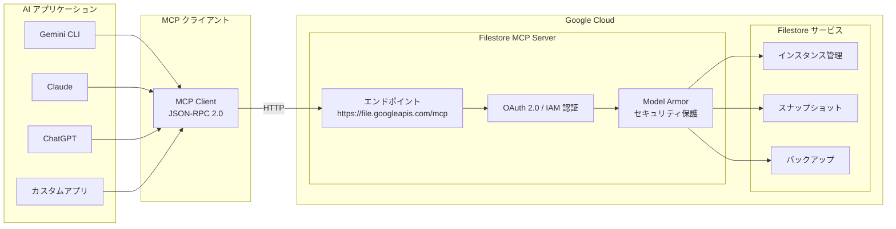

# Filestore: リモート MCP サーバーの一般提供 (GA)

**リリース日**: 2026-06-01

**サービス**: Google Cloud Filestore

**機能**: Filestore リモート Model Context Protocol (MCP) サーバー GA

**ステータス**: GA (一般提供)

📊 [このアップデートのインフォグラフィックを見る](https://takech9203.github.io/google-cloud-news-summary/20260601-filestore-mcp-server-ga.html)

## 概要

Google Cloud Filestore のリモート Model Context Protocol (MCP) サーバーが一般提供 (GA) となりました。この MCP サーバーにより、LLM、AI アプリケーション、AI 対応の開発プラットフォームから自然言語を使用して Filestore インスタンスの作成・管理が可能になります。

MCP (Model Context Protocol) は、大規模言語モデル (LLM) と AI アプリケーションが外部データソースやツールに接続するための標準化されたプロトコルです。Filestore リモート MCP サーバーは Google Cloud のインフラストラクチャ上で動作し、HTTP エンドポイントを通じて AI アプリケーションと通信します。これにより、Gemini CLI、ChatGPT、Claude などの AI アプリケーションから直接、高性能ファイルストレージのプロビジョニングと管理が可能になります。

Filestore MCP サーバーは Filestore API を有効化すると自動的に利用可能になり、インスタンスの作成・スケーリング、オペレーションの監視、スナップショットやバックアップによるデータ保護の設定を自然言語で実行できます。

**アップデート前の課題**

- Filestore インスタンスの作成・管理には Google Cloud Console、gcloud CLI、または REST API を直接操作する必要があった
- AI エージェントやアプリケーションから Filestore リソースを管理するには、カスタムインテグレーションの開発が必要だった
- インフラ管理の自動化には専用のスクリプトや IaC ツールの知識が求められていた

**アップデート後の改善**

- 自然言語で Filestore インスタンスの作成・管理が可能になった
- AI アプリケーションから標準化された MCP プロトコルを通じて直接 Filestore を操作できるようになった
- OAuth 2.0 と IAM による細粒度のアクセス制御が MCP 経由で利用可能になった
- Model Armor によるプロンプト・レスポンスのセキュリティ保護がオプションで利用可能になった

## アーキテクチャ図



AI アプリケーションは MCP クライアントを介して Filestore リモート MCP サーバー (https://file.googleapis.com/mcp) に接続し、OAuth 2.0 認証と IAM 認可を経て Filestore リソースの操作を実行します。

## サービスアップデートの詳細

### 主要機能

1. **リモート MCP サーバーエンドポイント**
   - グローバルエンドポイント: `https://file.googleapis.com/mcp`
   - HTTP トランスポートを使用したリモート通信
   - JSON-RPC 2.0 プロトコルによる標準化された通信

2. **インスタンス管理ツール**
   - `filestore_list_instances`: 全 Filestore インスタンスの一覧表示
   - `filestore_get_instance`: 特定のインスタンスの詳細情報取得

3. **スナップショット管理ツール**
   - `filestore_list_snapshots`: 特定インスタンスの全スナップショット一覧
   - `filestore_get_snapshot`: 特定スナップショットの詳細取得
   - `filestore_create_snapshot`: 新規スナップショットの作成

4. **バックアップ管理ツール**
   - `filestore_list_backups`: 全バックアップの一覧表示
   - `filestore_get_backup`: 特定バックアップの詳細取得
   - `filestore_create_backup`: 新規バックアップの作成

5. **セキュリティ機能**
   - OAuth 2.0 プロトコルによる認証
   - IAM による細粒度のアクセス制御
   - Model Armor によるプロンプト・レスポンスのセキュリティ保護 (オプション)
   - 集中化された監査ログ

## 技術仕様

### MCP ツール一覧

| ツール名 | 機能 |
|----------|------|
| `filestore_list_instances` | 全 Filestore インスタンスの一覧取得 |
| `filestore_get_instance` | 特定インスタンスの詳細取得 |
| `filestore_list_snapshots` | 特定インスタンスのスナップショット一覧取得 |
| `filestore_get_snapshot` | 特定スナップショットの詳細取得 |
| `filestore_create_snapshot` | スナップショットの新規作成 |
| `filestore_list_backups` | 全バックアップの一覧取得 |
| `filestore_get_backup` | 特定バックアップの詳細取得 |
| `filestore_create_backup` | バックアップの新規作成 |

### 必要な IAM ロール

| ロール | 説明 |
|--------|------|
| `roles/mcp.toolUser` (MCP Tool User) | MCP ツールの呼び出し権限 |
| `roles/file.admin` (File Admin) | Filestore リソースへのフルアクセス |

### OAuth スコープ

| スコープ URI | 説明 |
|-------------|------|
| `https://www.googleapis.com/auth/cloud-filer` | Filestore リモート MCP サーバーへの認証 |

## 設定方法

### 前提条件

1. Google Cloud プロジェクトで Filestore API が有効化されていること
2. MCP サーバーが有効化されていること
3. 適切な IAM ロール (`roles/mcp.toolUser` および `roles/file.admin`) が付与されていること

### 手順

#### ステップ 1: MCP クライアントの設定

AI アプリケーションの MCP クライアント設定に以下の情報を追加します:

```json
{
  "mcpServers": {
    "filestore": {
      "name": "Filestore MCP server",
      "url": "https://file.googleapis.com/mcp",
      "transport": "HTTP"
    }
  }
}
```

#### ステップ 2: ツール一覧の確認

MCP サーバーに接続後、利用可能なツールを確認します:

```bash
curl --location 'https://file.googleapis.com/mcp' \
  --header 'content-type: application/json' \
  --header 'accept: application/json, text/event-stream' \
  --data '{
    "method": "tools/list",
    "jsonrpc": "2.0",
    "id": 1
  }'
```

#### ステップ 3: 自然言語によるインスタンス管理

接続完了後、AI アプリケーションから自然言語でリクエストを送信できます:

- 「プロジェクト my-project の us-central1-a ゾーンに 1 TiB の Zonal インスタンスを作成してください」
- 「全 Filestore インスタンスの状態とストレージティアを表形式で表示してください」
- 「インスタンス my-instance のスナップショットを作成してください」

## メリット

### ビジネス面

- **運用効率の向上**: 自然言語でインフラ管理ができるため、専門的な CLI/API 知識がなくてもストレージリソースを管理可能
- **AI ワークフローとの統合**: AI アプリケーションのワークフロー内で直接ストレージのプロビジョニングとデータ保護を実行可能
- **開発速度の加速**: カスタムインテグレーションの開発が不要になり、標準プロトコルで即座に接続可能

### 技術面

- **標準化されたプロトコル**: MCP 標準に準拠しているため、対応する全ての AI アプリケーションから統一的にアクセス可能
- **細粒度のセキュリティ**: OAuth 2.0 + IAM による認証・認可で、最小権限の原則に基づいたアクセス制御を実現
- **マネージドインフラ**: Google Cloud のインフラ上で稼働するため、可用性やスケーラビリティを自前で管理する必要がない
- **監査ログの集中管理**: MCP サーバー経由の全操作が監査ログに記録され、コンプライアンス要件への対応が容易

## デメリット・制約事項

### 制限事項

- スナップショットやバックアップの削除、復元、リストアは MCP サーバー経由では実行不可 (意図しないデータ損失防止のため)
- インスタンスの作成・削除などの一部の操作は MCP ツールとして提供されていない可能性がある (利用可能なツールは 8 種類に限定)
- OAuth スコープとして `https://www.googleapis.com/auth/cloud-filer` が必要

### 考慮すべき点

- AI エージェントに Filestore の管理権限を付与する際は、専用の ID を作成してアクセスの制御と監視を行うことを推奨
- MCP サーバー経由の操作は全て監査ログに記録されるため、コスト管理の観点から過剰な API 呼び出しに注意
- 本番環境での利用前に、Model Armor によるセキュリティ保護の有効化を検討すべき

## ユースケース

### ユースケース 1: AI 開発プラットフォームからのストレージ自動プロビジョニング

**シナリオ**: 機械学習パイプラインの一部として、トレーニングデータを格納するための高性能ファイルストレージを AI エージェントが自動的にプロビジョニングする。

**実装例**:
```
ユーザー: 「us-central1-a に 2 TiB の Zonal Filestore インスタンスを作成して、
           default ネットワークに接続してください」

AI エージェント: filestore_create_instance ツールを呼び出し、
               指定されたパラメータでインスタンスを自動作成
```

**効果**: インフラチームへの依頼や手動操作が不要になり、開発者が必要なタイミングでストレージを即座に確保可能。

### ユースケース 2: 定期的なデータ保護の自動化

**シナリオ**: AI エージェントが定期的に Filestore インスタンスの状態を確認し、重要なデータのスナップショットやバックアップを自動作成する。

**効果**: 人的介入なしにデータ保護ポリシーを遵守し、障害発生時の復旧ポイントを自動的に確保。

### ユースケース 3: マルチクラウド AI ワークフローでのストレージ管理

**シナリオ**: 異なる AI プラットフォーム (Claude、Gemini CLI など) から統一的に Filestore リソースを管理し、チーム全体でストレージインフラの状態を可視化する。

**効果**: ツールに依存しない統一的なストレージ管理が可能になり、チーム間のコラボレーションが向上。

## 料金

Filestore MCP サーバー自体の追加料金は発生しません (Filestore API の有効化により自動的に利用可能)。料金は作成・管理される Filestore インスタンスに対して発生します。

### Filestore 料金体系

| サービスティア | 課金項目 | 料金 (USD) |
|---------------|----------|------------|
| Filestore Regional (カスタムパフォーマンス ON) | インスタンスあたり | $40/月〜 |
| Filestore Regional (カスタムパフォーマンス ON) | 容量 (GiB あたり) | $0.21/月〜 |
| Filestore Regional (カスタムパフォーマンス ON) | IOPS あたり | $0.027/月〜 |
| Filestore Regional (カスタムパフォーマンス OFF) | 容量 (GiB あたり) | $0.45/月〜 |
| Filestore Zonal (カスタムパフォーマンス ON) | インスタンスあたり | $20/月〜 |
| Filestore Zonal (カスタムパフォーマンス ON) | 容量 (GiB あたり) | $0.12/月〜 |
| Filestore Zonal (カスタムパフォーマンス ON) | IOPS あたり | $0.0145/月〜 |
| Filestore Zonal (カスタムパフォーマンス OFF) | 容量 (GiB あたり) | $0.25/月〜 |

※ 料金はリージョンにより異なります。最新の料金は公式料金ページを参照してください。

## 関連サービス・機能

- **Google Cloud MCP サーバー**: Google Cloud の各種サービスに対応したリモート MCP サーバー群。Filestore はその一つとして提供
- **Model Armor**: MCP サーバー経由のプロンプトとレスポンスに対するセキュリティ保護を提供
- **Cloud IAM**: MCP ツール呼び出しに対する細粒度のアクセス制御を担当
- **Filestore CSI ドライバー**: GKE ワークロード向けの Filestore 統合。MCP サーバーとは異なるアプローチでの自動化を提供
- **Gemini CLI**: Filestore MCP サーバーへの接続をネイティブサポートする AI アプリケーションの一つ

## 参考リンク

- 📊 [インフォグラフィック](https://takech9203.github.io/google-cloud-news-summary/20260601-filestore-mcp-server-ga.html)
- [公式リリースノート](https://docs.cloud.google.com/release-notes#June_01_2026)
- [Filestore MCP サーバーの使用方法](https://docs.cloud.google.com/filestore/docs/use-filestore-mcp)
- [Filestore MCP リファレンス](https://docs.cloud.google.com/filestore/docs/reference/mcp)
- [Google Cloud MCP サーバー概要](https://docs.cloud.google.com/mcp/overview)
- [料金ページ](https://cloud.google.com/filestore/pricing)

## まとめ

Filestore リモート MCP サーバーの GA リリースにより、AI アプリケーションから標準化されたプロトコルを通じて高性能ファイルストレージを直接管理できるようになりました。これは Google Cloud が推進する「AI-ready インフラストラクチャ」戦略の一環であり、AI エージェントがインフラリソースを自律的に管理する時代の到来を象徴しています。Filestore を利用している組織は、既存の AI ワークフローへの MCP サーバー統合を検討し、インフラ管理の自動化と効率化を進めることを推奨します。

---

**タグ**: #Filestore #MCP #ModelContextProtocol #AI #GA #ストレージ #NFS #自動化 #インフラ管理
