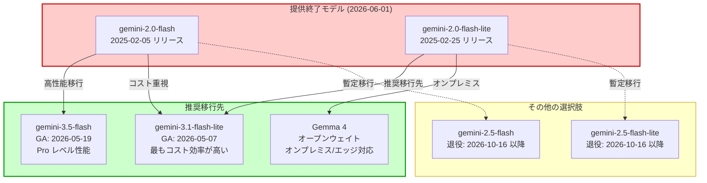

# Gemini Enterprise Agent Platform: Gemini 2.0 Flash / Flash-Lite 提供終了 (Breaking Change)

**リリース日**: 2026-06-01

**サービス**: Gemini Enterprise Agent Platform

**機能**: Gemini 2.0 Flash および Gemini 2.0 Flash-Lite の提供終了

**ステータス**: Retired (提供終了)

:warning: **BREAKING CHANGE**: このアップデートにより、Gemini 2.0 Flash および Gemini 2.0 Flash-Lite モデルへのすべてのアクセスが即時停止されます。影響を受けるユーザーは速やかに移行が必要です。

[このアップデートのインフォグラフィックを見る](https://takech9203.github.io/google-cloud-news-summary/20260601-gemini-2-0-flash-discontinued.html)

## 概要

2026 年 6 月 1 日をもって、Gemini 2.0 Flash (`gemini-2.0-flash`, `gemini-2.0-flash-001`) および Gemini 2.0 Flash-Lite (`gemini-2.0-flash-lite`, `gemini-2.0-flash-lite-001`) が完全に提供終了 (Retired) となりました。これらのモデルへのオンライン推論、バッチ推論、チューニング、および Provisioned Throughput を含むすべてのアクセスが停止されています。

この変更は **Breaking Change** であり、これらのモデル ID を参照している API リクエストは 404 エラーを返します。影響を受けるすべてのユーザーは、推奨される移行先モデル (Gemini 3.1 Flash-Lite、Gemini 3.5 Flash、Gemma 4 など) への即時移行が必要です。

Gemini 2.0 Flash は 2025 年 2 月 5 日にリリースされ、約 16 か月間にわたり高速・低コストの推論モデルとして広く利用されてきました。後継モデルである Gemini 3.x シリーズは、応答品質、指示追従性、マルチモーダル入力品質において大幅な改善を実現しており、Google は積極的な移行を推奨しています。

**アップデート前の課題**

- Gemini 2.0 Flash / Flash-Lite を本番環境で利用中のアプリケーションが多数存在
- Provisioned Throughput で固定契約を結んでいるユーザーへの影響
- チューニング済みモデルの再トレーニングが必要になるケース

**アップデート後の改善**

- Gemini 3.1 Flash-Lite は Gemini 2.5 Flash と同等の応答品質を達成しつつ、低レイテンシ・低コストを維持
- Gemini 3.5 Flash は Pro レベルのコーディング能力とエージェント実行能力を Flash 価格帯で提供
- Gemma 4 はオープンウェイトモデルとしてオンプレミスやエッジデバイスでの実行が可能

## アーキテクチャ図



Gemini 2.0 Flash / Flash-Lite から推奨移行先モデルへの移行パスを示す図。実線は推奨パス、点線は暫定的な移行パス (2026 年 10 月以降に再移行が必要) を表す。

## サービスアップデートの詳細

### 提供終了対象モデル

| モデル ID | リリース日 | 提供終了日 | 推奨移行先 |
|-----------|-----------|-----------|-----------|
| `gemini-2.0-flash` | 2025-02-05 | 2026-06-01 | `gemini-3.1-flash-lite` / `gemini-3.5-flash` |
| `gemini-2.0-flash-001` | 2025-02-05 | 2026-06-01 | `gemini-3.5-flash` |
| `gemini-2.0-flash-lite` | 2025-02-25 | 2026-06-01 | `gemini-3.1-flash-lite` |
| `gemini-2.0-flash-lite-001` | 2025-02-25 | 2026-06-01 | `gemini-3.1-flash-lite` |

### 影響範囲

1. **オンライン推論 (Online Prediction)**
   - 該当モデル ID を指定した `generateContent` API リクエストが 404 エラーを返す
   - REST API、Google Gen AI SDK、Firebase AI Logic SDK すべてが影響を受ける

2. **バッチ推論 (Batch Inference)**
   - 該当モデルを使用するバッチジョブが失敗する
   - 実行中のバッチジョブも完了しない可能性がある

3. **Provisioned Throughput**
   - 該当モデルに対する Provisioned Throughput 契約は無効化
   - プロジェクト・リージョン・モデル・バージョンの組み合わせで予約されたスループットが利用不可

4. **チューニング済みモデル**
   - Gemini 2.0 Flash をベースにファインチューニングしたモデルも利用不可
   - 新しいベースモデルで再チューニングが必要

5. **コンテキストキャッシュ**
   - 該当モデルに紐づく明示的キャッシュ (Explicit Cache) が無効化

### 推奨移行先の詳細

#### Gemini 3.1 Flash-Lite (推奨: コスト効率重視)

| 項目 | 詳細 |
|------|------|
| モデル ID | `gemini-3.1-flash-lite` |
| リリース日 | 2026-05-07 (GA) |
| 入力トークン上限 | 1,048,576 |
| 出力トークン上限 | 65,535 |
| ナレッジカットオフ | 2025 年 1 月 |
| 特徴 | 最もコスト効率が高い Gemini モデル、低レイテンシ最適化 |

**主要な改善点:**
- Gemini 2.5 Flash と同等の応答品質を達成
- 指示追従性の大幅改善 (複雑なチャットボットワークフロー対応)
- 音声入力品質の改善 (ASR タスク)
- Thinking (推論) サポート (minimal / low / medium / high レベル)

**サポートする機能:**
- Grounding with Google Search
- Code execution
- Supervised fine-tuning / Continuous tuning
- Function calling
- Structured output
- Context caching (Implicit / Explicit)
- Provisioned Throughput

#### Gemini 3.5 Flash (推奨: 高性能移行)

| 項目 | 詳細 |
|------|------|
| モデル ID | `gemini-3.5-flash` |
| リリース日 | 2026-05-19 (GA) |
| 入力トークン上限 | 1,048,576 |
| 出力トークン上限 | 65,536 |
| ナレッジカットオフ | 2025 年 1 月 |
| 特徴 | Pro レベルの知性を Flash 価格帯で提供 |

**主要な改善点:**
- Pro レベルのコーディング能力
- 並列エージェント実行能力
- サブエージェントデプロイ、マルチステップワークフロー、長期タスクに最適化
- Gemini 3 ファミリーの全機能を継承 (Thinking、Structured outputs with tools、Multimodal function responses など)

#### Gemma 4 (推奨: オンプレミス/エッジ)

| 項目 | 詳細 |
|------|------|
| ライセンス | Apache 2.0 (オープンウェイト) |
| サイズバリエーション | E2B, E4B, 12B, 26B A4B, 31B |
| コンテキストウィンドウ | 小型: 128K / 中型: 256K |
| アーキテクチャ | Dense + Mixture-of-Experts (MoE) |
| 入力 | テキスト、画像、動画、音声 (E2B/E4B/12B) |

**主要な特徴:**
- 推論能力 (configurable thinking modes)
- ネイティブ Function Calling サポート
- ネイティブ System Prompt サポート
- Multi-Token Prediction によるSpeculative Decoding
- 140+ 言語サポート
- モバイルからサーバーまで幅広いデプロイ対象

## 技術仕様

### モデル性能比較

| 項目 | Gemini 2.0 Flash (終了) | Gemini 3.1 Flash-Lite | Gemini 3.5 Flash |
|------|------------------------|----------------------|-----------------|
| 入力トークン | 1,048,576 | 1,048,576 | 1,048,576 |
| 出力トークン | 8,192 | 65,535 | 65,536 |
| Thinking | 非対応 | 対応 (4段階) | 対応 |
| Fine-tuning | 対応 | 対応 | 非対応 |
| Function Calling | 対応 | 対応 | 対応 |
| Structured Output | 対応 | 対応 | 対応 |
| Context Caching | 対応 | 対応 | 対応 |
| Provisioned Throughput | 終了 | 対応 | 対応 |
| Live API | 非対応 | 非対応 | 非対応 |

### API エラーコード

提供終了モデルへのリクエスト時に返されるエラー:

```json
{
  "error": {
    "code": 404,
    "message": "Model 'gemini-2.0-flash' is retired and no longer available. Please use 'gemini-3.1-flash-lite' or 'gemini-3.5-flash' instead.",
    "status": "NOT_FOUND"
  }
}
```

## 設定方法

### 前提条件

1. Google Cloud プロジェクトで Gemini Enterprise Agent Platform API が有効であること
2. 適切な IAM 権限 (`roles/aiplatform.user` 以上) があること
3. Google Gen AI SDK の最新バージョンがインストールされていること

### 手順

#### ステップ 1: 影響を受けるコードの特定

```bash
# プロジェクト内で廃止モデルの参照箇所を検索
grep -rn "gemini-2.0-flash" --include="*.py" --include="*.js" --include="*.ts" --include="*.java" --include="*.go" .
grep -rn "gemini-2.0-flash-lite" --include="*.py" --include="*.js" --include="*.ts" --include="*.java" --include="*.go" .
```

影響を受けるすべてのファイルを特定し、移行計画を立てる。

#### ステップ 2: モデル ID の更新 (Python SDK 例)

```python
# Before (エラーになるコード)
from google import genai

client = genai.Client()
response = client.models.generate_content(
    model="gemini-2.0-flash",  # 404 エラー
    contents="Hello, world!"
)

# After (移行後)
from google import genai

client = genai.Client()
response = client.models.generate_content(
    model="gemini-3.1-flash-lite",  # コスト効率重視の場合
    contents="Hello, world!"
)
```

#### ステップ 3: Thinking 機能の活用 (オプション)

```python
from google import genai
from google.genai import types

client = genai.Client()

# Gemini 3.1 Flash-Lite で Thinking を活用
response = client.models.generate_content(
    model="gemini-3.1-flash-lite",
    contents="複雑な推論タスクをここに記述",
    config=types.GenerateContentConfig(
        thinking_config=types.ThinkingConfig(thinking_level="medium")
    ),
)
print(response.text)
```

#### ステップ 4: Provisioned Throughput の再設定

Provisioned Throughput を使用していた場合、新しいモデルに対して再契約が必要です。

```bash
# 現在の Provisioned Throughput 契約を確認
gcloud ai endpoints list --project=YOUR_PROJECT --region=YOUR_REGION

# 新しいモデルへの Provisioned Throughput を設定
# Google Cloud Console > Gemini Enterprise Agent Platform > Provisioned Throughput から実行
```

#### ステップ 5: チューニング済みモデルの再作成

```python
from google import genai
from google.genai import types

client = genai.Client()

# 新しいベースモデルでファインチューニングジョブを作成
tuning_job = client.tunings.create(
    base_model="gemini-3.1-flash-lite",
    training_dataset=types.TuningDataset(
        gcs_uri="gs://your-bucket/training-data.jsonl"
    ),
    config=types.CreateTuningJobConfig(
        epoch_count=3,
        learning_rate_multiplier=1.0,
    ),
)
```

## メリット

### ビジネス面

- **コスト最適化**: Gemini 3.1 Flash-Lite は最もコスト効率の高い Gemini モデルであり、大量トラフィックでのコスト削減が期待できる
- **性能向上**: 移行先モデルは全般的に応答品質が向上しており、ユーザー体験の改善につながる
- **将来性**: 最新モデルへの移行により、今後の機能アップデートやサポートを継続的に受けられる

### 技術面

- **出力トークン拡大**: 8,192 → 65,535 トークンへの大幅な出力上限拡大
- **Thinking 機能**: 推論品質とレイテンシのバランスを段階的に制御可能
- **指示追従性向上**: 複雑なプロンプトへの応答精度が改善
- **音声入力品質**: ASR (自動音声認識) タスクの精度向上

## デメリット・制約事項

### 制限事項

- Gemini 3.5 Flash は Supervised fine-tuning に非対応 (チューニングが必要な場合は 3.1 Flash-Lite を選択)
- Gemini 3.1 Flash-Lite / 3.5 Flash は Live API に非対応
- Gemini 3.x 系モデルではプロンプティングのベストプラクティスが変更 (推論モデルとしての最適化)
- 画像セグメンテーションは Gemini 3.x で非対応 (Gemini 2.5 Flash with thinking off を使用)

### 考慮すべき点

- **チューニング済みモデルの再トレーニング**: ベースモデルが変わるため、評価と再チューニングが必要
- **プロンプトの調整**: Gemini 3.x は推論モデルとして最適化されており、冗長なプロンプトエンジニアリングよりも簡潔で直接的な指示が効果的
- **temperature パラメータ**: Gemini 3 Pro 以降はデフォルト 1.0 を推奨。以前のモデルで temperature を低く設定していた場合、挙動が変わる可能性がある
- **コスト試算**: 移行先モデルの料金体系が異なる場合があるため、事前にコスト試算を実施すること
- **Provisioned Throughput 契約**: 既存契約の残存期間と新規契約のタイミングを確認

## ユースケース

### ユースケース 1: 高トラフィックチャットボットの移行

**シナリオ**: カスタマーサポートチャットボットで `gemini-2.0-flash-lite` を使用しており、月間数百万リクエストを処理している。

**実装例**:
```python
from google import genai
from google.genai import types

client = genai.Client()

# Gemini 3.1 Flash-Lite に移行 (コスト効率最大化)
response = client.models.generate_content(
    model="gemini-3.1-flash-lite",
    config={
        "system_instruction": "あなたはカスタマーサポートアシスタントです。簡潔で正確な回答を提供してください。"
    },
    contents=user_query
)
```

**効果**: レイテンシを維持しつつ応答品質が向上。Thinking レベルの調整により、単純な FAQ と複雑な問い合わせで品質/速度のバランスを制御可能。

### ユースケース 2: エージェントワークフローの高度化

**シナリオ**: `gemini-2.0-flash` をベースとしたマルチステップエージェントを構築しており、より高度な推論能力が求められている。

**実装例**:
```python
from google import genai
from google.genai import types

client = genai.Client()

# Gemini 3.5 Flash に移行 (Pro レベルの推論能力)
response = client.models.generate_content(
    model="gemini-3.5-flash",
    contents=agent_prompt,
    config=types.GenerateContentConfig(
        tools=[search_tool, code_execution_tool],
        thinking_config=types.ThinkingConfig(thinking_level="high")
    ),
)
```

**効果**: Pro レベルのコーディング能力と並列エージェント実行により、複雑なワークフローの成功率が大幅に向上。

### ユースケース 3: オンプレミス/エッジデバイスでの推論

**シナリオ**: レイテンシやデータ主権の要件から、クラウド API ではなくローカル推論が必要。

**効果**: Gemma 4 (Apache 2.0 ライセンス) により、Gemini 2.0 Flash 相当以上の性能をオンプレミスで実現。E2B/E4B モデルはモバイルデバイスでも動作可能。

## 料金

移行先モデルの料金は Gemini Enterprise Agent Platform の料金ページを参照してください。

### 消費オプション比較

| オプション | Gemini 3.1 Flash-Lite | Gemini 3.5 Flash |
|-----------|----------------------|-----------------|
| Standard PayGo | 対応 | 対応 |
| Flex PayGo | 対応 | 対応 |
| Priority PayGo | 対応 | 対応 |
| Provisioned Throughput | 対応 | 対応 |
| Batch Inference | 対応 | 対応 |

## 利用可能リージョン

### Gemini 3.1 Flash-Lite / Gemini 3.5 Flash

| カテゴリ | リージョン |
|---------|----------|
| Global | `global` |
| Multi-region | `us`, `eu` |
| ML processing (US) | Multi-region |
| ML processing (EU) | Multi-region |

詳細は [Deployments and endpoints](https://docs.cloud.google.com/gemini-enterprise-agent-platform/resources/locations) を参照。

## 関連サービス・機能

- **Gemini Enterprise Agent Platform**: モデル提供基盤。モデルバージョン管理、デプロイメント、スループット管理を提供
- **Provisioned Throughput**: 固定コスト・固定期間のスループット予約サービス。提供終了モデルの契約は無効化される
- **Firebase AI Logic SDK**: クライアント SDK からの Gemini モデル呼び出し。モデル ID の更新が必要
- **Vertex AI (Gemini Enterprise Agent Platform)**: 従来の Vertex AI Generative AI 機能を統合した新プラットフォーム
- **Gemma 4**: Google DeepMind が提供するオープンウェイトモデル。クラウド API 不要でのローカル推論が可能

## 参考リンク

- [インフォグラフィック](https://takech9203.github.io/google-cloud-news-summary/20260601-gemini-2-0-flash-discontinued.html)
- [公式リリースノート](https://docs.cloud.google.com/release-notes#June_01_2026)
- [モデルバージョンと提供終了スケジュール](https://docs.cloud.google.com/gemini-enterprise-agent-platform/models/model-versions)
- [Gemini モデル移行ガイド](https://docs.cloud.google.com/gemini-enterprise-agent-platform/models/migrate)
- [Gemini 3.1 Flash-Lite ドキュメント](https://docs.cloud.google.com/gemini-enterprise-agent-platform/models/gemini/3-1-flash-lite)
- [Gemini 3.5 Flash ドキュメント](https://docs.cloud.google.com/gemini-enterprise-agent-platform/models/gemini/3-5-flash)
- [Gemma 4 モデルカード](https://ai.google.dev/gemma/docs/core/model_card_4)
- [Provisioned Throughput](https://docs.cloud.google.com/gemini-enterprise-agent-platform/models/provisioned-throughput)
- [料金ページ](https://cloud.google.com/gemini-enterprise-agent-platform/generative-ai/pricing)
- [Gemini API 非推奨スケジュール (Google AI)](https://ai.google.dev/gemini-api/docs/deprecations)

## まとめ

Gemini 2.0 Flash および Flash-Lite の提供終了は **Breaking Change** であり、これらのモデルを利用中のすべてのアプリケーションに即時の対応が求められます。推奨される次のアクションとして、(1) 影響を受けるコードベースの洗い出し、(2) ユースケースに応じた移行先モデルの選定 (コスト重視なら Gemini 3.1 Flash-Lite、性能重視なら Gemini 3.5 Flash、オンプレミスなら Gemma 4)、(3) テスト環境での動作確認とプロンプト調整、(4) 本番環境へのデプロイを速やかに実施してください。特にチューニング済みモデルや Provisioned Throughput を利用していた場合は、再設定に追加の時間が必要となるため、早急な対応を強く推奨します。

---

**タグ**: #GeminiEnterprise #BreakingChange #ModelRetirement #Gemini2Flash #Migration #Gemini3FlashLite #Gemini35Flash #Gemma4 #ProvisionedThroughput #AgentPlatform
