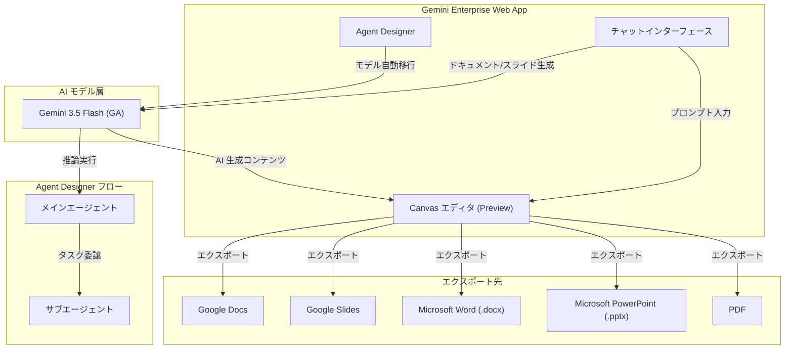

# Gemini Enterprise: Canvas によるドキュメント・スライド作成機能と Agent Designer の Gemini 3.5 Flash 移行

**リリース日**: 2026-06-01

**サービス**: Gemini Enterprise

**機能**: Canvas (Preview) によるドキュメント・スライド作成 / Agent Designer の Gemini 3.5 Flash 自動移行

**ステータス**: Canvas: Public Preview / Agent Designer 移行: GA (自動適用済み)

[このアップデートのインフォグラフィックを見る](https://takech9203.github.io/google-cloud-news-summary/infographic/20260601-gemini-enterprise-canvas-agent-designer.html)

## 概要

Gemini Enterprise に 2 つの重要なアップデートが同時にリリースされました。1 つ目は、Agent Designer で作成されたエージェントの基盤モデルが Gemini 3.1 Pro から Gemini 3.5 Flash に自動移行されたことです。US リージョンおよび Global リージョンのエージェントが対象であり、ユーザー側でのアクションは不要です。2 つ目は、Canvas と呼ばれるインタラクティブなドキュメント・スライド作成ツールが Public Preview として利用可能になったことです。

Canvas は Gemini Enterprise ウェブアプリ内の専用ツールであり、チャットとサイドバイサイドで AI 生成ドキュメントやプレゼンテーションを作成・編集できます。作成したコンテンツは Google Workspace (Google Docs、Google Slides)、Microsoft Office 形式 (DOCX、PowerPoint)、PDF にエクスポートできるため、既存のワークフローとシームレスに統合できます。

Agent Designer の Gemini 3.5 Flash 移行により、エージェントはより高度な推論能力、エージェンティックな実行能力、コーディング能力を活用できるようになります。Gemini 3.5 Flash は GA モデルとして安定性が保証されており、1M トークンのコンテキストウィンドウ、65K トークンの最大出力、思考保持機能を備えています。

**アップデート前の課題**

- Agent Designer のエージェントは Gemini 3.1 Pro で動作しており、最新の推論・エージェンティック能力を活用できなかった
- Gemini Enterprise 内でドキュメントやスライドを作成するには、外部アプリケーション (Google Docs、Google Slides 等) に切り替える必要があった
- チャットで得た AI の回答やインサイトを構造化されたドキュメントに変換するプロセスが手動で煩雑だった

**アップデート後の改善**

- Agent Designer エージェントが Gemini 3.5 Flash の高度な推論・エージェンティック実行能力を自動的に利用可能になった
- Canvas を通じて、チャット画面から離れることなく AI 生成ドキュメントやスライドを作成・編集できるようになった
- 作成したコンテンツを Google Workspace、Microsoft Office、PDF など複数のフォーマットにワンクリックでエクスポートできるようになった
- AI によるトーン調整、長さ変更、ハイライト選択による部分的なリライトなど、インタラクティブな編集機能が利用可能になった

## アーキテクチャ図



Gemini Enterprise 内での Canvas と Agent Designer のアーキテクチャを示しています。両機能とも Gemini 3.5 Flash モデルを基盤として利用し、Canvas はドキュメント生成とエクスポート、Agent Designer はエージェンティックなタスク実行を担います。

## サービスアップデートの詳細

### 主要機能

1. **Agent Designer の Gemini 3.5 Flash 自動移行**
   - US リージョンおよび Global リージョンの Agent Designer エージェントが対象
   - Gemini 2.5 Flash / Gemini 2.5 Pro から Gemini 3.1 Pro に移行済みのエージェントが、さらに Gemini 3.5 Flash に自動移行
   - ユーザー側でのアクションは不要 (自動適用)
   - 別のモデルを使用したい場合は、会話型チャットまたはフロービルダーでエージェント設定を編集可能

2. **Canvas によるドキュメント作成 (Preview)**
   - チャットからドキュメントを AI 生成し、サイドバイサイドで表示・編集
   - 直接編集 (テキスト追加、書式変更、リスト作成)
   - AI パワード編集 (トーン・長さ調整スライダー、チャットによる詳細フィードバック)
   - ハイライト選択による部分的リライト
   - Undo/Redo によるバージョンナビゲーション

3. **Canvas によるスライド作成 (Preview)**
   - チャットプロンプトからスライドプレゼンテーションを AI 生成
   - チャットでの修正指示による更新 (各更新で新しいアーティファクトが生成)
   - 画像ソースの自動引用 (最終スライドに Image Sources スライドが追加)

4. **Canvas エクスポート機能**
   - ドキュメント: Google Docs、DOCX、PDF にエクスポート可能
   - スライド: Google Slides、Microsoft PowerPoint、PDF にエクスポート可能
   - テキストのクリップボードコピーにも対応

## 技術仕様

### Gemini 3.5 Flash モデル仕様

| 項目 | 詳細 |
|------|------|
| モデル ID | gemini-3.5-flash |
| コンテキストウィンドウ | 1M トークン |
| 最大出力トークン | 65K トークン |
| 思考保持 (Thought Preservation) | デフォルトで有効 |
| デフォルト思考レベル | medium (以前の high から変更) |
| ステータス | GA (一般提供) |
| Computer Use | 非対応 |

### Canvas 機能仕様

| 項目 | 詳細 |
|------|------|
| ステータス | Public Preview |
| 対応リージョン | Global、US、EU |
| 対応エディション | Business、Standard、Plus |
| モバイル対応 | 非対応 (ウェブアプリのみ) |
| クォータ | 通常のチャットクエリと同一カウント |
| デフォルト状態 | 管理者が有効化する必要あり |

### 管理者による Canvas 有効化設定

Canvas を利用するには、Gemini Enterprise 管理者がウェブアプリの機能管理設定で「Enable Canvas」トグルをオンにする必要があります。

```
管理コンソール > Gemini Enterprise > Apps > Web app feature management
  > "Enable Canvas" トグルを ON に設定
```

## 設定方法

### 前提条件

1. Gemini Enterprise (Business、Standard、または Plus エディション) のライセンスを保有していること
2. 管理者が Canvas 機能を有効化していること (Canvas 利用の場合)
3. Google Drive データストアが接続されていること (Google Docs/Slides へのエクスポートの場合)

### 手順

#### ステップ 1: Canvas の有効化 (管理者)

管理者は Google Cloud Console から Gemini Enterprise アプリのウェブアプリ機能管理設定にアクセスし、「Enable Canvas」トグルを有効にします。

```
1. Google Cloud Console > Gemini Enterprise > Apps に移動
2. 対象アプリを選択
3. Web app feature management を開く
4. "Enable Canvas" トグルを ON に変更
5. 保存
```

#### ステップ 2: Canvas でドキュメントを作成 (ユーザー)

```
1. Gemini Enterprise ウェブアプリにサインイン
2. 新しいチャットを開始
3. "Tools" をクリック、または "/" を入力してショートカットリストを表示
4. "Canvas (Preview)" を選択
5. ドキュメント作成のプロンプトを入力して送信
6. 右側の Canvas エディタでドキュメントが表示される
```

#### ステップ 3: Agent Designer でモデルを変更する場合 (オプション)

Gemini 3.5 Flash 以外のモデルを使用したい場合は、以下のいずれかの方法でエージェント設定を変更できます。

**会話型チャットでの変更:**
```
1. Agent Designer キャンバスを開く
2. 左側のチャットペインで変更プロンプトを入力
   例: "Change the main agent's model to [モデル名]"
3. Preview タブで動作確認
4. "Update" をクリックして保存
```

**フロービルダーでの変更:**
```
1. Agent Designer キャンバスの "Flow" タブをクリック
2. メインエージェントノードをクリック
3. "Gemini model" フィールドを変更
4. "Update" をクリックして保存
```

## メリット

### ビジネス面

- **生産性向上**: チャットとドキュメント作成が一体化し、アプリケーション間の切り替えが不要になることで、コンテンツ作成ワークフローが大幅に効率化される
- **フォーマット互換性**: Google Workspace と Microsoft Office の両方にエクスポートできるため、組織内外の多様なツール環境に対応可能
- **エージェント品質向上**: Gemini 3.5 Flash への自動移行により、Agent Designer で構築したエージェントの推論能力とタスク遂行能力が向上し、ビジネスプロセスの自動化品質が改善される

### 技術面

- **最新モデルの自動適用**: Agent Designer ユーザーはコード変更やデプロイ作業なしに最新モデルの恩恵を受けられる
- **思考保持機能**: Gemini 3.5 Flash のデフォルト有効な思考保持により、マルチターン会話でのエージェントの一貫性が向上
- **インタラクティブ編集**: Canvas の AI パワード編集機能 (トーン・長さ調整、ハイライト編集) により、精密なドキュメント調整が可能

## デメリット・制約事項

### 制限事項

- Canvas は Public Preview であり、Pre-GA の提供条件が適用される (サポートが限定的な場合がある)
- Canvas はウェブアプリのみ対応で、モバイルアプリでは利用不可
- Canvas 対応リージョンは Global、US、EU のみ (他のリージョンでは利用不可)
- スライドの更新は毎回新しいアーティファクトとして生成され、既存のアーティファクトはバージョニングされない
- Canvas はアクティブセッション中に生成されたコンテンツの編集のみサポート (さらなる編集にはエクスポートが必要)

### 考慮すべき点

- Agent Designer のモデル移行は自動のため、既存エージェントの動作が変わる可能性がある (品質向上が期待されるが、テスト推奨)
- Gemini 3.5 Flash のデフォルト思考レベルが medium に変更されているため、以前の high 設定に依存していたエージェントは出力品質を確認すべき
- Canvas のクォータは通常チャットと共有されるため、Canvas の頻繁な利用はチャットの利用可能量に影響する
- Google Docs/Slides へのエクスポートには Google Drive データストアの接続と Google Workspace ライセンスが必要

## ユースケース

### ユースケース 1: 営業提案書の自動作成

**シナリオ**: 営業チームが顧客との商談後に、チャットでの情報整理を基に提案書を作成する。

**実装例**:
```
1. Gemini Enterprise チャットで顧客要件や商談内容をまとめる
2. "Canvas" ツールを選択
3. プロンプト: "先ほどの商談内容を基に、3ページの提案書を作成してください。
   製品概要、導入メリット、料金プランのセクションを含めてください"
4. Canvas 内で AI 生成された提案書を確認・編集
5. トーンを「フォーマル」に調整
6. Google Slides にエクスポートして顧客に送付
```

**効果**: 提案書作成時間を大幅に短縮し、チャットで整理した情報を直接ドキュメント化できる

### ユースケース 2: Agent Designer エージェントによる定型レポートの自動生成

**シナリオ**: 週次の売上レポートを自動生成するエージェントが、Gemini 3.5 Flash 移行により精度向上

**効果**: Gemini 3.5 Flash の改善された推論能力により、複雑なデータソースからのインサイト抽出精度が向上し、レポートの質が改善される。スケジュール実行と組み合わせることで完全自動化が可能

### ユースケース 3: 社内ナレッジの構造化

**シナリオ**: 社内データストア (Google Drive、SharePoint 等) に接続された Gemini Enterprise で、散在するナレッジを Canvas で体系的なドキュメントに整理する

**効果**: 複数のデータソースから情報を統合し、チャットでの Q&A を経て Canvas で構造化されたドキュメントを作成。エクスポートにより社内 Wiki やポータルに即座に反映可能

## 料金

Gemini Enterprise の料金体系に基づきます。Canvas や Agent Designer の追加料金はなく、既存のサブスクリプション内で利用可能です。

### エディション別料金

| エディション | 月額料金 (1 シート) | Canvas 対応 | Agent Designer 対応 |
|-------------|-------------------|------------|-------------------|
| Business | $21 USD から | 対応 | 対応 |
| Standard | $30 USD から | 対応 | 対応 |
| Plus | $30 USD から (上位プラン) | 対応 | 対応 |
| Frontline | Standard/Plus に追加 | 対応 (利用のみ) | 利用のみ |

Canvas クエリと通常のチャットクエリは同一のクォータで計算されるため、追加のクォータ購入は不要ですが、利用量が増えるとクォータ消費が早まる点に注意が必要です。

## 利用可能リージョン

| 機能 | 対応リージョン |
|------|---------------|
| Canvas (Preview) | Global、US、EU |
| Agent Designer (Gemini 3.5 Flash 移行) | US、Global |

EU リージョンについては、Agent Designer の移行が今後適用される可能性がありますが、今回のアナウンスでは US と Global のみが明示されています。

## 関連サービス・機能

- **Google Workspace**: Canvas からのエクスポート先として Google Docs、Google Slides と統合
- **Agent Designer**: Gemini Enterprise 内のノーコード・ローコードエージェント構築プラットフォーム
- **Gemini 3.5 Flash**: Agent Designer の基盤モデルとして利用される最新の Flash モデル (GA)
- **NotebookLM Enterprise**: Gemini Enterprise 内の別の AI ドキュメントツール。Canvas とは用途が異なり、ソース資料の分析・要約に特化
- **Core Assistant**: Gemini Enterprise のルートエージェント。Canvas や Agent Designer エージェントと連携してユーザーリクエストを処理

## 参考リンク

- [インフォグラフィック](https://takech9203.github.io/google-cloud-news-summary/infographic/20260601-gemini-enterprise-canvas-agent-designer.html)
- [公式リリースノート](https://docs.cloud.google.com/release-notes#June_01_2026)
- [Canvas ドキュメント](https://docs.cloud.google.com/gemini/enterprise/docs/assistant-canvas)
- [Agent Designer 概要](https://docs.cloud.google.com/gemini/enterprise/docs/agent-designer)
- [Agent Designer エージェントの編集](https://docs.cloud.google.com/gemini/enterprise/docs/agent-designer/edit-agent)
- [ウェブアプリ機能管理](https://docs.cloud.google.com/gemini/enterprise/docs/manage-web-app-features)
- [Gemini Enterprise エディション](https://docs.cloud.google.com/gemini/enterprise/docs/editions)
- [Gemini 3.5 Flash リリースノート](https://ai.google.dev/gemini-api/docs/interactions/whats-new-gemini-3.5)

## まとめ

今回のアップデートにより、Gemini Enterprise は AI によるコンテンツ作成とエージェント実行の両面で大幅に強化されました。Canvas (Preview) の導入はチャットベースの AI アシスタントからドキュメント作成プラットフォームへの進化を示しており、Agent Designer の Gemini 3.5 Flash 自動移行はノーコードエージェントの品質を自動的に向上させます。管理者は Canvas の有効化を検討し、Agent Designer ユーザーはモデル移行後のエージェント動作を確認することを推奨します。

---

**タグ**: #GeminiEnterprise #Canvas #AgentDesigner #Gemini3.5Flash #ドキュメント生成 #ノーコード #Preview #GA
