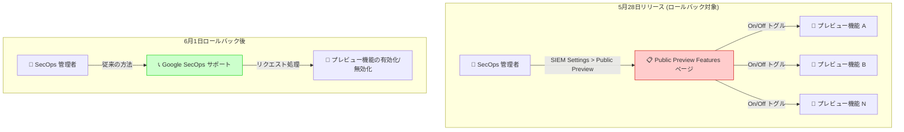

# Google SecOps: プレビュー機能管理のロールバック

**リリース日**: 2026-06-01

**サービス**: Google SecOps (Google Security Operations)

**機能**: Manage access to preview features (プレビュー機能へのアクセス管理)

**ステータス**: ロールバック (Rolled back)

📊 [このアップデートのインフォグラフィックを見る](https://takech9203.github.io/google-cloud-news-summary/20260601-google-secops-preview-feature-rollback.html)

## 概要

2026 年 6 月 1 日、Google は Google SecOps (Google Security Operations) の「Manage access to preview features (プレビュー機能へのアクセス管理)」機能をロールバックしたことを発表した。この機能は 2026 年 5 月 28 日にリリースされたが、わずか 4 日後にロールバックが実施された。

この機能は、SOC マネージャーやセキュリティエンジニアがパブリックプレビュー機能の有効化・無効化を管理者が自律的にコントロールできるようにするもので、サポートチャネルを経由せずにプレビュー機能のオン・オフを切り替えられることが主要な価値提案だった。ロールバックの具体的な理由は公式には明示されていないが、リリース後に発見された問題に対処するための措置と考えられる。

**アップデート前の状態 (5 月 28 日リリース時)**

- 管理者が SIEM Settings > Public Preview ページからプレビュー機能を個別にオン・オフできる機能がリリースされた
- プレビュー機能の一覧、ステータス (On/Off)、予想 GA 日、ドキュメントリンクが表示可能だった
- サポートチャネルを経由せずに管理者がセルフサービスでプレビュー機能を制御できた

**ロールバック後の状態 (6 月 1 日以降)**

- 5 月 28 日にリリースされた「Manage access to preview features」機能が巻き戻された
- ロールバック期間中、プレビュー機能の管理方法が以前の状態に戻る可能性がある
- 今後、問題が修正された上で再リリースされることが期待される

## アーキテクチャ図

5 月 28 日にリリースされたセルフサービス管理機能がロールバックされ、プレビュー機能の管理が従来のサポート経由に戻った状態を示す。

## サービスアップデートの詳細

### ロールバック対象機能の概要

1. **Public Preview Features ページ**
   - Settings > SIEM Settings > Public Preview からアクセス
   - テナント内で利用可能な全パブリックプレビュー機能の一覧を表示
   - 有効化済み機能数 / 全体数 (例: "Features enabled for public preview (27 of 35)") を表示

2. **管理者によるセルフサービス制御**
   - Administrator ロールを持つユーザーがトグルで機能のオン・オフを即座に切り替え可能
   - 依存関係のある機能については、両方を有効化するよう通知される仕組み
   - 無効化時には理由の入力を求めるダイアログが表示

3. **閲覧権限**
   - すべての Google SecOps ユーザーがプレビュー機能一覧を閲覧可能
   - 各機能の Feature Name、Preview Status、Expected GA Date、Documentation リンクを確認可能

### ロールバックの影響

1. **コンプライアンス制御テナントへの影響**
   - FedRAMP や HIPAA などの特別なコンプライアンス制御があるテナントでは、元々この機能は利用不可だった
   - これらのテナントは引き続きサポート経由でプレビュー機能を有効化する必要がある

2. **一般テナントへの影響**
   - 5 月 28 日以降にセルフサービスで有効化したプレビュー機能の状態がどうなるかは公式発表で明確にされていない
   - 管理者は、有効化済みのプレビュー機能が期待通り動作しているか確認することを推奨

## 技術仕様

### 関連する権限とロール

| 項目 | 詳細 |
|------|------|
| 必要なロール | Administrator ロール (Google SecOps 内) |
| 閲覧権限 | すべての Google SecOps ユーザー |
| アクセスパス | Settings > SIEM Settings > Public Preview |
| 対象 | パブリックプレビュー機能のみ (プライベートプレビューは対象外) |

### タイムライン

| 日付 | イベント |
|------|---------|
| 2026-05-28 | 「Manage access to preview features」機能リリース |
| 2026-06-01 | 同機能のロールバック発表 |
| 未定 | 修正後の再リリース (予想) |

## デメリット・制約事項

### ロールバックによる影響

- セルフサービスでプレビュー機能を制御する手段が一時的に利用不可
- 5 月 28 日〜6 月 1 日の間に変更したプレビュー機能設定の状態確認が必要
- 機能の再リリース時期が未定

### 推奨アクション

- 現在有効化しているプレビュー機能の動作を確認する
- プレビュー機能の有効化・無効化が必要な場合は Google SecOps サポートに問い合わせる
- 公式リリースノートで再リリースのアナウンスを監視する

## ユースケース

### ユースケース 1: プレビュー機能を有効化済みの環境

**シナリオ**: 5 月 28 日のリリース後にセルフサービスでプレビュー機能を有効化した SOC チーム

**推奨対応**:
- 有効化したプレビュー機能が正常に動作しているか確認する
- 問題が発生している場合は Google SecOps サポートに連絡する
- ロールバックにより機能の状態が変更されていないか検証する

**効果**: 環境の安定性を確保し、ロールバックによる予期せぬ影響を最小化できる

### ユースケース 2: 今後プレビュー機能の利用を計画している環境

**シナリオ**: 新しいプレビュー機能のテストを予定していた管理者

**推奨対応**:
- 機能の再リリースを待つか、サポートチャネルを通じて有効化をリクエストする
- コンプライアンス制御テナントの場合は従来通りサポート経由で対応

**効果**: 不安定な機能を利用するリスクを回避しつつ、必要な機能へのアクセスを確保

## 料金

Google SecOps のプレビュー機能管理自体に追加料金は発生しない。プレビュー機能の利用は Pre-GA Offerings Terms に基づく。

## 関連サービス・機能

- **Google SecOps IAM 統合**: プレビュー機能の管理権限は IAM のロールベースアクセス制御と連携
- **Google SecOps SOAR**: SOAR 側のプレビュー機能は別のリリースサイクルで管理される
- **Assured Workloads**: コンプライアンス制御テナントではプレビュー機能管理に制限あり
- **Cloud Audit Logs**: Feature RBAC への移行後、プレビュー機能の変更操作は監査ログに記録される

## 参考リンク

- 📊 [インフォグラフィック](https://takech9203.github.io/google-cloud-news-summary/20260601-google-secops-preview-feature-rollback.html)
- [公式リリースノート (6 月 1 日)](https://docs.cloud.google.com/release-notes#June_01_2026)
- [関連リリースノート (5 月 28 日)](https://docs.cloud.google.com/chronicle/docs/secops/release-notes#May_28_2026)
- [プレビュー機能管理ドキュメント](https://docs.cloud.google.com/chronicle/docs/secops/preview-features-manage)
- [Google SecOps 概要](https://docs.cloud.google.com/chronicle/docs/secops/secops-overview)
- [Feature RBAC の設定 (IAM)](https://docs.cloud.google.com/chronicle/docs/onboard/configure-feature-access)

## まとめ

Google SecOps の「Manage access to preview features」機能が 5 月 28 日のリリースからわずか 4 日でロールバックされた。管理者がセルフサービスでプレビュー機能を制御できる有用な機能であるだけに、早期の修正と再リリースが期待される。影響を受けるユーザーは、有効化済みのプレビュー機能の動作確認を行い、必要に応じてサポートに問い合わせることを推奨する。

---

**タグ**: #GoogleSecOps #Chronicle #SIEM #PreviewFeatures #Rollback #SecurityOperations
