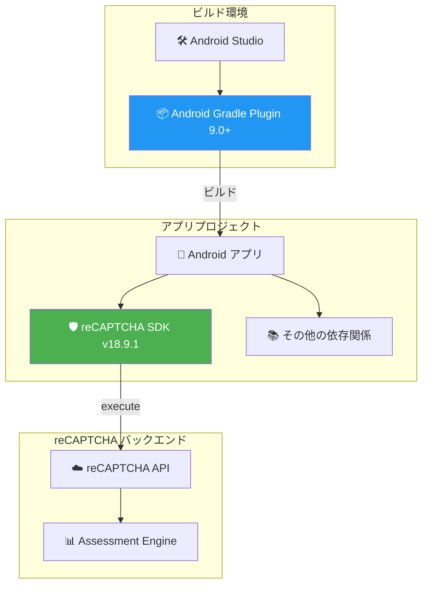

# reCAPTCHA: Mobile SDK v18.9.1 for Android - パッケージ名衝突の修正

**リリース日**: 2026-06-01

**サービス**: reCAPTCHA (Google Cloud Fraud Defense)

**機能**: Mobile SDK v18.9.1 for Android

**ステータス**: 変更 (バグ修正リリース)

📊 [このアップデートのインフォグラフィックを見る](https://takech9203.github.io/google-cloud-news-summary/20260601-recaptcha-mobile-sdk-v18-9-1.html)

## 概要

reCAPTCHA Mobile SDK v18.9.1 が Android 向けにリリースされた。本バージョンは、Android Gradle Plugin (AGP) バージョン 9.0 以上を使用してプロジェクトをビルドする際に発生していたパッケージ名の衝突問題を修正するバグフィックスリリースである。

このアップデートは、Android の最新ビルドツールチェーンへの対応を確実にするものであり、AGP 9.0 へのアップグレードを計画している、または既にアップグレード済みの Android 開発者にとって重要な修正となる。reCAPTCHA SDK を利用するアプリケーションで、AGP 9.0 以降でのビルドエラーが解消される。

先行バージョンの v18.9.0 (2026年5月13日リリース) では SDK レイテンシの改善、スコア分布のキャリブレーション改善、desugar の不要化、最低サポート Android API レベルの 24 (Android 7.0) への引き上げが含まれていた。v18.9.1 はその安定版リリースに対する修正パッチとなる。

**アップデート前の課題**

- reCAPTCHA Mobile SDK v18.9.0 を使用するプロジェクトで、Android Gradle Plugin 9.0 以上を使用するとパッケージ名の衝突が発生し、ビルドが失敗していた
- AGP 9.0 は Android Studio の最新版に同梱されるため、開発環境のアップデートに伴いビルドエラーに遭遇する開発者が増えていた
- ビルドエラーを回避するために AGP のダウングレードが必要となり、他の依存関係との互換性の問題が発生する可能性があった

**アップデート後の改善**

- Android Gradle Plugin 9.0 以上の環境でも reCAPTCHA SDK を含むプロジェクトが正常にビルドできるようになった
- 最新の Android ビルドツールチェーンとの完全な互換性が確保された
- AGP のバージョンに制約されることなく、reCAPTCHA の最新機能を利用可能になった

## アーキテクチャ図



Android Gradle Plugin 9.0 以上の環境において、reCAPTCHA SDK v18.9.1 がパッケージ名衝突なくビルドされ、reCAPTCHA バックエンドと正常に通信する構成を示す。

## サービスアップデートの詳細

### 主要機能

1. **パッケージ名衝突の修正**
   - Android Gradle Plugin 9.0 以上で発生していた名前空間の衝突問題を解消
   - AGP 9.0 で導入された新しいパッケージ名前空間の取り扱いルールへの対応
   - ビルド時の依存関係解決が正常に動作するよう修正

2. **v18.9.0 からの継続的な改善の維持**
   - SDK レイテンシと信頼性の改善 (v18.9.0 で導入)
   - スコア分布キャリブレーションの改善 (v18.9.0 で導入)
   - desugar 不要化と最低サポート API レベル 24 (v18.9.0 で導入)

3. **fetchClient API の継続サポート**
   - ネットワーク障害時の自動リトライ機能
   - バックグラウンドでの SDK 初期化
   - タイムアウト設定のカスタマイズ

## 技術仕様

### SDK バージョン情報

| 項目 | 詳細 |
|------|------|
| SDK バージョン | 18.9.1 |
| プラットフォーム | Android |
| 最低サポート API レベル | 24 (Android 7.0) |
| 修正対象 AGP バージョン | 9.0 以上 |
| 依存関係 | com.google.android.recaptcha:recaptcha:18.9.1 |
| 先行バージョン | v18.9.0 (2026-05-13) |

### SDK バージョン履歴 (最近)

| バージョン | リリース日 | 主な変更点 |
|-----------|-----------|-----------|
| v18.9.1 | 2026-06-01 | AGP 9.0+ パッケージ名衝突修正 |
| v18.9.0 | 2026-05-13 | レイテンシ改善、スコアキャリブレーション、API 24 最低要件 |
| v18.8.0 | 2025-09-17 | 信頼性改善とバグ修正 |
| v18.7.1 | 2025-05-12 | execute() メソッドの信頼性改善 |
| v18.7.0 | 2025-01-29 | play-services-recaptchabase 依存追加 |

## 設定方法

### 前提条件

1. Android Studio がインストール済み (最新版推奨)
2. 最低 Android SDK API レベル 24 (Android 7.0) 以上のプロジェクト
3. reCAPTCHA キー (KEY_ID) の作成済み

### 手順

#### ステップ 1: 依存関係の更新

アプリレベルの `build.gradle` ファイルで reCAPTCHA SDK のバージョンを更新する。

```groovy
dependencies {
    implementation 'com.google.android.recaptcha:recaptcha:18.9.1'
}
```

#### ステップ 2: プロジェクトの同期とビルド

```bash
# Gradle の同期
./gradlew --refresh-dependencies

# プロジェクトのビルド
./gradlew assembleDebug
```

AGP 9.0 以上を使用している環境で、以前発生していたパッケージ名衝突のビルドエラーが解消されていることを確認する。

#### ステップ 3: SDK の初期化 (既存コードの変更不要)

```kotlin
// fetchClient を使用した推奨の初期化方法 (変更不要)
class CustomApplication : Application() {
    private lateinit var recaptchaClient: RecaptchaClient

    override fun onCreate() {
        super.onCreate()
        CoroutineScope(Dispatchers.IO).launch {
            try {
                recaptchaClient = Recaptcha.fetchClient(
                    this@CustomApplication, "KEY_ID"
                )
            } catch (e: RecaptchaException) {
                // エラーハンドリング
            }
        }
    }
}
```

## メリット

### ビジネス面

- **開発スケジュールへの影響回避**: AGP アップグレードに伴うビルドエラーによる開発遅延を防止
- **最新ツールチェーンの即座の採用**: Android の最新開発環境をすぐに活用可能
- **セキュリティ対策の継続性**: ビルド問題によるセキュリティ SDK 更新の遅延を回避

### 技術面

- **ビルド互換性の確保**: AGP 9.0+ との完全な互換性
- **依存関係の競合解消**: パッケージ名前空間の衝突なくクリーンなビルドが可能
- **アップグレードパスの明確化**: v18.9.0 から v18.9.1 への単純なバージョンバンプで問題解決

## デメリット・制約事項

### 制限事項

- 本バージョンは Android 専用のリリースであり、iOS 版には影響しない
- 最低サポート API レベルは 24 (Android 7.0) のまま (v18.9.0 で引き上げ済み)
- AGP 9.0 未満の環境では本修正の恩恵はない (そもそも問題が発生しないため)

### 考慮すべき点

- v18.9.0 で導入されたスコア分布キャリブレーションの改善により、スコア閾値の見直しが引き続き推奨される
- 既に v18.9.0 で問題なくビルドできている環境 (AGP 8.x 以下) では、即座のアップデートは必須ではないが、将来の AGP アップグレードに備えて更新を推奨

## ユースケース

### ユースケース 1: AGP 9.0 へのアップグレードを計画中のプロジェクト

**シナリオ**: Android アプリ開発チームが Android Studio の最新版を導入し、AGP 9.0 を使用し始めたところ、reCAPTCHA SDK を含むプロジェクトでビルドエラーが発生した。

**実装例**:
```groovy
// build.gradle (project-level)
plugins {
    id 'com.android.application' version '9.0.0' apply false
}

// build.gradle (app-level)
dependencies {
    // v18.9.0 から v18.9.1 に更新するだけでビルドエラー解消
    implementation 'com.google.android.recaptcha:recaptcha:18.9.1'
}
```

**効果**: パッケージ名衝突なく正常にビルドが完了し、最新の AGP と reCAPTCHA SDK を併用可能になる。

### ユースケース 2: CI/CD パイプラインでのビルド失敗対応

**シナリオ**: CI/CD 環境で AGP を 9.0 にアップグレードした後、自動ビルドが失敗し始めた。reCAPTCHA SDK のパッケージ名衝突が原因と特定された。

**効果**: SDK バージョンを 18.9.1 に更新することで、CI/CD パイプラインが正常に動作を再開し、デプロイフローが復旧する。

## 料金

reCAPTCHA は 3 つのティアで提供されている。Mobile SDK はすべてのティアで利用可能である (Essentials ティアでは基本的なボット対策のみ)。

### 料金例

| ティア | 月額料金 | アセスメント数 |
|--------|---------|--------------|
| Essentials | 無料 | 10,000 回/月まで |
| Premium | 無料 ~ $8 + 従量課金 | 10,000 回まで無料、100,000 回まで $8、以降 $1/1,000 回 |
| Enterprise | $1/1,000 回 (ボリュームコミットメント) | 要相談 (12ヶ月最低契約) |

**注意**: Mobile SDK の利用自体に追加料金はないが、SDK から生成されるトークンのアセスメント (バックエンドでの評価) が課金対象となる。

## 関連サービス・機能

- **Google Cloud Fraud Defense**: reCAPTCHA は Google Cloud Fraud Defense スイートの一部として提供されている
- **Cloud Armor**: reCAPTCHA for WAF と Cloud Armor の統合により、モバイルアプリケーションからの WAF 保護が可能
- **Firebase**: RecaptchaInterop を通じた Firebase クライアントとの統合アーキテクチャ
- **Android Gradle Plugin**: AGP 9.0 以上で導入された新しいパッケージ名前空間ルールへの対応

## 参考リンク

- 📊 [インフォグラフィック](https://takech9203.github.io/google-cloud-news-summary/20260601-recaptcha-mobile-sdk-v18-9-1.html)
- [公式リリースノート](https://docs.cloud.google.com/release-notes#June_01_2026)
- [reCAPTCHA リリースノート一覧](https://docs.cloud.google.com/recaptcha/docs/release-notes)
- [Android アプリへの reCAPTCHA 統合ガイド](https://docs.cloud.google.com/recaptcha/docs/instrument-android-apps)
- [reCAPTCHA 料金ページ](https://cloud.google.com/security/products/recaptcha#pricing)
- [reCAPTCHA ティア比較](https://docs.cloud.google.com/recaptcha/docs/compare-tiers)
- [GitHub - reCAPTCHA Enterprise Mobile SDK](https://github.com/GoogleCloudPlatform/recaptcha-enterprise-mobile-sdk)

## まとめ

reCAPTCHA Mobile SDK v18.9.1 は、Android Gradle Plugin 9.0 以上でのパッケージ名衝突を修正する重要なバグフィックスリリースである。AGP 9.0 を使用中、またはアップグレードを計画している Android 開発者は、`build.gradle` の依存関係を `18.9.1` に更新することで問題を解消できる。特に CI/CD パイプラインで AGP 9.0 を使用している場合は、早期のアップデートを推奨する。

---

**タグ**: #reCAPTCHA #Android #MobileSDK #BugFix #AndroidGradlePlugin #FraudDefense #Security
