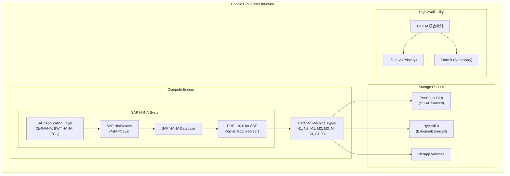

# SAP on Google Cloud: RHEL 10.0 for SAP の新規認定

**リリース日**: 2026-06-01
**サービス**: SAP on Google Cloud
**機能**: RHEL 10.0 for SAP オペレーティングシステム認定
**ステータス**: Announcement

📊 [このアップデートのインフォグラフィックを見る](https://takech9203.github.io/google-cloud-news-summary/20260601-sap-on-google-cloud-rhel-10-certification.html)

## 概要

SAP は、Google Cloud 上の SAP HANA および SAP NetWeaver で使用するオペレーティングシステムとして、Red Hat Enterprise Linux (RHEL) 10.0 for SAP を新たに認定しました。これは RHEL のメジャーバージョンアップとなる重要なマイルストーンであり、Google Cloud 上で SAP ワークロードを運用する企業に最新の Linux カーネル技術とセキュリティ機能を提供します。

RHEL 10.0 for SAP は、Linux カーネル 6.12 ベースで構築されており、最小カーネルバージョンは `6.12.0-55.73.1.el10_0.x86_64` となっています。これにより、X4、C3-metal、C4-metal を含むすべての SAP 認定 Compute Engine マシンタイプで利用可能です。Google Cloud は On demand、BYOS（Bring Your Own Subscription）、および GC-HA（高可用性統合機能）の各ライセンスモデルでイメージを提供しています。

この認定により、Google Cloud 上の SAP 環境では RHEL 7.x から RHEL 10.x までの幅広いバージョンが利用可能となり、企業の OS アップグレード戦略に柔軟性を提供します。

**アップデート前の課題**
- Google Cloud 上の SAP HANA/NetWeaver 環境では RHEL 9.x が最新の認定バージョンであった
- RHEL 10 の新機能（セキュリティ強化、パフォーマンス改善）を SAP 環境で利用できなかった
- メジャーバージョンの制約により、一部の最新ハードウェア機能への最適化が限定的だった

**アップデート後の改善**
- Linux カーネル 6.12 ベースによる最新のセキュリティおよびパフォーマンス機能の活用が可能に
- すべての SAP 認定マシンタイプ（X4、C3-metal、C4-metal 含む）での動作が認定済み
- On demand、BYOS、GC-HA の全ライセンスモデルで Google Cloud 提供イメージが利用可能
- 長期サポートが見込まれる最新メジャーバージョンへの移行パスの確立

## アーキテクチャ図



## サービスアップデートの詳細

### 主要機能

| 項目 | 詳細 |
|------|------|
| OS バージョン | RHEL 10.0 for SAP |
| Linux カーネル | 6.12.0-55.73.1.el10_0.x86_64 |
| SAP HANA 認定 | 全 SAP 認定マシンタイプ対応 |
| SAP NetWeaver 認定 | 全 SAP 認定マシンタイプ対応 |
| Google Cloud イメージ提供 | On demand / BYOS / GC-HA |

### 対応するワークロード

- **SAP HANA**: OLAP（分析処理）および OLTP（トランザクション処理）の両方
- **SAP NetWeaver**: ABAP および Java スタック
- **SAP S/4HANA**: 3-tier 構成
- **SAP BW/4HANA**: 3-tier 構成
- **SAP ECC / Business Suite**: 全構成

## 技術仕様

### 最小カーネルバージョン

- **全 SAP 認定マシンタイプ**: `6.12.0-55.73.1.el10_0.x86_64`

### 対応マシンタイプ

RHEL 10.0 for SAP は、以下のすべての SAP 認定 Compute Engine マシンタイプで使用可能です。

| マシンファミリー | 用途 |
|-----------------|------|
| N1 high-memory | SAP HANA (OLAP/OLTP) |
| N2 high-memory | SAP HANA (OLAP/OLTP) |
| M1 memory-optimized | 大規模 SAP HANA |
| M2 memory-optimized | 超大規模 SAP HANA |
| M3 memory-optimized | 超大規模 SAP HANA |
| M4 memory-optimized | 超大規模 SAP HANA |
| C3 compute-optimized | SAP HANA / NetWeaver |
| C4 compute-optimized | SAP HANA / NetWeaver |
| X4 memory-optimized | 超大規模 SAP HANA |

### ライセンスモデル

| モデル | 説明 |
|--------|------|
| On demand | Google Cloud から直接ライセンスを含むイメージを利用（従量課金） |
| BYOS | Red Hat Cloud Access プログラムにより既存サブスクリプションを適用 |
| GC-HA | 高可用性統合機能を含むイメージ |

## 設定方法

### Terraform を使用したデプロイ例

RHEL 10.0 for SAP イメージを使用して SAP HANA をデプロイする場合、Terraform 設定で以下のパラメータを指定します。

```hcl
linux_image         = "rhel-10-0-sap-ha"
linux_image_project = "rhel-sap-cloud"
```

### Deployment Manager を使用する場合

```yaml
linuxImage: family/rhel-10-0-sap-ha
linuxImageProject: rhel-sap-cloud
```

## メリット

### ビジネス面

- **長期サポート**: RHEL 10 はメジャーリリースとして Red Hat から長期サポートが提供される見込み
- **コンプライアンス対応**: 最新のセキュリティ標準に対応した OS 基盤
- **投資保護**: 最新プラットフォームへの移行により、将来の SAP アップデートとの互換性を確保
- **柔軟なライセンス**: On demand と BYOS の選択により、コスト最適化が可能

### 技術面

- **最新カーネル**: Linux 6.12 カーネルによるパフォーマンスおよびセキュリティの向上
- **全マシンタイプ対応**: X4、C3-metal、C4-metal を含むすべての認定マシンタイプで動作
- **高可用性**: GC-HA 統合機能によるクラスタ構成のサポート
- **Google Cloud 最適化イメージ**: Compute Engine 向けに最適化された公式イメージの提供

## デメリット・制約事項

- RHEL 9.x で必要だった追加パッケージ（chkconfig、compat-openssl11）と同様の前提条件が存在する可能性がある（Google Cloud 提供イメージ使用時は自動インストール済み）
- 既存の RHEL 8.x / 9.x 環境からの移行にはメジャーバージョンアップグレードの計画が必要
- SAP アプリケーションごとの互換性確認が個別に必要（SAP Note 2235581 参照）
- BYOS の場合、Red Hat サブスクリプションの RHEL 10 対応状況の確認が必要

## ユースケース

### 新規 SAP HANA 環境の構築

Google Cloud 上に新規で SAP HANA 環境を構築する場合、RHEL 10.0 for SAP は最新かつ長期サポートが期待できるベースラインとして最適です。

### SAP S/4HANA マイグレーション

オンプレミスから Google Cloud への SAP S/4HANA マイグレーションにおいて、最新 OS を選択することで移行後の OS アップグレード作業を最小化できます。

### 高可用性クラスタ構成

GC-HA 対応イメージの提供により、マルチゾーン高可用性構成の SAP HANA システムを RHEL 10.0 上で構築可能です。

### 大規模メモリ集約型ワークロード

X4 や M4 などの大規模メモリ最適化マシンタイプとの組み合わせにより、最新カーネルのメモリ管理改善を活用した大規模 SAP HANA インスタンスの運用が可能です。

## 料金

RHEL 10.0 for SAP の利用に関する料金は、以下の 2 つの要素で構成されます。

- **インフラストラクチャコスト**: Compute Engine VM の利用料金（マシンタイプに依存）
- **ライセンスコスト**: On demand の場合は vCPU 数に基づくスケーラブル料金。BYOS の場合は Red Hat に直接支払い

詳細な料金は [Compute Engine の VM インスタンス料金](https://cloud.google.com/compute/vm-instance-pricing) および [プレミアムイメージ料金](https://docs.cloud.google.com/compute/all-pricing#premiumimages) を参照してください。

## 関連サービス・機能

- **Google Cloud's Agent for SAP**: SAP 環境のモニタリングと管理を支援するエージェント（最新バージョン 3.9）
- **Compute Engine**: SAP ワークロード向けの認定仮想マシンインスタンス
- **Cloud Storage**: SAP HANA バックアップの保存先
- **Filestore / NetApp Volumes**: SAP HANA スケールアウト構成の共有ファイルシステム
- **Persistent Disk / Hyperdisk**: SAP HANA のデータおよびログボリューム

## 参考リンク

- 📊 [インフォグラフィック](https://takech9203.github.io/google-cloud-news-summary/20260601-sap-on-google-cloud-rhel-10-certification.html)
- [公式リリースノート](https://docs.cloud.google.com/release-notes#June_01_2026)
- [SAP HANA 認定オペレーティングシステム](https://docs.cloud.google.com/sap/docs/sap-hana-os-support#quick_reference_table)
- [SAP NetWeaver 認定オペレーティングシステム](https://docs.cloud.google.com/sap/docs/netweaver-os-support#quick_reference_table)
- [SAP HANA 認定構成](https://docs.cloud.google.com/sap/docs/certifications-sap-hana)
- [SAP アプリケーション認定](https://docs.cloud.google.com/sap/docs/certifications-sap-apps)
- [SAP Note 2235581 - SAP HANA: Supported Operating Systems](https://me.sap.com/notes/2235581)

## まとめ

RHEL 10.0 for SAP の Google Cloud 上での認定は、SAP ワークロードを運用する企業にとって重要なアップデートです。Linux カーネル 6.12 をベースとした最新のメジャーリリースにより、セキュリティ、パフォーマンス、ハードウェアサポートの各面で改善が提供されます。すべての SAP 認定 Compute Engine マシンタイプで利用可能であり、On demand、BYOS、GC-HA の全ライセンスモデルで Google Cloud 公式イメージが提供されるため、既存環境のアップグレードや新規構築の両方において柔軟な選択肢となります。

---

**タグ**: #SAP #GoogleCloud #RHEL10 #SAPonGoogleCloud #SAPHANA #SAPNetWeaver #RedHat #OperatingSystem #Certification #ComputeEngine #HighAvailability
