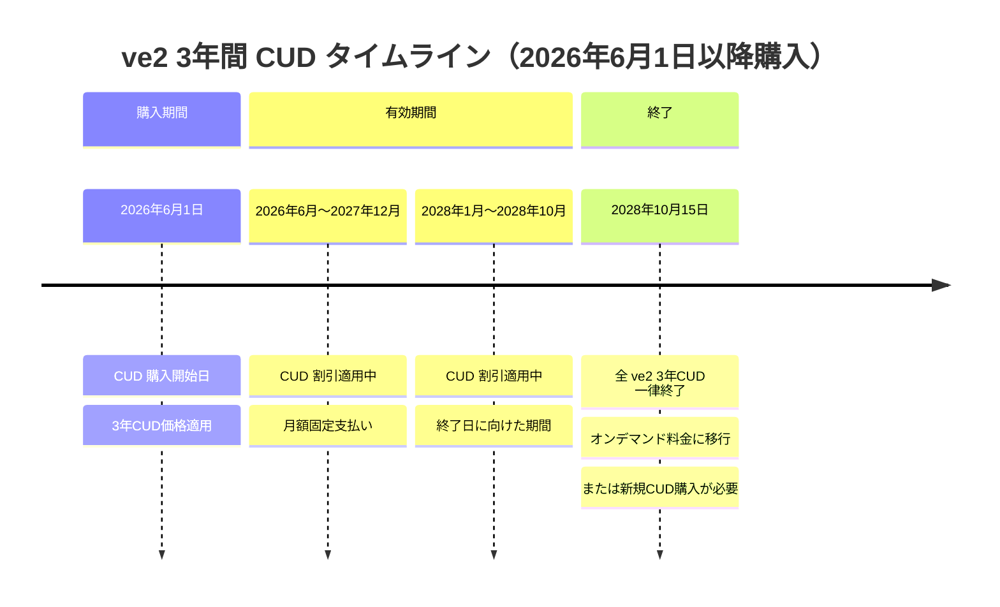

# Google Cloud VMware Engine: ve2 ノード 3年間 CUD の早期終了日設定

**リリース日**: 2026-06-01

**サービス**: Google Cloud VMware Engine

**機能**: ve2 Committed Use Discount (CUD) 3年契約の終了日変更

**ステータス**: Announcement

📊 [このアップデートのインフォグラフィックを見る](https://takech9203.github.io/google-cloud-news-summary/infographic/20260601-vmware-engine-ve2-cud-termination.html)

## 概要

Google Cloud は、2026年5月31日以降に購入されるすべての Google Cloud VMware Engine ve2 ノード向け 3年間（36ヶ月）Committed Use Discount（CUD）について、実際の契約期間に関わらず 2028年10月15日に一律終了する旨を発表しました。

この変更は、VMware Engine の ve2 ノードタイプに関するCUD購入条件に重大な影響を与えます。通常、3年間CUDは購入日から36ヶ月間有効ですが、今回の変更により、2026年6月1日以降に購入した場合、実際の利用期間は最大約28ヶ月（2026年6月〜2028年10月）に短縮されます。ただし、3年間CUD価格（より高い割引率）が適用される点が重要です。

この発表は、Broadcom による VMware 買収後のライセンス体系変更や、Google Cloud VMware Engine のサービスロードマップの一環と考えられます。ve1 ノードの End-of-Life マイグレーション計画（2026年5月15日発表）や、ve1 CUD の販売終了（2026年5月20日発表）と合わせて、VMware Engine 全体のポートフォリオ再編が進行中です。

**アップデート前の課題**

以前の CUD 購入モデルでは以下の状況でした：

- 3年間 CUD を購入すると、購入日から正確に36ヶ月間の契約が成立していた
- 契約期間が明確に定義されており、予算計画が立てやすかった
- CUD のキャンセルは不可能だが、契約期間は保証されていた

**アップデート後の改善**

今回のアップデートにより以下の変更が適用されます：

- 3年間 CUD 価格（高い割引率）が短縮された実質期間にも適用されるため、単位時間あたりのコスト削減効果が高まる
- 2028年10月15日までの明確な終了日が設定されたことで、将来のプラットフォーム移行やアップグレード計画が立てやすくなる
- 長期コミットメントのリスクが実質的に軽減される（最大約28ヶ月の拘束で3年CUD価格を享受）

## アーキテクチャ図



この図は、2026年6月1日以降に購入される ve2 3年間 CUD の有効期間を示しています。通常36ヶ月であるべき期間が、2028年10月15日の一律終了日により短縮されることを視覚化しています。

## サービスアップデートの詳細

### 主要機能

1. **3年間 CUD の終了日固定**
   - 2026年5月31日以降に購入されるすべての ve2 3年間 CUD が対象
   - 購入日に関わらず、2028年10月15日に一律終了
   - 実質的な契約期間は購入時期により16〜28ヶ月程度に短縮

2. **3年CUD価格の維持**
   - 実際の契約期間が短縮されても、3年間 CUD 価格（割引率）がそのまま適用
   - 1年間 CUD よりも有利な価格で利用可能
   - 月額または前払いの支払い方法は従来通り

3. **既存CUDへの影響なし**
   - 2026年5月31日以前に購入済みの CUD は影響を受けない
   - 既存の 3年間 CUD は元の契約通り36ヶ月間有効
   - 既存の 1年間 CUD も変更なし

## 技術仕様

### ve2 ノードタイプの概要

| ノードタイプ | vCPU/ノード | メモリ/ノード (GiB) | ストレージ/ノード (TB) |
|------|------|------|------|
| ve2-mega-128 | 128 | 2048 | 51.2 |
| ve2-large-128 | 128 | 2048 | 38.4 |
| ve2-standard-128 | 128 | 2048 | 25.5 |
| ve2-small-128 | 128 | 2048 | 12.8 |
| ve2-standard-so (Storage Only) | - | - | 25.5 |

### CUD 契約タイプ

| 項目 | 詳細 |
|------|------|
| 対象ノードファミリー | ve2 全タイプ |
| 影響を受ける CUD 期間 | 3年（36ヶ月）のみ |
| 適用開始日 | 2026年6月1日以降の購入分 |
| 一律終了日 | 2028年10月15日 |
| 適用価格 | 3年間 CUD 価格（変更なし） |
| CUD モデル | Portable License commitment（現在唯一の新規購入可能モデル） |
| キャンセル | 不可（従来通り） |

### CUD 確認方法

```bash
# Cloud Shell から現在のプロジェクトに関連する全 CUD を確認
curl -H "Authorization: Bearer $(gcloud auth print-access-token)" \
  -H "Content-Type: application/json" \
  https://enterprisepurchasing.googleapis.com/v1alpha/projects/$GOOGLE_CLOUD_PROJECT/locations/global/gcveCuds
```

## 設定方法

### 前提条件

1. Google Cloud VMware Engine が有効化されたプロジェクト
2. CUD 購入に必要な IAM 権限（Billing Account Administrator または同等）
3. Portable VMware Cloud Foundations ライセンス

### 手順

#### ステップ 1: 現在の CUD 状況を確認

```bash
# Google Cloud Console で確認
# Navigation Menu > VMware Engine > Committed use discounts
```

既存の CUD の期間と終了日を確認し、新規購入の必要性を評価します。

#### ステップ 2: コスト試算の実施

```bash
# 3年CUD価格が適用される実質期間を計算
# 例: 2026年7月1日に購入した場合
# 実質期間: 2026年7月1日 〜 2028年10月15日 = 約27.5ヶ月
# 適用価格: 3年CUD価格（通常のオンデマンド比で大幅割引）
```

購入タイミングに応じた実質的な割引効果を事前に計算してください。

#### ステップ 3: CUD の購入（必要な場合）

```bash
# Google Cloud Console から購入
# 1. Navigation Menu > VMware Engine > Committed use discounts
# 2. [Purchase] をクリック
# 3. 名前、リージョン、サブスクリプションタイプを選択
# 4. Agreement Type: Portable License commitment を選択
# 5. Duration: 3 years を選択
# 6. ノードタイプとノード数を指定
# 7. 内容を確認して [Purchase] をクリック
```

注意: 購入後のキャンセルは不可能です。必ず事前にコスト分析を実施してください。

## メリット

### ビジネス面

- **短縮された拘束期間での高割引**: 実質16〜28ヶ月の拘束で3年CUD価格（最も高い割引率）を享受できるため、単位期間あたりのコストパフォーマンスが向上する可能性がある
- **明確なプラットフォーム移行計画**: 2028年10月15日という明確な日付が設定されたことで、次世代ノード（ve3等）への移行計画や代替ソリューションの評価に時間的な指標を得られる
- **リスクの限定**: 長期コミットメントの不確実性が低減され、短期間での投資回収が求められるプロジェクトにも適用しやすい

### 技術面

- **CUD 価格の自動適用**: 従来通り、リージョン内の全 ve2 ノード使用量に CUD が自動適用され、手動管理は不要
- **柔軟なノード構成**: ve2 ファミリー内でのノードタイプ変更（ve2-standard から ve2-mega 等）は CUD に影響しない
- **ハイブリッド運用**: CUD でカバーされない超過分はオンデマンド料金で利用可能

## デメリット・制約事項

### 制限事項

- 2026年6月1日以降に購入する ve2 3年CUD は最大約28ヶ月しか有効でない（36ヶ月より短い）
- 購入後のキャンセルは従来通り不可能
- CUD はストレージ、バックアップ、IP アドレス、ネットワーク送信データ転送、ライセンスには適用されない
- CUD の課金アカウント間の移動は不可

### 考慮すべき点

- 購入時期が遅いほど実質的な CUD 有効期間が短くなるため、早期購入が有利
- 2028年10月15日以降の容量計画は別途検討が必要（新規CUD購入またはオンデマンド利用）
- ve1 ノードの EoL マイグレーションとの兼ね合いを考慮したリソース計画が必要
- 1年間CUD の方が柔軟性が高い場合もあるため、総コストを比較検討すること
- Broadcom の VMware ライセンス体系変更の今後の影響も考慮に入れること

## ユースケース

### ユースケース 1: 既存 ve1 からの移行で ve2 CUD を購入

**シナリオ**: ve1 ノードの EoL 通知を受け、ve2 ノードへの移行を計画している企業。移行後のコスト最適化として ve2 3年CUD を検討。

**実装例**:
```
# 1. 現在の ve1 使用量を確認
# 2. ve2 ノードへの移行計画を策定
# 3. 2028年10月15日までの必要リソースを算出
# 4. 3年CUD の実質期間（購入日〜2028/10/15）でのコスト削減額を計算
# 5. 1年CUD との比較分析を実施
# 6. 判断に基づき CUD を購入
```

**効果**: ve1 EoL 対応と同時にコスト最適化を実現。3年CUD 価格により、移行後のランニングコストを最小化。

### ユースケース 2: 新規 VMware Engine 環境の構築

**シナリオ**: 2026年後半にオンプレミス VMware 環境から Google Cloud VMware Engine への移行を計画している企業。2028年10月までの運用を想定したコスト計画を策定。

**効果**: 3年CUD 価格の適用により、オンデマンド料金と比較して大幅なコスト削減を実現しつつ、2028年10月以降の戦略（CUD更新、次世代ノードへの移行、マルチクラウド戦略等）を別途検討する時間を確保。

### ユースケース 3: 短期プロジェクト向けコスト最適化

**シナリオ**: 2028年中に完了予定の大規模プロジェクト向けに VMware Engine リソースが必要。プロジェクト期間が CUD 終了日内に収まる。

**効果**: 3年CUD 価格で短期間の利用が可能となり、プロジェクト完了後の不要な長期拘束を回避しながら最大限の割引を享受。

## 料金

VMware Engine の CUD 料金は、ノードタイプ、リージョン、契約期間、支払い方法（月額/前払い）により異なります。具体的な料金は [VMware Engine pricing](https://cloud.google.com/vmware-engine/pricing) ページを参照してください。

### 料金体系の比較

| 料金モデル | 割引率 | 拘束期間 | 備考 |
|--------|-----------------|------|------|
| オンデマンド | 基準価格 | なし | 最も柔軟 |
| 1年間 CUD | 中程度の割引 | 12ヶ月 | 標準的な契約 |
| 3年間 CUD（今回の変更対象） | 最大の割引 | 実質最大28ヶ月* | 2028/10/15終了 |

*2026年6月1日に購入した場合の最大実質期間

### 重要な料金に関する注意事項

- CUD は Spend-based（使用量ベース）であり、$/hour 単位で測定
- 3年CUD 価格は実質期間に関わらず適用される
- CUD を超える使用量はオンデマンド料金で課金
- CUD 料金には VMware Cloud Foundations ライセンスは含まれない（Portable License commitment の場合）

## 利用可能リージョン

ve2 ノードタイプは以下のリージョンで利用可能です：

| リージョン | ゾーン |
|------|------|
| asia-northeast1 (東京) | asia-northeast1-a |
| asia-northeast2 (大阪) | asia-northeast2-a |
| australia-southeast1 (シドニー) | australia-southeast1-a, australia-southeast1-b |
| australia-southeast2 (メルボルン) | australia-southeast2-a, australia-southeast2-b |
| europe-west2 (ロンドン) | europe-west2-a, europe-west2-b |
| europe-west3 (フランクフルト) | europe-west3-a, europe-west3-b |
| europe-west4 (オランダ) | europe-west4-a |
| europe-west8 (ミラノ) | europe-west8-a, europe-west8-b |
| europe-southwest1 (マドリード) | europe-southwest1-a |
| me-central1 (ドーハ) | me-central1-a |
| me-central2 (ダンマーム) | me-central2-c |
| northamerica-northeast1 (モントリオール) | northamerica-northeast1-a |
| northamerica-northeast2 (トロント) | northamerica-northeast2-a |
| southamerica-east1 (サンパウロ) | southamerica-east1-a, southamerica-east1-c |
| southamerica-west1 (サンティアゴ) | southamerica-west1-a, southamerica-west1-b |
| us-central1 (アイオワ) | us-central1-a |
| us-east4 (バージニア北部) | us-east4-a, us-east4-b |
| us-south1 (ダラス) | us-south1-b |
| us-west2 (ロサンゼルス) | us-west2-a, us-west2-b |

## 関連サービス・機能

- **VMware Engine ve1 EoL マイグレーション**: ve1 ハードウェアの End-of-Life に伴う ve2 への移行ガイド（2026年5月15日発表）
- **VMware Engine ve1 CUD 販売終了**: europe-west2 リージョンでの ve1 1年CUD の販売終了（2026年5月20日発表）
- **Google Cloud Billing CUD 管理**: VMware Engine CUD は Google Cloud Console の VMware Engine セクションで一元管理
- **Portable License commitment**: 現在唯一の新規購入可能な CUD モデル。VMware Cloud Foundations ライセンスの持ち込みが必要
- **Essential Contacts**: サービスイベントの通知設定（2026年4月15日以降必須）

## 参考リンク

- 📊 [インフォグラフィック](https://takech9203.github.io/google-cloud-news-summary/infographic/20260601-vmware-engine-ve2-cud-termination.html)
- [公式リリースノート](https://docs.cloud.google.com/release-notes#June_01_2026)
- [VMware Engine リリースノート](https://docs.cloud.google.com/vmware-engine/docs/release-notes)
- [VMware Engine CUD ドキュメント](https://docs.cloud.google.com/vmware-engine/docs/cud)
- [VMware Engine サービスアナウンスメント](https://docs.cloud.google.com/vmware-engine/docs/service-announcements)
- [VMware Engine 料金ページ](https://cloud.google.com/vmware-engine/pricing)
- [VMware Engine ノードタイプ](https://docs.cloud.google.com/vmware-engine/docs/concepts-node-types)
- [Google Cloud Spend-based CUD](https://docs.cloud.google.com/docs/cuds-spend-based)

## まとめ

今回の発表は、Google Cloud VMware Engine ve2 ノード向け 3年間 CUD の購入条件に重要な変更をもたらします。2026年6月1日以降に購入する場合、3年CUD 価格が適用されつつも 2028年10月15日に一律終了するため、購入タイミングに応じた実質的なコスト効果を慎重に分析する必要があります。VMware Engine を利用中または検討中の組織は、1年CUD との総コスト比較、ve1 からの移行計画との整合性確認、そして2028年10月以降のインフラ戦略の策定を早急に進めることを推奨します。

---

**タグ**: #GoogleCloud #VMwareEngine #CUD #CommittedUseDiscount #ve2 #Pricing #コスト最適化 #マイグレーション
