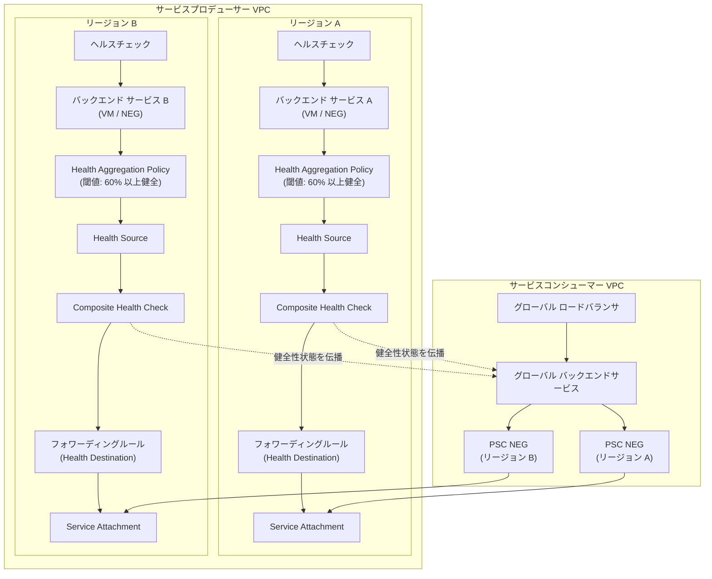

# Virtual Private Cloud (VPC): Private Service Connect の Composite Health (自動クロスリージョン フェイルオーバー)

**リリース日**: 2026-06-01

**サービス**: Virtual Private Cloud (VPC)

**機能**: Composite Health for Private Service Connect

**ステータス**: GA (一般提供)

📊 [このアップデートのインフォグラフィックを見る](https://takech9203.github.io/google-cloud-news-summary/20260601-vpc-private-service-connect-composite-health.html)

## 概要

Google Cloud は、Private Service Connect (PSC) の Composite Health 機能を一般提供 (GA) として正式リリースしました。この機能は、以前「Private Service Connect health」として知られていたもので、サービスプロデューサーが公開サービスのヘルスクライテリア (健全性基準) を定義し、PSC バックエンドを使用してサービスにアクセスするコンシューマーに対して自動的なクロスリージョン フェイルオーバーを実現します。

Composite Health は、サービスプロデューサーのバックエンド (VM インスタンスやネットワーク エンドポイント) の集約されたヘルス状態に基づいて、公開サービスの健全性を判定します。従来の外れ値検出 (Outlier Detection) がレスポンスの失敗から健全性を推測するのに対し、Composite Health はプロデューサーが直接定義したヘルスシグナルに基づくため、より正確なフェイルオーバー判定を提供します。

この機能を利用するには、サービスプロデューサーとコンシューマーの双方がマルチリージョン デプロイメントを構成する必要があります。プロデューサーがヘルス状態を構成すると、その状態はコンシューマーのロードバランサに自動的に伝播され、あるリージョンのサービスインスタンスが不健全になった場合、コンシューマーのロードバランサは自動的にトラフィックを別リージョンの健全なサービスインスタンスにルーティングします。

**アップデート前の課題**

- PSC 経由で公開サービスにアクセスするコンシューマーは、クロスリージョン フェイルオーバーの判定に外れ値検出 (レスポンスの失敗に基づく推測) しか利用できなかった
- サービスプロデューサーがバックエンドの実際の健全性状態をコンシューマーに直接伝達する仕組みがなかった
- バックエンドの一部が不健全になってもコンシューマー側で即座に検知できず、リクエストが失敗するまでフェイルオーバーが発生しなかった

**アップデート後の改善**

- サービスプロデューサーが独自のヘルス基準 (健全なバックエンドの割合や最小数) を定義し、複合的な健全性状態としてコンシューマーに伝播できるようになった
- プロデューサーのバックエンドの実際の健全性に基づく正確なフェイルオーバー判定が可能になった
- コンシューマー側で追加設定なしに、マルチリージョン デプロイメントでの自動クロスリージョン フェイルオーバーが実現された
- Preview から GA に昇格し、本番ワークロードでの利用が正式にサポートされた

## アーキテクチャ図



サービスプロデューサーが各リージョンで Composite Health を構成し、その健全性状態がコンシューマーのグローバル ロードバランサに自動伝播される構成を示しています。リージョン A が不健全と判定されると、コンシューマーのロードバランサは自動的にリージョン B にフェイルオーバーします。

## サービスアップデートの詳細

### 主要機能

1. **Health Aggregation Policy (ヘルス集約ポリシー)**
   - バックエンド サービスが「健全」と見なされるための条件を定義するリソース
   - 2 つの設定可能な閾値: 健全なエンドポイントの最小割合 (デフォルト 60%) と健全なエンドポイントの最小数 (デフォルト 1)
   - 再利用可能なリソースとして複数のバックエンド サービスに同じポリシーを適用可能

2. **Health Source (ヘルスソース)**
   - 単一のバックエンド サービスの健全性を Composite Health Check で利用可能にするリソース
   - バックエンド サービスと Health Aggregation Policy をリンクする役割
   - 各ヘルスソースは正確に 1 つのバックエンド サービスを参照

3. **Composite Health Check (複合ヘルスチェック)**
   - 1 つ以上のヘルスソースの健全性状態を集約し、単一の複合ヘルス状態を生成
   - すべてのヘルスソースが健全な場合にのみサービスを「健全」と判定 (AND ロジック)
   - 1 つの Composite Health Check で 1 ~ 10 のヘルスソースを参照可能

4. **Health Destination (ヘルスデスティネーション)**
   - Composite Health Check から最終的な複合ヘルス状態を受け取るリソース
   - プロデューサーのロードバランサのフォワーディングルールがデスティネーションとなる
   - ヘルス状態はこのフォワーディングルールに接続するコンシューマーのロードバランサに自動伝播

## 技術仕様

### サポートされるロードバランサ (プロデューサー側)

| ロードバランサタイプ | 対応状況 |
|------|------|
| Internal passthrough Network Load Balancer | 対応 |
| Regional internal Application Load Balancer | 対応 |
| Regional internal proxy Network Load Balancer | 対応 |

### サポートされるバックエンドタイプ

| バックエンドタイプ | 説明 |
|------|------|
| GCE_VM_IP_PORT NEG | ゾーン NEG (ネットワーク エンドポイント グループ) |
| GCE_VM_IP NEG | ゾーン NEG |
| インスタンス グループ | マネージド / アンマネージド インスタンス グループ |

### 構成要件

| 項目 | 要件 |
|------|------|
| ロードバランシング スキーム | INTERNAL または INTERNAL_MANAGED |
| リソースのスコープ | リージョナル (監視対象サービスと同一リージョン) |
| Composite Health Check あたりのヘルスソース数 | 1 ~ 10 |
| フォワーディングルールあたりの Composite Health Check 数 | 1 |
| プロジェクト要件 | すべてのリソースが同一プロジェクト内 |

### 必要な IAM 権限

```
compute.regionHealthAggregationPolicies.list
compute.regionHealthAggregationPolicies.get
compute.regionHealthAggregationPolicies.create
compute.regionHealthAggregationPolicies.update
compute.regionHealthAggregationPolicies.delete
compute.regionHealthSources.list
compute.regionHealthSources.get
compute.regionHealthSources.create
compute.regionHealthSources.update
compute.regionHealthSources.delete
compute.regionCompositeHealthChecks.list
compute.regionCompositeHealthChecks.get
compute.regionCompositeHealthChecks.create
compute.regionCompositeHealthChecks.update
compute.regionCompositeHealthChecks.delete
```

事前定義ロール `roles/compute.networkAdmin` (Compute Network Admin) にこれらの権限が含まれています。

## 設定方法

### 前提条件

1. 各リージョンにサポートされる内部ロードバランサを使用したターゲットサービスを作成済みであること
2. 各ターゲットサービスに対して Service Attachment を作成し公開済みであること
3. Compute Engine API が有効化されていること
4. Compute Network Admin ロール (またはカスタムロール) が付与されていること

### 手順

#### ステップ 1: Health Aggregation Policy の作成

```bash
gcloud beta compute health-aggregation-policies create my-health-policy \
    --region=us-central1 \
    --healthy-percent-threshold=75 \
    --min-healthy-threshold=3
```

バックエンド サービスが健全と見なされる条件を定義します。この例では、バックエンドの 75% 以上が健全であり、かつ最低 3 つの健全なバックエンドが存在する必要があります。

#### ステップ 2: Health Source の作成

```bash
gcloud beta compute health-sources create my-health-source \
    --region=us-central1 \
    --source-type=BACKEND_SERVICE \
    --sources=my-backend-service \
    --health-aggregation-policy=my-health-policy
```

特定のバックエンド サービスを Health Aggregation Policy にリンクし、健全性の監視を有効化します。

#### ステップ 3: Composite Health Check の作成

```bash
gcloud beta compute composite-health-checks create my-composite-hc \
    --region=us-central1 \
    --health-sources=my-health-source \
    --health-destination=projects/my-project/regions/us-central1/forwardingRules/my-forwarding-rule
```

ヘルスソースを集約し、最終的な複合ヘルス状態をフォワーディングルール (Health Destination) に適用します。複数のヘルスソースはカンマ区切りで指定できます。

## メリット

### ビジネス面

- **サービス可用性の向上**: プロデューサーが定義した正確なヘルス基準に基づく自動フェイルオーバーにより、エンドユーザーへのサービス中断を最小化
- **運用コストの削減**: 手動でのフェイルオーバー操作が不要になり、24/7 の監視・対応体制の負担を軽減
- **SLA の改善**: マルチリージョン構成と自動フェイルオーバーの組み合わせにより、より高い可用性 SLA を達成可能

### 技術面

- **正確なヘルス判定**: 外れ値検出 (レスポンス失敗の推測) と比較して、バックエンドの実際の健全性状態に基づくため誤判定が少ない
- **柔軟な閾値設定**: ヘルス集約ポリシーにより、サービスごとに異なる健全性基準を定義可能
- **コンシューマー側の追加設定不要**: マルチリージョン デプロイメントにおいてコンシューマーは追加設定なしで自動フェイルオーバーの恩恵を受けられる
- **追加料金なし**: Composite Health 自体に追加料金が発生しないため、コスト面のリスクなく可用性を強化可能

## デメリット・制約事項

### 制限事項

- Composite Health による健全性状態はコンシューマーのロードバランサにのみ表示され、ログで確認することはできない
- すべての Composite Health リソース (参照するバックエンド サービスやフォワーディングルールを含む) は同一プロジェクト内に存在する必要がある
- あるサービスの Composite Health 状態を別のサービスのヘルスソースとして使用 (チェーン) することはできない
- ヘルスチェック構成をテストするモードがなく、構成した Composite Health Check は即座にフェイルオーバーをトリガーする可能性がある
- Private Service Connect バックエンドが公開サービスにアクセスする構成のみをサポート

### 考慮すべき点

- プロデューサーとコンシューマーの双方がマルチリージョン デプロイメントを構成する必要があり、単一リージョン構成では利用できない
- 健全性の閾値設定 (パーセンテージと最小数) を適切に設計しないと、意図しないフェイルオーバーが発生する可能性がある
- テストモードがないため、本番環境への導入時は段階的に構成することを推奨

## ユースケース

### ユースケース 1: マルチリージョン SaaS プラットフォーム

**シナリオ**: SaaS プロバイダーが PSC を通じてマネージドサービスを複数のエンタープライズ顧客に提供しており、あるリージョンのバックエンドに障害が発生した場合に顧客側で自動的にフェイルオーバーさせたい。

**効果**: プロデューサーが各リージョンで Composite Health を構成することで、コンシューマー (SaaS 利用企業) は追加設定なしに自動クロスリージョン フェイルオーバーの恩恵を受け、サービス中断を最小化できる。

### ユースケース 2: 金融機関の高可用性 API ゲートウェイ

**シナリオ**: 金融機関が内部 API サービスを PSC 経由で異なる VPC の部門に提供しており、厳格な可用性要件 (99.99%) を満たす必要がある。バックエンドの 80% 以上が健全でなければサービスを不健全と判定し、フェイルオーバーを発動させたい。

**効果**: Health Aggregation Policy で高めの閾値 (80% 以上、最低 5 インスタンス) を設定することで、部分的な障害でも早期にフェイルオーバーを実行し、エンドユーザーへの影響を防止できる。

### ユースケース 3: パートナー企業間のサービス連携

**シナリオ**: パートナー企業が PSC を通じて互いのサービスを利用しており、プロデューサー企業がコンシューマー企業に対して正確なヘルス状態を伝達し、障害時の自動切り替えを保証したい。

**効果**: Composite Health により、プロデューサー企業はサービスの健全性基準を明示的に定義し、パートナー企業は信頼性の高いフェイルオーバーを自動で実行できる。手動の連絡・対応プロセスが不要になる。

## 料金

Private Service Connect の Composite Health 機能自体に追加料金は発生しません。ただし、VPC ネットワーク内のリソースおよびネットワーク トラフィックに対しては通常の課金が適用されます。詳細は [VPC の料金ページ](https://cloud.google.com/vpc/pricing) を参照してください。

## 関連サービス・機能

- **Private Service Connect バックエンド**: コンシューマーがロードバランサ経由で公開サービスにアクセスするための機能。Composite Health のフェイルオーバーシグナルを受信する側
- **Cloud Load Balancing**: プロデューサー側の内部ロードバランサ (Internal passthrough NLB、Regional internal ALB、Regional internal proxy NLB) および コンシューマー側のグローバル ロードバランサがフェイルオーバーを実行
- **ヘルスチェック**: 個々のバックエンド (VM / NEG) の健全性を判定する基礎となる標準ヘルスチェック機能
- **Service Attachment**: PSC でサービスを公開するためのリソース。Composite Health のフォワーディングルールと関連付けられる

## 参考リンク

- 📊 [インフォグラフィック](https://takech9203.github.io/google-cloud-news-summary/20260601-vpc-private-service-connect-composite-health.html)
- [公式リリースノート](https://docs.cloud.google.com/release-notes#June_01_2026)
- [About Composite Health for Private Service Connect](https://docs.cloud.google.com/vpc/docs/about-private-service-connect-health)
- [Configure Private Service Connect health for automatic cross-region failover](https://docs.cloud.google.com/vpc/docs/configure-private-service-connect-health-failover)
- [Private Service Connect backends](https://docs.cloud.google.com/vpc/docs/private-service-connect-backends)
- [VPC 料金](https://cloud.google.com/vpc/pricing)

## まとめ

Private Service Connect の Composite Health が GA となったことで、サービスプロデューサーはバックエンドの実際の健全性状態に基づいた正確なフェイルオーバーシグナルをコンシューマーに提供できるようになりました。マルチリージョンで PSC 経由のサービス公開を行っている組織は、追加料金なしでサービスの可用性を大幅に向上させることができます。本番ワークロードへの導入を検討する際は、Health Aggregation Policy の閾値設計を慎重に行い、テストモードがない点を考慮して段階的に構成を適用することを推奨します。

---

**タグ**: #VPC #PrivateServiceConnect #CompositeHealth #CrossRegionFailover #HighAvailability #GA #Networking
