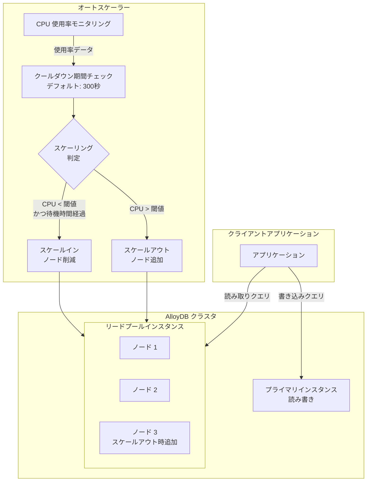

# AlloyDB for PostgreSQL: リードプールインスタンスのオートスケーリングにクールダウン期間設定機能を追加

**リリース日**: 2026-06-02

**サービス**: AlloyDB for PostgreSQL

**機能**: リードプールオートスケーリングのクールダウン期間設定

**ステータス**: Preview (プレビュー)

📊 [このアップデートのインフォグラフィックを見る](https://takech9203.github.io/google-cloud-news-summary/infographic/20260602-alloydb-autoscaling-cooldown-period.html)

## 概要

AlloyDB for PostgreSQL のリードプールインスタンスにおけるオートスケーリング機能に、新たにクールダウン期間（cooldown period）を設定できる機能が追加されました。この機能により、オートスケーリングが発動するタイミングをより細かく制御できるようになり、不必要なスケールイン・スケールアウトの繰り返し（フラッピング）を防止できます。

クールダウン期間は、AlloyDB がリードプールインスタンスのリソース使用状況をオートスケーリングアルゴリズムに反映するまでの待機時間を秒単位で定義するパラメータです。デフォルト値は 300 秒（5 分）に設定されており、`--autoscaler-cool-down-period-seconds` フラグで変更可能です。

この機能は、トラフィックパターンが変動しやすいワークロードを運用する DBA やアプリケーション開発者にとって特に有用です。短期的な負荷スパイクに対する過剰なスケーリング反応を抑制し、コスト効率とパフォーマンスのバランスを最適化できます。

**アップデート前の課題**

オートスケーリング機能は利用可能でしたが、スケーリングのタイミング制御に関して以下の課題がありました。

- クールダウン期間をカスタマイズできず、短期的な負荷変動に対して不要なスケーリングが発生する可能性があった
- スケールイン時のデフォルト待機時間が固定されており、ワークロード特性に応じた調整ができなかった
- トラフィックパターンが周期的に変動する環境で、ノード数が頻繁に増減する「フラッピング」が発生しやすかった

**アップデート後の改善**

今回のアップデートにより、以下の改善が実現されました。

- `--autoscaler-cool-down-period-seconds` パラメータでクールダウン期間を自由に設定可能になった
- ワークロードの特性に合わせてスケーリングの感度を調整できるようになった
- 不要なスケーリングイベントを削減し、安定した運用とコスト最適化を両立できるようになった

## アーキテクチャ図



この図は、AlloyDB リードプールのオートスケーリングにおけるクールダウン期間の役割を示しています。オートスケーラーは CPU 使用率を監視し、クールダウン期間を考慮した上でスケーリング判定を行います。

## サービスアップデートの詳細

### 主要機能

1. **クールダウン期間の設定**
   - `--autoscaler-cool-down-period-seconds` パラメータで秒単位でクールダウン期間を設定可能
   - デフォルト値は 300 秒（5 分）
   - スケーリング判定前のリソース使用状況の安定化待機時間として機能

2. **スケールイン遅延の制御**
   - スケールイン時、AlloyDB は「10 分」または「設定したクールダウン期間」のうち長い方の時間を待機
   - CPU 使用率がターゲット値を下回り続けるか、スケジュールポリシーが非アクティブになるまで待機
   - 例: クールダウン期間を 660 秒に設定した場合、スケールイン前に 11 分間の安定確認が必要

3. **既存のオートスケーリングポリシーとの統合**
   - CPU 使用率ベースポリシーとの併用が可能
   - スケジュールベースポリシーとの併用が可能
   - 複数ポリシーが有効な場合、最も多くのノードを推奨するポリシーが選択される

## 技術仕様

### オートスケーリングパラメータ

| パラメータ | 説明 | デフォルト値 |
|------|------|------|
| `--autoscaler-cool-down-period-seconds` | スケーリング判定前の待機時間（秒） | 300 |
| `--autoscaler-target-cpu-usage` | ターゲット CPU 使用率（0.0-1.0） | - |
| `--autoscaler-max-node-count` | 最大ノード数 | - |
| `--read-pool-node-count` | 最小ノード数（スケールインの下限） | - |
| `--enable-autoscaler` | オートスケーリング有効化 | - |

### スケーリング動作仕様

| 項目 | 詳細 |
|------|------|
| スケールアウトトリガー | CPU 使用率がターゲットを超過 |
| スケールイントリガー | CPU 使用率がターゲットを下回る |
| スケールイン待機時間 | max(10分, クールダウン期間) |
| 最大ノード数 | クラスタ全体で 20 ノード |
| キャッシュウォーミング | 新ノード追加後、数分間必要 |

### gcloud コマンドフラグ

```bash
# クールダウン期間を含むオートスケーリング設定
gcloud beta alloydb instances create INSTANCE_ID \
    --instance-type=READ_POOL \
    --read-pool-node-count=NODE_COUNT \
    --region=REGION_ID \
    --cluster=CLUSTER_ID \
    --project=PROJECT_ID \
    --enable-autoscaler \
    --autoscaler-max-node-count=MAX_NODE_COUNT \
    --autoscaler-cool-down-period-seconds=COOLDOWN_PERIOD \
    --autoscaler-target-cpu-usage=TARGET_CPU_USAGE \
    --machine-type=MACHINE_TYPE
```

## 設定方法

### 前提条件

1. Google Cloud プロジェクトが作成済みで、AlloyDB API が有効化されていること
2. AlloyDB クラスタとプライマリインスタンスが既に作成されていること
3. `gcloud` CLI がインストールされ、適切な権限で認証済みであること
4. `roles/alloydb.admin` または同等の IAM ロールが付与されていること

### 手順

#### ステップ 1: 新規リードプールインスタンスの作成時にクールダウン期間を設定

```bash
gcloud beta alloydb instances create my-read-pool \
    --instance-type=READ_POOL \
    --read-pool-node-count=2 \
    --region=us-central1 \
    --cluster=my-cluster \
    --project=my-project \
    --enable-autoscaler \
    --autoscaler-max-node-count=5 \
    --autoscaler-cool-down-period-seconds=600 \
    --autoscaler-target-cpu-usage=0.7 \
    --machine-type=n2-highmem-4
```

この例では、クールダウン期間を 600 秒（10 分）に設定し、CPU 使用率のターゲットを 70% としています。ノード数は最小 2、最大 5 の範囲でオートスケーリングされます。

#### ステップ 2: 既存リードプールインスタンスのクールダウン期間を更新

```bash
gcloud beta alloydb instances update my-read-pool \
    --region=us-central1 \
    --cluster=my-cluster \
    --project=my-project \
    --enable-autoscaler \
    --autoscaler-cool-down-period-seconds=900
```

既存のリードプールインスタンスに対してクールダウン期間を 900 秒（15 分）に変更する例です。

#### ステップ 3: オートスケーリング状態の確認

```bash
gcloud alloydb instances describe my-read-pool \
    --region=us-central1 \
    --cluster=my-cluster \
    --project=my-project \
    --view=FULL \
    --format="yaml(nodes)"
```

現在のノード数とオートスケーリング状態を確認できます。また、Google Cloud コンソールの Clusters ページ > System insights からも確認可能です。

## メリット

### ビジネス面

- **コスト最適化**: 不必要なスケールアウトを抑制することで、一時的な負荷スパイクによる余分なノード料金の発生を防止できる
- **予測可能な運用コスト**: スケーリングの頻度を制御することで、月次のコンピューティングコストの予測精度が向上する
- **SLA 安定化**: フラッピングによる接続切断やキャッシュミスを回避し、安定したサービスレベルを維持できる

### 技術面

- **フラッピング防止**: 短期的な負荷変動に対する過剰反応を抑制し、安定したノード構成を維持できる
- **キャッシュ効率の向上**: ノードの追加削除が減少することで、各ノードのキャッシュが温まった状態を維持しやすくなる
- **既存接続への影響最小化**: スケーリング頻度を下げることで、長期接続を使用するアプリケーションへの影響を低減できる
- **柔軟なチューニング**: ワークロードの特性（バースト型、周期型、定常型）に応じた最適なクールダウン値を設定可能

## デメリット・制約事項

### 制限事項

- プレビュー機能であり、「Pre-GA Offerings Terms」の対象。サポートが限定される場合がある
- `gcloud beta` コマンドが必要であり、GA（一般提供）版の gcloud コマンドでは利用不可
- クラスタ全体で最大 20 ノードの制限は変更なし
- クールダウン期間を短く設定しすぎると、フラッピング防止の効果が薄れる

### 考慮すべき点

- クールダウン期間を長く設定すると、急激な負荷増加に対するスケールアウトの反応が遅れる可能性がある
- スケールイン時の待機時間は max(10分, クールダウン期間) であるため、10 分未満に設定してもスケールインの速度は変わらない
- 新しいノードが追加された際のキャッシュウォーミングには数分かかるため、クールダウン期間とは別に考慮が必要
- 長期接続を使用している場合、新規ノードへのトラフィック分散には新しいクライアント接続の作成が必要

## ユースケース

### ユースケース 1: EC サイトのセール期間対応

**シナリオ**: EC サイトで定期セール時にトラフィックが急増するが、セール開始直後の瞬間的なスパイクでスケールアウトが繰り返されるのを防ぎたい。

**実装例**:
```bash
# セール期間用の設定: クールダウン 600秒 + スケジュールポリシー併用
gcloud beta alloydb instances update ecommerce-read-pool \
    --region=asia-northeast1 \
    --cluster=ecommerce-cluster \
    --project=my-ecommerce-project \
    --enable-autoscaler \
    --autoscaler-max-node-count=10 \
    --autoscaler-cool-down-period-seconds=600 \
    --autoscaler-target-cpu-usage=0.6 \
    --autoscaler-set-schedule=sale-period \
    --autoscaler-schedule-cron-exp="0 9 * * 1-5" \
    --autoscaler-schedule-duration-seconds=36000 \
    --autoscaler-schedule-time-zone=Asia/Tokyo \
    --autoscaler-schedule-min-node-count=5
```

**効果**: セール時にはスケジュールポリシーで最低 5 ノードを確保しつつ、クールダウン期間 600 秒により瞬間的な負荷変動でのスケーリング頻度を抑制。セール終了後は安定的にスケールダウンされる。

### ユースケース 2: バッチ処理と OLTP の混在環境

**シナリオ**: 日中は OLTP ワークロード、夜間はバッチ処理によるレポート生成が実行される環境で、バッチ処理開始時の短期的な CPU スパイクによる不要なスケールアウトを防ぎたい。

**実装例**:
```bash
# バッチ処理対応: クールダウン期間を 15 分に設定
gcloud beta alloydb instances update analytics-read-pool \
    --region=us-central1 \
    --cluster=analytics-cluster \
    --project=my-analytics-project \
    --enable-autoscaler \
    --autoscaler-cool-down-period-seconds=900 \
    --autoscaler-target-cpu-usage=0.7
```

**効果**: バッチ処理開始時の一時的な CPU スパイク（数分間）に対してスケールアウトが発動せず、安定した初期負荷の後にのみスケーリングが行われる。これにより、一時的なスパイクでの不要なノード追加コストを回避。

## 料金

クールダウン期間の設定自体には追加料金は発生しません。料金はオートスケーリングにより実際に稼働するノード数に基づいて算出されます。

### AlloyDB コンピューティング料金

| リソース | 単価 |
|----------|------|
| vCPU | $0.0736 / vCPU / 時間 |
| メモリ | $0.0125 / GB / 時間 |

### 料金例（リードプールインスタンス）

| 構成 | 月額料金 (概算) |
|--------|-----------------|
| n2-highmem-4 (4 vCPU, 32 GB) x 2 ノード | 約 $1,013 |
| n2-highmem-4 (4 vCPU, 32 GB) x 5 ノード | 約 $2,533 |
| n2-highmem-8 (8 vCPU, 64 GB) x 3 ノード | 約 $2,277 |

**注**: クールダウン期間を適切に設定することで、ノードの不要な増加を防ぎ、月額コストを削減できます。1-3 年のコミットメントによる Committed Use Discount (CUD) も利用可能です。

## 利用可能リージョン

AlloyDB for PostgreSQL のオートスケーリング機能（クールダウン期間設定を含む）は、AlloyDB がサポートするすべてのリージョンで利用可能です。主なリージョンは以下の通りです。

- アジア太平洋: asia-northeast1（東京）、asia-northeast2（大阪）、asia-southeast1（シンガポール）等
- 米州: us-central1、us-east1、us-west1 等
- ヨーロッパ: europe-west1、europe-west4 等

最新のリージョン対応状況は [AlloyDB のロケーションページ](https://cloud.google.com/alloydb/docs/locations) を参照してください。

## 関連サービス・機能

- **AlloyDB リードプールインスタンス**: オートスケーリングが適用されるインスタンスタイプ。読み取り専用のワークロードを水平スケーリングするために使用
- **AlloyDB スケジュールベースポリシー**: Cron 式で指定した時間帯に最小ノード数を保証するオートスケーリングポリシー。クールダウン期間と併用可能
- **Cloud Monitoring**: AlloyDB のメトリクス（CPU 使用率、ノード数）を監視し、オートスケーリングの動作を可視化
- **Cloud SQL for PostgreSQL**: PostgreSQL 互換のマネージドデータベースサービス。オートスケーリング機能は提供されないが、リードレプリカによる読み取りスケーリングが可能

## 参考リンク

- 📊 [インフォグラフィック](https://takech9203.github.io/google-cloud-news-summary/infographic/20260602-alloydb-autoscaling-cooldown-period.html)
- [公式リリースノート](https://docs.cloud.google.com/release-notes#June_02_2026)
- [ドキュメント: リードプールインスタンスのスケーリング](https://docs.cloud.google.com/alloydb/docs/instance-read-pool-scale#autoscale-read-pool)
- [AlloyDB 料金ページ](https://cloud.google.com/alloydb/pricing)
- [AlloyDB 概要](https://cloud.google.com/alloydb/docs/overview)

## まとめ

AlloyDB for PostgreSQL のリードプールオートスケーリングにクールダウン期間設定機能が追加されたことで、スケーリングのタイミングをワークロード特性に合わせて細かく制御できるようになりました。特にトラフィックが変動しやすい環境では、フラッピング防止とコスト最適化の両面で大きなメリットがあります。AlloyDB のリードプールオートスケーリングを既に利用中、または導入を検討している場合は、`--autoscaler-cool-down-period-seconds` パラメータの適切な設定を検討することを推奨します。

---

**タグ**: #AlloyDB #PostgreSQL #オートスケーリング #リードプール #クールダウン期間 #データベース #パフォーマンス最適化 #コスト最適化
