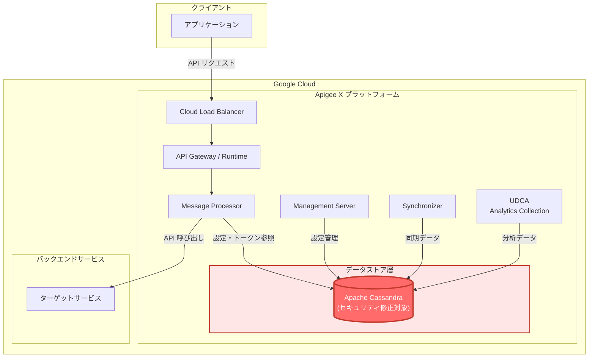

# Apigee X: Cassandra セキュリティアップデート

**リリース日**: 2026-06-02

**サービス**: Apigee X

**機能**: Cassandra Security Update

**ステータス**: Security

[このアップデートのインフォグラフィックを見る](https://takech9203.github.io/google-cloud-news-summary/20260602-apigee-x-cassandra-security-update.html)

## 概要

2026年6月2日、Google Cloud は Apigee X の Cassandra インフラストラクチャに対する重要なセキュリティアップデートをリリースしました。このアップデートでは、合計11件の CVE(Common Vulnerabilities and Exposures)脆弱性が修正されています。

Cassandra は Apigee X の中核的なデータストアであり、API キー、OAuth トークン、アプリケーション設定、分散クォータカウンターなどのランタイムデータを保持しています。このセキュリティ修正は、Cassandra インフラストラクチャの堅牢性を維持し、潜在的な攻撃ベクトルを排除するために不可欠なものです。

このロールアウトは2026年6月2日から開始され、全ての Google Cloud ゾーンへの展開完了まで4営業日以上かかる場合があります。お客様のインスタンスでは、ロールアウトが完了するまで修正が反映されない可能性があります。

**アップデート前の課題**

- Apigee Cassandra インフラストラクチャに11件のセキュリティ脆弱性が存在していた
- 脆弱性が悪用された場合、API 管理基盤の可用性やデータの機密性に影響を及ぼす可能性があった
- セキュリティリスクを軽減するための回避策が限定的だった

**アップデート後の改善**

- 11件全ての CVE 脆弱性が修正され、セキュリティリスクが排除された
- Google Cloud による自動ロールアウトにより、顧客側の作業が不要
- Cassandra インフラストラクチャ全体のセキュリティポスチャが強化された

## アーキテクチャ図



Apigee X のアーキテクチャにおいて、Cassandra はランタイムデータストアとして中心的な役割を果たしています。赤色で強調表示されているのが今回のセキュリティ修正対象コンポーネントです。

## サービスアップデートの詳細

### 主要機能

1. **複数 CVE の一括修正**
   - 11件のセキュリティ脆弱性に対する包括的な修正パッチ
   - Cassandra インフラストラクチャ全体を対象とした統合的なセキュリティ強化

2. **自動ロールアウト**
   - Google Cloud が管理するフルマネージドなデプロイメント
   - 全ゾーンへの段階的な展開(4営業日以上)
   - 顧客側でのアクション不要

3. **ゼロダウンタイムアップデート**
   - ローリングアップデート方式によるサービス継続性の確保
   - API トラフィックへの影響を最小限に抑えた展開

## 技術仕様

### 修正された脆弱性一覧

| CVE ID | 対象 |
|--------|------|
| CVE-2026-39820 | Apigee Cassandra インフラストラクチャ |
| CVE-2026-42499 | Apigee Cassandra インフラストラクチャ |
| CVE-2026-39836 | Apigee Cassandra インフラストラクチャ |
| CVE-2026-33814 | Apigee Cassandra インフラストラクチャ |
| CVE-2026-42501 | Apigee Cassandra インフラストラクチャ |
| CVE-2026-33811 | Apigee Cassandra インフラストラクチャ |
| CVE-2026-39825 | Apigee Cassandra インフラストラクチャ |
| CVE-2026-39817 | Apigee Cassandra インフラストラクチャ |
| CVE-2026-39823 | Apigee Cassandra インフラストラクチャ |
| CVE-2026-39819 | Apigee Cassandra インフラストラクチャ |
| CVE-2026-39826 | Apigee Cassandra インフラストラクチャ |

### Cassandra が保持するデータの種類

| データ種別 | 説明 |
|-----------|------|
| API キー | アプリケーション認証に使用されるキー情報 |
| OAuth トークン | アクセストークン、リフレッシュトークン |
| アプリケーション設定 | API プロキシの設定・構成データ |
| 分散クォータカウンター | レートリミット制御用のカウンター |
| KVM (Key-Value Map) | カスタムデータストア |

## 設定方法

### 前提条件

1. Apigee X のインスタンスが稼働中であること
2. 特別な設定や操作は不要（フルマネージド）

### 手順

#### 顧客アクション: 不要

```bash
# このアップデートは Google Cloud によって自動的に適用されます。
# 顧客側での操作は必要ありません。

# ロールアウト状況の確認は Apigee UI またはAPI で可能:
curl -H "Authorization: Bearer $(gcloud auth print-access-token)" \
  "https://apigee.googleapis.com/v1/organizations/{ORG_NAME}/instances"
```

ロールアウトは2026年6月2日から順次開始され、全ゾーンへの展開完了まで4営業日以上かかる場合があります。

## メリット

### ビジネス面

- **コンプライアンス対応**: セキュリティ脆弱性の迅速な修正により、PCI DSS や SOC 2 などのコンプライアンス要件を維持
- **運用負荷の軽減**: 自動ロールアウトにより、顧客のセキュリティチームの工数が不要

### 技術面

- **多層防御の強化**: 11件の脆弱性を一括修正することで、攻撃対象領域を大幅に削減
- **サービス継続性**: ゼロダウンタイムでのセキュリティパッチ適用により、API の可用性を維持
- **インフラストラクチャの堅牢化**: Cassandra データストア層のセキュリティポスチャを最新の状態に更新

## デメリット・制約事項

### 制限事項

- ロールアウト完了まで4営業日以上かかるため、即時の修正適用は保証されない
- 一部のゾーンでは他のゾーンよりも修正の反映が遅れる可能性がある
- ロールアウト中は一時的に異なるバージョンのインスタンスが混在する

### 考慮すべき点

- ロールアウト完了前の期間は脆弱性が残存する可能性があるため、追加のネットワークセキュリティ対策の検討が推奨される
- 修正適用後、Cassandra の再起動に伴う一時的なレイテンシ増加の可能性がある（通常は最小限）

## ユースケース

### ユースケース 1: 金融サービス企業の API セキュリティ

**シナリオ**: PCI DSS 準拠が求められる金融サービス企業が、Apigee X を使用して決済 API を公開している場合

**効果**: 自動的にセキュリティパッチが適用されることで、継続的なコンプライアンス維持が可能。監査証跡としてリリースノートを活用できる。

### ユースケース 2: 大規模 API プラットフォーム運営

**シナリオ**: 数百の API プロキシを運営するエンタープライズ企業が、セキュリティインシデントのリスクを最小化したい場合

**効果**: Google Cloud のマネージドセキュリティアップデートにより、運用チームの介入なしに脆弱性が修正され、API プラットフォーム全体のセキュリティが確保される。

## 料金

このセキュリティアップデートに追加費用は発生しません。通常の Apigee X の料金体系に含まれます。

| 項目 | 料金 |
|------|------|
| セキュリティアップデート適用 | 無料（Apigee X 利用料に含む） |
| ダウンタイム | なし（ゼロダウンタイム更新） |

## 利用可能リージョン

このセキュリティアップデートは、Apigee X が利用可能な全ての Google Cloud リージョン・ゾーンに順次展開されます。ロールアウトは2026年6月2日から開始され、4営業日以上かけて全ゾーンに適用されます。

## 関連サービス・機能

- **Apigee X**: Google Cloud のフルマネージド API 管理プラットフォーム
- **Apigee hybrid**: オンプレミスまたはマルチクラウド環境での API 管理（別途 Cassandra 管理が必要）
- **Cloud Armor**: API エンドポイントへの追加的なセキュリティ保護
- **Security Command Center**: Google Cloud 全体のセキュリティポスチャ管理

## 参考リンク

- [インフォグラフィック](https://takech9203.github.io/google-cloud-news-summary/20260602-apigee-x-cassandra-security-update.html)
- [公式リリースノート](https://docs.cloud.google.com/release-notes#June_02_2026)
- [Apigee X ドキュメント](https://cloud.google.com/apigee/docs)
- [Apigee セキュリティ情報](https://cloud.google.com/apigee/docs/api-platform/fundamentals/security)
- [Apigee 料金ページ](https://cloud.google.com/apigee/pricing)

## まとめ

今回の Apigee X Cassandra セキュリティアップデートは、11件の CVE 脆弱性を修正する重要なセキュリティパッチです。Google Cloud によるフルマネージドな自動ロールアウトにより、顧客側の操作は不要ですが、全ゾーンへの展開完了まで4営業日以上を要する点に留意してください。Apigee X を利用している全ての組織に対して自動的に適用されるため、追加のアクションは必要ありませんが、セキュリティ監査の観点からリリースノートの確認と記録を推奨します。

---

**タグ**: #ApigeeX #Cassandra #Security #CVE #セキュリティアップデート #自動ロールアウト #API管理
