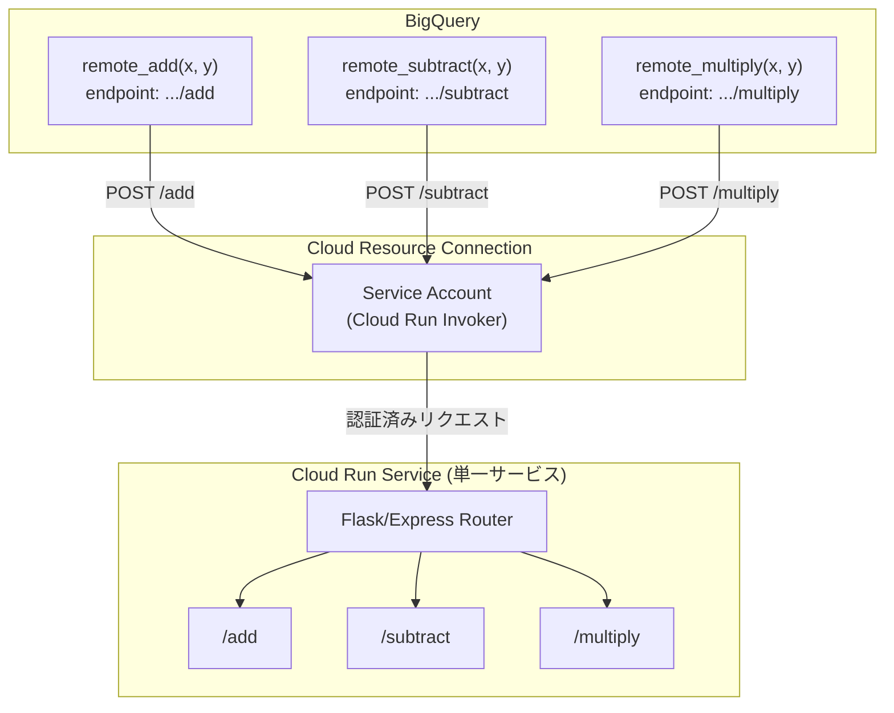

# BigQuery: Remote Functions カスタムパスサポート (GA)

**リリース日**: 2026-06-02

**サービス**: BigQuery

**機能**: Remote Functions エンドポイント URL のカスタムパスサポート

**ステータス**: Generally Available (GA)

[このアップデートのインフォグラフィックを見る](https://takech9203.github.io/google-cloud-news-summary/20260602-bigquery-remote-functions-custom-path-ga.html)

## 概要

BigQuery Remote Functions において、エンドポイント URL にカスタムパスを指定できる機能が一般提供 (GA) となった。これにより、単一の Cloud Run サービスを複数の BigQuery リモート関数で共有し、異なるパスサフィックスでルーティングすることが可能になる。

この機能は、Cloud Run サービスのエンドポイント URL の末尾にルートパスを追加することで、1 つのアプリケーション内に複数のリモート関数ロジックを実装できるようにするもの。例えば `https://service_name-project_number.region.run.app/add` と `https://service_name-project_number.region.run.app/subtract` のように、同一サービスの異なるパスにそれぞれ別の BigQuery リモート関数を作成できる。

Solutions Architect やデータエンジニアにとって、マイクロサービスの管理コストを削減しつつ、BigQuery から柔軟に外部ロジックを呼び出すための重要な改善である。

**アップデート前の課題**

- リモート関数ごとに個別の Cloud Run サービスまたは Cloud Run Functions をデプロイする必要があった
- 関連するビジネスロジックであっても、別々のサービスとして管理しなければならなかった
- サービス数の増加に伴い、デプロイ、監視、IAM 設定の管理オーバーヘッドが増大していた

**アップデート後の改善**

- 単一の Cloud Run サービス内で複数のルートパスを定義し、それぞれを別々の BigQuery リモート関数にマッピングできるようになった
- 関連するビジネスロジックを 1 つのアプリケーションにまとめて管理できるようになった
- サービス数の削減により、デプロイ、監視、IAM 管理のオーバーヘッドが軽減された

## アーキテクチャ図



単一の Cloud Run サービスに複数のルートパスを定義し、BigQuery の各リモート関数から異なるパスを指定して呼び出すアーキテクチャ。Cloud Resource Connection のサービスアカウントを通じて認証が行われる。

## サービスアップデートの詳細

### 主要機能

1. **エンドポイント URL のカスタムパス指定**
   - `CREATE FUNCTION` ステートメントの `endpoint` オプションで、Cloud Run URL の末尾にルートパスを追加可能
   - 例: `https://service_name-project_number.region.run.app/subtract_list`
   - 同一サービスの異なるパスにそれぞれ別のリモート関数を作成可能

2. **単一サービスでの複数関数ホスティング**
   - 1 つの Cloud Run サービス (または Cloud Run Functions) 内で複数のエンドポイントを定義
   - Flask や Express などのルーティング機能を活用して、パスごとに異なるビジネスロジックを実装
   - 共通ライブラリやデータベース接続の共有が容易

3. **既存のリモート関数との完全互換**
   - カスタムパスなし (ルートパス `/`) の従来のリモート関数はそのまま動作
   - 入出力フォーマット (JSON の `calls` / `replies`) は変更なし
   - 接続設定や IAM 権限の設定方法も同一

## 技術仕様

### カスタムパスの制約事項

| 項目 | 詳細 |
|------|------|
| 使用可能文字 | 英大文字 (A-Z)、英小文字 (a-z)、数字 (0-9)、ハイフン (-)、アンダースコア (_) |
| 使用不可文字 | フラグメント識別子 (#)、クエリパラメータ (?)、チルダ (~) |
| 禁止パス | `/_ah/` で始まるパス、`/eventlog`、末尾が `z` のパス |

### CREATE FUNCTION 構文

```sql
CREATE FUNCTION PROJECT_ID.DATASET_ID.remote_subtract(x INT64, y INT64)
RETURNS INT64
REMOTE WITH CONNECTION PROJECT_ID.LOCATION.CONNECTION_NAME
OPTIONS (
  endpoint = 'https://service_name-project_number.region.run.app/subtract_list'
)
```

### Cloud Run サービス実装例 (Python/Flask)

```python
from flask import Flask, request, jsonify

app = Flask(__name__)

@app.route("/add", methods=['POST'])
def batch_add():
    request_json = request.get_json()
    calls = request_json['calls']
    replies = [sum(call) for call in calls]
    return jsonify({"replies": replies})

@app.route("/subtract_list", methods=['POST'])
def batch_subtract():
    request_json = request.get_json()
    calls = request_json['calls']
    replies = []
    for call in calls:
        nums = [x for x in call if x is not None]
        result = nums[0] - sum(nums[1:]) if nums else 0
        replies.append(result)
    return jsonify({"replies": replies})

if __name__ == "__main__":
    app.run(host="0.0.0.0", port=8080)
```

## 設定方法

### 前提条件

1. Google Cloud プロジェクトで BigQuery API と Cloud Run API が有効化されていること
2. Cloud Resource Connection が作成済みであること
3. Connection のサービスアカウントに Cloud Run Invoker ロールが付与されていること
4. Cloud Run サービスがデプロイ済みであること

### 手順

#### ステップ 1: Cloud Resource Connection の作成

```bash
bq mk --connection --location=REGION --project_id=PROJECT_ID \
  --connection_type=CLOUD_RESOURCE CONNECTION_ID
```

サービスアカウント ID を確認:

```bash
bq show --connection PROJECT_ID.REGION.CONNECTION_ID
```

#### ステップ 2: Cloud Run サービスへの IAM 権限付与

```bash
gcloud run services add-iam-policy-binding SERVICE_NAME \
  --member="serviceAccount:CONNECTION_SERVICE_ACCOUNT" \
  --role="roles/run.invoker" \
  --region=REGION
```

#### ステップ 3: カスタムパス付きリモート関数の作成

```sql
-- 加算関数 (/add パス)
CREATE FUNCTION my_project.my_dataset.remote_add(x INT64, y INT64)
RETURNS INT64
REMOTE WITH CONNECTION my_project.us.my_connection
OPTIONS (
  endpoint = 'https://my-service-abc123-uc.a.run.app/add'
);

-- 減算関数 (/subtract_list パス)
CREATE FUNCTION my_project.my_dataset.remote_subtract(x INT64, y INT64)
RETURNS INT64
REMOTE WITH CONNECTION my_project.us.my_connection
OPTIONS (
  endpoint = 'https://my-service-abc123-uc.a.run.app/subtract_list'
);
```

#### ステップ 4: リモート関数の呼び出し

```sql
SELECT
  remote_add(10, 20) AS addition_result,
  remote_subtract(100, 30) AS subtraction_result;
```

## メリット

### ビジネス面

- **運用コスト削減**: サービス数の削減により、デプロイ・監視・メンテナンスのコストが低減
- **開発効率向上**: 関連ロジックを 1 つのリポジトリ・サービスにまとめることで、開発サイクルが短縮
- **インフラコスト最適化**: 複数の小さなサービスを統合することで、Cloud Run の最小インスタンス費用を削減可能

### 技術面

- **シンプルなアーキテクチャ**: 関連する複数の関数を 1 つのサービスに集約し、マイクロサービスの過剰分割を回避
- **共有リソースの活用**: データベース接続プール、キャッシュ、共通ライブラリをサービス内で共有可能
- **統一的なデプロイ**: 1 回のデプロイで関連する全リモート関数を更新可能

## デメリット・制約事項

### 制限事項

- パスに使用できる文字は英数字、ハイフン、アンダースコアのみ
- `/_ah/` で始まるパス、`/eventlog`、末尾が `z` のパスは使用不可
- フラグメント識別子 (#)、クエリパラメータ (?)、チルダ (~) は使用不可
- リモート関数の戻り値は非決定的と見なされ、クエリ結果のキャッシュは行われない

### 考慮すべき点

- 1 つのサービスに多数の関数を集約しすぎると、障害の影響範囲が拡大する
- サービスのコールドスタート時間が増加する可能性がある (コードサイズの増大)
- 個別関数のスケーリング要件が大きく異なる場合は、別サービスへの分離を検討すべき
- VPC Service Controls 使用時は、サービスプロジェクトをペリメータに追加する必要がある

## ユースケース

### ユースケース 1: データ変換パイプラインの統合

**シナリオ**: EC サイトのデータ分析チームが、商品データに対する複数の変換処理 (価格正規化、カテゴリ分類、テキストクレンジング) を BigQuery から呼び出す必要がある。

**実装例**:
```python
@app.route("/normalize_price", methods=['POST'])
def normalize_price():
    # 通貨変換と税込み価格の統一処理
    ...

@app.route("/classify_category", methods=['POST'])
def classify_category():
    # ML モデルによるカテゴリ自動分類
    ...

@app.route("/cleanse_text", methods=['POST'])
def cleanse_text():
    # テキストデータのクレンジング処理
    ...
```

```sql
SELECT
  product_id,
  normalize_price(price, currency) AS normalized_price,
  classify_category(description) AS category,
  cleanse_text(product_name) AS clean_name
FROM raw_products;
```

**効果**: 3 つの Cloud Run サービスを 1 つに統合し、管理コストを 1/3 に削減。共通の商品マスタデータをインメモリキャッシュで共有可能。

### ユースケース 2: マルチモデル ML 推論の統合

**シナリオ**: データサイエンスチームが複数の ML モデル (感情分析、エンティティ抽出、要約生成) を BigQuery のクエリから呼び出す必要がある。

**効果**: 単一のサービスで ML モデルのロード・推論を管理し、GPU リソースの効率的な共有とモデルのバージョン管理を簡素化。

## 料金

BigQuery Remote Functions の利用に関する料金は以下の組み合わせで構成される:

| 項目 | 料金体系 |
|------|----------|
| BigQuery クエリ処理 | 標準の BigQuery 料金 (オンデマンド: $6.25/TB、スロット: 予約ベース) |
| Cloud Run 実行 | リクエスト数 + CPU/メモリ使用量ベース |
| Cloud Run Functions 実行 | 呼び出し回数 + コンピュート時間ベース |

カスタムパス機能自体に追加料金は発生しない。複数のサービスを 1 つに統合することで、Cloud Run の最小インスタンス維持コストを削減できる可能性がある。

## 利用可能リージョン

BigQuery Remote Functions は、BigQuery と Cloud Run (または Cloud Run Functions) の両方がサポートされているリージョンで利用可能:

- **シングルリージョン**: BigQuery と Cloud Run Functions の両方がサポートするリージョンで利用可能。リモート関数と Cloud Run サービスは同一リージョンに配置する必要がある
- **マルチリージョン (US)**: 米国内の任意のシングルリージョンにデプロイされた Cloud Run サービスを利用可能
- **マルチリージョン (EU)**: EU 加盟国内の任意のシングルリージョンにデプロイされた Cloud Run サービスを利用可能

## 関連サービス・機能

- **Cloud Run**: リモート関数のバックエンドとして使用。カスタムパスによるルーティングはCloud Run のサービス設計と密接に関連
- **Cloud Run Functions**: より軽量なリモート関数バックエンド。単一関数の場合に最適
- **BigQuery Connections (CLOUD_RESOURCE)**: リモート関数と Cloud Run 間の認証・認可を管理する接続リソース
- **VPC Service Controls**: リモート関数利用時のセキュリティ境界設定に使用。内部トラフィックのイングレス設定と組み合わせ可能
- **BigQuery DataFrames**: Python から BigQuery リモート関数を自動的に作成・管理するフレームワーク

## 参考リンク

- [インフォグラフィック](https://takech9203.github.io/google-cloud-news-summary/20260602-bigquery-remote-functions-custom-path-ga.html)
- [公式リリースノート](https://docs.cloud.google.com/release-notes#June_02_2026)
- [BigQuery Remote Functions ドキュメント](https://docs.cloud.google.com/bigquery/docs/remote-functions)
- [リモート関数の作成手順](https://docs.cloud.google.com/bigquery/docs/remote-functions#create_a_remote_function)
- [カスタムパスの制限事項](https://docs.cloud.google.com/bigquery/docs/remote-functions#custom-path-limitations)
- [BigQuery 料金](https://cloud.google.com/bigquery/pricing)
- [Cloud Run 料金](https://cloud.google.com/run/pricing)

## まとめ

BigQuery Remote Functions のカスタムパスサポートの GA により、単一の Cloud Run サービスで複数のリモート関数をホストするアーキテクチャが正式にサポートされた。これにより、サービスの管理オーバーヘッドが大幅に削減され、関連するビジネスロジックを効率的に統合できるようになる。既存のリモート関数ユーザーは、関連する関数群の統合を検討し、運用コストの最適化を図ることを推奨する。

---

**タグ**: #BigQuery #RemoteFunctions #CloudRun #GA #カスタムパス #サーバーレス #データエンジニアリング
