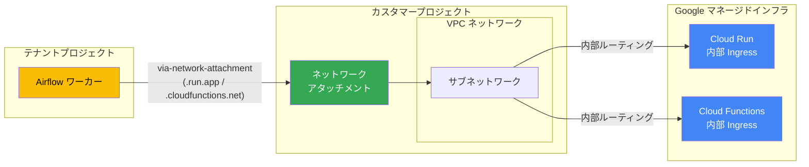

# Cloud Composer: Managed Airflow (Gen 3) から内部 Ingress 制限付き Cloud Run エンドポイントへのアクセスが可能に

**リリース日**: 2026-06-02

**サービス**: Cloud Composer (Managed Airflow Gen 3)

**機能**: ネットワークアタッチメント経由での Cloud Run 内部 Ingress エンドポイントへのアクセス

**ステータス**: Beta

📊 [このアップデートのインフォグラフィックを見る](https://takech9203.github.io/google-cloud-news-summary/infographic/20260602-cloud-composer-gen3-cloud-run-internal-access.html)

## 概要

Cloud Composer の Managed Airflow (Gen 3) 環境において、内部 Ingress に制限された Cloud Run エンドポイントに、環境のネットワークアタッチメントを経由してアクセスできるようになりました。この機能は gcloud CLI beta コマンドおよび beta Cloud Composer API を通じて、すべての Managed Airflow (Gen 3) バージョンで利用可能です。

従来、Cloud Run サービスの Ingress を内部エンドポイントに制限している場合、Managed Airflow 環境からそのエンドポイントにアクセスすることはできませんでした。これは、テナントプロジェクト内の Airflow ワーカーが環境と同じ VPC ネットワークに属していないためです。今回のアップデートにより、`--cloud-run-functions-routing via-network-attachment` オプションを使用して、Cloud Run へのトラフィックをネットワークアタッチメント経由でルーティングできるようになり、セキュアな内部通信が実現します。

この機能は、セキュリティ要件の高いエンタープライズ環境において、データパイプラインのオーケストレーションと内部サービス間の通信を安全に行いたいデータエンジニアや MLOps エンジニアに特に有用です。

**アップデート前の課題**

Cloud Run の Ingress を内部に制限している場合、Managed Airflow (Gen 3) 環境からアクセスできない制約がありました。

- Cloud Run サービスの Ingress を「internal」に制限すると、テナントプロジェクトの Airflow ワーカーからアクセスできなかった
- 内部 Ingress 制限付きの Cloud Run サービスを DAG から呼び出すには、Ingress 制限を緩和する必要があった
- セキュリティポリシーとワークフローオーケストレーションの要件の間にトレードオフが存在していた

**アップデート後の改善**

ネットワークアタッチメント経由のトラフィックルーティングにより、以下が可能になりました。

- 内部 Ingress 制限を維持したまま、Airflow DAG から Cloud Run サービスを呼び出すことが可能になった
- Cloud Run の Ingress 設定を緩和する必要がなくなり、セキュリティポリシーを維持できるようになった
- `.run.app` および `.cloudfunctions.net` ドメインへのトラフィックがネットワークアタッチメント経由で安全にルーティングされるようになった

## アーキテクチャ図



この図は、Managed Airflow (Gen 3) のテナントプロジェクト内の Airflow ワーカーが、カスタマープロジェクトのネットワークアタッチメントを経由して、内部 Ingress に制限された Cloud Run / Cloud Functions エンドポイントにアクセスするトラフィックフローを示しています。

## サービスアップデートの詳細

### 主要機能

1. **Cloud Run トラフィックルーティング設定**
   - `--cloud-run-functions-routing` パラメータにより、Cloud Run へのトラフィックルーティング方式を制御可能
   - `direct` (デフォルト): 他の Google API/サービスと同様のルーティング
   - `via-network-attachment`: 環境のネットワークアタッチメント経由でルーティング

2. **対象ドメインの自動ルーティング**
   - `.run.app` ドメインへのトラフィックが自動的にネットワークアタッチメント経由でルーティング
   - `.cloudfunctions.net` ドメインへのトラフィックも同様にルーティング
   - カスタムドメインを使用する Private IP 環境では、非 Google アドレスへのトラフィックはデフォルトでネットワークアタッチメント経由

3. **VPC 接続操作との同時実行**
   - VPC ネットワークへの接続操作と同時に `--cloud-run-functions-routing` を指定可能
   - 既存環境への後付け設定にも対応
   - gcloud CLI および REST API の両方で設定可能

## 技術仕様

### ルーティング設定オプション

| 項目 | 詳細 |
|------|------|
| パラメータ名 (gcloud) | `--cloud-run-functions-routing` |
| API フィールド | `config.nodeConfig.trafficRoutingConfig.cloudRunFunctionsRouting` |
| 値: direct | デフォルト。通常の Google API ルーティングを使用 |
| 値: via-network-attachment | ネットワークアタッチメント経由でルーティング |
| 対象ドメイン | `.run.app`, `.cloudfunctions.net` |
| API バージョン | v1beta1 |
| gcloud コンポーネント | gcloud beta composer |

### 前提条件と制約

| 項目 | 詳細 |
|------|------|
| ネットワーキングタイプ | Private IP 必須 |
| VPC 接続 | 環境がVPCネットワークに接続済みであること |
| 切断制限 | ルーティング有効時はVPC切断不可 (先にデフォルトルーティングに戻す必要あり) |
| 対応バージョン | すべての Managed Airflow (Gen 3) バージョン |

### API リクエスト例

```json
{
  "config": {
    "nodeConfig": {
      "trafficRoutingConfig": {
        "cloudRunFunctionsRouting": "VIA_NETWORK_ATTACHMENT"
      }
    }
  }
}
```

## 設定方法

### 前提条件

1. Managed Airflow (Gen 3) 環境が作成済みであること
2. 環境が Private IP ネットワーキングを使用していること (Public IP の場合はネットワーキングタイプを変更する)
3. 環境が VPC ネットワークに接続済み、またはこの操作と同時に接続すること
4. gcloud CLI beta コンポーネントがインストール済みであること

### 手順

#### ステップ 1: 環境のネットワーキングタイプを確認

```bash
gcloud beta composer environments describe ENVIRONMENT_NAME \
    --location LOCATION \
    --format="get(config.privateEnvironmentConfig)"
```

環境が Public IP の場合は、Private IP に変更します。

#### ステップ 2: VPC ネットワーク接続の確認または設定

```bash
# VPC ネットワークへの接続 (未接続の場合)
gcloud beta composer environments update ENVIRONMENT_NAME \
    --location LOCATION \
    --network NETWORK_ID \
    --subnetwork SUBNETWORK_ID
```

既存のネットワークアタッチメントを使用する場合:

```bash
gcloud beta composer environments update ENVIRONMENT_NAME \
    --location LOCATION \
    --network-attachment projects/PROJECT/regions/REGION/networkAttachments/ATTACHMENT_NAME
```

#### ステップ 3: Cloud Run トラフィックルーティングを有効化

```bash
gcloud beta composer environments update ENVIRONMENT_NAME \
    --location LOCATION \
    --cloud-run-functions-routing via-network-attachment
```

VPC 接続と同時に設定する場合:

```bash
gcloud beta composer environments update ENVIRONMENT_NAME \
    --location LOCATION \
    --network NETWORK_ID \
    --subnetwork SUBNETWORK_ID \
    --cloud-run-functions-routing via-network-attachment
```

#### ステップ 4: 設定の確認

```bash
gcloud beta composer environments describe ENVIRONMENT_NAME \
    --location LOCATION \
    --format="get(config.nodeConfig.trafficRoutingConfig)"
```

#### ステップ 5: (オプション) デフォルトルーティングに戻す

```bash
gcloud beta composer environments update ENVIRONMENT_NAME \
    --location LOCATION \
    --cloud-run-functions-routing direct
```

## メリット

### ビジネス面

- **セキュリティコンプライアンスの維持**: Cloud Run の内部 Ingress 制限を解除せずに、データパイプラインからの安全なアクセスを実現。規制要件やセキュリティポリシーに準拠したまま運用可能
- **運用の簡素化**: VPN やプロキシなどの回避策を構築する必要がなくなり、インフラストラクチャの複雑性が低減
- **コスト効率**: 追加のネットワーキングインフラ (VPN ゲートウェイ、プロキシ VM など) が不要になり、ネットワーキングコストを削減

### 技術面

- **ゼロトラストネットワーキングとの親和性**: 内部トラフィックのみを許可する構成を維持しながら、ワークフローオーケストレーションを実現
- **シンプルな設定**: 単一の gcloud コマンドまたは API 呼び出しで設定完了。複雑なネットワーク構成が不要
- **既存環境への適用**: 環境の再作成なしに、既存の Managed Airflow (Gen 3) 環境に後付けで設定可能

## デメリット・制約事項

### 制限事項

- 環境は Private IP ネットワーキングを使用する必要がある (Public IP では利用不可)
- ルーティング設定を有効にした状態では、VPC ネットワークからの切断ができない (先にデフォルトルーティングに戻す必要がある)
- 現時点では Beta 機能であり、gcloud beta および v1beta1 API でのみ利用可能
- Terraform での設定は公式ドキュメントでまだ明記されていない

### 考慮すべき点

- ネットワークアタッチメント経由のルーティングは `.run.app` と `.cloudfunctions.net` の全トラフィックに適用される (特定のサービスのみの選択的ルーティングは不可)
- VPC ネットワーク側でのファイアウォールルールやルーティング設定が適切に構成されている必要がある
- DNS 解決は引き続きデフォルトの方法で行われるため、プライベート DNS ゾーンとの相互作用を考慮する必要がある
- 環境の内部 IP 範囲 (デフォルト: 100.64.128.0/20) と VPC サブネットワークの IP 範囲が重複しないこと

## ユースケース

### ユースケース 1: ML パイプラインでの内部モデルサービングエンドポイント呼び出し

**シナリオ**: ML エンジニアが Airflow DAG からモデル推論サービス (Cloud Run にデプロイ、内部 Ingress に制限) を呼び出して、バッチ推論パイプラインを構築したい場合。

**実装例**:
```python
from airflow import DAG
from airflow.providers.http.operators.http import SimpleHttpOperator
from datetime import datetime

with DAG(
    "ml_batch_inference",
    start_date=datetime(2026, 6, 1),
    schedule_interval="@daily",
) as dag:
    call_inference = SimpleHttpOperator(
        task_id="call_model_endpoint",
        http_conn_id="internal_cloud_run",
        endpoint="/predict",
        method="POST",
        data='{"instances": [...]}',
        headers={"Content-Type": "application/json"},
    )
```

**効果**: モデルサービングの内部 Ingress 制限を維持しながら、Airflow からの自動バッチ推論が可能になる。外部公開のリスクなくパイプラインを運用できる。

### ユースケース 2: マイクロサービスアーキテクチャでのイベント処理

**シナリオ**: データエンジニアが、内部に制限された複数の Cloud Run サービス (データ変換、バリデーション、通知) を Airflow DAG から順番に呼び出してデータパイプラインを構成したい場合。

**効果**: 全サービスを内部 Ingress に制限したまま、Airflow によるオーケストレーションが可能。サービスメッシュのような追加インフラなしに、セキュアなサービス間連携を実現。

### ユースケース 3: セキュリティ要件の厳しい金融データ処理

**シナリオ**: 金融機関が PCI DSS や SOC 2 などの規制要件に準拠しつつ、Cloud Run 上のデータ処理サービスを Airflow から呼び出す必要がある場合。

**効果**: すべてのサービスを内部ネットワーク内に閉じたまま、データ処理パイプラインを安全にオーケストレーションできる。コンプライアンス監査への対応も容易になる。

## 料金

Cloud Run トラフィックルーティング機能自体には追加料金は発生しません。ただし、以下の Cloud Composer の標準料金が適用されます。

### Cloud Composer (Gen 3) の主要料金

| 項目 | 料金 |
|------|------|
| 環境管理費 | $0.35/時間 (約 $252/月) |
| vCPU | $0.0498/vCPU-時間 |
| メモリ | $0.0055/GB-時間 |
| データベース (Small) | $0.009/時間 |
| データベース (Medium) | $0.024/時間 |
| データベース (Large) | $0.048/時間 |

### ネットワーキング関連

| 項目 | 料金 |
|------|------|
| Private IP 環境の内部通信 | 追加料金なし |
| ネットワークアタッチメント | 追加料金なし |
| VPC ネットワーク内のトラフィック | 標準の VPC 内部通信料金 |

※ 料金は 2026 年 6 月時点の情報です。最新の料金は公式料金ページをご確認ください。

## 利用可能リージョン

この機能はすべての Managed Airflow (Gen 3) バージョンで利用可能であり、Cloud Composer がサポートするすべてのリージョンで使用できます。Cloud Composer (Gen 3) は、以下を含む主要なリージョンでサポートされています:

- アジア太平洋: asia-northeast1 (東京), asia-northeast2 (大阪), asia-southeast1 (シンガポール) 等
- 北米: us-central1, us-east1, us-west1 等
- ヨーロッパ: europe-west1, europe-west2, europe-west4 等

## 関連サービス・機能

- **Cloud Run**: サーバーレスコンテナ実行環境。内部 Ingress 制限により、内部ネットワークからのみアクセスを許可可能
- **Cloud Functions**: サーバーレス関数実行環境。同様に `.cloudfunctions.net` ドメインのルーティングが対象
- **VPC ネットワーク**: Google Cloud の仮想プライベートネットワーク。ネットワークアタッチメントを介して Composer 環境と接続
- **Private Service Connect**: Google マネージドサービスへのプライベート接続を提供
- **VPC Service Controls**: サービス境界を設定してデータの流出を防止

## 参考リンク

- 📊 [インフォグラフィック](https://takech9203.github.io/google-cloud-news-summary/infographic/20260602-cloud-composer-gen3-cloud-run-internal-access.html)
- [公式リリースノート](https://docs.cloud.google.com/release-notes#June_02_2026)
- [ドキュメント: VPC ネットワークへの接続](https://docs.cloud.google.com/composer/docs/composer-3/connect-vpc-network#cloud-run-traffic)
- [Cloud Composer 料金ページ](https://cloud.google.com/composer/pricing)
- [Cloud Run Ingress 設定](https://docs.google.com/run/docs/securing/ingress)
- [ネットワークアタッチメントについて](https://docs.cloud.google.com/vpc/docs/about-network-attachments)

## まとめ

今回のアップデートにより、Managed Airflow (Gen 3) 環境から内部 Ingress に制限された Cloud Run エンドポイントへのアクセスが可能になり、セキュリティとワークフローオーケストレーションの両立が実現しました。セキュリティ要件の高い環境で Cloud Run を活用したデータパイプラインを構築しているチームは、`--cloud-run-functions-routing via-network-attachment` オプションの導入を検討してください。現時点では Beta 機能ですが、本番環境での利用に向けた早期検証を開始することを推奨します。

---

**タグ**: #CloudComposer #ManagedAirflow #Gen3 #CloudRun #VPC #ネットワークアタッチメント #内部Ingress #PrivateIP #Beta #セキュリティ
