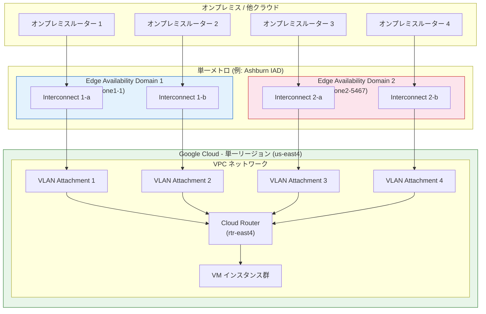

# Cloud Interconnect: Single-Region Critical Production SLA (99.99%) GA

**リリース日**: 2026-06-02

**サービス**: Cloud Interconnect

**機能**: Single-Region Critical Production SLA (99.99%) GA

**ステータス**: Generally Available (GA)

📊 [このアップデートのインフォグラフィックを見る](https://takech9203.github.io/google-cloud-news-summary/20260602-cloud-interconnect-single-region-critical-sla-ga.html)

## 概要

Google Cloud は、Cloud Interconnect における単一リージョン構成での Critical Production SLA（99.99%）の一般提供（GA）を発表しました。これまで 99.99% の可用性を達成するには、2 つの異なるメトロポリタンエリアにまたがるマルチリージョントポロジーが必須でしたが、今回のアップデートにより、単一リージョン内のトポロジーでも同等の SLA を実現できるようになりました。

この機能は Dedicated Interconnect と Cross-Cloud Interconnect の両方に対応しており、単一リージョンに集中したワークロードを持つ企業にとって、よりシンプルかつコスト効率の高い高可用性ネットワーク構成が可能になります。特に、データレジデンシー要件やレイテンシー要件により単一リージョンでの運用が求められるケースにおいて大きな価値を提供します。

対象ユーザーは、ミッションクリティカルなワークロードを単一リージョンで運用する必要があるエンタープライズ企業、金融機関、医療機関、公共機関など、高い可用性と地理的制約の両立が求められる組織です。

**アップデート前の課題**

これまで Cloud Interconnect で 99.99% の Critical Production SLA を達成するには、以下の制約がありました。

- 2 つの異なるメトロポリタンエリア（例: LGA と IAD）にまたがる接続が必須で、単一リージョンのみでは最高 SLA を達成できなかった
- マルチリージョン構成が必要なため、コロケーション施設の契約や物理接続が複数の都市に分散し、コストと運用負荷が増大していた
- データレジデンシー要件で単一リージョンに制限されるワークロードでは、99.9%（Non-critical Production）までしか SLA を得られなかった

**アップデート後の改善**

今回のアップデートにより、以下の改善が実現されました。

- 単一メトロポリタンエリア内の 4 本の Dedicated Interconnect 接続で 99.99% SLA を達成可能になった
- マルチリージョン構成が不要になり、コロケーション施設の調達がシンプル化された
- Cross-Cloud Interconnect でも単一リージョントポロジーで 99.99% SLA がサポートされ、マルチクラウド接続の高可用性が向上した

## アーキテクチャ図



単一メトロ内の 2 つの Edge Availability Domain にそれぞれ 2 本ずつ（計 4 本）の Interconnect 接続を配置し、単一リージョン内の Cloud Router に VLAN Attachment 経由で接続することで、99.99% SLA を達成するトポロジーを示しています。

## サービスアップデートの詳細

### 主要機能

1. **単一リージョン Critical Production SLA（99.99%）**
   - 単一メトロポリタンエリア内で 4 本以上の Dedicated Interconnect 接続を使用して 99.99% 可用性を実現
   - 従来のマルチリージョン要件（2 つの異なるメトロ）が不要に
   - Interconnect Connection Group の `PRODUCTION_CRITICAL` トポロジーケイパビリティとして設定

2. **Edge Availability Domain ペアリング**
   - 単一メトロ内の 2 つの異なる Edge Availability Domain（メトロ可用性ゾーン）に接続を分散
   - メンテナンスウィンドウが Edge Availability Domain 間で調整されるため、同時ダウンを回避
   - 対応するメトロのロケーションテーブルでペアの組み合わせを確認可能

3. **Cross-Cloud Interconnect 対応**
   - AWS、Azure、OCI、Alibaba Cloud への Cross-Cloud Interconnect でも単一リージョントポロジーをサポート
   - 両 Cloud Router を同一リージョンに配置し、異なる Edge Availability Domain の VLAN Attachment に接続
   - マルチクラウド環境での高可用性接続がシンプルに実現可能

## 技術仕様

### 単一リージョン 99.99% トポロジー要件

| 項目 | 要件 |
|------|------|
| Interconnect 接続数 | 最低 4 本 |
| Edge Availability Domain | 2 つ（各ドメインに最低 2 本） |
| VLAN Attachment 数 | 最低 4 つ（全て同一リージョン） |
| Cloud Router | 最低 1 つ（VLAN 配置リージョンと同一） |
| リージョン | メトロの低レイテンシーリージョンを使用 |
| Dynamic Routing Mode | Regional または Global |
| Connection Group | `PRODUCTION_CRITICAL` トポロジーケイパビリティ |
| オンプレミスルーター | 各接続に固有のルーターを推奨 |

### マルチリージョン構成との比較

| 項目 | 単一リージョン（新機能） | マルチリージョン（従来） |
|------|--------------------------|--------------------------|
| メトロ数 | 1 | 2 |
| 接続数 | 最低 4 本 | 最低 4 本（各メトロ 2 本） |
| SLA | 99.99% | 99.99% |
| リージョン数 | 1 | 2 |
| コロケーション施設 | 1 都市 | 2 都市 |
| Dynamic Routing | Regional or Global | Global 必須 |

### Connection Group 設定

```bash
# Interconnect Connection Group の作成
gcloud compute interconnects groups create example-interconnect-group \
    --intended-topology-capability PRODUCTION_CRITICAL

# 単一リージョン構成で接続を追加
gcloud compute interconnects groups create-members example-interconnect-group \
    --interconnect='name=interconnect-1-a,facility=iad-1' \
    --interconnect='name=interconnect-1-b,facility=iad-1' \
    --interconnect='name=interconnect-2-a,facility=iad-5467' \
    --interconnect='name=interconnect-2-b,facility=iad-5467' \
    --customer-name=example.com \
    --noc-contact-email=user@example.com \
    --description="Single-Region 99.99% Topology" \
    --intent-mismatch-behavior=REJECT \
    --interconnect-type=DEDICATED \
    --link-type=LINK_TYPE_ETHERNET_100G_LR
```

## 設定方法

### 前提条件

1. Google Cloud プロジェクトで Compute Engine API が有効であること
2. 必要な IAM 権限（`roles/compute.networkAdmin` または同等の権限）を持つこと
3. 対応メトロのコロケーション施設との契約があること
4. VPC ネットワークが作成済みであること

### 手順

#### ステップ 1: Interconnect Connection Group の作成

```bash
# Connection Group を作成（Production Critical を指定）
gcloud compute interconnects groups create my-interconnect-group \
    --intended-topology-capability PRODUCTION_CRITICAL
```

Connection Group を使用することで、構成がSLA 要件を満たしているかどうかのフィードバックを受け取ることができます。

#### ステップ 2: Dedicated Interconnect 接続の注文

```bash
# Google Cloud Console で注文
# 1. Cloud Interconnect > 物理接続のセットアップ
# 2. Dedicated Interconnect を選択
# 3. Production SLA: Production critical (maximum resiliency) を選択
# 4. Topology type: Single region を選択
# 5. 既存の Interconnect Group を選択
# 6. メトロポリタンエリアを選択
# 7. 4 本の接続を 2 つの Edge Availability Domain に分散して追加
```

Console から注文後、Google Cloud がポートを割り当て、LOA-CFA を送付します。

#### ステップ 3: Cloud Router の作成

```bash
# 低レイテンシーリージョンに Cloud Router を作成
gcloud compute routers create rtr-east4 \
    --asn 64513 \
    --network vpc1 \
    --region us-east4
```

メトロに対応する低レイテンシーリージョンに Cloud Router を作成します。

#### ステップ 4: VLAN Attachment の作成

```bash
# 各 Interconnect 接続に対して VLAN Attachment を作成
gcloud compute interconnects attachments dedicated create attachment-1 \
    --interconnect interconnect-1-a \
    --router rtr-east4 \
    --region us-east4

gcloud compute interconnects attachments dedicated create attachment-2 \
    --interconnect interconnect-1-b \
    --router rtr-east4 \
    --region us-east4

gcloud compute interconnects attachments dedicated create attachment-3 \
    --interconnect interconnect-2-a \
    --router rtr-east4 \
    --region us-east4

gcloud compute interconnects attachments dedicated create attachment-4 \
    --interconnect interconnect-2-b \
    --router rtr-east4 \
    --region us-east4
```

4 つの VLAN Attachment を全て同一リージョンに配置し、それぞれ固有の Interconnect 接続に接続します。

#### ステップ 5: BGP セッションの構成

```bash
# 各 VLAN Attachment に対して BGP ピアを追加
gcloud compute routers add-bgp-peer rtr-east4 \
    --peer-name peer-1 \
    --interface if-attachment-1 \
    --peer-ip-address 169.254.0.2 \
    --peer-asn 65001 \
    --region us-east4
```

オンプレミスルーターで対応する BGP セッションを構成し、同じプレフィックスを全てのセッションでアドバタイズします。

## メリット

### ビジネス面

- **コスト削減**: 2 都市にまたがるコロケーション施設の契約が不要になり、物理インフラのコストを大幅に削減
- **コンプライアンス対応**: データレジデンシー要件のある地域でも最高レベルの SLA を取得可能
- **運用簡素化**: 単一都市での物理接続管理により、運用チームの負荷が軽減
- **ベンダー交渉の簡素化**: 1 つのコロケーション施設プロバイダーとの契約で済む可能性

### 技術面

- **低レイテンシー**: 単一リージョン内の通信のため、リージョン間通信に伴うレイテンシーが発生しない
- **Dynamic Routing の柔軟性**: Regional または Global の Dynamic Routing Mode を選択可能（マルチリージョンでは Global 必須）
- **トポロジー検証**: Connection Group によるSLA 準拠の自動検証機能
- **ECMP によるトラフィック分散**: 冗長パスを活用した等コストマルチパスルーティングでトラフィックを効率的に分散

## デメリット・制約事項

### 制限事項

- 対応メトロが限定されている（全てのメトロで利用可能ではなく、サポートされるメトロのロケーションテーブルで確認が必要）
- 最低 4 本の Dedicated Interconnect 接続が必要（Non-critical の 2 本より初期コストが高い）
- VLAN Attachment の配置リージョンは、メトロの低レイテンシーリージョンに限定される
- 単一メトロ全体が被災した場合（大規模自然災害など）は保護されない

### 考慮すべき点

- メトロレベルの障害に対する保護が必要な場合は、従来のマルチリージョン構成を検討すべき
- 各 Interconnect 接続に対して、使用容量の 50% 以下に抑えることがベストプラクティス（フェイルオーバー時の帯域確保）
- オンプレミスルーターは各接続に固有のものを推奨（共有ルーターは単一障害点になり得る）
- Connection Group の `intent-mismatch-behavior` を `REJECT` に設定することで、SLA 要件を満たさない変更を防止可能

## ユースケース

### ユースケース 1: 金融機関のリアルタイム取引システム

**シナリオ**: 東京リージョンにトレーディングシステムを展開する金融機関が、オンプレミスのデータセンターと Google Cloud 間で超低レイテンシーかつ 99.99% 可用性の接続を必要としている。データレジデンシー要件により、日本国外へのデータ転送は不可。

**実装例**:
```bash
# 東京メトロ内で 4 本の Dedicated Interconnect を構成
gcloud compute interconnects groups create trading-interconnect-group \
    --intended-topology-capability PRODUCTION_CRITICAL

# asia-northeast1 リージョンに Cloud Router と VLAN Attachment を配置
gcloud compute routers create rtr-tokyo \
    --asn 64513 \
    --network trading-vpc \
    --region asia-northeast1
```

**効果**: 単一メトロ内で最高レベルの SLA を確保しながら、データ主権要件を満たし、リージョン間通信のレイテンシーを排除

### ユースケース 2: マルチクラウド環境での Cross-Cloud Interconnect

**シナリオ**: AWS と Google Cloud を併用するエンタープライズ企業が、両クラウド間の接続に 99.99% の可用性を求めている。ワークロードは単一リージョンに集約されており、地理的分散の必要がない。

**効果**: Cross-Cloud Interconnect の単一リージョントポロジーにより、マルチクラウド間で最高レベルの SLA を確保。従来必要だった 2 つのメトロにまたがる構成が不要になり、接続コストと管理負荷を大幅に削減

### ユースケース 3: 医療データプラットフォーム

**シナリオ**: 病院グループが電子カルテシステムのバックエンドを Google Cloud に移行。患者データは特定の地域外に出せないレギュレーションがあり、かつ 24/365 の高可用性が必須。

**効果**: 単一リージョン内で 99.99% SLA を達成し、医療データのコンプライアンス要件（HIPAA、地域の医療データ保護法）と可用性要件を同時に充足

## 料金

Cloud Interconnect の料金は、ポート料金、VLAN Attachment 料金、およびデータ転送料金で構成されます。単一リージョン 99.99% トポロジーでは最低 4 本の接続が必要です。

### 料金例

| 構成要素 | 月額料金 (概算) |
|----------|-----------------|
| 10 Gbps Dedicated Interconnect ポート x 4 | $6,840 ($1,710/ポート x 4) |
| VLAN Attachment (10 Gbps) x 4 | $600 ($150/attachment x 4) |
| エグレスデータ転送 (10 TB/月) | Interconnect 経由は通常のインターネット経由より低い料金が適用 |
| **合計（データ転送を除くインフラ費用）** | **約 $7,440/月** |

注: 実際の料金はリージョン、容量、契約形態により異なります。固定料金プラン（Fixed Pricing）を利用するとエグレス料金を予測可能にできます。最新の正確な料金は [Cloud Interconnect 料金ページ](https://cloud.google.com/network-connectivity/pricing#interconnect-pricing) を参照してください。

## 利用可能リージョン

単一リージョン 99.99% SLA は、対応する Edge Availability Domain ペアが存在するメトロで利用可能です。主な対応メトロには以下が含まれます（完全なリストはロケーションテーブルを参照）:

- **北米**: Ashburn (IAD)、その他対応メトロ
- **ヨーロッパ**: 対応メトロ（ロケーションテーブルで確認）
- **アジア太平洋**: 対応メトロ（ロケーションテーブルで確認）

Cross-Cloud Interconnect の場合、各クラウドプロバイダーごとにサポートされるロケーションが異なります:
- AWS: [サポートされるロケーション](https://docs.cloud.google.com/network-connectivity/docs/interconnect/how-to/cci/aws/choose-locations#supported-locations)
- Azure: [サポートされるロケーション](https://docs.cloud.google.com/network-connectivity/docs/interconnect/how-to/cci/azure/choose-locations#supported-locations)
- OCI: [サポートされるロケーション](https://docs.cloud.google.com/network-connectivity/docs/interconnect/how-to/cci/oci/choose-locations#supported-locations)
- Alibaba Cloud: [サポートされるロケーション](https://docs.cloud.google.com/network-connectivity/docs/interconnect/how-to/cci/alibaba/choose-locations#supported-locations)

## 関連サービス・機能

- **Cloud Router**: VLAN Attachment と BGP セッションを管理し、動的ルートを学習・アドバタイズする
- **Network Connectivity Center**: サイト間データ転送やハブアンドスポーク型のネットワークトポロジーを管理
- **HA VPN over Cloud Interconnect**: Interconnect 上に暗号化された VPN トンネルを確立し、トランジット中のデータを保護
- **Cross-Cloud Interconnect**: AWS、Azure、OCI、Alibaba Cloud との直接接続を Google マネージドで提供
- **Interconnect Connection Group**: 接続のグループ化と SLA 準拠の自動検証を実現

## 参考リンク

- 📊 [インフォグラフィック](https://takech9203.github.io/google-cloud-news-summary/20260602-cloud-interconnect-single-region-critical-sla-ga.html)
- [公式リリースノート](https://docs.cloud.google.com/release-notes#June_02_2026)
- [Establish 99.99% availability for Dedicated Interconnect](https://docs.cloud.google.com/network-connectivity/docs/interconnect/tutorials/dedicated-creating-9999-availability)
- [Cross-Cloud Interconnect overview](https://docs.cloud.google.com/network-connectivity/docs/interconnect/concepts/cci-overview)
- [Cloud Interconnect SLA](https://cloud.google.com/network-connectivity/docs/interconnect/sla)
- [料金ページ](https://cloud.google.com/network-connectivity/pricing#interconnect-pricing)
- [コロケーション施設の選択](https://docs.cloud.google.com/network-connectivity/docs/interconnect/concepts/choosing-colocation-facilities)

## まとめ

Cloud Interconnect の単一リージョン Critical Production SLA（99.99%）の GA は、データレジデンシー要件や地理的制約のある組織にとって待望のアップデートです。従来マルチリージョン構成でしか達成できなかった最高レベルの可用性が、単一メトロ内の構成で実現可能になったことで、コスト削減・運用簡素化・コンプライアンス対応の全てを同時に達成できます。ミッションクリティカルなワークロードを単一リージョンで運用する組織は、ロケーションテーブルで対応メトロを確認し、Connection Group を活用したトポロジー構成を検討することを推奨します。

---

**タグ**: #CloudInterconnect #DedicatedInterconnect #CrossCloudInterconnect #SLA #HighAvailability #NetworkConnectivity #SingleRegion #GA #Multicloud #Hybrid
