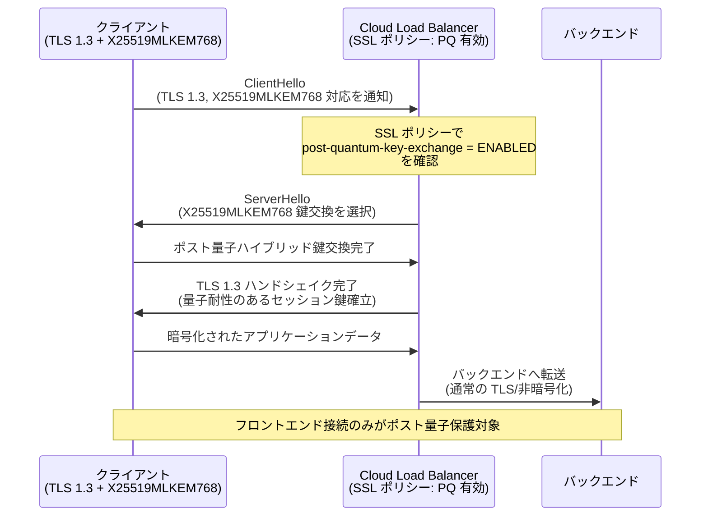

# Cloud Load Balancing: ポスト量子鍵交換 (Post-Quantum Key Exchange) サポート

**リリース日**: 2026-06-02

**サービス**: Cloud Load Balancing

**機能**: TLS ポスト量子鍵交換 (X25519MLKEM768)

**ステータス**: GA (一般提供)

[このアップデートのインフォグラフィックを見る](https://takech9203.github.io/google-cloud-news-summary/infographic/20260602-cloud-load-balancing-post-quantum-tls.html)

## 概要

Google Cloud は、Application Load Balancer および外部プロキシ Network Load Balancer において、TLS ポスト量子鍵交換のサポートを開始しました。これにより、量子コンピュータによる将来的な暗号解読リスク、特に「Harvest Now, Decrypt Later (今収集して、後で復号する)」攻撃からトラフィックを保護することが可能になります。

Google は、TLS で使用される非対称暗号が、現在の研究の進展ペースが続けば「早ければ 2029 年にも量子コンピュータによって破られる可能性がある」と推定しています。本機能は、クライアントとロードバランサ間のフロントエンド TLS 接続において、ハイブリッド鍵交換方式 X25519MLKEM768 を使用することで、古典的暗号とポスト量子暗号の両方によるセキュリティを提供します。

この機能は SSL ポリシーの `post-quantum-key-exchange` 設定を通じて有効化でき、TLS 1.3 と X25519MLKEM768 をサポートするクライアントとの接続時に自動的にポスト量子鍵交換が適用されます。サポートしていないクライアントからの接続には影響を与えません。

**アップデート前の課題**

- TLS 通信において、量子コンピュータの将来的な脅威に対する防御手段がロードバランサレベルで提供されていなかった
- 「Harvest Now, Decrypt Later」攻撃により、現在記録された暗号化トラフィックが将来の量子コンピュータで復号されるリスクがあった
- Perfect Forward Secrecy (ECDHE) を使用していても、量子コンピュータによる鍵交換アルゴリズムの解読には対応できなかった

**アップデート後の改善**

- SSL ポリシーの設定一つでポスト量子鍵交換を有効化でき、即座に「Harvest Now, Decrypt Later」攻撃からの保護を開始可能
- ハイブリッド方式 (X25519MLKEM768) により、古典的暗号とポスト量子暗号の両方でセキュリティを確保
- 段階的ロールアウトにより、互換性の問題がある場合でも猶予期間を確保して対応可能

## アーキテクチャ図



クライアントが TLS 1.3 と X25519MLKEM768 をサポートしている場合、ロードバランサはポスト量子ハイブリッド鍵交換を使用してセッション鍵を確立します。ポスト量子保護はフロントエンド接続 (クライアントとロードバランサ間) にのみ適用されます。

## サービスアップデートの詳細

### 主要機能

1. **X25519MLKEM768 ハイブリッド鍵交換**
   - 古典的暗号 (X25519) とポスト量子暗号 (MLKEM768) を組み合わせたハイブリッド方式
   - NIST が開発・検証したアルゴリズムに基づき、IETF で策定中の TLS 標準に準拠
   - いずれか一方のアルゴリズムが破られても、もう一方が保護を維持

2. **SSL ポリシーによる制御**
   - `post-quantum-key-exchange` 設定で 3 つのモードを選択可能: `ENABLED`、`DEFAULT`、`DEFERRED`
   - 既存の SSL ポリシープロファイル (COMPATIBLE, MODERN, RESTRICTED, CUSTOM, FIPS_202205) すべてと組み合わせ可能
   - 任意の最小 TLS バージョン設定と併用可能

3. **段階的ロールアウト計画**
   - Phase 1 (2026年10月まで): デフォルト無効、オプトインで有効化
   - Phase 2 (2026年10月～2027年10月): デフォルト有効、`DEFERRED` で延期可能
   - Phase 3 (2027年10月以降): 常時有効、延期オプションなし

4. **後方互換性の確保**
   - TLS 1.3 や X25519MLKEM768 をサポートしないクライアントからの接続は影響を受けない
   - 既存のロードバランサ接続は中断されない

## 技術仕様

### サポートされるロードバランサ

| ロードバランサ種別 | SSL ポリシースコープ |
|------|------|
| グローバル外部 Application Load Balancer | グローバル |
| Classic Application Load Balancer | グローバル |
| リージョン外部 Application Load Balancer | リージョン |
| クロスリージョン内部 Application Load Balancer | グローバル |
| リージョン内部 Application Load Balancer | リージョン |
| グローバル外部プロキシ Network Load Balancer | グローバル |
| Classic プロキシ Network Load Balancer | グローバル |

### ポスト量子鍵交換モード

| モード | 動作 | 推奨ケース |
|------|------|------|
| `ENABLED` | X25519MLKEM768 鍵交換を即座に有効化 | 即座に保護を開始したい場合 (推奨) |
| `DEFAULT` | 2026年10月まで無効、以降有効 | SSL ポリシー未設定時のデフォルト動作 |
| `DEFERRED` | 2027年10月まで無効、以降有効 | 互換性の問題がある場合の猶予措置 |

### 量子コンピュータが TLS に与える脅威

| 脅威の種類 | 対象 | ポスト量子鍵交換で対応 |
|------|------|------|
| 鍵交換への攻撃 | セッション鍵の解読、過去のトラフィック復号 | 対応可能 |
| 認証への攻撃 | 証明書の偽造、中間者攻撃 | 対象外 (別途対応必要) |
| 対称暗号への攻撃 | AES, ChaCha20 | 脅威なし |

## 設定方法

### 前提条件

1. Cloud Load Balancing が設定済みであること (対象のロードバランサ種別であること)
2. TargetHttpsProxy または TargetSslProxy が構成済みであること
3. 適切な IAM 権限 (`compute.sslPolicies.create`, `compute.sslPolicies.update`) を持っていること

### 手順

#### ステップ 1: SSL ポリシーの作成 (グローバル)

```bash
gcloud compute ssl-policies create my-pq-ssl-policy \
  --profile MODERN \
  --min-tls-version 1.2 \
  --post-quantum-key-exchange ENABLED
```

ポスト量子鍵交換を `ENABLED` に設定した新しい SSL ポリシーを作成します。プロファイルは COMPATIBLE, MODERN, RESTRICTED, CUSTOM, FIPS_202205 のいずれかを選択可能です。

#### ステップ 2: SSL ポリシーの作成 (リージョン)

```bash
gcloud compute ssl-policies create my-pq-ssl-policy \
  --profile MODERN \
  --min-tls-version 1.2 \
  --region asia-northeast1 \
  --post-quantum-key-exchange ENABLED
```

リージョン Application Load Balancer を使用している場合は、`--region` フラグを指定します。

#### ステップ 3: 既存の SSL ポリシーの更新

```bash
gcloud compute ssl-policies update my-existing-policy \
  --post-quantum-key-exchange ENABLED
```

既に SSL ポリシーがアタッチされている場合は、既存ポリシーを更新してポスト量子鍵交換を有効化できます。

#### ステップ 4: SSL ポリシーをターゲットプロキシにアタッチ

```bash
gcloud compute target-https-proxies update my-https-proxy \
  --ssl-policy my-pq-ssl-policy
```

作成した SSL ポリシーをターゲット HTTPS プロキシに関連付けます。

## メリット

### ビジネス面

- **長期的なデータ保護**: 現在の通信を将来の量子コンピュータによる解読から保護し、規制遵守やデータ機密性を維持
- **リスクの先行的軽減**: 「Harvest Now, Decrypt Later」攻撃に対する防御を今すぐ開始でき、セキュリティ投資の先行メリットを享受
- **追加コスト不要**: SSL ポリシーの設定変更のみで有効化でき、追加料金なしでポスト量子セキュリティを実現

### 技術面

- **ハイブリッドセキュリティ**: 古典暗号とポスト量子暗号の組み合わせにより、どちらか一方が破られても保護が維持される
- **透過的な後方互換性**: TLS 1.3/X25519MLKEM768 未対応クライアントは従来通り接続可能で、既存システムへの影響なし
- **NIST/IETF 標準準拠**: 業界標準のアルゴリズムと標準に基づいており、相互運用性を確保
- **段階的移行パス**: 3 フェーズのロールアウトにより、互換性問題の解決に十分な時間を確保

## デメリット・制約事項

### 制限事項

- フロントエンド接続 (クライアントとロードバランサ間) のみが対象。バックエンド接続にはポスト量子保護は適用されない
- クライアントが TLS 1.3 と X25519MLKEM768 の両方をサポートしている必要がある
- 認証 (証明書) に対する量子コンピュータの攻撃にはこの機能では対応できない

### 考慮すべき点

- ポスト量子鍵交換により、TLS ハンドシェイクのデータサイズが増加する可能性がある (MLKEM768 の公開鍵・暗号文のサイズ)
- 一部の古いクライアントやプロキシが X25519MLKEM768 を含む ClientHello を正しく処理できない可能性がある
- 2027年10月以降はオプトアウトができなくなるため、それまでに互換性の問題を解決する必要がある
- 内部パススルー Network Load Balancer や外部パススルー Network Load Balancer は対象外

## ユースケース

### ユースケース 1: 金融機関のデータ保護

**シナリオ**: 銀行や証券会社が、顧客の金融取引データを長期的に保護する必要がある。量子コンピュータの実用化後に過去の取引情報が復号されるリスクを排除したい。

**実装例**:
```bash
# 金融機関向け: 最高セキュリティプロファイルでPQ有効化
gcloud compute ssl-policies create finance-pq-policy \
  --profile RESTRICTED \
  --min-tls-version 1.2 \
  --post-quantum-key-exchange ENABLED

gcloud compute target-https-proxies update banking-proxy \
  --ssl-policy finance-pq-policy
```

**効果**: 顧客の金融データが将来の量子コンピュータによる解読から保護され、PCI DSS や金融規制への準拠を強化。

### ユースケース 2: 医療・ヘルスケアデータの保護

**シナリオ**: 医療機関が患者の電子カルテや遺伝子情報を扱うシステムにおいて、長期間にわたる機密保護を確保したい。

**効果**: HIPAA 準拠を強化し、患者データの長期的な機密性を確保。遺伝子情報のような数十年間にわたり価値を持つデータを量子コンピュータの脅威から保護。

### ユースケース 3: 政府・防衛関連システム

**シナリオ**: 政府機関が機密情報を扱うクラウドシステムにおいて、国家レベルの脅威アクターによる「Harvest Now, Decrypt Later」攻撃に備える必要がある。

**効果**: 国家安全保障レベルの通信を量子時代に備えて保護し、NIST のポスト量子暗号移行ガイドラインに準拠。

## 料金

ポスト量子鍵交換の有効化に追加料金は発生しません。通常の Cloud Load Balancing の料金体系が適用されます。

### 料金例 (Cloud Load Balancing 標準料金)

| 項目 | 料金 |
|--------|-----------------|
| 転送ルール (1 時間あたり) | $0.025 |
| 処理データ (1 GB あたり) | $0.008 - $0.012 |
| ポスト量子鍵交換の有効化 | 追加料金なし |

※ SSL ポリシーの作成・変更自体には追加料金は発生しません。ポスト量子鍵交換機能も追加課金なしで利用可能です。

## 利用可能リージョン

- **グローバルロードバランサ**: すべてのリージョンで利用可能 (Google のグローバルフロントエンドで処理)
- **リージョンロードバランサ**: SSL ポリシーがサポートされているすべてのリージョンで利用可能

本機能はフロントエンドの TLS 処理に関するものであり、ロードバランサがデプロイされているすべてのロケーションで有効です。

## 関連サービス・機能

- **Certificate Manager**: TLS 証明書の管理。ポスト量子鍵交換と組み合わせて使用
- **Cloud Armor**: DDoS 保護と WAF。ロードバランサのセキュリティレイヤーとして併用
- **SSL ポリシー**: TLS バージョンや暗号スイートの制御。ポスト量子鍵交換はこの設定の一部
- **Backend mTLS**: バックエンド接続の相互認証。フロントエンドのポスト量子保護と補完的に使用
- **VPC Service Controls**: データ境界の保護。通信暗号化と組み合わせた多層防御

## 参考リンク

- [インフォグラフィック](https://takech9203.github.io/google-cloud-news-summary/infographic/20260602-cloud-load-balancing-post-quantum-tls.html)
- [公式リリースノート](https://docs.cloud.google.com/release-notes#June_02_2026)
- [ポスト量子 TLS ドキュメント](https://docs.cloud.google.com/load-balancing/docs/post-quantum-tls#post-quantum-key-exchange)
- [SSL ポリシーの概念](https://docs.cloud.google.com/load-balancing/docs/ssl-policies-concepts)
- [SSL ポリシーの使用方法](https://docs.cloud.google.com/load-balancing/docs/use-ssl-policies)
- [Google Cloud のポスト量子暗号](https://cloud.google.com/security/resources/post-quantum-cryptography)
- [料金ページ](https://cloud.google.com/vpc/network-pricing#cloud-load-balancing)

## まとめ

Cloud Load Balancing におけるポスト量子鍵交換サポートは、量子コンピュータ時代に向けた重要なセキュリティ強化です。「Harvest Now, Decrypt Later」攻撃から現在のトラフィックを保護するため、特に長期的なデータ機密性が求められる組織は、SSL ポリシーで `post-quantum-key-exchange` を `ENABLED` に設定し、即座にポスト量子保護を有効化することを強く推奨します。追加コストなしで利用可能であり、互換性のあるクライアントのみに適用されるため、既存システムへの影響なく導入できます。

---

**タグ**: #CloudLoadBalancing #PostQuantum #TLS #X25519MLKEM768 #Security #SSL #QuantumComputing #HarvestNowDecryptLater #Encryption
