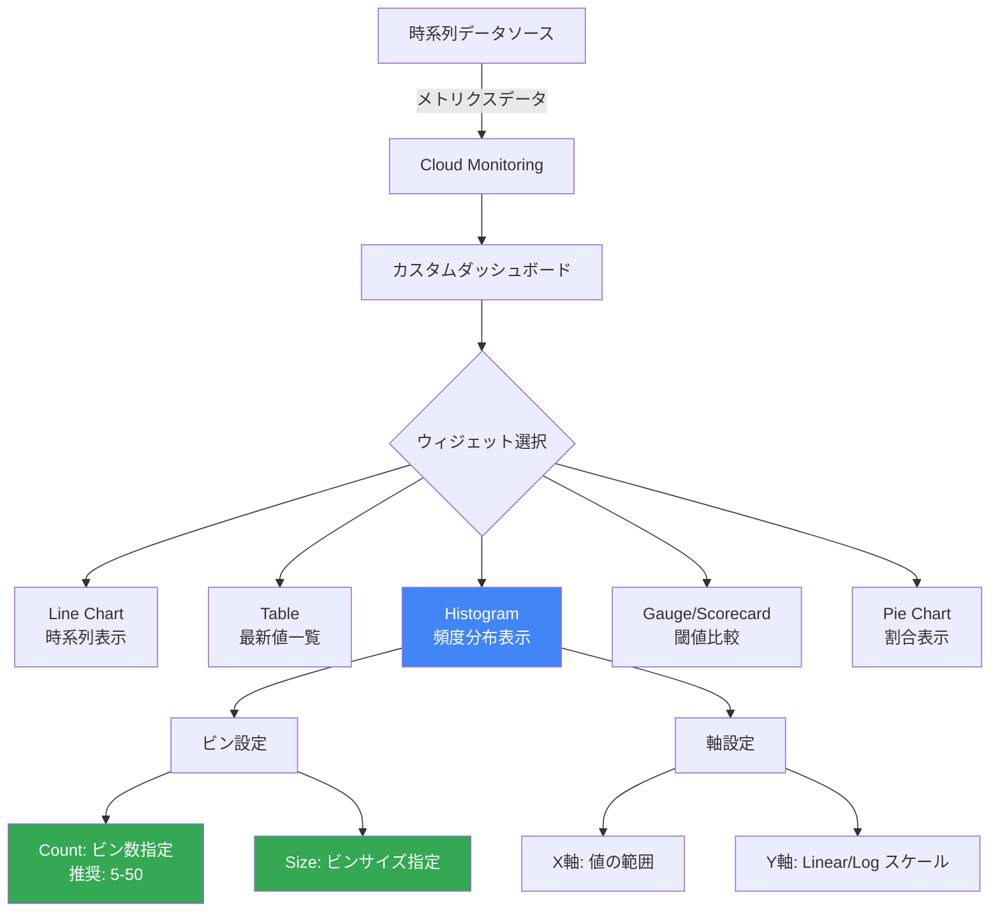

# Cloud Monitoring: カスタムダッシュボードの Histogram ウィジェットが一般提供開始

**リリース日**: 2026-06-02

**サービス**: Cloud Monitoring

**機能**: カスタムダッシュボードでの Histogram ウィジェットサポート

**ステータス**: GA（一般提供）

📊 [このアップデートのインフォグラフィックを見る](https://takech9203.github.io/google-cloud-news-summary/infographic/20260602-cloud-monitoring-histogram-widgets-ga.html)

## 概要

Google Cloud は、Cloud Monitoring のカスタムダッシュボードにおける Histogram ウィジェットのサポートを一般提供（GA）として発表しました。この機能により、複数の時系列データの最新値を範囲（ビン）にグループ化し、値の相対的な頻度分布をグラフィカルに表現できるようになります。

Histogram ウィジェットは、テーブルやスコアカードなど単純に最新値を表示するウィジェットとは異なり、値がどの範囲に集中しているかを視覚的に把握できる点が特徴です。これにより、インフラストラクチャやアプリケーションのパフォーマンス分布を一目で理解し、異常値やパターンの特定が容易になります。

この機能は、Google Cloud コンソールでの GUI 操作と Cloud Monitoring API の両方から利用可能で、既存のカスタムダッシュボードに追加することができます。SRE チーム、インフラ管理者、アプリケーション開発者にとって、モニタリングの可視化オプションが大幅に強化されます。

**アップデート前の課題**

- 最新値の表示にはテーブル、ゲージ、スコアカードなどのウィジェットしか利用できず、値の分布状況を把握するのが困難だった
- 複数の時系列データの値がどの範囲に集中しているかを視覚的に確認するには、外部ツールやカスタムスクリプトが必要だった
- Histogram ウィジェットはプレビュー段階であり、本番環境での使用には SLA が適用されなかった

**アップデート後の改善**

- Histogram ウィジェットが GA となり、SLA の対象として本番環境で安心して利用可能に
- 値の相対頻度分布をダッシュボード上で直接可視化でき、パフォーマンスの分布パターンを即座に把握可能に
- ビンのサイズや数、軸の範囲・スケールなどの詳細なカスタマイズが可能に
- Cloud Monitoring API を通じたプログラマティックな構成にも対応

## アーキテクチャ図



この図は、Cloud Monitoring のカスタムダッシュボードにおける Histogram ウィジェットの位置付けと設定オプションを示しています。時系列データが Cloud Monitoring に取り込まれた後、ダッシュボード上で様々な可視化形式を選択でき、Histogram はその中でも分布パターンの把握に特化したウィジェットです。

## サービスアップデートの詳細

### 主要機能

1. **Histogram ウィジェットによる分布可視化**
   - 各時系列から最新の値を抽出し、指定した範囲（ビン）にグループ化
   - X 軸がビン（値の範囲）、Y 軸が該当する時系列の数（カウント）を表示
   - 値の相対的な頻度分布を直感的に把握可能

2. **柔軟なビン設定**
   - ビン数指定（Count）: 推奨値は 5〜50、最大 1000 ビンまでサポート
   - ビンサイズ指定（Size）: 各ビンの幅を数値で指定可能
   - デフォルト設定ではデータに基づいて自動的にビンが決定

3. **軸のカスタマイズ**
   - X 軸の最小値・最大値を指定可能
   - Y 軸のスケーリングとして Linear（線形）または Logarithmic（対数）を選択可能

4. **API による構成サポート**
   - Cloud Monitoring API の `XyChart` 構造を使用して Histogram を構成
   - `DataSet.plotType` を `STACKED_BAR` に設定
   - `DataSet.dimensions` 配列で `column` を `metric_value` に指定
   - `xMin`、`xMax`、`maxBinCount`、`numericBinSize` による詳細制御

## 技術仕様

### Histogram ウィジェットの構成パラメータ

| 項目 | 詳細 |
|------|------|
| ウィジェットタイプ | XyChart（Histogram モード） |
| plotType | `STACKED_BAR` |
| dimensions.column | `metric_value` |
| ビン数 | 5〜50 推奨、最大 1000 |
| X 軸範囲 | `xMin`、`xMax` で指定可能 |
| Y 軸スケール | `LINEAR` または `LOG`（対数） |
| 対応メトリクスタイプ | 数値型の全メトリクスタイプ |

### API を使用した Histogram ウィジェットの構成

```json
{
  "displayName": "Histogram Dashboard Example",
  "mosaicLayout": {
    "columns": 48,
    "tiles": [
      {
        "height": 16,
        "width": 24,
        "widget": {
          "title": "VM Instance - CPU utilization [MEAN]",
          "xyChart": {
            "chartOptions": {
              "displayHorizontal": false,
              "mode": "COLOR"
            },
            "dataSets": [
              {
                "dimensions": [
                  {
                    "column": "metric_value"
                  }
                ],
                "minAlignmentPeriod": "60s",
                "plotType": "STACKED_BAR",
                "targetAxis": "Y1",
                "timeSeriesQuery": {
                  "timeSeriesFilter": {
                    "aggregation": {
                      "alignmentPeriod": "60s",
                      "groupByFields": [],
                      "perSeriesAligner": "ALIGN_MEAN"
                    },
                    "filter": "metric.type=\"compute.googleapis.com/instance/cpu/utilization\" resource.type=\"gce_instance\""
                  }
                }
              }
            ],
            "yAxis": {
              "scale": "LINEAR"
            }
          }
        }
      }
    ]
  }
}
```

### ビンサイズ詳細制御の設定例

```json
{
  "dimensions": [
    {
      "column": "metric_value",
      "xMin": 0,
      "xMax": 1.0,
      "maxBinCount": 20
    }
  ]
}
```

## 設定方法

### 前提条件

1. Google Cloud プロジェクトで Cloud Monitoring が有効であること
2. `roles/monitoring.editor`（Monitoring 編集者）ロールが付与されていること
3. カスタムダッシュボードが作成済み、または新規作成の権限があること

### 手順

#### ステップ 1: Google Cloud コンソールでダッシュボードを開く

Google Cloud コンソールの Monitoring セクションからカスタムダッシュボードを開き、編集モードにします。

```
Navigation: Monitoring > Dashboards > [対象ダッシュボード] > Edit
```

#### ステップ 2: Histogram ウィジェットを追加

「Add widget」をクリックし、ウィジェットタイプから「Histogram」を選択します。

#### ステップ 3: メトリクスを選択

表示したいメトリクスタイプを選択します。デフォルトのビン設定で Histogram が表示されます。

#### ステップ 4: ビン設定のカスタマイズ（オプション）

```
Histogram bins > Count: ビン数を入力（推奨: 5-50）
Histogram bins > Size: ビンのサイズを入力
X-axis range: X 軸の最小値・最大値を設定
Y-axis scale: Linear または Logarithmic を選択
```

#### ステップ 5: API を使用した構成（代替方法）

```bash
# gcloud CLI を使用してダッシュボードを作成
gcloud monitoring dashboards create --config-from-file=dashboard.json
```

#### ステップ 6: 設定を保存

「Apply」をクリックしてウィジェットの変更を適用し、「Save」でダッシュボードを保存します。

## メリット

### ビジネス面

- **運用効率の向上**: パフォーマンス分布を即座に把握でき、異常の早期検出と対応時間の短縮に貢献
- **意思決定の迅速化**: インフラリソースの利用状況の分布を視覚的に把握し、スケーリングやリソース最適化の判断を迅速化
- **GA による信頼性**: SLA が適用されるため、本番環境のモニタリングに安心して利用可能

### 技術面

- **分布パターンの直感的理解**: 平均値やパーセンタイルだけでは見えない値の分布パターンを視覚化
- **柔軟なカスタマイズ**: ビン数・サイズ、軸範囲・スケールを細かく調整可能
- **API 互換性**: Infrastructure as Code（IaC）ワークフローに組み込み可能で、Terraform 等との連携も容易
- **既存ダッシュボードとの統合**: 他のウィジェット（テーブル、ゲージ、折れ線グラフ等）と同一ダッシュボード上に配置可能

## デメリット・制約事項

### 制限事項

- ダッシュボードあたりの最大ウィジェット数は 100 個まで
- ビン数の最大値は 1000（推奨は 5〜50）
- 最新値のみを表示するウィジェットであり、時系列の推移は表示不可（時系列表示には Line Chart を使用）
- Distribution 型の値をそのまま表示する場合は Heatmap が適切

### 考慮すべき点

- 時系列の数が少ない場合（例: 5 未満）は Histogram よりもテーブルやスコアカードの方が適切な場合がある
- ビン設定が不適切だと分布の特徴を見逃す可能性がある（ビン数が少なすぎると詳細が失われ、多すぎるとノイズが増える）
- API で構成する場合、`XyChart` の `dimensions` フィールドの正しい設定が必要

## ユースケース

### ユースケース 1: VM インスタンスの CPU 使用率分布分析

**シナリオ**: 100 台以上の VM インスタンスを運用しており、CPU 使用率の分布パターンを把握してリソースの最適化を行いたい。

**実装例**:
```json
{
  "timeSeriesFilter": {
    "filter": "metric.type=\"compute.googleapis.com/instance/cpu/utilization\" resource.type=\"gce_instance\"",
    "aggregation": {
      "alignmentPeriod": "60s",
      "perSeriesAligner": "ALIGN_MEAN"
    }
  }
}
```

**効果**: 大半の VM が低い CPU 使用率に集中している場合はオーバープロビジョニングの可能性を示し、右側に偏っている場合はスケールアップの必要性を示す。これにより、コスト最適化やキャパシティプランニングに直接活用できる。

### ユースケース 2: API レスポンスタイムの分布分析

**シナリオ**: マイクロサービスアーキテクチャにおいて、各サービスのレスポンスタイムの分布を監視し、レイテンシの異常を検出したい。

**実装例**:
```json
{
  "dimensions": [
    {
      "column": "metric_value",
      "xMin": 0,
      "xMax": 5000,
      "numericBinSize": 100
    }
  ]
}
```

**効果**: レスポンスタイムのバイモーダル分布（2 つのピーク）が見られる場合、特定の条件下でのパフォーマンス劣化を示唆し、根本原因の調査ポイントを特定できる。

### ユースケース 3: ディスク I/O パフォーマンスの監視

**シナリオ**: データベースクラスタの各ノードにおけるディスク書き込みバイト数の分布を監視し、ホットスポットの特定を行いたい。

**効果**: 特定のノードだけが極端に高い I/O を示している場合を即座に視覚化でき、データの偏りやパーティション設計の問題を早期に発見できる。

## 料金

Cloud Monitoring のカスタムダッシュボードおよび Histogram ウィジェット自体の利用には追加料金はかかりません。Cloud Monitoring の料金は、取り込むメトリクスのデータ量に基づきます。

### 料金例

| 項目 | 料金 |
|------|------|
| Google Cloud 非課金メトリクス | 無料 |
| カスタムダッシュボード作成・利用 | 無料 |
| Histogram ウィジェット利用 | 無料 |
| Cloud Monitoring API 読み取り呼び出し | 最初の 100 万時系列/請求アカウント/月は無料 |
| カスタムメトリクス・ユーザー定義メトリクス | 課金対象（詳細は料金ページ参照） |

**注意**: Histogram ウィジェットはデータの可視化機能であり、ウィジェット自体に追加コストは発生しません。ただし、表示するメトリクスデータの取り込みに対しては通常の Cloud Monitoring 料金が適用されます。

## 利用可能リージョン

Cloud Monitoring はグローバルサービスとして提供されており、Histogram ウィジェットを含むカスタムダッシュボード機能はすべてのリージョンで利用可能です。モニタリング対象のリソースがどのリージョンに配置されていても、Histogram ウィジェットでデータを可視化できます。

## 関連サービス・機能

- **Cloud Monitoring ダッシュボード**: Histogram ウィジェットを配置する基盤となるカスタムダッシュボード機能
- **Cloud Monitoring API**: プログラマティックにダッシュボードと Histogram ウィジェットを構成するための API
- **Cloud Monitoring MCP サーバー**: AI エージェントがメトリクスデータにアクセスするためのリモート MCP サーバー（2026年4月 GA）
- **Cloud Logging**: メトリクスデータと合わせてログデータも同一ダッシュボードに表示可能
- **Alerting Policies**: Histogram で可視化した分布に基づいてアラートポリシーを設定可能
- **Ops Agent**: メトリクスデータを Cloud Monitoring に送信するエージェント

## 参考リンク

- 📊 [インフォグラフィック](https://takech9203.github.io/google-cloud-news-summary/infographic/20260602-cloud-monitoring-histogram-widgets-ga.html)
- [公式リリースノート](https://docs.cloud.google.com/release-notes#June_02_2026)
- [Histogram の構成方法（Google Cloud コンソール）](https://docs.cloud.google.com/monitoring/charts#add_histogram)
- [Histogram ウィジェットを含むダッシュボードの API サンプル](https://docs.cloud.google.com/monitoring/dashboards/api-examples#dashboard_with_a_histogram_widget)
- [Cloud Monitoring の料金](https://cloud.google.com/stackdriver/pricing)
- [カスタムダッシュボードの作成と管理](https://docs.cloud.google.com/monitoring/charts/dashboards)

## まとめ

Cloud Monitoring の Histogram ウィジェットが GA となったことで、カスタムダッシュボード上でメトリクスの分布パターンを直感的に可視化できるようになりました。特に大規模なインフラを運用するチームにとって、CPU 使用率やレスポンスタイムなどの分布を一目で把握できることは、キャパシティプランニングや異常検出において大きな価値を提供します。既存のカスタムダッシュボードに Histogram ウィジェットを追加し、モニタリングの可視化を強化することを推奨します。

---

**タグ**: #CloudMonitoring #Dashboard #Histogram #Visualization #GA #Observability
