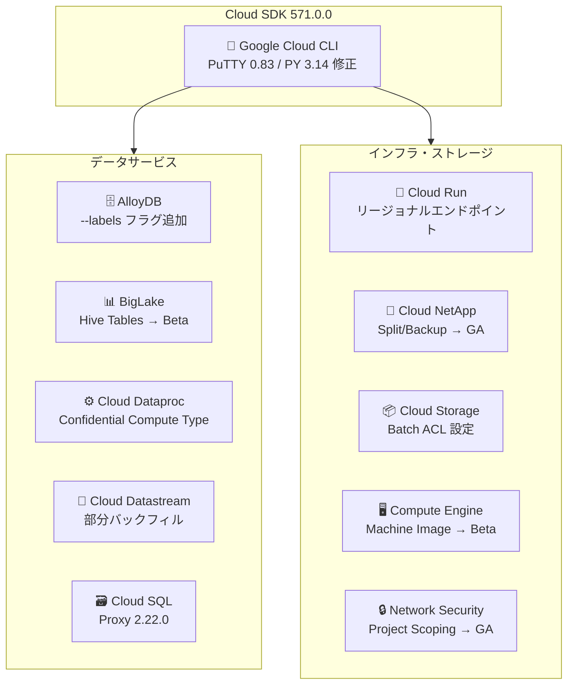

# Cloud SDK: バージョン 571.0.0 リリース

**リリース日**: 2026-06-02

**サービス**: Cloud SDK (Google Cloud CLI)

**機能**: Cloud SDK 571.0.0 - 多数のサービスにわたるアップデート

**ステータス**: GA / Beta (サービスにより異なる)

📊 [このアップデートのインフォグラフィックを見る](https://takech9203.github.io/google-cloud-news-summary/20260602-cloud-sdk-571-0-0.html)

## 概要

Cloud SDK 571.0.0 は、Google Cloud CLI の基盤改善から各種サービス固有の機能追加まで、幅広いアップデートを含むリリースである。今回のリリースでは、11 のサービスにわたる変更が行われ、セキュリティ修正、新フラグの追加、Beta から GA への昇格など多岐にわたる改善が含まれている。

特に注目すべきは、Cloud Dataproc における Confidential Computing の拡張（SEV、SEV_SNP、TDX テクノロジーの明示的指定への対応）、Cloud Datastream の部分バックフィル機能（--sql-where-clause フラグ）、および Cloud Run のリージョナルエンドポイントサポートの追加である。これらはデータセキュリティ、データ移行の柔軟性、マルチリージョンデプロイメントにおいて重要な進展をもたらす。

対象ユーザーは、Google Cloud CLI を日常的に利用するインフラエンジニア、データエンジニア、DevOps エンジニア、およびセキュリティエンジニアである。

**アップデート前の課題**

- Windows 環境での PuTTY にセキュリティ上の脆弱性が存在していた（issue 515628403）
- Python 3.14 環境で `gcloud compute scp --tunnel-through-iap` が低速だった
- Cloud Dataproc で Confidential Computing テクノロジーの種類を明示的に指定できなかった
- Cloud Datastream のバックフィルではテーブル全体を対象にする必要があり、部分的なデータ選択ができなかった
- AlloyDB インスタンス作成時にラベルを直接設定できなかった

**アップデート後の改善**

- Windows PuTTY が 0.83 に更新され、セキュリティ脆弱性が修正された
- Python 3.14 での IAP トンネル経由 SCP のパフォーマンスが改善された
- `--confidential-compute-type` フラグにより SEV、SEV_SNP、TDX を明示的に選択可能になった
- `--sql-where-clause` フラグにより部分バックフィルが可能になり、必要なデータのみを効率的に移行できるようになった
- AlloyDB インスタンス作成コマンドで `--labels` フラグが利用可能になった

## アーキテクチャ図



Cloud SDK 571.0.0 で更新された主要サービスの全体像を示す。Google Cloud CLI の基盤改善に加え、データサービスとインフラ・ストレージサービスの両方で機能拡張が行われている。

## サービスアップデートの詳細

### 主要機能

1. **Google Cloud CLI - セキュリティ修正とパフォーマンス改善**
   - Windows PuTTY を 0.83 に更新（issue 515628403 の修正）
   - Python 3.14 環境での `gcloud compute scp --tunnel-through-iap` の低速問題を修正
   - Windows 環境でのリモート接続セキュリティが強化された

2. **Cloud Dataproc - Confidential Computing タイプ指定**
   - 新しい `--confidential-compute-type` フラグの追加
   - 指定可能な値: `SEV`（AMD Secure Encrypted Virtualization）、`SEV_SNP`（AMD SEV-Secure Nested Paging）、`TDX`（Intel Trust Domain Extensions）
   - 従来の `--confidential-compute` フラグは非推奨化
   - ハードウェアベースのメモリ暗号化テクノロジーを明示的に選択可能

3. **Cloud Datastream - 部分バックフィル**
   - `start-backfill` コマンドに `--sql-where-clause` フラグを追加
   - SQL の WHERE 句を指定して、バックフィル対象データを限定可能
   - SQL ソースのみでサポート
   - 使用例: `--sql-where-clause="t.key1 = 'value1' AND t.key2 = 'value2'"`

4. **Cloud Run - リージョナルエンドポイントサポート**
   - worker-pools と jobs でリージョナルエンドポイントのサポートを追加
   - データレジデンシー要件やレイテンシ最適化に対応
   - worker-pools はバックグラウンド処理向けの Cloud Run リソース

5. **AlloyDB - ラベル管理機能**
   - インスタンス作成コマンドに `--labels` フラグを追加
   - `--update-labels`、`--remove-labels`、`--clear-labels` でラベルの更新・削除・クリアが可能
   - リソース管理やコスト配分のためのタグ付けが容易に

6. **BigLake - Hive テーブルの Beta 昇格**
   - `gcloud biglake hive tables` コマンドグループが Beta に昇格
   - BigLake を通じた Hive メタストアテーブルの管理が可能に

7. **Cloud NetApp - Split コマンドと Backup Config の GA 化**
   - ボリュームの split コマンドが GA に昇格
   - backup config コマンドが GA に昇格
   - クローンボリュームの分離やバックアップ構成の本番利用が正式サポート

8. **Cloud SQL - Proxy のアップデート**
   - cloud-sql-proxy を 2.22.0 に更新
   - TLS 1.3 による暗号化通信、IAM 認証のサポートを含む

9. **Cloud Storage - バッチ ACL 設定**
   - `batch-operations` に `--set-object-acls-from-file` フラグを追加
   - ファイルからオブジェクト ACL を一括設定可能

10. **Compute Engine - マシンイメージフラグの Beta 昇格**
    - `--source-machine-image` 関連フラグが Beta に昇格
    - マシンイメージからのインスタンス作成が Beta で利用可能

11. **Network Security - プロジェクトスコーピングの GA 化**
    - security-profiles コマンドのプロジェクトスコーピングが GA に昇格
    - セキュリティプロファイルのプロジェクト単位での管理が正式サポート

## 技術仕様

### Confidential Computing テクノロジー比較

| テクノロジー | プロバイダー | 保護レベル | ライブマイグレーション | 対応マシンタイプ |
|------|------|------|------|------|
| SEV | AMD | メモリ暗号化 | 対応 (N2D, C3D) | N2D, C2D, C3D, C4D |
| SEV_SNP | AMD | メモリ暗号化 + ページング保護 | 非対応 | N2D (Milan) |
| TDX | Intel | Trust Domain 分離 | 非対応 | c3-standard-*, a3-highgpu-1g |

### Cloud Datastream 部分バックフィルの仕様

| 項目 | 詳細 |
|------|------|
| フラグ名 | `--sql-where-clause` |
| 対応ソース | SQL ソースのみ |
| 構文 | SQL WHERE 句（WHERE キーワードなし） |
| API エンドポイント | `datastream/v1` |
| 必要権限 | `datastream.objects.startBackfillJob` |

### Cloud SDK 571.0.0 更新コンポーネント一覧

| コンポーネント | 変更内容 | ステージ |
|------|------|------|
| Google Cloud CLI | PuTTY 0.83、PY 3.14 修正 | GA |
| AlloyDB | --labels フラグ | GA |
| BigLake | hive tables | Beta |
| Cloud Dataproc | --confidential-compute-type | GA |
| Cloud Datastream | --sql-where-clause | GA |
| Cloud NetApp | split, backup config | GA |
| Cloud Run | リージョナルエンドポイント | GA |
| Cloud SQL | cloud-sql-proxy 2.22.0 | GA |
| Cloud Storage | --set-object-acls-from-file | GA |
| Compute Engine | --source-machine-image | Beta |
| Network Security | project scoping | GA |

## 設定方法

### 前提条件

1. Cloud SDK がインストール済みであること
2. 認証が完了していること (`gcloud auth login`)

### 手順

#### ステップ 1: Cloud SDK のアップデート

```bash
# Cloud SDK を最新バージョンに更新
gcloud components update

# バージョン確認
gcloud version
# Google Cloud SDK 571.0.0
```

#### ステップ 2: Cloud Dataproc で Confidential Computing を利用

```bash
# SEV を使用した Dataproc クラスタの作成
gcloud dataproc clusters create my-cluster \
  --region=us-central1 \
  --confidential-compute-type=SEV

# SEV-SNP を使用
gcloud dataproc clusters create my-secure-cluster \
  --region=us-central1 \
  --confidential-compute-type=SEV_SNP

# Intel TDX を使用
gcloud dataproc clusters create my-tdx-cluster \
  --region=us-central1 \
  --confidential-compute-type=TDX
```

#### ステップ 3: Cloud Datastream で部分バックフィルを実行

```bash
# WHERE 句を指定して部分バックフィルを開始
gcloud datastream objects start-backfill my-object \
  --stream=my-stream \
  --location=us-central1 \
  --sql-where-clause="t.created_at >= '2026-01-01'"
```

#### ステップ 4: AlloyDB インスタンスにラベルを設定

```bash
# ラベル付きでインスタンスを作成
gcloud alloydb instances create my-instance \
  --cluster=my-cluster \
  --region=us-central1 \
  --instance-type=PRIMARY \
  --cpu-count=4 \
  --labels=env=production,team=data

# 既存インスタンスのラベル更新
gcloud alloydb instances update my-instance \
  --cluster=my-cluster \
  --region=us-central1 \
  --update-labels=env=staging
```

## メリット

### ビジネス面

- **セキュリティコンプライアンスの強化**: Confidential Computing テクノロジーの明示的な選択により、業界規制やデータ保護要件への対応が容易になる
- **データ移行コストの削減**: 部分バックフィルにより、必要なデータのみを移行することで時間とコストを節約できる
- **リソース管理の効率化**: AlloyDB のラベルサポートにより、コスト配分やリソース追跡が改善される

### 技術面

- **運用の柔軟性向上**: Cloud Run のリージョナルエンドポイントにより、データレジデンシー要件への対応やレイテンシ最適化が可能
- **セキュリティの向上**: PuTTY の更新により Windows 環境での SSH 接続の脆弱性が解消された
- **本番環境の安定性**: Cloud NetApp の GA 化により、split やバックアップ構成を本番ワークロードで安心して使用可能

## デメリット・制約事項

### 制限事項

- `--sql-where-clause` による部分バックフィルは SQL ソースのみでサポート（NoSQL ソースは非対応）
- `--confidential-compute` フラグは非推奨となったため、既存スクリプトの更新が必要
- SEV_SNP は N2D マシンタイプ (AMD Milan) のみ、TDX は c3-standard マシンタイプのみで利用可能

### 考慮すべき点

- Cloud SDK のアップデート後、既存の CI/CD パイプラインで非推奨フラグを使用している場合は移行計画が必要
- Confidential Computing テクノロジーの選択は、対応するマシンタイプとリージョンに依存するため、事前に利用可能性を確認すること
- cloud-sql-proxy 2.22.0 へのアップデートにより、接続パラメータの動作が変わる可能性があるため、テスト環境での検証を推奨

## ユースケース

### ユースケース 1: 規制対応のデータ処理パイプライン

**シナリオ**: 金融機関が顧客データを処理する Dataproc クラスタを運用しており、メモリ暗号化による保護が規制上必要とされている。

**実装例**:
```bash
# Intel TDX による Trust Domain 分離を使用した Dataproc クラスタ
gcloud dataproc clusters create finance-processing \
  --region=us-central1 \
  --confidential-compute-type=TDX \
  --master-machine-type=c3-standard-8 \
  --worker-machine-type=c3-standard-8
```

**効果**: ハードウェアレベルでのメモリ暗号化により、処理中のデータが保護され、規制要件を満たしつつ高性能なデータ処理が可能となる。

### ユースケース 2: 大規模テーブルの段階的データ移行

**シナリオ**: Cloud Datastream を使用してオンプレミスの大規模テーブル（数億行）を BigQuery に移行する際、日付範囲で分割して段階的に移行したい。

**実装例**:
```bash
# 2026年1月分のデータのみバックフィル
gcloud datastream objects start-backfill orders-table \
  --stream=migration-stream \
  --location=us-central1 \
  --sql-where-clause="t.order_date >= '2026-01-01' AND t.order_date < '2026-02-01'"
```

**効果**: テーブル全体ではなく月次で分割して移行することで、ソースデータベースへの負荷を分散し、移行の進捗を管理しやすくなる。

## 料金

Cloud SDK 自体は無料で利用可能。各サービスの料金は個別のサービス料金体系に従う。

- [Cloud Dataproc 料金](https://cloud.google.com/dataproc/pricing)
- [Cloud Datastream 料金](https://cloud.google.com/datastream/pricing)
- [AlloyDB 料金](https://cloud.google.com/alloydb/pricing)
- [Cloud Run 料金](https://cloud.google.com/run/pricing)
- [Cloud SQL 料金](https://cloud.google.com/sql/pricing)

## 関連サービス・機能

- **Confidential VM**: Cloud Dataproc の Confidential Computing テクノロジーの基盤となる Compute Engine 機能。SEV、SEV-SNP、TDX をサポート
- **Cloud IAP (Identity-Aware Proxy)**: `gcloud compute scp --tunnel-through-iap` で使用される、IAP トンネル経由のセキュアな接続機能
- **Cloud SQL Auth Proxy**: cloud-sql-proxy 2.22.0 として更新された、Cloud SQL への安全な接続を提供するコネクタ
- **BigQuery**: BigLake Hive テーブルのバックエンドとして連携し、統合的なデータレイク分析を提供
- **Cloud NetApp Volumes**: ボリュームの split 操作やバックアップ構成により、エンタープライズストレージ管理を支援

## 参考リンク

- 📊 [インフォグラフィック](https://takech9203.github.io/google-cloud-news-summary/20260602-cloud-sdk-571-0-0.html)
- [公式リリースノート](https://docs.cloud.google.com/release-notes#June_02_2026)
- [Cloud SDK ドキュメント](https://cloud.google.com/sdk/docs)
- [Cloud SDK リリースノート](https://cloud.google.com/sdk/docs/release-notes)
- [Confidential VM サポート構成](https://cloud.google.com/confidential-computing/confidential-vm/docs/supported-configurations)
- [Cloud Datastream バックフィル管理](https://cloud.google.com/datastream/docs/manage-backfill-for-the-objects-of-a-stream)
- [Cloud Run Worker Pools デプロイ](https://cloud.google.com/run/docs/deploy-worker-pools)

## まとめ

Cloud SDK 571.0.0 は、セキュリティ、データ移行の柔軟性、リソース管理の改善を中心とした包括的なアップデートである。特に Cloud Dataproc の Confidential Computing タイプ指定と Cloud Datastream の部分バックフィルは、エンタープライズ環境でのセキュリティ要件対応とデータ移行効率化において大きな価値を提供する。既存の `--confidential-compute` フラグを使用しているスクリプトは、新しい `--confidential-compute-type` フラグへの移行を計画することを推奨する。

---

**タグ**: #CloudSDK #GoogleCloudCLI #Dataproc #ConfidentialComputing #Datastream #CloudRun #AlloyDB #BigLake #CloudNetApp #CloudSQL #CloudStorage #ComputeEngine #NetworkSecurity
