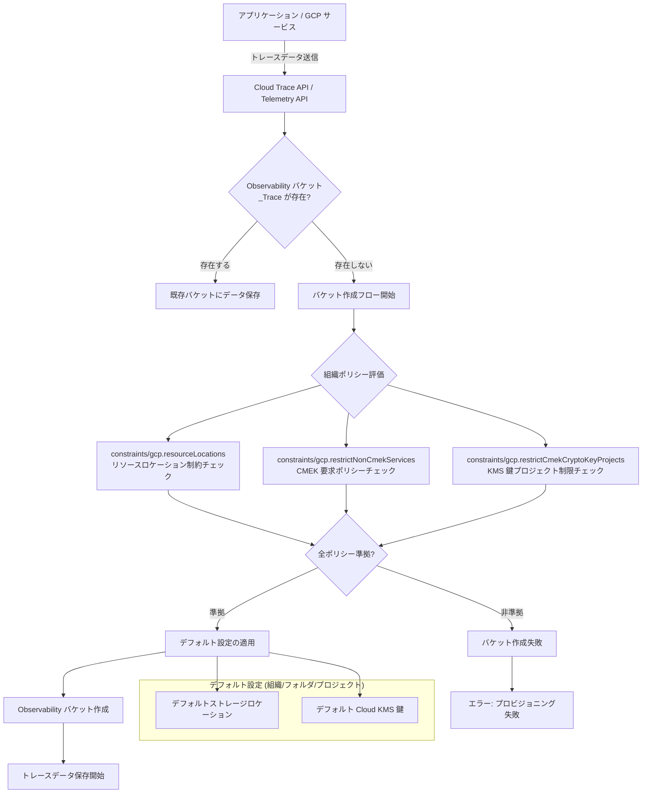

# Cloud Trace: Observability バケット作成フローにおける組織ポリシーの適用

**リリース日**: 2026-06-02

**サービス**: Cloud Trace

**機能**: Observability バケット作成時のリソースロケーション制約および CMEK ポリシーの適用

**ステータス**: GA (一般提供)

[このアップデートのインフォグラフィックを見る](https://takech9203.github.io/google-cloud-news-summary/infographic/20260602-cloud-trace-observability-bucket-org-policies.html)

## 概要

Google Cloud は、Cloud Trace の Observability バケット作成フローにおいて、組織ポリシーの適用を開始しました。具体的には、リソースロケーションに関する制約、顧客管理暗号鍵 (CMEK) の使用を要求するポリシー、および暗号鍵を保存するプロジェクトを制限するポリシーが、Observability バケットの作成時に強制されるようになりました。

Cloud Trace のトレースデータは `_Trace` という名前の Observability バケットに保存されます。このバケットはシステムによって自動的に作成されますが、今回のアップデートにより、バケット作成時に組織ポリシーが評価され、ポリシーに違反するバケットは作成されません。これにより、コンプライアンス要件やデータ主権要件を持つ組織が、トレースデータの保存場所と暗号化方式を組織全体で統一的に管理できるようになりました。

このアップデートは、規制産業（金融、医療、政府機関など）やデータレジデンシー要件を持つ企業にとって特に重要です。GDPR、HIPAA、PCI DSS などのコンプライアンス基準に対応するため、トレースデータの保存場所と暗号化を厳密に制御する必要がある組織に大きな価値を提供します。

**アップデート前の課題**

- Observability バケットの作成時に組織ポリシーが適用されず、意図しないリージョンにトレースデータが保存される可能性があった
- CMEK ポリシーを設定していても、Observability バケットには適用されなかったため、トレースデータのみ暗号化制御の対象外となっていた
- 組織全体のセキュリティポリシーとトレースデータの暗号化管理に一貫性がなかった

**アップデート後の改善**

- Observability バケット作成時に `constraints/gcp.resourceLocations` 制約が適用され、許可されたリージョンのみにデータが保存される
- `constraints/gcp.restrictNonCmekServices` ポリシーにより、CMEK を使用しない Observability バケットの作成が自動的にブロックされる
- `constraints/gcp.restrictCmekCryptoKeyProjects` ポリシーにより、承認されたプロジェクトの KMS 鍵のみが暗号化に使用される

## アーキテクチャ図



この図は、トレースデータが送信された際に Observability バケットの作成フローがどのように組織ポリシーを評価し、準拠した場合にのみバケットを作成する流れを示しています。

## サービスアップデートの詳細

### 主要機能

1. **リソースロケーション制約の適用**
   - `constraints/gcp.resourceLocations` 制約に基づき、許可されたロケーションにのみ Observability バケットが作成される
   - マルチリージョン (eu, us) および 40 以上のリージョンをサポート
   - 組織ポリシーで許可されたロケーションと Observability バケットがサポートするロケーションの交差集合から自動的に選択される

2. **CMEK ポリシーの強制**
   - `constraints/gcp.restrictNonCmekServices` Deny ポリシーにより、新規リソースへの CMEK 暗号化が強制される
   - CMEK ポリシーを設定する場合、Observability バケットのデフォルト設定で Cloud KMS 鍵を指定する必要がある
   - デフォルト設定が未構成の場合、バケットのプロビジョニングが失敗する

3. **KMS 鍵プロジェクト制限**
   - `constraints/gcp.restrictCmekCryptoKeyProjects` ポリシーにより、暗号化に使用できる KMS 鍵のプロジェクトを制限可能
   - 承認されたプロジェクトの鍵のみが Observability バケットの暗号化に使用される
   - 組織全体の鍵管理ガバナンスを実現

## 技術仕様

### 組織ポリシー制約一覧

| 制約 ID | 目的 | 適用レベル |
|---------|------|-----------|
| `constraints/gcp.resourceLocations` | リソース作成可能なロケーションを制限 | 組織、フォルダ、プロジェクト |
| `constraints/gcp.restrictNonCmekServices` | CMEK を使用しないリソース作成をブロック | 組織、フォルダ、プロジェクト |
| `constraints/gcp.restrictCmekCryptoKeyProjects` | 暗号化に使用可能な KMS 鍵プロジェクトを制限 | 組織、フォルダ、プロジェクト |

### ロケーション決定ルール

| 組織ポリシーでロケーション制限 | デフォルトストレージロケーション設定あり | バケットロケーションの決定方法 |
|------|------|------|
| なし | なし | サポートされるロケーションからシステムが選択 |
| あり | なし | 組織ポリシー許可ロケーションとサポートロケーションの交差集合から選択 |
| なし | あり | デフォルト設定のストレージロケーションを使用 |
| あり | あり | デフォルト設定のロケーションを使用 (組織ポリシーで許可されていない場合は作成失敗) |

### 必要な IAM ロール

```json
{
  "required_roles": [
    {
      "role": "roles/observability.editor",
      "purpose": "Observability バケットのデフォルト設定の表示・更新"
    },
    {
      "role": "roles/cloudkms.admin",
      "purpose": "Cloud KMS 鍵の管理および IAM ポリシー設定"
    }
  ],
  "required_permissions": [
    "observability.settings.get",
    "observability.settings.update",
    "cloudkms.cryptoKeys.getIamPolicy",
    "cloudkms.cryptoKeys.setIamPolicy"
  ]
}
```

## 設定方法

### 前提条件

1. 組織レベルのリソース管理者ロール (`roles/resourcemanager.organizationAdmin`) を持っていること
2. Cloud KMS API が有効化されていること
3. Observability バケットのデフォルト設定を構成するためのロール (`roles/observability.editor`, `roles/cloudkms.admin`) が付与されていること
4. CMEK を使用する場合、対象ロケーションに Cloud KMS キーリングと鍵が作成済みであること

### 手順

#### ステップ 1: 組織ポリシーでリソースロケーションを制限

```bash
# リソースロケーション制約を設定 (例: asia-northeast1 と us-central1 のみ許可)
gcloud resource-manager org-policies set-policy \
  --organization=ORGANIZATION_ID \
  policy.yaml
```

`policy.yaml` の内容:
```yaml
constraint: constraints/gcp.resourceLocations
listPolicy:
  allowedValues:
    - in:asia-northeast1-locations
    - in:us-central1-locations
```

#### ステップ 2: CMEK ポリシーを設定

```bash
# CMEK を要求する Deny ポリシーを作成
gcloud org-policies set-policy cmek-policy.yaml \
  --organization=ORGANIZATION_ID
```

`cmek-policy.yaml` の内容:
```yaml
constraint: constraints/gcp.restrictNonCmekServices
listPolicy:
  deniedValues:
    - observability.googleapis.com
```

#### ステップ 3: KMS 鍵プロジェクトを制限

```bash
# 暗号化に使用可能なプロジェクトを制限
gcloud org-policies set-policy kms-project-policy.yaml \
  --organization=ORGANIZATION_ID
```

`kms-project-policy.yaml` の内容:
```yaml
constraint: constraints/gcp.restrictCmekCryptoKeyProjects
listPolicy:
  allowedValues:
    - projects/my-kms-project
```

#### ステップ 4: Observability バケットのデフォルト設定を構成

```bash
# デフォルト KMS 鍵を設定 (組織レベル、asia-northeast1)
gcloud beta observability settings update \
  --organization=ORGANIZATION_ID \
  --location=asia-northeast1 \
  --kms-key-name=projects/my-kms-project/locations/asia-northeast1/keyRings/my-keyring/cryptoKeys/my-key

# デフォルトストレージロケーションを設定
gcloud beta observability settings update \
  --organization=ORGANIZATION_ID \
  --location=global \
  --storage-location=asia-northeast1
```

#### ステップ 5: 設定を確認

```bash
# デフォルト設定を表示
gcloud beta observability settings describe \
  --organization=ORGANIZATION_ID \
  --location=asia-northeast1
```

## メリット

### ビジネス面

- **コンプライアンス自動化**: GDPR、HIPAA、PCI DSS などの規制要件に対するトレースデータのコンプライアンスを組織ポリシーで自動的に担保できる
- **データ主権の確保**: 特定の国や地域にトレースデータを閉じ込めることで、データ主権要件を満たせる
- **ガバナンスの統一**: ログ、メトリクス、トレースすべてのオブザーバビリティデータに対して統一的な暗号化・ロケーションポリシーを適用可能

### 技術面

- **自動適用**: 組織ポリシーが自動的に適用されるため、個別プロジェクトでの設定漏れがなくなる
- **階層的継承**: 組織 > フォルダ > プロジェクトの階層構造でポリシーが継承され、管理負荷が軽減される
- **既存バケットへの影響なし**: ポリシーは新規バケット作成時にのみ適用され、既存バケットは引き続き利用可能

## デメリット・制約事項

### 制限事項

- 組織ポリシーは遡及的に適用されないため、既存の Observability バケットが不適切なロケーションにある場合は手動で移行する必要がある
- CMEK ポリシーを設定した場合、デフォルト設定を事前に構成しないとバケットの自動プロビジョニングが失敗し、トレースデータが収集できなくなる
- 組織ポリシーで許可されたロケーションと Observability バケットがサポートするロケーションに重複がない場合、バケットを作成できない

### 考慮すべき点

- CMEK を使用する場合、Cloud KMS 鍵のローテーション、無効化、削除がトレースデータへのアクセスに影響するため、鍵のライフサイクル管理を慎重に行う必要がある
- Cloud Run functions、Cloud Run、App Engine が生成するトレースデータは、Observability バケットが存在しない場合は保存されないため、ポリシー違反によるバケット作成失敗時にデータロスが発生する可能性がある
- デフォルト設定の変更は新規バケットにのみ適用されるため、既存バケットの暗号化設定は変更されない

## ユースケース

### ユースケース 1: EU データ主権要件への対応

**シナリオ**: ヨーロッパのお客様のデータを処理するサービスにおいて、GDPR に基づきトレースデータを EU 内にのみ保存する必要がある場合。

**実装例**:
```yaml
# 組織ポリシー: EU リージョンのみ許可
constraint: constraints/gcp.resourceLocations
listPolicy:
  allowedValues:
    - in:eu-locations
```

```bash
# デフォルトストレージロケーションを EU に設定
gcloud beta observability settings update \
  --folder=EU_FOLDER_ID \
  --location=global \
  --storage-location=europe-west3
```

**効果**: EU フォルダ配下のプロジェクトで自動作成される Observability バケットが必ず EU リージョン内に配置され、GDPR のデータ越境規制に自動準拠する。

### ユースケース 2: 金融機関における暗号化制御

**シナリオ**: 金融機関がすべてのオブザーバビリティデータに対して自社管理の暗号鍵を使用し、鍵の管理を特定のセキュリティプロジェクトに集約する必要がある場合。

**実装例**:
```bash
# CMEK を強制
gcloud org-policies set-policy cmek-policy.yaml \
  --organization=ORGANIZATION_ID

# KMS 鍵プロジェクトを制限
gcloud org-policies set-policy kms-project-policy.yaml \
  --organization=ORGANIZATION_ID

# デフォルト KMS 鍵を設定
gcloud beta observability settings update \
  --organization=ORGANIZATION_ID \
  --location=asia-northeast1 \
  --kms-key-name=projects/security-kms-project/locations/asia-northeast1/keyRings/observability/cryptoKeys/trace-key
```

**効果**: トレースデータを含むすべてのオブザーバビリティデータが承認済み KMS 鍵で暗号化され、暗号鍵のアクセス監査ログにより不正アクセスの検知も可能になる。

## 料金

Cloud Trace の料金はトレースデータの取り込み量に基づきます。Observability バケットの組織ポリシー適用自体には追加料金は発生しません。

### 料金例

| 項目 | 月額料金 (概算) |
|--------|-----------------|
| Cloud Trace 取り込み (最初の 250 万スパン) | 無料 |
| Cloud Trace 取り込み (250 万スパン超過分) | $0.20 / 100 万スパン |
| Cloud KMS 鍵 (CMEK 使用時) | $0.06 / 鍵バージョン / 月 |
| Cloud KMS 鍵操作 (CMEK 使用時) | $0.03 / 10,000 操作 |

注: CMEK を使用する場合、Cloud KMS の料金が別途発生します。組織ポリシーの設定・適用自体は無料です。

## 利用可能リージョン

Observability バケットは以下のリージョンをサポートしています:

**マルチリージョン**: eu, us

**アジア太平洋**: asia-east1 (台湾), asia-east2 (香港), asia-northeast1 (東京), asia-northeast2 (大阪), asia-northeast3 (ソウル), asia-south1 (ムンバイ), asia-south2 (デリー), asia-southeast1 (シンガポール), asia-southeast2 (ジャカルタ), asia-southeast3 (バンコク), australia-southeast1 (シドニー), australia-southeast2 (メルボルン)

**アメリカ**: northamerica-northeast1 (モントリオール), northamerica-northeast2 (トロント), northamerica-south1 (メキシコ), southamerica-east1 (サンパウロ), southamerica-west1 (サンティアゴ), us-central1 (アイオワ), us-east1 (サウスカロライナ), us-east4 (北バージニア), us-east5 (コロンバス), us-south1 (ダラス), us-west1 (オレゴン), us-west2 (ロサンゼルス), us-west3 (ソルトレイクシティ), us-west4 (ラスベガス)

**ヨーロッパ**: europe-central2 (ワルシャワ), europe-north1 (フィンランド), europe-north2 (ストックホルム), europe-southwest1 (マドリード), europe-west1 (ベルギー), europe-west2 (ロンドン), europe-west3 (フランクフルト), europe-west4 (オランダ), europe-west6 (チューリッヒ), europe-west8 (ミラノ), europe-west10 (ベルリン), europe-west12 (トリノ)

**中東**: me-central1 (ドーハ), me-central2 (ダンマーム), me-west1 (テルアビブ)

**アフリカ**: africa-south1 (ヨハネスブルグ)

## 関連サービス・機能

- **Cloud Logging**: ログバケットでも同様の組織ポリシーとデフォルトリソース設定によるロケーション・CMEK 制御が可能
- **Cloud KMS**: Observability バケットの暗号化に使用する顧客管理暗号鍵を提供
- **Organization Policy Service**: リソースの作成を制限する組織全体のポリシーを定義・適用
- **Cloud Monitoring**: 同じ Google Cloud Observability プラットフォームの一部としてメトリクスデータを管理
- **Telemetry API**: トレースデータの取り込みに使用される API (2026年3月30日以降、新規プロジェクトで自動有効化)

## 参考リンク

- [インフォグラフィック](https://takech9203.github.io/google-cloud-news-summary/infographic/20260602-cloud-trace-observability-bucket-org-policies.html)
- [公式リリースノート](https://docs.cloud.google.com/release-notes#June_02_2026)
- [Observability バケットのデフォルト設定](https://docs.google.com/stackdriver/docs/observability/set-defaults-for-observability-buckets)
- [Observability バケットの CMEK サポート](https://docs.cloud.google.com/stackdriver/docs/observability/cmek)
- [Observability バケットのロケーション](https://docs.cloud.google.com/stackdriver/docs/observability/observability-bucket-locations)
- [Cloud Trace ストレージ概要](https://docs.cloud.google.com/trace/docs/storage-overview)
- [Cloud Observability 料金](https://cloud.google.com/products/observability/pricing)

## まとめ

今回のアップデートにより、Cloud Trace の Observability バケット作成フローが組織ポリシーを完全にサポートし、トレースデータのロケーション制御と暗号化管理が組織レベルで統一的に行えるようになりました。コンプライアンス要件やデータ主権要件を持つ組織は、Observability バケットのデフォルト設定と組織ポリシーを組み合わせて構成することを推奨します。特に CMEK ポリシーを適用する場合は、デフォルト設定での KMS 鍵指定が必須であるため、事前にデフォルト設定を構成してからポリシーを有効化してください。

---

**タグ**: #CloudTrace #Observability #OrganizationPolicy #CMEK #DataResidency #Compliance #Security #CloudKMS #Encryption #GoogleCloudObservability
