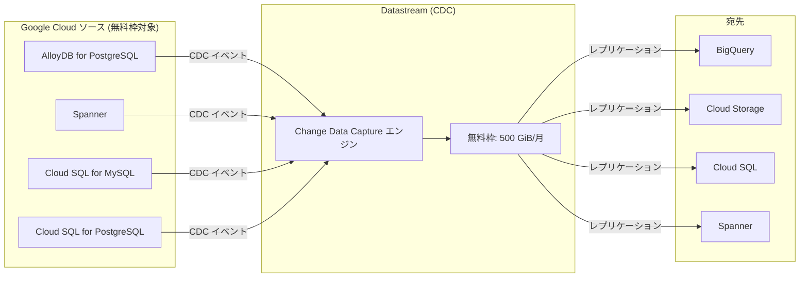

# Datastream: Google Cloud ソースからの CDC データ処理に無料枠を導入

**リリース日**: 2026-06-02

**サービス**: Datastream

**機能**: Google Cloud ソースからの CDC データ処理に無料枠を導入

**ステータス**: GA (一般提供)

[このアップデートのインフォグラフィックを見る](https://takech9203.github.io/google-cloud-news-summary/infographic/20260602-datastream-free-tier-cdc.html)

## 概要

Google Cloud は、Datastream の Change Data Capture (CDC) データ処理において、Google Cloud ソース（AlloyDB for PostgreSQL、Spanner など）からのデータに対する無料枠を新たに導入しました。請求アカウントごとに、毎月最初の 500 GiB の CDC データ処理が無料で提供されます。

この無料枠により、Google Cloud のマネージドデータベースからのリアルタイムデータレプリケーションを、追加コストなしで開始できるようになります。特に、小規模から中規模のワークロードにおいては、CDC パイプラインの運用コストを大幅に削減することが可能です。

対象ユーザーは、AlloyDB for PostgreSQL や Spanner から BigQuery、Cloud Storage、その他の宛先へリアルタイムでデータを同期したいデータエンジニア、アナリスト、アーキテクトです。

**アップデート前の課題**

Datastream の CDC データ処理は、データ量に応じた従量課金のみで提供されていました。

- Google Cloud ソースからのデータであっても、最初の 1 バイトから $0.10/GiB の料金が発生していた
- 小規模なプロジェクトや PoC（概念実証）において、コストが採用障壁となっていた
- リアルタイム分析パイプラインの試験運用に予算確保が必要だった

**アップデート後の改善**

今回のアップデートにより、Google Cloud ソースからの CDC データ処理に無料枠が適用されるようになりました。

- 毎月最初の 500 GiB の CDC データ処理が無料（Google Cloud ソース限定）
- 無料枠を超過した分のみ $0.10/GiB が課金される
- PoC やスタートアップの初期段階でコストを気にせずリアルタイムデータパイプラインを構築可能

## アーキテクチャ図



Datastream は Google Cloud ソースからの変更データ（INSERT、UPDATE、DELETE）をキャプチャし、各宛先にニアリアルタイムでレプリケーションします。無料枠は、このデータ処理の最初の 500 GiB/月に適用されます。

## サービスアップデートの詳細

### 主要機能

1. **無料枠の適用範囲**
   - Google Cloud ソース（AlloyDB for PostgreSQL、Cloud SQL for MySQL、Cloud SQL for PostgreSQL、Spanner）からの CDC データ処理が対象
   - CDC イベント（INSERT、UPDATE、DELETE）とバックフィル操作の両方に適用
   - 請求アカウントごとに毎月 500 GiB まで無料

2. **自動適用**
   - 既存のストリームにも自動的に適用される
   - 追加の設定変更は不要
   - 毎月の請求サイクルで自動的にリセット

3. **非 Google Cloud ソースとの差別化**
   - Oracle、自己管理型 MySQL/PostgreSQL、SQL Server などの非 Google Cloud ソースには無料枠は適用されない
   - 非 Google Cloud ソースは従来通り $0.10/GiB の従量課金

## 技術仕様

### 料金体系

| ソースタイプ | 無料枠 | 超過分の料金 |
|------|------|------|
| Google Cloud ソース (AlloyDB, Cloud SQL, Spanner) | 500 GiB/月 | $0.10/GiB |
| 非 Google Cloud ソース (Oracle, 自己管理 MySQL 等) | なし | $0.10/GiB |

### 無料枠の条件

| 項目 | 詳細 |
|------|------|
| 対象データ | CDC イベント + バックフィルデータ |
| 適用単位 | 請求アカウントごと |
| リセット頻度 | 毎月 |
| ロールオーバー | なし（未使用分は翌月に持ち越し不可） |
| 適用開始 | 自動（設定変更不要） |

## 設定方法

### 前提条件

1. Google Cloud プロジェクトが有効であること
2. Datastream API が有効化されていること
3. 対象ソースデータベース（AlloyDB for PostgreSQL または Spanner）が構成済みであること

### 手順

#### ステップ 1: Datastream API の有効化

```bash
gcloud services enable datastream.googleapis.com
```

Datastream API をプロジェクトで有効化します。

#### ステップ 2: 接続プロファイルの作成

```bash
gcloud datastream connection-profiles create my-alloydb-profile \
  --location=us-central1 \
  --type=POSTGRESQL \
  --postgresql-hostname=<ALLOYDB_IP> \
  --postgresql-port=5432 \
  --postgresql-username=datastream_user \
  --postgresql-password=<PASSWORD> \
  --postgresql-database=mydb
```

Google Cloud ソースへの接続プロファイルを作成します。

#### ステップ 3: ストリームの作成

```bash
gcloud datastream streams create my-cdc-stream \
  --location=us-central1 \
  --source=my-alloydb-profile \
  --destination=my-bigquery-profile \
  --backfill-all
```

CDC ストリームを作成します。無料枠は自動的に適用されるため、追加の設定は不要です。

## メリット

### ビジネス面

- **コスト削減**: 月間 500 GiB 以下の CDC ワークロードは完全無料。中小規模のプロジェクトにおいて年間数百ドルのコスト削減が可能
- **導入障壁の低下**: コストを気にせず PoC を実施でき、データドリブンな意思決定への移行を加速
- **Google Cloud エコシステムへのロックイン促進**: Google Cloud ソースを使用するインセンティブが明確化

### 技術面

- **設定変更不要**: 既存のストリームに自動適用されるため、運用負荷がゼロ
- **サーバーレスアーキテクチャとの相乗効果**: Datastream のサーバーレス特性と相まって、初期投資なしでリアルタイムデータパイプラインを構築可能
- **段階的スケーリング**: 無料枠内で検証し、ワークロード拡大に応じて柔軟にスケール

## デメリット・制約事項

### 制限事項

- 無料枠は Google Cloud ソースのみに適用（Oracle、自己管理型データベースは対象外）
- 未使用の無料枠は翌月にロールオーバーされない
- 請求アカウントごとの制限であり、プロジェクトごとではない

### 考慮すべき点

- BigQuery、Cloud Storage、Dataflow などの宛先サービスの料金は別途発生
- ネットワーク/エグレス料金は無料枠に含まれない
- 大規模ワークロードでは 500 GiB を超過する可能性があるため、コスト見積もりが必要

## ユースケース

### ユースケース 1: AlloyDB から BigQuery へのリアルタイム分析パイプライン

**シナリオ**: EC サイトが AlloyDB for PostgreSQL をトランザクションデータベースとして使用し、注文データや在庫データをリアルタイムで BigQuery に同期して分析ダッシュボードを構築する。

**実装例**:
```bash
# AlloyDB -> BigQuery のストリームを作成
gcloud datastream streams create ecommerce-analytics \
  --location=asia-northeast1 \
  --source=alloydb-ecommerce \
  --destination=bigquery-analytics \
  --postgresql-excluded-objects='{"postgresqlSchemas":[{"schema":"internal"}]}' \
  --backfill-all
```

**効果**: 月間 CDC データ量が 200 GiB 程度であれば、Datastream 側のコストが完全に無料。従来の月額約 $20 が削減される。

### ユースケース 2: Spanner から BigQuery へのグローバルデータ集約

**シナリオ**: グローバルに分散した Spanner インスタンスから変更データを BigQuery に集約し、全リージョンの統合分析レポートを生成する。

**効果**: Spanner の変更ストリーム機能と Datastream の無料枠を組み合わせることで、グローバルなリアルタイム分析基盤を低コストで構築可能。

### ユースケース 3: PoC / 開発環境での無料利用

**シナリオ**: 新規プロジェクトで CDC パイプラインの PoC を実施する際、無料枠の範囲内でリアルタイムレプリケーションの性能や互換性を検証する。

**効果**: 開発・検証段階ではほぼ確実に 500 GiB 以内に収まるため、追加コストなしで Datastream の機能を評価できる。

## 料金

Datastream の料金は、実際に処理されたデータ量（GiB）に基づいて計算されます。今回の無料枠導入により、Google Cloud ソースからのデータ処理は大幅に低コスト化されました。

### 料金例

| 使用量（Google Cloud ソース） | 月額料金 (概算) |
|--------|-----------------|
| 100 GiB/月 | $0（無料枠内） |
| 500 GiB/月 | $0（無料枠内） |
| 750 GiB/月 | $25（超過分 250 GiB x $0.10） |
| 1,000 GiB/月 | $50（超過分 500 GiB x $0.10） |
| 2,000 GiB/月 | $150（超過分 1,500 GiB x $0.10） |

※ 宛先サービス（BigQuery、Cloud Storage 等）の料金は別途発生します。

## 利用可能リージョン

Datastream は以下を含む多数のリージョンで利用可能です。無料枠は全リージョンで適用されます。

- asia-northeast1 (東京)
- asia-northeast2 (大阪)
- us-central1 (アイオワ)
- us-east1 (サウスカロライナ)
- europe-west1 (ベルギー)
- europe-west10 (ベルリン)
- europe-west12 (トリノ)
- me-central1 (ドーハ)
- northamerica-south1 (メキシコ)

その他全リージョンについては[公式ドキュメント](https://cloud.google.com/datastream/docs/ip-allowlists-and-regions)を参照してください。

## 関連サービス・機能

- **AlloyDB for PostgreSQL**: Google Cloud のフルマネージド PostgreSQL 互換データベース。Datastream のソースとして無料枠の対象
- **Spanner**: グローバル分散データベース。2026年1月から Datastream のソースとしてサポート開始。無料枠の対象
- **BigQuery**: 最も一般的な Datastream の宛先。Datastream for BigQuery として直接統合
- **Cloud Storage**: CDC イベントのストリーミング宛先。イベント駆動型アーキテクチャに活用
- **Dataflow**: Datastream と組み合わせてカスタムワークフローを構築するためのデータ処理サービス
- **Knowledge Catalog**: Datastream リソースのメタデータ管理・検索に活用（2026年4月から統合）

## 参考リンク

- [インフォグラフィック](https://takech9203.github.io/google-cloud-news-summary/infographic/20260602-datastream-free-tier-cdc.html)
- [公式リリースノート](https://docs.cloud.google.com/release-notes#June_02_2026)
- [ドキュメント](https://cloud.google.com/datastream/docs/overview)
- [料金ページ](https://cloud.google.com/datastream/pricing)
- [AlloyDB for PostgreSQL の構成](https://docs.cloud.google.com/datastream/docs/configure-alloydb-psql)
- [Spanner ソースの構成](https://docs.cloud.google.com/datastream/docs/sources-spanner)

## まとめ

Datastream の無料枠導入は、Google Cloud エコシステム内でのリアルタイムデータレプリケーションの採用を大きく促進するアップデートです。特に AlloyDB for PostgreSQL や Spanner を使用している組織にとって、追加コストなしで CDC パイプラインを構築・運用できることは、データドリブンなアーキテクチャへの移行を加速する重要な一歩です。まずは無料枠を活用して PoC を実施し、ワークロードの成長に合わせてスケールすることを推奨します。

---

**タグ**: #Datastream #CDC #FreeTier #AlloyDB #Spanner #BigQuery #リアルタイム分析 #データレプリケーション #コスト最適化
