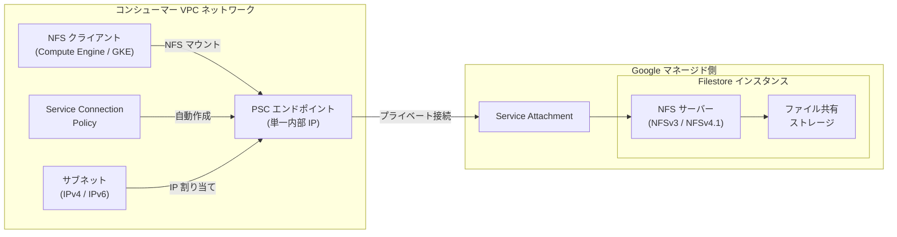

# Filestore: Private Service Connect 接続が一般提供開始 (GA)

**リリース日**: 2026-06-02

**サービス**: Filestore

**機能**: Private Service Connect による NFSv3/NFSv4.1 プロトコルおよび IPv4/IPv6 アドレスファミリーでのプライベート接続

**ステータス**: GA (一般提供)

📊 [このアップデートのインフォグラフィックを見る](https://takech9203.github.io/google-cloud-news-summary/infographic/20260602-filestore-private-service-connect-ga.html)

## 概要

Google Cloud は、Filestore インスタンスにおける Private Service Connect (PSC) のサポートを一般提供 (GA) として発表しました。この機能により、コンシューマーは VPC ネットワーク内からマネージドファイルストレージサービスにプライベートにアクセスできるようになります。NFSv3 または NFSv4.1 ファイルシステムプロトコル、および IPv4 または IPv6 アドレスファミリーに対応しています。

Private Service Connect を使用することで、コンシューマーは IP アドレス範囲全体を割り当てる代わりに、VPC 内の単一の内部 IP アドレスをプロビジョニングして PSC エンドポイントを作成するだけで Filestore インスタンスへの接続が可能になります。これにより、ネットワーク管理が大幅に簡素化され、セキュリティが強化されます。

この機能は、Zonal、Regional、Enterprise の各サービスティアで利用可能であり、Shared VPC 構成もサポートしています。エンタープライズワークロードやマルチテナント環境で、よりセキュアで管理しやすいファイルストレージ接続を必要とする組織に最適です。

**アップデート前の課題**

Private Service Connect が GA になる前は、Filestore のネットワーク接続において以下の課題がありました。

- VPC ピアリングやプライベートサービスアクセスを使用する場合、IP アドレス範囲全体を予約する必要があり、IP アドレスの管理が複雑だった
- マルチテナント環境やプロジェクト間での Filestore インスタンスへのプライベートアクセスの構成が煩雑だった
- IPv6 のネイティブサポートがなく、モダンなネットワーク構成への対応が制限されていた

**アップデート後の改善**

今回の GA リリースにより、以下の改善が実現しました。

- 単一の内部 IP アドレスのプロビジョニングのみで Filestore へのプライベート接続が可能になった
- NFSv3 と NFSv4.1 の両プロトコルで PSC 接続が利用でき、ワークロードに応じた柔軟な選択が可能になった
- IPv4 と IPv6 の両方のアドレスファミリーをサポートし、デュアルスタック環境への対応が実現した
- Service Connection Policy による自動エンドポイント作成で、大規模デプロイメントの管理が効率化された

## アーキテクチャ図



この図は、コンシューマー VPC ネットワーク内の NFS クライアントが Private Service Connect エンドポイントを経由して、Google マネージド側の Filestore インスタンスにプライベートに接続する構成を示しています。Service Connection Policy がエンドポイントの自動作成を管理します。

## サービスアップデートの詳細

### 主要機能

1. **Private Service Connect エンドポイント**
   - コンシューマー VPC 内に単一の内部 IP アドレスとして作成される接続ポイント
   - Service Connection Policy による自動プロビジョニングをサポート
   - Shared VPC 構成ではホストプロジェクトにエンドポイントをプロビジョニング可能

2. **デュアルプロトコルサポート (NFSv3 / NFSv4.1)**
   - NFSv3: 全サービスティアで利用可能、双方向通信、ステートレス復旧
   - NFSv4.1: Zonal / Regional / Enterprise ティアで利用可能、Kerberos 認証対応、リースベースのロック制御
   - PSC 経由でも両プロトコルの機能をフル活用可能

3. **IPv4 / IPv6 デュアルスタック対応**
   - サービスアタッチメントごとに IPv4 または IPv6 エンドポイントを選択可能
   - IPv6 選択時はアクセス制御フィールドが IPv6 CIDR 表記で検証される
   - モダンなネットワーク環境への完全対応

4. **Service Connection Policy**
   - VPC ネットワークごとに接続ポリシーを定義し、自動エンドポイント作成を有効化
   - サブネット指定によるエンドポイント IP アドレスの自動割り当て
   - 接続数の制限設定による管理の一元化

## 技術仕様

### 対応サービスティアとプロトコル

| 項目 | 詳細 |
|------|------|
| 対応ティア | Zonal, Regional, Enterprise |
| 対応プロトコル | NFSv3, NFSv4.1 |
| アドレスファミリー | IPv4 (MODE_IPV4), IPv6 (MODE_IPV6) |
| 接続モード | PRIVATE_SERVICE_CONNECT |
| 容量範囲 | 1 TiB - 100 TiB (ティアにより異なる) |
| ステータス | GA (一般提供) |

### プロトコル比較

| 仕様 | NFSv3 | NFSv4.1 |
|------|-------|---------|
| 対応ティア | 全ティア | Zonal / Regional / Enterprise |
| 双方向通信 | あり | なし (クライアント起動、ポート 2049) |
| 認証 | なし | RPCSEC_GSS (Kerberos) |
| ファイル ACL | なし | あり (最大 50 ACE) |
| グループ数 | 最大 16 | 無制限 (Managed AD 接続時) |
| ロック方式 | NLM (クライアント制御) | リースベース (サーバー制御) |

### 必要な API

```json
{
  "required_apis": [
    "compute.googleapis.com",
    "networkconnectivity.googleapis.com",
    "serviceconsumermanagement.googleapis.com",
    "file.googleapis.com"
  ]
}
```

## 設定方法

### 前提条件

1. Filestore インスタンスの十分なクォータ (リージョンとティアに応じて確認)
2. Compute Engine API、Network Connectivity API、Service Consumer Management API の有効化
3. VPC ネットワークと適切なサブネットの準備
4. Shared VPC 使用時: ホストプロジェクトでの PSC エンドポイントプロビジョニング権限

### 手順

#### ステップ 1: Service Connection Policy の作成

```bash
gcloud network-connectivity service-connection-policies create filestore-psc-policy \
  --network=my-vpc-network \
  --project=my-project \
  --region=us-central1 \
  --service-class=gcp-filestore \
  --subnets=https://www.googleapis.com/compute/v1/projects/my-project/regions/us-central1/subnetworks/psc-subnet \
  --psc-connection-limit=10
```

Service Connection Policy は、Filestore インスタンス作成時に自動的に PSC エンドポイントを作成するために必要です。

#### ステップ 2: Filestore インスタンスの作成 (PSC 接続モード)

```bash
gcloud filestore instances create my-filestore-instance \
  --project="my-project" \
  --region=us-central1 \
  --tier=REGIONAL \
  --protocol=NFS_v4_1 \
  --file-share=name="my_share",capacity=1024 \
  --network=name="my-vpc-network",connect-mode=PRIVATE_SERVICE_CONNECT,address-mode=MODE_IPV4
```

このコマンドにより、Private Service Connect 接続モードで Filestore Regional インスタンスが作成されます。Service Connection Policy が存在するサブネットから自動的にエンドポイント IP が割り当てられます。

#### ステップ 3: IPv6 エンドポイントでの作成 (オプション)

```bash
gcloud filestore instances create my-filestore-ipv6 \
  --project="my-project" \
  --region=us-central1 \
  --tier=REGIONAL \
  --protocol=NFS_v3 \
  --file-share=name="my_share_v6",capacity=2048 \
  --network=name="my-vpc-network",connect-mode=PRIVATE_SERVICE_CONNECT,address-mode=MODE_IPV6
```

IPv6 アドレスファミリーを使用する場合は `address-mode=MODE_IPV6` を指定します。

#### ステップ 4: Shared VPC 環境での作成 (オプション)

```bash
gcloud filestore instances create my-shared-vpc-instance \
  --project="service-project" \
  --region=us-central1 \
  --tier=REGIONAL \
  --protocol=NFS_v4_1 \
  --file-share=name="shared_vol",capacity=1024 \
  --network=name=projects/host-project/global/networks/shared-vpc,connect-mode=PRIVATE_SERVICE_CONNECT,address-mode=MODE_IPV4,psc-endpoint-project=host-project
```

Shared VPC 構成では、ホストプロジェクトのネットワーク名をフルパスで指定し、`psc-endpoint-project` パラメータでエンドポイントの作成先プロジェクトを指定します。

## メリット

### ビジネス面

- **IP アドレス管理の効率化**: 単一 IP アドレスのプロビジョニングで接続が完了するため、IP アドレス計画の複雑さが大幅に削減される
- **マルチテナント対応の強化**: 異なるプロジェクトや組織からのプライベートアクセスが容易になり、マネージドサービスの共有利用が促進される
- **コンプライアンス対応**: プライベート接続により、データがパブリックインターネットを経由しないため、規制要件への適合が容易

### 技術面

- **セキュリティの強化**: VPC 内のプライベート IP 経由でのアクセスにより、攻撃面が最小化される
- **ネットワーク構成の簡素化**: VPC ピアリングの制約 (推移的ルーティングの不可など) を回避でき、柔軟なネットワーク設計が可能
- **IPv6 対応**: デュアルスタック環境でのモダンなネットワーク構成をサポートし、将来的なアドレス枯渇リスクに対応
- **自動化対応**: Service Connection Policy によりエンドポイント作成を自動化でき、Infrastructure as Code との親和性が高い

## デメリット・制約事項

### 制限事項

- Legacy ティア (Basic HDD / Basic SSD) では PSC 接続は利用不可
- Service Connection Policy は VPC ネットワーク、リージョン、サービスクラスの組み合わせごとに 1 つのみ作成可能
- Shared VPC 構成では、Service Connection Policy のスコープがホストプロジェクトを許可する必要がある
- VPC ネットワーク数の上限は 49 (Filestore 全体の制限)

### 考慮すべき点

- 既存のプライベートサービスアクセス接続から PSC への移行には、インスタンスの再作成が必要になる可能性がある
- Service Connection Policy の更新はサブネットと接続数制限のみ可能。その他のフィールドを変更するには再作成が必要
- NFSv4.1 + Kerberos 認証を使用する場合、Managed Service for Microsoft Active Directory の追加構成が必要
- IPv6 エンドポイント使用時のアクセス制御設定は IPv6 CIDR 表記で検証されるため、既存のファイアウォールルールの見直しが必要

## ユースケース

### ユースケース 1: マルチプロジェクト環境でのファイル共有

**シナリオ**: 複数の開発チームが異なる Google Cloud プロジェクトで作業しており、共通の Filestore インスタンスにプライベートにアクセスする必要がある。VPC ピアリングの制約により、従来は各プロジェクトからのアクセスが困難だった。

**実装例**:
```bash
# ホストプロジェクトで Service Connection Policy を作成
gcloud network-connectivity service-connection-policies create shared-filestore-policy \
  --network=shared-vpc \
  --project=host-project \
  --region=us-central1 \
  --service-class=gcp-filestore \
  --subnets=psc-subnet \
  --psc-connection-limit=20

# サービスプロジェクトから Filestore インスタンスを作成
gcloud filestore instances create team-shared-storage \
  --project=service-project-a \
  --region=us-central1 \
  --tier=REGIONAL \
  --protocol=NFS_v4_1 \
  --file-share=name="shared_data",capacity=2048 \
  --network=name=projects/host-project/global/networks/shared-vpc,connect-mode=PRIVATE_SERVICE_CONNECT,address-mode=MODE_IPV4,psc-endpoint-project=host-project
```

**効果**: 各プロジェクトのチームが VPC ピアリングなしで同一の Filestore インスタンスにプライベートにアクセスでき、IP アドレス管理の複雑さも削減される。

### ユースケース 2: セキュリティ要件が厳しい GKE ワークロード

**シナリオ**: 金融系ワークロードを GKE 上で実行しており、NFS ストレージへのアクセスにおいてデータの暗号化とクライアント認証が必須。ネットワークレベルでのプライベート接続も要件として求められている。

**実装例**:
```bash
# NFSv4.1 + PSC で認証・暗号化付きファイルストレージを作成
gcloud filestore instances create secure-gke-storage \
  --project=finance-project \
  --region=asia-northeast1 \
  --tier=ENTERPRISE \
  --protocol=NFS_v4_1 \
  --file-share=name="secure_vol",capacity=1024 \
  --network=name="gke-vpc",connect-mode=PRIVATE_SERVICE_CONNECT,address-mode=MODE_IPV4
```

**効果**: PSC によるプライベート接続と NFSv4.1 の Kerberos 認証 (krb5p) を組み合わせることで、ネットワークレベルとプロトコルレベルの両方でセキュリティを確保。コンプライアンス要件を満たしながら高可用性のファイルストレージを利用可能。

### ユースケース 3: IPv6 対応のモダンインフラストラクチャ

**シナリオ**: 組織全体で IPv6 への移行を進めており、ファイルストレージサービスも IPv6 ネイティブで接続したい。

**効果**: IPv6 エンドポイントを使用することで、IPv4 アドレスの枯渇を気にせずスケーラブルなファイルストレージ接続を構築できる。デュアルスタック環境での段階的移行もサポート。

## 料金

Filestore の料金は Private Service Connect の使用有無にかかわらず、リージョン、サービスティア、インスタンス容量に基づきます。PSC エンドポイント自体には追加の課金は発生しません。

### 料金例

| ティア | 構成 | 月額料金 (概算) |
|--------|------|-----------------|
| Filestore Regional (カスタムパフォーマンス ON) | インスタンス料金 + 1 TiB + IOPS | $40 + $215/TiB + $0.027/IOPS |
| Filestore Regional (カスタムパフォーマンス OFF) | 1 TiB | $460/TiB |
| Filestore Zonal (カスタムパフォーマンス ON) | インスタンス料金 + 1 TiB + IOPS | $20 + $123/TiB + $0.0145/IOPS |
| Filestore Zonal (カスタムパフォーマンス OFF) | 1 TiB | $256/TiB |

※ 上記は us-central1 リージョンの参考価格です。実際の料金はリージョンにより異なります。

## 利用可能リージョン

Filestore の Zonal、Regional、Enterprise ティアが利用可能な全リージョンで PSC 接続を使用できます。日本リージョンでは以下が対象です:

- asia-northeast1 (東京)
- asia-northeast2 (大阪)

その他のリージョンについては [Filestore のロケーションページ](https://cloud.google.com/filestore/docs/locations) を参照してください。

## 関連サービス・機能

- **Private Service Connect**: Google マネージドサービスやサードパーティサービスへのプライベート接続を実現する VPC ネットワーキング機能
- **VPC Service Controls**: Filestore を含む Google Cloud リソースへのアクセスを制御するセキュリティ境界
- **Managed Service for Microsoft Active Directory**: NFSv4.1 の Kerberos 認証で利用する LDAP/Kerberos サービス
- **GKE (Google Kubernetes Engine)**: Filestore CSI ドライバーを通じた NFSv4.1 マウントをサポート
- **Cloud SQL / AlloyDB**: 同様に Private Service Connect をサポートするデータベースサービス

## 参考リンク

- 📊 [インフォグラフィック](https://takech9203.github.io/google-cloud-news-summary/infographic/20260602-filestore-private-service-connect-ga.html)
- [公式リリースノート](https://docs.google.com/release-notes#June_02_2026)
- [Private Service Connect 構成ドキュメント](https://cloud.google.com/filestore/docs/configure-psc)
- [Filestore サービスティア](https://cloud.google.com/filestore/docs/service-tiers)
- [Filestore 料金ページ](https://cloud.google.com/filestore/pricing)
- [Private Service Connect 概要](https://cloud.google.com/vpc/docs/private-service-connect)
- [Service Connection Policy について](https://cloud.google.com/vpc/docs/about-service-connection-policies)

## まとめ

Filestore における Private Service Connect サポートの GA リリースは、エンタープライズ環境でのマネージドファイルストレージのネットワーク接続を大幅に簡素化する重要なアップデートです。NFSv3/NFSv4.1 と IPv4/IPv6 の組み合わせをフルサポートすることで、セキュリティ要件の厳しい環境からモダンな IPv6 ネイティブ環境まで幅広い構成に対応します。既存の Filestore ユーザーは、新規インスタンス作成時に PSC 接続モードを選択することで、よりセキュアでスケーラブルなファイルストレージ環境を構築することを推奨します。

---

**タグ**: #Filestore #PrivateServiceConnect #PSC #NFSv3 #NFSv4.1 #IPv6 #VPC #ネットワーキング #GA #セキュリティ #ストレージ
