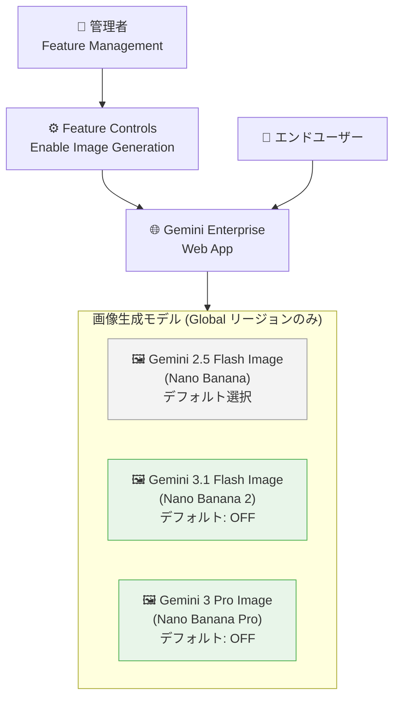

# Gemini Enterprise: 画像生成モデル (Nano Banana Pro / Nano Banana 2) が GA

**リリース日**: 2026-06-02

**サービス**: Gemini Enterprise

**機能**: 画像生成モデル Gemini 3 Pro Image (Nano Banana Pro) / Gemini 3.1 Flash Image (Nano Banana 2) の一般提供開始

**ステータス**: GA (Generally Available)

[このアップデートのインフォグラフィックを見る](https://takech9203.github.io/google-cloud-news-summary/20260602-gemini-enterprise-image-generation-ga.html)

## 概要

Gemini Enterprise アプリにおいて、2 つの高度な画像生成モデルが一般提供 (GA) として利用可能になった。**Gemini 3 Pro Image (Nano Banana Pro)** はプロフェッショナルレベルの画像生成・編集に特化した推論駆動型モデルであり、**Gemini 3.1 Flash Image (Nano Banana 2)** は高速・高効率なバランス型モデルである。

これにより、Gemini Enterprise ユーザーは従来の Gemini 2.5 Flash Image (Nano Banana) に加え、より高品質かつ高機能な画像生成をウェブアプリ上で直接利用できるようになった。管理者はフィーチャーコントロールからこれらのモデルの有効化・無効化を管理できる。

両モデルはデフォルトでオフに設定されており、Global リージョンでのみ利用可能である。管理者が明示的に有効化する必要があるため、組織のポリシーに合わせた段階的な展開が可能となっている。

**アップデート前の課題**

- Gemini Enterprise の画像生成は Gemini 2.5 Flash Image (Nano Banana) のみに限定されていた
- 複雑な指示や高精度なテキストレンダリングが求められるプロフェッショナル用途には対応が不十分だった
- 4K 解像度や高度な推論ベースの画像構成には対応していなかった

**アップデート後の改善**

- Nano Banana Pro による推論ベースの高品質画像生成が Gemini Enterprise ウェブアプリで利用可能になった
- Nano Banana 2 による高速・低レイテンシな画像生成が利用可能になった
- 管理者がフィーチャーコントロールからモデル単位で有効化・無効化を管理できるようになった
- Public Preview 時に有効化していた場合は GA でも継続して有効 (Nano Banana 2)

## アーキテクチャ図

Gemini Enterprise ウェブアプリにおける画像生成モデルの選択肢と管理者による制御フローを示す。新たに GA となった Nano Banana 2 および Nano Banana Pro は管理者がフィーチャーコントロールで有効化する必要がある。

## サービスアップデートの詳細

### 主要機能

1. **Gemini 3 Pro Image (Nano Banana Pro)**
   - モデル ID: `gemini-3-pro-image`
   - プロフェッショナル向け画像生成・編集エンジン
   - 推論 (Thinking) 機能を搭載し、複雑な指示に対応
   - Google Search によるリアルワールドグラウンディングをサポート
   - 最大 4K 解像度の画像出力 (4K は Preview)
   - スタジオ品質の精密さと高度なクリエイティブコントロール
   - 正確なテキストレンダリングと事実に基づくデータビジュアライゼーション

2. **Gemini 3.1 Flash Image (Nano Banana 2)**
   - モデル ID: `gemini-3.1-flash-image`
   - 高速・高効率なバランス型画像生成モデル
   - Nano Banana Pro の高効率版として、速度と大量処理に最適化
   - 0.5K / 1K / 2K / 4K (Preview) の解像度オプション
   - Image Search Grounding (テキスト・画像の検索結果を活用)
   - 動画入力からの画像生成 (Preview)
   - 改善された国際化テキストレンダリング

3. **管理者向けフィーチャーコントロール**
   - Google Cloud コンソール > Gemini Enterprise > Configurations > Feature Management で管理
   - モデル単位での有効化・無効化が可能
   - デフォルトでオフのため、組織ポリシーに合わせた段階的展開が可能
   - Public Preview 中に Nano Banana 2 を有効にしていた場合、GA でも有効状態が継続

## 技術仕様

### モデル比較

| 項目 | Nano Banana Pro (Gemini 3 Pro Image) | Nano Banana 2 (Gemini 3.1 Flash Image) |
|------|------|------|
| モデル ID | `gemini-3-pro-image` | `gemini-3.1-flash-image` |
| 入力トークン上限 | 65,536 | 131,072 |
| 出力トークン上限 | 32,768 | 32,768 |
| サポート入力 | テキスト、画像 | テキスト、画像、動画 (Preview) |
| 対応解像度 | 1K, 2K, 4K (Preview) | 512, 1K, 2K, 4K (Preview) |
| 対応アスペクト比 | 1:1, 3:2, 2:3, 3:4, 4:3, 4:5, 5:4, 9:16, 16:9, 21:9 | 1:1, 3:2, 2:3, 3:4, 1:4, 4:1, 4:3, 4:5, 5:4, 1:8, 8:1, 9:16, 16:9, 21:9, 9:21 |
| Thinking (推論) | サポート | サポート |
| Google Search グラウンディング | サポート | サポート |
| 最大画像入力数 | 14 枚/プロンプト | 14 枚/プロンプト |
| 知識カットオフ | 2025 年 1 月 | 2025 年 1 月 |
| リリース日 | 2026 年 5 月 28 日 | 2026 年 5 月 28 日 |

### 画像トークン消費量

| モデル | 入力画像トークン | 出力 1K | 出力 2K | 出力 4K |
|--------|-----------------|---------|---------|---------|
| Nano Banana Pro | 560 tokens/画像 | 1,120 tokens | 1,120 tokens | 2,000 tokens |
| Nano Banana 2 | 1,120 tokens/画像 | 1,120 tokens | 1,680 tokens | 2,520 tokens |

### セキュリティコントロール

| 機能 | オンライン予測 | バッチ推論 |
|------|--------------|-----------|
| データレジデンシー | サポート | サポート |
| CMEK | サポート | サポート |
| VPC-SC | サポート | サポート |
| AXT | サポート | サポート |

## 設定方法

### 前提条件

1. Gemini Enterprise Admin ロール (`discoveryengine.agentspaceAdmin`) が付与されていること
2. 既存の Gemini Enterprise ウェブアプリが作成済みであること
3. Gemini Enterprise のいずれかのエディション (Business / Standard / Plus) のライセンスが割り当てられていること

### 手順

#### ステップ 1: Feature Management にアクセス

1. Google Cloud コンソールで Gemini Enterprise ページに移動
2. 設定するアプリの名前をクリック
3. **Configurations** をクリックし、**Feature Management** タブを選択

#### ステップ 2: 画像生成モデルを有効化

1. **Enable image generation** トグルがオンになっていることを確認
2. 使用する画像モデルを選択:
   - **Gemini 3 pro image (Nano Banana Pro)**: トグルをオンに変更
   - **Gemini 3.1 flash image (Nano Banana 2)**: トグルをオンに変更
3. 設定を保存

#### ステップ 3: リージョン警告の確認

両モデルは Global リージョンでのみ利用可能。エンドユーザーが Global 以外のリージョンでこれらのモデルを使用しようとした場合、警告が表示される。ユーザーは利用規約を確認して続行できる。

## メリット

### ビジネス面

- **プロフェッショナル品質のコンテンツ作成**: マーケティング素材、プレゼンテーション資料、製品モックアップを社内で迅速に作成可能
- **段階的な展開**: デフォルトオフのため、組織のコンプライアンスポリシーに合わせて段階的に導入可能
- **コスト効率の選択肢**: Nano Banana 2 (高速・低コスト) と Nano Banana Pro (高品質) から用途に応じて選択可能

### 技術面

- **推論ベースの高精度生成**: Nano Banana Pro の Thinking 機能により、複雑な構図やテキスト配置を正確に実現
- **マルチターン編集**: 会話形式で画像を反復的に編集・改善可能
- **エンタープライズグレードのセキュリティ**: CMEK、VPC-SC、データレジデンシーなどの企業向けセキュリティコントロールに対応
- **SynthID ウォーターマーク**: 生成画像にはすべて SynthID が埋め込まれ、AI 生成コンテンツの追跡が可能

## デメリット・制約事項

### 制限事項

- Global リージョンでのみ利用可能 (EU、US マルチリージョンは非対応)
- デフォルトでオフのため、管理者による明示的な有効化が必要
- 4K 解像度出力は両モデルとも Preview 段階
- Function calling、Context caching、Live API は非サポート
- 動画入力 (Nano Banana 2) は Preview 段階

### 考慮すべき点

- Global リージョンのみの制約により、データレジデンシー要件が厳しい組織では注意が必要
- Nano Banana Pro は推論 (Thinking) を使用するため、Nano Banana 2 と比較してレスポンス時間が長くなる可能性がある
- 既存の Gemini 2.5 Flash Image (Nano Banana) が引き続きデフォルト選択となるため、新モデルの利用にはユーザーへの周知が必要

## ユースケース

### ユースケース 1: マーケティングチームのビジュアルコンテンツ制作

**シナリオ**: マーケティング部門が製品ローンチに向けたビジュアル素材を迅速に作成する必要がある。デザインツールの操作スキルがないメンバーでも、自然言語の指示でプロフェッショナル品質の画像を生成したい。

**効果**: Nano Banana Pro を活用することで、複雑なグラフィックデザインや正確なテキスト配置を含む画像をウェブアプリ上で直接生成。マルチターン編集により反復的なデザイン改善も容易に実現。

### ユースケース 2: 大量のビジュアルアセット生成

**シナリオ**: EC サイトの運営チームが商品画像のバリエーションやプロモーション画像を大量に生成する必要がある。速度とコスト効率を重視。

**効果**: Nano Banana 2 の高速・低レイテンシ特性を活かし、大量の画像を効率的に生成。多様なアスペクト比 (1:4, 4:1, 1:8, 8:1 含む) に対応しているため、各種プラットフォーム向けのバリエーションも一括生成可能。

### ユースケース 3: データビジュアライゼーション

**シナリオ**: アナリストチームがレポートや社内プレゼンテーション向けに、データに基づいたインフォグラフィックやチャートを作成したい。

**効果**: Nano Banana Pro の Google Search グラウンディングと正確なテキストレンダリング機能により、事実に基づいた正確なデータビジュアライゼーションを生成。推論機能により、複雑なデータ関係も適切に視覚化。

## 料金

Gemini Enterprise の画像生成モデルの料金は、Gemini Enterprise のサブスクリプションに含まれる。エディションごとの詳細な料金情報は以下のページを参照。

- [Gemini Enterprise 料金ページ](https://cloud.google.com/gemini-enterprise-agent-platform/generative-ai/pricing)

### Gemini Enterprise エディション比較

| エディション | 対象ユーザー数 | 画像生成 | 主な特徴 |
|-------------|--------------|---------|---------|
| Business | 1-300 ユーザー | 利用可能 | 中小規模向け |
| Standard | 1+ ユーザー | 利用可能 | フルコネクタエコシステム |
| Plus | 1+ ユーザー | 利用可能 | 最新モデル優先アクセス |
| Frontline | 150+ ユーザー | 利用可能 | 大規模組織向け |

## 利用可能リージョン

| モデル | 利用可能リージョン |
|--------|-------------------|
| Gemini 3 Pro Image (Nano Banana Pro) | Global のみ |
| Gemini 3.1 Flash Image (Nano Banana 2) | Global のみ |
| Gemini 2.5 Flash Image (Nano Banana) | Global、EU、US マルチリージョン |

Global リージョン以外で使用しようとした場合、ユーザーに警告が表示され、規約を確認した上で続行可能。

## 関連サービス・機能

- **Gemini Enterprise Agent Platform**: Nano Banana Pro / Nano Banana 2 モデルの API 利用 (Vertex AI 経由)
- **Imagen 4 / Imagen 4 Ultra**: Gemini API で利用可能な専用画像生成モデル。Gemini ネイティブ画像生成とは別のアプローチ
- **Model Armor**: Gemini Enterprise でプロンプトとレスポンスのスクリーニングを行うセキュリティ機能
- **Content Credentials (C2PA)**: 生成画像の出所と履歴を証明するメタデータ規格への対応

## 参考リンク

- [インフォグラフィック](https://takech9203.github.io/google-cloud-news-summary/20260602-gemini-enterprise-image-generation-ga.html)
- [公式リリースノート](https://docs.cloud.google.com/release-notes#June_02_2026)
- [ウェブアプリのフィーチャー管理ドキュメント](https://docs.cloud.google.com/gemini/enterprise/docs/manage-web-app-features)
- [Gemini 3 Pro Image モデル仕様](https://docs.cloud.google.com/gemini-enterprise-agent-platform/models/gemini/3-pro-image)
- [Gemini 3.1 Flash Image モデル仕様](https://docs.cloud.google.com/gemini-enterprise-agent-platform/models/gemini/3-1-flash-image)
- [Gemini Enterprise エディション比較](https://docs.cloud.google.com/gemini/enterprise/docs/editions)
- [画像生成ガイド](https://docs.cloud.google.com/gemini-enterprise-agent-platform/models/capabilities/image-generation)

## まとめ

Gemini Enterprise に高品質な画像生成モデル (Nano Banana Pro / Nano Banana 2) が GA として追加されたことで、企業ユーザーはプロフェッショナルレベルの画像生成をウェブアプリ上で直接利用可能になった。管理者はフィーチャーコントロールからモデル単位で有効化を管理できるため、組織の要件に合わせた段階的な導入が推奨される。Global リージョン限定という制約はあるものの、推論ベースの高精度生成やマルチターン編集など、従来の画像生成では実現が困難だった高度なユースケースに対応できる点が大きな価値となる。

---

**タグ**: #GeminiEnterprise #ImageGeneration #NanoBanana #GA #AI #GenerativeAI
