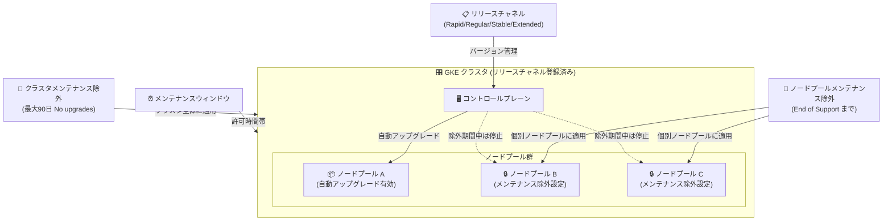

# Google Kubernetes Engine: メンテナンス除外機能の拡張

**リリース日**: 2026-06-02

**サービス**: Google Kubernetes Engine (GKE)

**機能**: メンテナンス除外 (Maintenance Exclusions) の機能拡張

**ステータス**: GA (一般提供)

📊 [このアップデートのインフォグラフィックを見る](https://takech9203.github.io/google-cloud-news-summary/20260602-gke-maintenance-exclusions-expansion.html)

## 概要

Google Kubernetes Engine (GKE) のメンテナンス除外機能が大幅に拡張された。今回のアップデートでは、ノードプール単位のメンテナンス除外がリリースチャネルに登録されたクラスタで利用可能になり、また「No upgrades (アップグレードなし)」スコープのデフォルトメンテナンス除外の最大期間が 90 日に延長された。

これらの変更により、クラスタのアップグレード管理においてより柔軟な制御が可能になる。特に、これまでリリースチャネルに登録せずにノードプールの自動アップグレードを無効化していたユーザーにとって、リリースチャネルの恩恵を受けながら同等の制御を実現できる重要なアップデートである。

**アップデート前の課題**

- ノードプール単位で自動アップグレードを無効化するには、クラスタをリリースチャネルに登録しない (No channel) 構成にする必要があった
- リリースチャネルに登録しないと、加速パッチアップグレード、ロールアウトシーケンシング、Autopilot モードなどの機能が利用できなかった
- 「No upgrades」スコープのメンテナンス除外は最大期間に制約があり、長期間のバージョン検証プロセスに対応が困難だった
- ノードプールごとに異なるアップグレード戦略を適用する柔軟性が不足していた

**アップデート後の改善**

- リリースチャネルに登録したまま、ノードプール単位でメンテナンス除外を設定可能になった
- 「No upgrades」メンテナンス除外が最大 90 日まで設定可能になり、長期間の安定性要件に対応できるようになった
- リリースチャネルの全機能 (加速パッチ、ロールアウトシーケンシング等) を活用しながら、個別ノードプールの制御が可能になった
- No channel 構成からリリースチャネルへの移行が容易になった

## アーキテクチャ図



GKE クラスタ内で、クラスタレベルのメンテナンス除外とノードプールレベルのメンテナンス除外を組み合わせることで、きめ細かなアップグレード制御が可能になる。リリースチャネルに登録しながら、特定のノードプールのみ自動アップグレードを抑止できる。

## サービスアップデートの詳細

### 主要機能

1. **ノードプール単位のメンテナンス除外 (Per-node pool maintenance exclusions)**
   - リリースチャネルに登録されたクラスタで利用可能
   - 個別ノードプールに対して自動アップグレードを無効化できる
   - これまで No channel 構成でしか実現できなかったノードプール自動アップグレード無効化と同等の機能を提供
   - 除外の終了時刻はクラスタのマイナーバージョンの End of Support 日を追跡する
   - End of Support に達した場合、GKE は必須の自動アップグレードを実行し、その後メンテナンス除外を再アクティブ化する

2. **「No upgrades」除外期間の延長**
   - デフォルトの「No upgrades」メンテナンス除外が最大 90 日まで設定可能に
   - コントロールプレーンとノードの両方のマイナーアップグレードおよびパッチアップグレードを完全に停止
   - 長期のバージョン検証プロセスや、大規模イベント期間中の変更凍結に対応
   - 推奨は 30 日以内だが、特定のユースケースでは 90 日まで延長可能

3. **リリースチャネルとの統合強化**
   - ノードプールメンテナンス除外により、リリースチャネルの全機能を活用可能
   - 加速パッチアップグレード、ロールアウトシーケンシング、長期サポート (Extended チャネル) との併用が可能
   - No channel からリリースチャネルへの移行パスが明確化

## 技術仕様

### メンテナンス除外のスコープ比較

| スコープ | コントロールプレーン (マイナー) | コントロールプレーン (パッチ) | ノード (マイナー) | ノード (パッチ) | 最大期間 |
|---------|------|------|------|------|------|
| No upgrades (デフォルト) | 不可 | 不可 | 不可 | 不可 | 最大 90 日 |
| No minor upgrades | 不可 | 許可 | 不可 | 許可 | End of Support まで |
| No minor or node upgrades | 不可 | 許可 | 不可 | 不可 | End of Support まで |
| ノードプール除外 | - | - | 不可 | 不可 | End of Support まで |

### ノードプールメンテナンス除外の制限事項

| 項目 | 詳細 |
|------|------|
| 対象クラスタ | リリースチャネルに登録されたクラスタのみ |
| 設定数 | ノードプールあたり 1 つのみ |
| 開始日時 | 即時開始のみ (将来の日時指定は不可) |
| Autopilot クラスタ | 利用不可 (GKE がノードを管理するため) |
| 防止対象 | ノードバージョンアップグレードのみ (他のノード更新は防止しない) |

### クラスタメンテナンス除外の制限事項

| 項目 | 詳細 |
|------|------|
| 最大除外数 | クラスタあたり 20 個 |
| No upgrades スコープ | 最大 3 個 (32 日間のローリングウィンドウで 48 時間のメンテナンス可用性が必要) |
| End of Support 超過 | 不可 (一時的な緊急措置として No upgrades スコープでのみ可能) |

## 設定方法

### 前提条件

1. GKE クラスタがリリースチャネル (Rapid、Regular、Stable、Extended) に登録されていること
2. Standard モードのクラスタであること (ノードプール除外の場合)
3. `gcloud` CLI が最新バージョンに更新されていること

### 手順

#### ステップ 1: ノードプールメンテナンス除外の設定 (新規ノードプール作成時)

```bash
gcloud container node-pools create POOL_NAME \
    --cluster CLUSTER_NAME \
    --location=CONTROL_PLANE_LOCATION \
    --add-maintenance-exclusion-until-end-of-support
```

#### ステップ 2: 既存ノードプールへのメンテナンス除外追加

```bash
gcloud container node-pools update POOL_NAME \
    --cluster CLUSTER_NAME \
    --location=CONTROL_PLANE_LOCATION \
    --add-maintenance-exclusion-until-end-of-support
```

#### ステップ 3: クラスタレベルの「No upgrades」除外設定 (最大 90 日)

```bash
gcloud container clusters update CLUSTER_NAME \
    --add-maintenance-exclusion-name "extended-freeze" \
    --add-maintenance-exclusion-start 2026-06-01T00:00:00Z \
    --add-maintenance-exclusion-end 2026-08-30T00:00:00Z \
    --add-maintenance-exclusion-scope no_upgrades
```

#### ステップ 4: ノードプールメンテナンス除外の削除

```bash
gcloud container node-pools update POOL_NAME \
    --cluster CLUSTER_NAME \
    --location=CONTROL_PLANE_LOCATION \
    --remove-maintenance-exclusion-until-end-of-support
```

## メリット

### ビジネス面

- **運用の柔軟性向上**: クリティカルなワークロードを実行するノードプールのみアップグレードを制御し、その他は自動アップグレードの恩恵を受けられる
- **大規模イベント対応**: ブラックフライデーや年末商戦など、最大 90 日間の変更凍結期間を設定可能
- **移行コスト削減**: No channel 構成からリリースチャネルへの移行が容易になり、リリースチャネルの追加機能を活用可能

### 技術面

- **きめ細かな制御**: ノードプール単位でアップグレード戦略を分離し、異なる SLA 要件に対応可能
- **セキュリティと安定性の両立**: リリースチャネルの加速パッチアップグレードを一部ノードプールで活用しつつ、他のノードプールは手動管理が可能
- **End of Support 自動追跡**: メンテナンス除外の終了時刻が自動的に End of Support 日を追跡し、手動での日付管理が不要

## デメリット・制約事項

### 制限事項

- ノードプールメンテナンス除外は Autopilot クラスタでは利用不可 (GKE がノードを管理するため)
- ノードプールあたり 1 つのメンテナンス除外しか設定できない
- 将来の開始日時を指定できない (即時開始のみ)
- ノードプールメンテナンス除外は、ノードバージョンアップグレードのみを防止し、他のタイプのノード更新 (セキュリティパッチの適用等) は防止しない

### 考慮すべき点

- 90 日間の No upgrades 除外を使用すると、重要なセキュリティパッチの適用が遅延する可能性がある (推奨は 30 日以内)
- メンテナンス除外期間が長期化すると、End of Support 到達時に複数のマイナーバージョンアップグレードが連続で実行される可能性がある
- ノードプールメンテナンス除外を使用する場合、手動でのノードプールアップグレードにより GKE バージョンスキューポリシーを遵守する責任がユーザーにある
- End of Support に達した場合、GKE は除外に関係なく必須の自動アップグレードを実行する

## ユースケース

### ユースケース 1: 大規模 EC サイトのピーク期間対応

**シナリオ**: EC サイトを運営する企業が、ブラックフライデーからサイバーマンデーを含む年末商戦期間 (約 60 日間) 中のクラスタ変更を完全に凍結したい。

**実装例**:
```bash
# 年末商戦期間中のメンテナンス除外 (60日間)
gcloud container clusters update production-cluster \
    --add-maintenance-exclusion-name "holiday-freeze-2026" \
    --add-maintenance-exclusion-start 2026-11-01T00:00:00Z \
    --add-maintenance-exclusion-end 2026-12-31T23:59:59Z \
    --add-maintenance-exclusion-scope no_upgrades
```

**効果**: 最大 90 日間の除外期間により、従来の制限を超えた長期の変更凍結が可能に。ピーク期間中の予期しないクラスタ変更によるサービス影響を排除できる。

### ユースケース 2: 段階的アップグレード戦略

**シナリオ**: 複数のノードプールを持つクラスタで、テスト用ノードプールは自動アップグレードを許可し、本番ワークロード用ノードプールは手動管理したい。

**実装例**:
```bash
# 本番用ノードプールにメンテナンス除外を設定
gcloud container node-pools update production-pool \
    --cluster my-cluster \
    --location=us-central1 \
    --add-maintenance-exclusion-until-end-of-support

# テスト用ノードプールはそのまま (自動アップグレード有効)
# staging-pool は何も設定しない
```

**効果**: テスト用ノードプールで新バージョンの動作確認後、本番用ノードプールを手動でアップグレードする段階的な戦略を実現。リリースチャネルの恩恵を受けながら、本番環境の安定性を確保できる。

### ユースケース 3: No channel からリリースチャネルへの移行

**シナリオ**: 従来 No channel 構成でノードプールの自動アップグレードを無効化していたクラスタを、リリースチャネルに移行したい。

**実装例**:
```bash
# 1. クラスタをリリースチャネルに登録
gcloud container clusters update my-cluster \
    --release-channel regular

# 2. 手動管理が必要なノードプールにメンテナンス除外を設定
gcloud container node-pools update critical-pool \
    --cluster my-cluster \
    --location=us-central1 \
    --add-maintenance-exclusion-until-end-of-support
```

**効果**: リリースチャネルの追加機能 (加速パッチアップグレード、ロールアウトシーケンシング、Autopilot 対応等) を活用しながら、従来と同等のアップグレード制御を維持できる。

## 料金

メンテナンス除外機能自体に追加料金は発生しない。GKE の標準料金体系が適用される。

| 項目 | 料金 |
|------|------|
| クラスタ管理費 | $0.10/クラスタ/時間 |
| 無料枠 | 月額 $74.40 のクレジット (ゾーナルおよび Autopilot クラスタ) |
| コンピュート | Compute Engine インスタンス料金に準拠 |

詳細は [GKE 料金ページ](https://cloud.google.com/kubernetes-engine/pricing) を参照。

## 利用可能リージョン

メンテナンス除外機能は GKE が利用可能な全リージョンで利用可能。リリースチャネルに登録されたクラスタであれば、リージョンによる制限はない。

## 関連サービス・機能

- **GKE リリースチャネル**: メンテナンス除外の全機能を利用するために必要。Rapid、Regular、Stable、Extended の各チャネルで利用可能
- **GKE メンテナンスウィンドウ**: メンテナンス除外と組み合わせて、自動メンテナンスの実行タイミングを制御
- **GKE ロールアウトシーケンシング**: リリースチャネルに登録されたクラスタで利用可能。複数クラスタ間のアップグレード順序を制御
- **Cloud Monitoring**: クラスタのバージョン状態やアップグレードイベントの監視
- **GKE バージョンスキューポリシー**: コントロールプレーンとノード間のバージョン差を管理。メンテナンス除外使用時は手動で遵守が必要

## 参考リンク

- 📊 [インフォグラフィック](https://takech9203.github.io/google-cloud-news-summary/20260602-gke-maintenance-exclusions-expansion.html)
- [公式リリースノート](https://cloud.google.com/release-notes#June_02_2026)
- [メンテナンスウィンドウと除外のコンセプト](https://cloud.google.com/kubernetes-engine/docs/concepts/maintenance-windows-and-exclusions#exclusions)
- [メンテナンス除外の設定方法](https://cloud.google.com/kubernetes-engine/docs/how-to/maintenance-windows-and-exclusions)
- [リリースチャネルの概要](https://cloud.google.com/kubernetes-engine/docs/concepts/release-channels)
- [GKE 料金ページ](https://cloud.google.com/kubernetes-engine/pricing)

## まとめ

今回の GKE メンテナンス除外機能の拡張は、クラスタのアップグレード管理における柔軟性を大幅に向上させるアップデートである。特に、ノードプール単位のメンテナンス除外により、No channel 構成を選択する必要性がほぼなくなり、リリースチャネルの全機能を活用しながらきめ細かなアップグレード制御が可能になった。GKE クラスタを運用するすべてのチームは、現在の No channel 構成をリリースチャネルへ移行することを検討すべきである。

---

**タグ**: #GKE #Kubernetes #MaintenanceExclusions #NodePool #ReleaseChannel #ClusterManagement #AutoUpgrade
