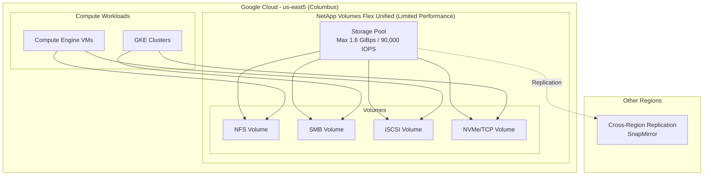

# Google Cloud NetApp Volumes: Flex Unified サービスレベルが us-east5 (Columbus) で利用可能に

**リリース日**: 2026-06-02

**サービス**: Google Cloud NetApp Volumes

**機能**: Flex Unified サービスレベル us-east5 リージョン対応 (Limited Performance)

**ステータス**: GA (一般提供)

📊 [このアップデートのインフォグラフィックを見る](https://takech9203.github.io/google-cloud-news-summary/infographic/20260602-netapp-volumes-flex-unified-us-east5.html)

## 概要

Google Cloud NetApp Volumes の Flex Unified サービスレベルが、us-east5 (Columbus, Ohio) リージョンで Limited Performance モードとして利用可能になりました。これにより、米国東部のオハイオ州コロンバスに拠点を持つ企業やワークロードが、NetApp の高性能エンタープライズストレージサービスを活用できるようになります。

Flex Unified は 2026年4月に GA となった NetApp Volumes の最新サービスレベルで、ブロックストレージとファイルストレージを統合し、NFSv3/v4.1/v4.2、SMB、iSCSI、NVMe/TCP の全プロトコルをサポートする柔軟なストレージソリューションです。Limited Performance リージョンでは、ストレージプールのピークパフォーマンスに上限が設けられますが、エンタープライズ向けの機能セットはフルに利用可能です。

今回の us-east5 追加により、Flex Unified Limited Performance リージョンは合計6リージョン (asia-northeast1、europe-west2、europe-west9、us-east5、us-west2、us-west3) に拡大しました。

**アップデート前の課題**

- us-east5 リージョンでは Flex Unified サービスレベルが利用できず、NetApp Volumes を使いたい場合は Flex File サービスレベルのみが選択肢だった
- Columbus 拠点のワークロードで統合ブロック+ファイルストレージが必要な場合、他リージョンにデプロイする必要がありレイテンシが増大していた
- iSCSI や NVMe/TCP プロトコルを必要とするワークロードを Columbus で実行することが困難だった

**アップデート後の改善**

- us-east5 リージョンで Flex Unified サービスレベルが利用可能になり、統合ストレージソリューションをコロンバスにデプロイ可能
- NFSv3/v4.1/v4.2、SMB、iSCSI、NVMe/TCP の全プロトコルが us-east5 で利用可能に
- ONTAP-mode を含む Flex Unified の全機能セットが利用可能 (パフォーマンス上限あり)

## アーキテクチャ図



この図は、us-east5 リージョンにおける Flex Unified ストレージプールの構成を示しています。Limited Performance モードではスループットが最大 1.6 GiBps、IOPS が最大 90,000 に制限されますが、全プロトコルと機能が利用可能です。

## サービスアップデートの詳細

### 主要機能

1. **Limited Performance モード**
   - ストレージプールのピークパフォーマンスが制限された状態で提供
   - 最大スループット: 1.6 GiBps (通常リージョンの 5 GiBps に対して制限)
   - 最大 IOPS: 90,000 (通常リージョンの 160,000 に対して制限)
   - 利用可能ゾーン: us-east5-b、us-east5-c

2. **マルチプロトコルサポート**
   - NFSv3/v4.1/v4.2: Linux ワークロード向け
   - SMB: Windows ワークロード向け
   - iSCSI: ブロックストレージアクセス
   - NVMe/TCP: 超低レイテンシブロックアクセス

3. **ONTAP-mode サポート**
   - NetApp ONTAP の管理機能をクラウドで利用可能
   - SnapMirror による外部レプリケーション
   - S3 マルチプロトコルサポート
   - 最小ボリュームサイズ 20 MiB から利用可能

## 技術仕様

### Flex Unified Limited Performance vs Custom Performance 比較

| 項目 | Limited Performance (us-east5) | Custom Performance (通常リージョン) |
|------|------|------|
| 最大スループット | 1.6 GiBps | 5 GiBps |
| 最大 IOPS | 90,000 | 160,000 |
| ストレージプール容量 | 1 ~ 425 TiB | 1 ~ 425 TiB |
| ボリュームサイズ | 1 GiB ~ 300 TiB | 1 GiB ~ 300 TiB |
| Large Capacity Volumes | 対応 (最大 20 PiB) | 対応 (最大 20 PiB) |
| プロトコル | NFSv3/v4.1/v4.2, SMB, iSCSI, NVMe/TCP | NFSv3/v4.1/v4.2, SMB, iSCSI, NVMe/TCP |
| SLA | 99.9% (Zonal) | 99.9% (Zonal) / 99.99% (Regional) |

### Flex Unified Limited Performance 対応リージョン一覧

| リージョン | ロケーション | 利用可能ゾーン |
|------|------|------|
| asia-northeast1 | 東京, 日本 | asia-northeast1-b, asia-northeast1-c |
| europe-west2 | ロンドン, 英国 | europe-west2-b, europe-west2-c |
| europe-west9 | パリ, フランス | europe-west9-a, europe-west9-b, europe-west9-c |
| us-east5 | コロンバス, 米国 | us-east5-b, us-east5-c |
| us-west2 | ロサンゼルス, 米国 | us-west2-b, us-west2-c |
| us-west3 | ソルトレイクシティ, 米国 | us-west3-a, us-west3-b, us-west3-c |

### ストレージプール作成の設定例

```bash
# gcloud CLI を使用した Flex Unified ストレージプール作成
gcloud netapp storage-pools create my-pool \
    --location=us-east5 \
    --service-level=FLEX \
    --capacity=2TiB \
    --network=my-vpc-network \
    --description="Flex Unified pool in Columbus"
```

## 設定方法

### 前提条件

1. Google Cloud プロジェクトが有効であること
2. NetApp Volumes API が有効化されていること
3. 適切な VPC ネットワークが us-east5 リージョンに設定されていること
4. 必要な IAM ロール (`roles/netapp.admin`) が付与されていること

### 手順

#### ステップ 1: API の有効化

```bash
gcloud services enable netapp.googleapis.com --project=PROJECT_ID
```

NetApp Volumes API を有効にします。

#### ステップ 2: ストレージプールの作成

```bash
gcloud netapp storage-pools create POOL_NAME \
    --location=us-east5 \
    --service-level=FLEX \
    --capacity=2TiB \
    --network=projects/PROJECT_ID/global/networks/VPC_NAME
```

us-east5 リージョンに Flex Unified ストレージプールを作成します。容量は 1 TiB 以上を指定してください。

#### ステップ 3: ボリュームの作成

```bash
gcloud netapp volumes create VOLUME_NAME \
    --location=us-east5 \
    --pool=POOL_NAME \
    --capacity=100GiB \
    --protocols=NFSV4
```

ストレージプール内にボリュームを作成します。プロトコルは用途に応じて選択してください。

## メリット

### ビジネス面

- **地理的カバレッジの拡大**: 米国中西部 (コロンバス) に拠点を持つ企業が、低レイテンシでエンタープライズストレージを利用可能
- **コスト効率**: Flex Unified の $0.105/GiB/月のカスタムプロビジョニング価格で、必要な容量とパフォーマンスのみを支払い
- **マイグレーション支援**: オンプレミスの NetApp ONTAP 環境からの移行先として us-east5 を選択可能

### 技術面

- **統合ストレージ**: ブロックとファイルを単一プラットフォームで管理し、運用の複雑さを削減
- **ONTAP-mode**: 既存の NetApp 運用スキルとツールをそのまま活用可能
- **自動階層化**: Large Capacity Volumes で auto-tiering により最大 20 PiB のデータを効率的に管理

## デメリット・制約事項

### 制限事項

- パフォーマンスが通常リージョンの約 32% (スループット) / 56% (IOPS) に制限される
- 利用可能ゾーンが us-east5-b と us-east5-c の 2 ゾーンに限定 (us-east5-a は非対応)
- Regional (マルチゾーン) 高可用性構成は Limited Performance リージョンでは利用制約がある可能性

### 考慮すべき点

- 高スループットを必要とするワークロード (例: 大規模 AI/ML データパイプライン) には通常リージョン (us-central1、us-east1 など) の利用を推奨
- Limited Performance の上限 (1.6 GiBps) がワークロード要件を満たすか事前に検証が必要
- 将来的にパフォーマンス上限が引き上げられる可能性があるが、現時点では保証されていない

## ユースケース

### ユースケース 1: オハイオ拠点企業のファイルサーバー移行

**シナリオ**: コロンバスに本社を置く企業が、オンプレミスの NetApp ファイラーを Google Cloud に移行したい。SMB/NFS の混在環境で、日常的なスループットは 500 MBps 程度。

**実装例**:
```bash
# SnapMirror を使用した移行レプリケーション設定
gcloud netapp volumes replications create my-replication \
    --location=us-east5 \
    --volume=my-volume \
    --destination-volume=projects/PROJECT/locations/us-east5/volumes/dest-vol \
    --replication-schedule=HOURLY
```

**効果**: 低レイテンシでのアクセスを維持しながら、オンプレミスからクラウドへのシームレスな移行を実現。1.6 GiBps の上限は日常的なファイルサーバーワークロードには十分。

### ユースケース 2: データベースバックエンドとしての iSCSI ボリューム

**シナリオ**: us-east5 で稼働する SQL Server や Oracle Database のブロックストレージとして、iSCSI プロトコルで接続する高可用性ストレージが必要。

**効果**: Flex Unified の iSCSI サポートにより、データベースワークロードに適したブロックストレージを提供。ONTAP-mode によるスナップショットとクローンで、開発/テスト環境の迅速な作成も可能。

## 料金

Flex Unified サービスレベルはカスタムプロビジョニングモデルを採用しており、容量とパフォーマンスを独立してスケーリングできます。

### 料金例

| 構成 | 月額料金 (概算) |
|--------|-----------------|
| 2 TiB ストレージプール | 約 $215/月 |
| 10 TiB ストレージプール | 約 $1,075/月 |
| 100 TiB ストレージプール | 約 $10,752/月 |

※ 基本料金は $0.105/GiB/月 (us-central1 基準)。パフォーマンス (スループット/IOPS) のプロビジョニングは追加料金が発生する場合があります。リージョンにより料金が異なる可能性があるため、最新の料金は公式料金ページを参照してください。

## 利用可能リージョン

今回のアップデートにより、Flex Unified サービスレベルの対応リージョンは以下の通りです:

**Custom Performance (フルパフォーマンス) リージョン** (16リージョン):
asia-northeast2, asia-south1, asia-southeast1, australia-southeast1, europe-west1, europe-west3, europe-west4, me-central2, me-west1, southamerica-east1, us-central1, us-east1, us-east4, us-south1, us-west1, us-west4

**Limited Performance リージョン** (6リージョン):
asia-northeast1, europe-west2, europe-west9, us-east5, us-west2, us-west3

## 関連サービス・機能

- **Flex File サービスレベル**: ファイルストレージに特化したサービスレベル。us-east5 では既に利用可能
- **ONTAP-mode**: Flex Unified プール上で NetApp ONTAP の管理操作を直接実行可能な新機能 (2026年4月 GA)
- **SnapMirror レプリケーション**: 外部 ONTAP システムとのレプリケーションや、クロスリージョンレプリケーションに対応
- **Large Capacity Volumes**: auto-tiering により最大 20 PiB の大容量ボリュームをサポート
- **Network Connectivity Center**: Producer VPC spoke による追加ネットワーク接続

## 参考リンク

- 📊 [インフォグラフィック](https://takech9203.github.io/google-cloud-news-summary/infographic/20260602-netapp-volumes-flex-unified-us-east5.html)
- [公式リリースノート](https://docs.cloud.google.com/release-notes#June_02_2026)
- [サービスレベルのドキュメント](https://docs.cloud.google.com/netapp/volumes/docs/discover/service-levels)
- [Limited Performance リージョン一覧](https://docs.cloud.google.com/netapp/volumes/docs/discover/service-levels#supported_regions_for_flex_unified_limited_performance)
- [料金ページ](https://cloud.google.com/netapp/volumes/pricing)
- [NetApp Volumes 概要](https://cloud.google.com/netapp-volumes)

## まとめ

Google Cloud NetApp Volumes の Flex Unified サービスレベルが us-east5 (Columbus) リージョンで Limited Performance モードとして利用可能になりました。パフォーマンス上限 (1.6 GiBps / 90,000 IOPS) はあるものの、全プロトコル対応と ONTAP-mode を含む完全な機能セットが利用でき、オハイオ州コロンバス拠点のエンタープライズワークロードに最適です。高スループット要件がある場合は通常リージョンの利用を推奨しますが、一般的なファイルサーバーやデータベースワークロードには十分なパフォーマンスを提供します。

---

**タグ**: #GoogleCloud #NetAppVolumes #FlexUnified #Storage #us-east5 #Columbus #LimitedPerformance #BlockStorage #FileStorage #iSCSI #NVMeTCP #NFS #SMB #ONTAP
