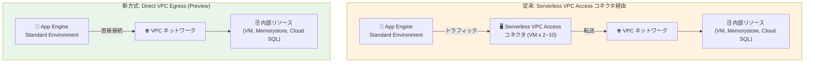

# App Engine Standard Environment: Direct VPC Egress (Preview)

**リリース日**: 2026-06-03

**サービス**: App Engine Standard Environment

**機能**: Direct VPC Egress

**ステータス**: Preview

📊 [このアップデートのインフォグラフィックを見る](https://takech9203.github.io/google-cloud-news-summary/20260603-app-engine-direct-vpc-egress-preview.html)

## 概要

App Engine Standard Environment において Direct VPC Egress が Preview として利用可能になった。Direct VPC Egress は、App Engine のワークロードから VPC ネットワークリソースへのアクセスを、従来の Serverless VPC Access コネクタを介さずに直接行える機能である。これにより、よりシンプルかつコスト効率の高い VPC ネットワーク接続が実現される。

対象ランタイムは Go、Java、Node.js、PHP、Python、Ruby の全 6 言語であり、App Engine Standard Environment を利用するほぼすべてのユーザーがこの機能の恩恵を受けられる。Cloud Run では既に GA となっている Direct VPC Egress が、ついに App Engine にも展開されたことで、Google Cloud のサーバーレスプラットフォーム全体で統一的な VPC 接続方式が利用可能になる方向へ進んでいる。

このアップデートは、VPC 内のプライベートリソース (Compute Engine VM、Memorystore インスタンス、Cloud SQL プライベート IP、オンプレミス接続先など) にアクセスする必要がある App Engine ユーザーにとって重要な選択肢を追加するものである。特に、コスト削減とアーキテクチャの簡素化を求める開発チームやインフラ担当者に影響がある。

**アップデート前の課題**

- App Engine から VPC ネットワークにアクセスするには、Serverless VPC Access コネクタの作成・管理が必須だった
- コネクタは最低 2 つの VM インスタンス (e2-micro 以上) を常時起動するため、トラフィックがなくても月額コストが発生していた
- コネクタ経由の接続は追加のネットワークホップによりレイテンシが増加していた
- ネットワークタグはコネクタレベルでしか設定できず、サービスごとのきめ細かいファイアウォール制御が困難だった
- コネクタのスケールアウト時に VPC トラフィックサージが発生し、追加インスタンスの作成中にネットワークレイテンシが生じていた
- コネクタはスケールインしないため、不要なインスタンスが残り続ける問題があった

**アップデート後の改善**

- Serverless VPC Access コネクタなしで、App Engine から VPC ネットワークへ直接トラフィックをルーティング可能になった
- VM インスタンスの追加コストが不要になり、ネットワーク Egress 料金のみで VPC 接続を実現できるようになった
- コネクタという中間コンポーネントが不要になり、低レイテンシ・高スループットの VPC 接続が可能になった
- サービスごとに個別のネットワークタグを設定でき、より粒度の細かいファイアウォール制御が可能になった
- アーキテクチャが簡素化され、コネクタの作成・監視・メンテナンスが不要になった

## アーキテクチャ図



従来方式では App Engine と VPC ネットワークの間に Serverless VPC Access コネクタ (専用 VM) が必要だったが、Direct VPC Egress により中間コンポーネントを排除し、App Engine から VPC ネットワークへ直接トラフィックをルーティングできるようになった。

## サービスアップデートの詳細

### 主要機能

1. **コネクタレスの VPC 接続**
   - Serverless VPC Access コネクタの作成・管理が不要
   - app.yaml の設定変更のみで VPC ネットワークへの接続を構成可能
   - コネクタ関連の API 有効化やリソースプロビジョニングが不要

2. **コスト効率の高い料金体系**
   - VM インスタンスのコンピューティング料金が不要
   - ネットワーク Egress 料金のみ課金
   - トラフィックがない場合はゼロコスト (App Engine 自体のスケーリングに連動)

3. **ネットワークタグによるきめ細かいセキュリティ制御**
   - サービスバージョンごとに固有のネットワークタグを割り当て可能
   - VPC ファイアウォールルールをサービスレベルで適用可能
   - 従来のコネクタレベルの共有タグより粒度の高い制御

4. **パフォーマンスの向上**
   - コネクタによる追加ホップの排除で低レイテンシを実現
   - より高いスループットを達成可能
   - App Engine インスタンスのオートスケーリングに連動した VPC 接続

5. **対応ランタイム**
   - Go
   - Java
   - Node.js
   - PHP
   - Python
   - Ruby

## 技術仕様

### Direct VPC Egress と Serverless VPC Access コネクタの比較

| 項目 | Direct VPC Egress | Serverless VPC Access コネクタ |
|------|-------------------|-------------------------------|
| レイテンシ | 低い | 高い |
| スループット | 高い | 低い |
| IP アドレス消費 | 多い (ケースによる) | 少ない |
| コスト | ネットワーク Egress 料金のみ | VM インスタンス料金 + ネットワーク Egress 料金 |
| ネットワークタグ | サービスごとに設定可能 | コネクタ単位で共有 |
| スケーリング | App Engine インスタンスに連動 | コネクタ独自のスケーリング (スケールインなし) |
| セットアップ | app.yaml の設定のみ | コネクタの作成・管理が必要 |
| ステータス (App Engine) | Preview | GA |

### Egress ルーティング設定

| 設定値 | 動作 |
|--------|------|
| `private-ranges-only` (デフォルト) | RFC 1918 / RFC 6598 の IP アドレスおよび内部 DNS 名宛のリクエストのみを VPC 経由でルーティング |
| `all-traffic` | すべてのアウトバウンドリクエストを VPC ネットワーク経由でルーティング |

## 設定方法

### 前提条件

1. Google Cloud プロジェクトに VPC ネットワークが存在すること
2. App Engine Standard Environment アプリケーションがデプロイ済みであること
3. 対象ランタイム (Go, Java, Node.js, PHP, Python, Ruby) を使用していること
4. Preview 機能の利用に同意していること

### 手順

#### ステップ 1: app.yaml の設定

```yaml
runtime: python312

vpc_access:
  egress: private-ranges-only  # または all-traffic
  network_interfaces:
    - network: my-vpc-network
      subnetwork: my-subnet
      tags:
        - my-app-tag
```

#### ステップ 2: デプロイ

```bash
gcloud app deploy
```

### 従来方式 (Serverless VPC Access コネクタ) との設定比較

**従来方式 (Serverless VPC Access コネクタ):**

```yaml
runtime: python312

vpc_access_connector:
  name: "projects/PROJECT_ID/locations/REGION/connectors/CONNECTOR_NAME"
  egress_setting: private-ranges-only
```

**新方式 (Direct VPC Egress):**

```yaml
runtime: python312

vpc_access:
  egress: private-ranges-only
  network_interfaces:
    - network: my-vpc-network
      subnetwork: my-subnet
```

## メリット

### ビジネス面

- **コスト削減**: Serverless VPC Access コネクタの VM インスタンス料金が不要。e2-micro 2 台構成でも月額約 $7.5 (us-central1) のコスト削減が見込める
- **運用負荷の軽減**: コネクタの作成・監視・メンテナンスが不要になり、インフラ管理工数が削減される
- **ゼロスケール対応**: トラフィックがない場合のコストがゼロであり、開発・テスト環境のコストを最小化できる

### 技術面

- **低レイテンシ**: コネクタ VM を経由しないため、VPC ネットワークへの接続レイテンシが低減
- **高スループット**: コネクタのインスタンスタイプによるスループット制限を受けない
- **きめ細かいセキュリティ**: サービスバージョンごとにネットワークタグを設定でき、VPC ファイアウォールルールで個別に制御可能
- **シンプルなアーキテクチャ**: 中間コンポーネントの排除により障害点が減少

## デメリット・制約事項

### 制限事項

- 現時点では Preview 段階であり、SLA の対象外
- 本番環境での利用は慎重な評価が必要
- IP アドレスの消費量が多くなる場合がある (各インスタンスが VPC サブネットから IP を消費)
- サブネットの IP アドレス空間を十分に確保する必要がある

### 考慮すべき点

- Preview から GA への移行時に設定変更が必要になる可能性がある
- 既存の Serverless VPC Access コネクタからの移行は段階的に行うことを推奨
- VPC ファイアウォールルールの見直しが必要 (コネクタの network tag からサービスの network tag への変更)
- Cloud Run では既に GA だが、App Engine ではまだ Preview であるため、リリースタイムラインに注意

## ユースケース

### ユースケース 1: Cloud SQL プライベート IP 接続

**シナリオ**: App Engine アプリケーションから Cloud SQL インスタンスにプライベート IP アドレスで接続する必要がある。従来は Serverless VPC Access コネクタが必須だったが、Direct VPC Egress により簡素化される。

**実装例**:
```yaml
runtime: python312

vpc_access:
  egress: private-ranges-only
  network_interfaces:
    - network: my-vpc
      subnetwork: my-subnet

env_variables:
  DB_HOST: "10.0.0.3"  # Cloud SQL プライベート IP
```

**効果**: コネクタの月額コストを削減しつつ、低レイテンシでの Cloud SQL 接続を実現

### ユースケース 2: Memorystore for Redis へのアクセス

**シナリオ**: App Engine のキャッシュレイヤーとして Memorystore for Redis を利用しており、内部 IP でのアクセスが必要。コネクタのスループット制限によりパフォーマンスが律速されていた。

**効果**: Direct VPC Egress により、コネクタのスループット制限を受けずに高速なキャッシュアクセスを実現。特に読み取り負荷の高いアプリケーションでレスポンスタイム改善が期待される。

### ユースケース 3: オンプレミスシステムとの Cloud VPN 連携

**シナリオ**: App Engine からオンプレミスのデータベースやサービスに Cloud VPN 経由でアクセスする必要がある。VPC ネットワークにルーティングした上で Cloud VPN トンネルを通じてオンプレミスに到達する構成。

**効果**: `all-traffic` ルーティング設定と組み合わせることで、すべてのトラフィックを VPC 経由で送信し、Cloud NAT による静的アウトバウンド IP の設定もコネクタなしで実現可能

## 料金

### Direct VPC Egress

- VM インスタンスのコンピューティング料金: なし
- ネットワーク Egress 料金のみ (VPC 内通信の標準料金)
- トラフィックがない場合: 追加料金なし

### Serverless VPC Access コネクタ (従来方式) との比較

| 構成 | 月額料金 (概算、us-central1) |
|------|------------------------------|
| Direct VPC Egress | ネットワーク Egress のみ (同一リージョン内は無料) |
| コネクタ (e2-micro x 2) | 約 $7.46/月 + ネットワーク Egress |
| コネクタ (e2-micro x 10) | 約 $37.30/月 + ネットワーク Egress |
| コネクタ (e2-standard-4 x 2) | 約 $97.09/月 + ネットワーク Egress |

詳細な料金については [VPC 料金ページ](https://cloud.google.com/vpc/pricing) を参照。

## 利用可能リージョン

App Engine Standard Environment が利用可能なすべてのリージョンで Direct VPC Egress が利用可能。主なリージョンは以下の通り:

- us-central1 (アイオワ)
- us-east1 (サウスカロライナ)
- us-west1 (オレゴン)
- europe-west1 (ベルギー)
- europe-west2 (ロンドン)
- asia-northeast1 (東京)
- asia-northeast2 (大阪)
- asia-southeast1 (シンガポール)

詳細は [App Engine のロケーション](https://cloud.google.com/appengine/docs/standard/locations) を参照。

## 関連サービス・機能

- **Cloud Run Direct VPC Egress**: Cloud Run では既に GA。App Engine 版は同じコンセプトをベースとしている
- **Cloud Run functions Direct VPC Egress**: 第 2 世代関数では 2026 年 2 月に GA
- **Serverless VPC Access**: 従来の VPC 接続方式。Direct VPC Egress が利用可能になった後も引き続きサポートされる
- **Cloud NAT**: Direct VPC Egress と組み合わせて、App Engine からの静的アウトバウンド IP アドレスを構成可能
- **VPC ファイアウォールルール**: ネットワークタグとの組み合わせでサービスごとのトラフィック制御を実現
- **Shared VPC**: Direct VPC Egress は Shared VPC ネットワークとの連携もサポート (Cloud Run で実績あり)

## 参考リンク

- 📊 [インフォグラフィック](https://takech9203.github.io/google-cloud-news-summary/20260603-app-engine-direct-vpc-egress-preview.html)
- [公式リリースノート](https://cloud.google.com/release-notes#June_03_2026)
- [App Engine Direct VPC Egress ドキュメント](https://cloud.google.com/appengine/docs/standard/vpc-direct-vpc)
- [Direct VPC Egress とコネクタの比較](https://cloud.google.com/appengine/docs/standard/compare-direct-vpc-egress-connectors)
- [App Engine VPC 接続 (Serverless VPC Access)](https://cloud.google.com/appengine/docs/standard/connecting-vpc)
- [Cloud Run Direct VPC Egress](https://cloud.google.com/run/docs/configuring/vpc-direct-vpc)
- [Serverless VPC Access 料金](https://cloud.google.com/vpc/pricing#serverless-vpc-pricing)

## まとめ

App Engine Standard Environment における Direct VPC Egress の Preview リリースは、サーバーレスプラットフォームから VPC ネットワークへの接続方式の大きな進歩である。Serverless VPC Access コネクタの VM コスト削減、セットアップの簡素化、パフォーマンス向上を同時に実現する。Cloud Run、Cloud Run functions に続き App Engine にも展開されたことで、Google Cloud のサーバーレス全体で統一的な VPC 接続体験が提供される方向に向かっている。現時点では Preview であるため、本番環境への適用は GA を待つことが推奨されるが、開発・テスト環境での評価を早期に開始し、移行計画を策定しておくことを推奨する。

---

**タグ**: #AppEngine #DirectVPCEgress #VPC #ネットワーキング #サーバーレス #Preview #コスト最適化
