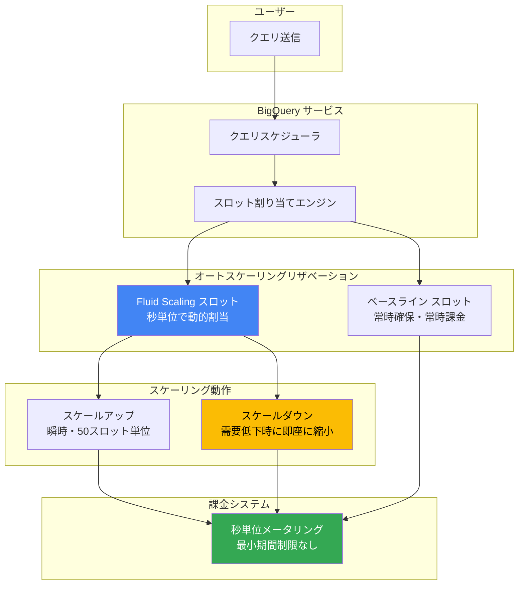

# BigQuery: Fluid Scaling が GA (一般提供)

**リリース日**: 2026-06-03

**サービス**: BigQuery

**機能**: BigQuery Fluid Scaling (秒単位課金・最小期間制限なし)

**ステータス**: Generally Available (GA)

📊 [このアップデートのインフォグラフィックを見る](https://takech9203.github.io/google-cloud-news-summary/20260603-bigquery-fluid-scaling-ga.html)

## 概要

BigQuery の Fluid Scaling が GA (一般提供) になりました。Fluid Scaling は、オートスケーリングリザベーションにおいて秒単位の課金を実現し、従来の 1 分間の最小課金期間を撤廃する画期的な機能です。これにより、短時間で完了するクエリに対しても実際の使用時間に正確に対応した課金が行われるようになり、コスト効率が大幅に改善されます。

Fluid Scaling は BigQuery のキャパシティベース課金モデルにおける重要な進化です。従来のオートスケーリングでは、スロットがスケールアップした後、最低 60 秒間はそのキャパシティが保持されていたため、数秒で完了するクエリでも 1 分間分の料金が発生していました。Fluid Scaling ではこの制約が解消され、真の秒単位課金が実現されます。

本機能は、断続的なクエリワークロード、短時間のアドホック分析、バースト的なデータ処理パイプラインを実行するデータエンジニア、データアナリスト、プラットフォームチームに特に有益です。

**アップデート前の課題**

- オートスケーリングリザベーションには 1 分間の最小スケールダウンウィンドウがあり、数秒のクエリでも 60 秒分の課金が発生していた
- スロットは 50 スロット単位でスケールアップし、実際の使用量より多いスロット数で課金されることがあった
- 短時間のクエリを連続して実行すると、各クエリがスケールダウンウィンドウをリセットし、不要なコストが蓄積した
- コスト最適化のためにクエリをバッチ処理にまとめる運用上の工夫が必要だった

**アップデート後の改善**

- 最小課金期間が撤廃され、秒単位で正確に課金されるようになった
- 短時間クエリのコスト効率が劇的に改善され、数秒のクエリには数秒分のみ課金される
- クエリのバッチ化やタイミング調整といった運用上の回避策が不要になった
- オンデマンド課金とキャパシティベース課金の間のコストギャップが縮小し、キャパシティモデルの採用が容易になった

## アーキテクチャ図



Fluid Scaling では、オートスケーリングされたスロットが秒単位で課金され、従来の 60 秒最小保持期間が不要になります。クエリが完了すると即座にスケールダウンが可能となり、実際の使用時間のみが課金対象となります。

## サービスアップデートの詳細

### 主要機能

1. **秒単位課金 (Per-second Billing)**
   - オートスケーリングスロットの使用が真の秒単位で課金される
   - 従来の 1 分間最小課金期間が完全に撤廃
   - クエリが 5 秒で完了すれば 5 秒分のみ課金

2. **最小期間制限の撤廃 (No Minimum Duration)**
   - スケールダウンウィンドウの 60 秒制約がなくなった
   - 需要が低下すると即座にキャパシティを縮小可能
   - 連続する短時間クエリでも各クエリの実行時間のみが課金対象

3. **既存オートスケーリングとの互換性**
   - 50 スロット単位のスケールアップ粒度は維持
   - ベースラインスロットとの併用が引き続き可能
   - Enterprise / Enterprise Plus エディションで利用可能

4. **瞬時スケーリング**
   - BigQuery はほぼ瞬時にリザベーションをスケーリング
   - ワークロードの需要に応じてスロット数を自動調整
   - 複数ステップで一度に大量のスロットを追加可能

## 技術仕様

### 課金モデル比較

| 項目 | 従来のオートスケーリング | Fluid Scaling (今回の GA) |
|------|--------------------------|---------------------------|
| 最小課金期間 | 60 秒 | なし (秒単位) |
| スケールダウン遅延 | 60 秒のスケールダウンウィンドウ | 即座にスケールダウン |
| スケールアップ粒度 | 50 スロット単位 | 50 スロット単位 |
| 課金単位 | スロット時間 (slot-hours) | スロット秒 (slot-seconds) |
| ベースラインスロット | サポート | サポート |
| コミットメント割引 | 対応 | 対応 |

### エディション別対応状況

| エディション | Fluid Scaling 対応 | 最大リザベーションサイズ |
|--------------|-------------------|--------------------------|
| Standard | 対応 | 1,600 スロット |
| Enterprise | 対応 | リージョンクォータまで |
| Enterprise Plus | 対応 | リージョンクォータまで |
| On-demand | 非対応 (リザベーション不要) | - |

### リザベーション設定例

```json
{
  "name": "projects/my-project/locations/us/reservations/fluid-scaling-demo",
  "slot_capacity": 500,
  "autoscale": {
    "max_slots": 500
  },
  "edition": "ENTERPRISE",
  "fluid_scaling": true
}
```

## 設定方法

### 前提条件

1. BigQuery の Enterprise または Enterprise Plus エディションが有効であること
2. `bigquery.reservations.create` 権限を持つ IAM ロール (例: BigQuery Admin)
3. リザベーション管理用のプロジェクトが存在すること

### 手順

#### ステップ 1: Fluid Scaling 対応リザベーションの作成

```bash
bq mk \
  --project_id=my-admin-project \
  --location=us \
  --reservation \
  --slots=0 \
  --autoscale_max_slots=500 \
  --edition=ENTERPRISE \
  --fluid_scaling=true \
  my_fluid_reservation
```

ベースラインスロットを 0 に設定し、最大オートスケーリングスロット数を指定します。`--fluid_scaling=true` フラグにより秒単位課金が有効になります。

#### ステップ 2: リザベーションアサインメントの作成

```bash
bq mk \
  --project_id=my-admin-project \
  --location=us \
  --reservation_assignment \
  --reservation_id=my_fluid_reservation \
  --job_type=QUERY \
  --assignee_id=my-analytics-project \
  --assignee_type=PROJECT
```

対象プロジェクトをリザベーションに割り当て、クエリジョブが Fluid Scaling リザベーションを使用するよう構成します。

#### ステップ 3: 動作確認とモニタリング

```sql
-- INFORMATION_SCHEMA でオートスケーリングの動作を確認
SELECT
  reservation_id,
  period_start,
  s.autoscale_current_slots AS autoscale_slot_seconds
FROM
  `region-us.INFORMATION_SCHEMA.RESERVATIONS_TIMELINE` m
JOIN m.per_second_details s
WHERE
  period_start >= TIMESTAMP_SUB(CURRENT_TIMESTAMP(), INTERVAL 1 HOUR)
ORDER BY period_start DESC;
```

## メリット

### ビジネス面

- **コスト削減**: 短時間クエリにおいて最大 90% 以上のコスト削減が期待できる (例: 5 秒のクエリが従来 60 秒分課金されていたものが 5 秒分に)
- **予測可能性の向上**: 実際のリソース使用量と課金が正確に一致するため、予算計画が容易
- **導入障壁の低下**: キャパシティベースモデルの「1 分最小」による割高感が解消され、オンデマンドからの移行を検討しやすくなった

### 技術面

- **運用の簡素化**: クエリバッチ化やスケジューリングの最適化が不要になり、アプリケーション設計がシンプルに
- **アーキテクチャの柔軟性**: マイクロクエリやイベント駆動型パイプラインでキャパシティモデルを採用しやすくなった
- **リソース効率**: 未使用スロットの保持期間が最小化され、組織全体のリソース効率が向上

## デメリット・制約事項

### 制限事項

- Fluid Scaling はオートスケーリングリザベーション専用であり、ベースラインスロット部分には適用されない (ベースラインは常時課金)
- スケールアップの粒度は引き続き 50 スロット単位のため、50 スロット未満の需要でも 50 スロット分が課金される
- キャパシティの可用性は保証されない (ベースラインスロットでのみ容量保証が可能)
- On-demand 課金モデルでは利用不可 (リザベーションの作成が必須)

### 考慮すべき点

- 高頻度の短時間クエリが多い環境では、ベースラインスロットの併用による容量保証とコミットメント割引の検討が推奨される
- キャパシティ優先順位は変更なし (Enterprise Plus > Enterprise > Standard)。ピーク時に Standard エディションではスロット確保が遅延する可能性がある
- 既存のコスト見積もりスクリプトや予算アラートの閾値を Fluid Scaling に合わせて調整する必要がある

## ユースケース

### ユースケース 1: アドホック分析ワークロード

**シナリオ**: データアナリストチームが日中に断続的にクエリを実行。各クエリは 3-15 秒で完了するが、クエリ間に数分の間隔がある。

**実装例**:
```bash
# ベースライン 0、オートスケーリング最大 200 スロットの Fluid Scaling リザベーション
bq mk \
  --location=us \
  --reservation \
  --slots=0 \
  --autoscale_max_slots=200 \
  --edition=ENTERPRISE \
  --fluid_scaling=true \
  adhoc_analytics
```

**効果**: 従来は各クエリに 60 秒分の課金が発生していたが、Fluid Scaling により実行時間 (3-15 秒) のみの課金となり、アドホック分析のコストが 75-95% 削減される。

### ユースケース 2: イベント駆動型データパイプライン

**シナリオ**: Pub/Sub からのイベントトリガーで BigQuery クエリが実行される。1 回のクエリ実行時間は 2-8 秒だが、1 時間あたり数百回のトリガーが発生する。

**効果**: 各クエリの実行時間のみが課金対象となるため、パイプライン全体のコンピュートコストが大幅に削減される。特にイベント頻度が低い夜間帯では事実上ゼロコストに近づく。

### ユースケース 3: マルチテナント SaaS プラットフォーム

**シナリオ**: SaaS プロバイダーが各テナントのクエリをキャパシティモデルで分離管理。テナントごとのクエリは短時間だが、多数のテナントからの同時リクエストがある。

**効果**: テナントごとの正確なコスト配賦が可能になり、実際の使用量に基づく課金をテナントに転嫁できる。従来の 1 分間最小課金による過剰請求の問題が解消される。

## 料金

Fluid Scaling の料金はエディション別のスロット時間単価に基づき、秒単位で計算されます。

### 料金体系 (Pay-as-you-go レート)

| エディション | 1 スロット時間あたり (USD) | 1 スロット秒あたり (USD, 換算) |
|--------------|---------------------------|-------------------------------|
| Standard | $0.04 | $0.0000111 |
| Enterprise | $0.06 | $0.0000167 |
| Enterprise Plus | $0.10 | $0.0000278 |

### 料金例 (Enterprise エディション)

| シナリオ | 従来 (1分最小) | Fluid Scaling | 削減率 |
|----------|---------------|---------------|--------|
| 100 スロット x 5 秒クエリ | 100 slot-min = $0.10 | 100 slots x 5sec = $0.0083 | 約 92% |
| 200 スロット x 30 秒クエリ | 200 slot-min = $0.20 | 200 slots x 30sec = $0.10 | 約 50% |
| 500 スロット x 60 秒クエリ | 500 slot-min = $0.50 | 500 slots x 60sec = $0.50 | 0% (同等) |

注: コミットメント (1 年: 20% 割引、3 年: 40% 割引) を利用することでさらにコスト削減が可能です。

## 利用可能リージョン

Fluid Scaling は BigQuery エディション (Standard / Enterprise / Enterprise Plus) が利用可能な全リージョンおよびマルチリージョンで利用できます。主要なロケーションは以下の通りです。

- **マルチリージョン**: US、EU
- **北米**: us-central1、us-east1、us-east4、us-west1、us-west2 など
- **ヨーロッパ**: europe-west1、europe-west2、europe-north1 など
- **アジア太平洋**: asia-northeast1 (東京)、asia-northeast3 (ソウル)、asia-southeast1 (シンガポール) など

## 関連サービス・機能

- **BigQuery Editions**: Fluid Scaling はエディション (Standard / Enterprise / Enterprise Plus) のリザベーションで動作する基盤機能
- **BigQuery Reservations**: スロット割り当ておよびワークロード管理の仕組み。Fluid Scaling はリザベーション内のオートスケーリング動作を拡張
- **BigQuery Slots Autoscaling**: 需要に応じてスロットを自動的にスケールアップ/ダウンする機能。Fluid Scaling はこの課金粒度を改善
- **Capacity Commitments**: 1 年 / 3 年のコミットメントによる割引。Fluid Scaling と併用してさらにコスト最適化が可能
- **BigQuery INFORMATION_SCHEMA**: リザベーションタイムラインビューで Fluid Scaling の動作を秒単位でモニタリング可能

## 参考リンク

- 📊 [インフォグラフィック](https://takech9203.github.io/google-cloud-news-summary/20260603-bigquery-fluid-scaling-ga.html)
- [公式リリースノート](https://docs.cloud.google.com/release-notes#June_03_2026)
- [BigQuery スロットオートスケーリング ドキュメント](https://docs.cloud.google.com/bigquery/docs/slots-autoscaling-intro)
- [BigQuery エディション](https://docs.cloud.google.com/bigquery/docs/editions-intro)
- [BigQuery リザベーション](https://docs.cloud.google.com/bigquery/docs/reservations-intro)
- [BigQuery 料金](https://cloud.google.com/bigquery/pricing#capacity_compute_analysis_pricing)

## まとめ

BigQuery Fluid Scaling の GA は、キャパシティベース課金モデルの最も大きな課題であった「1 分間最小課金期間」を解消する重要なアップデートです。秒単位の正確な課金により、特に短時間クエリが多いワークロードでは劇的なコスト削減が実現され、オンデマンドモデルとキャパシティモデルの選択がより柔軟になります。既存のオートスケーリングリザベーションを利用している組織は、Fluid Scaling への移行を検討し、コスト最適化の効果を評価することを推奨します。

---

**タグ**: #BigQuery #FluidScaling #Autoscaling #PerSecondBilling #コスト最適化 #GA #Reservations #Slots
