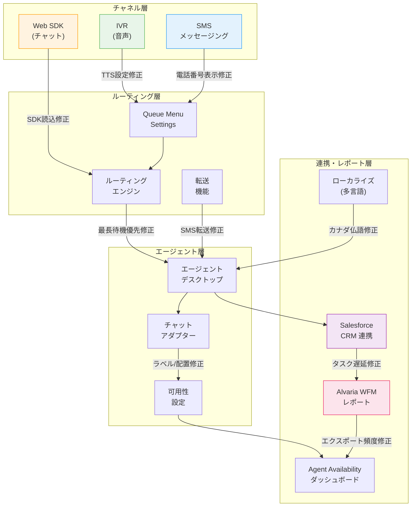

# Google Cloud Contact Center as a Service (CCaaS): 2026年6月バグ修正リリース

**リリース日**: 2026-06-03

**サービス**: Google Cloud Contact Center as a Service (CCaaS)

**機能**: 複数コンポーネントにわたるバグ修正 (11件)

**ステータス**: Fixed

[このアップデートのインフォグラフィックを見る](https://takech9203.github.io/google-cloud-news-summary/20260603-ccaas-bug-fixes-june.html)

## 概要

Google Cloud Contact Center as a Service (CCaaS) において、オムニチャネルコンタクトセンター運用に影響する11件のバグ修正がリリースされた。今回の修正は、SMS チャット転送、IVR キュー設定、エージェントルーティング、Workforce Management (WFM) レポート、Web SDK、CRM 連携など、プラットフォームの広範なコンポーネントに及んでいる。

CCaaS は Google Cloud のエンタープライズ向けオムニチャネルコンタクトセンターソリューションであり、音声、チャット、SMS、メールなど複数チャネルを統合管理する。今回の修正により、エージェントの生産性、顧客体験、および管理者のオペレーション効率が改善される。

特に、SMS チャット転送の不具合修正 (2件)、エージェントルーティングロジックの修正、Web SDK の読み込み問題の解消は、顧客対応の継続性と可用性に直接影響する重要な修正である。

**アップデート前の課題**

- カナダフランス語の翻訳が英語で表示され、フランス語圏の顧客・エージェントが正しいローカライズされた UI を利用できなかった
- Alvaria WFM Agent Performance レポートが毎日ではなく毎分エクスポートされ、ストレージと処理に不要な負荷が発生していた
- Agent Availability ダッシュボードの Agent Preferences テーブルが更新されず、管理者がエージェントの可用性設定変更をリアルタイムで把握できなかった
- SMS チャットの転送ボタンがエラーを表示し、エージェントが SMS チャットを転送できなかった
- Salesforce タスク作成の遅延により、チケット ID の更新にラグが発生していた
- 新しくサインインしたエージェントに着信チャットがルーティングされ、最長待機エージェントへの適切な分配が行われていなかった
- チャットアダプターのメッセージにラベル/配置が適用されず、エージェントとエンドユーザーの区別がつきにくかった
- IVR Queue Menu Settings で Text-to-Speech のテキスト入力フィールドが表示されなかった
- SMS Queue Menu Settings で電話番号が表示されなかった
- Web SDK が読み込まれず、Web チャネル経由の顧客接点が機能しなかった

**アップデート後の改善**

- カナダフランス語の翻訳が正しく表示されるようになった
- Alvaria WFM Agent Performance レポートが設計通り毎日エクスポートされるようになった
- Agent Availability ダッシュボードの Agent Preferences テーブルがリアルタイムで更新されるようになった
- SMS チャットの転送ボタンが正常に動作し、転送プロセスが開始されるようになった
- Salesforce タスク作成の遅延が解消され、チケット ID が速やかに更新されるようになった
- 着信チャットが最長待機エージェントに正しくルーティングされるようになった
- チャットアダプターでエージェントとエンドユーザーのメッセージが適切にラベル付け・配置されるようになった
- IVR Queue Menu Settings で Text-to-Speech テキスト入力フィールドが正しく表示されるようになった
- SMS Queue Menu Settings で電話番号が正しく表示されるようになった
- Web SDK が正常に読み込まれるようになった

## アーキテクチャ図

今回の修正は CCaaS プラットフォームの4つの主要層 (チャネル層、ルーティング層、エージェント層、連携・レポート層) にわたる。図中の各接続線は修正が適用されたデータフローを示している。

## サービスアップデートの詳細

### 主要機能修正

#### チャネル・SDK 関連 (3件)

1. **Web SDK 読み込み不具合の修正**
   - Web SDK が完全に読み込まれない問題を解消
   - Web チャネル経由の顧客接点 (チャット、VoIP) が正常に機能するようになった
   - 影響範囲: Web SDK を組み込んだすべてのウェブアプリケーション

2. **IVR Queue Menu Settings - TTS テキスト入力フィールド表示修正**
   - IVR キュー設定画面で Text-to-Speech のテキスト入力フィールドが表示されない問題を修正
   - 管理者が IVR メニューの音声案内テキストを設定・変更できるようになった

3. **SMS Queue Menu Settings - 電話番号表示修正**
   - SMS キューメニュー設定で電話番号が表示されない問題を修正
   - SMS チャネルの正しい設定・管理が可能になった

#### エージェントルーティング・転送関連 (4件)

4. **SMS チャット転送ボタンのエラー修正**
   - SMS チャットの転送ボタンをクリックした際にエラーが表示され転送が開始されない問題を修正
   - 転送ボタンが正常に転送プロセスを開始するようになった

5. **SMS チャット転送不能の修正**
   - エージェントが SMS チャットを他のエージェントやキューに転送できない問題を修正
   - SMS チャネルでの転送機能が復旧した

6. **着信チャットのルーティングロジック修正**
   - 新しくサインインしたエージェントに着信チャットがルーティングされる問題を修正
   - 本来の「最長待機エージェント優先 (Longest Available)」ルーティングが正しく機能するようになった

7. **チャットアダプターのメッセージラベル・配置修正**
   - チャットアダプターで送受信メッセージにラベルが付与されず、エージェント側とエンドユーザー側の区別がつかない問題を修正
   - メッセージの送信者が視覚的に明確に区別されるようになった

#### CRM 連携・レポート関連 (2件)

8. **Salesforce タスク作成遅延の修正**
   - Salesforce 連携でタスク作成に遅延が発生し、チケット ID の更新にラグが生じていた問題を修正
   - エージェントがリアルタイムで正確なチケット情報を確認できるようになった

9. **Alvaria WFM Agent Performance レポートエクスポート頻度の修正**
   - Agent Performance レポートが毎日ではなく毎分エクスポートされていた問題を修正
   - 設計通りの日次エクスポートスケジュールに戻った

#### ダッシュボード・UI 関連 (2件)

10. **Agent Availability ダッシュボード - Agent Preferences テーブル更新修正**
    - Agent Preferences テーブルがリアルタイムで更新されない問題を修正
    - 管理者がエージェントの可用性設定変更をダッシュボードで即座に確認できるようになった

11. **カナダフランス語翻訳の修正**
    - カナダフランス語 (fr-CA) のローカライズされた翻訳が英語で表示される問題を修正
    - フランス語圏カナダのユーザーに対して正しいローカライズ体験が提供されるようになった

## 技術仕様

### 修正対象コンポーネント一覧

| カテゴリ | 修正対象 | 影響度 | 影響チャネル |
|----------|----------|--------|--------------|
| チャネル | Web SDK 読み込み | 高 | Web |
| チャネル | IVR Queue Menu - TTS フィールド | 中 | IVR (音声) |
| チャネル | SMS Queue Menu - 電話番号 | 中 | SMS |
| ルーティング | SMS 転送ボタンエラー | 高 | SMS |
| ルーティング | SMS 転送不能 | 高 | SMS |
| ルーティング | チャットルーティングロジック | 高 | Web/Mobile チャット |
| エージェント UI | チャットアダプターラベル | 中 | チャット全般 |
| CRM 連携 | Salesforce タスク遅延 | 中 | 全チャネル |
| レポート | Alvaria WFM エクスポート頻度 | 中 | - |
| ダッシュボード | Agent Preferences テーブル | 低 | - |
| ローカライズ | カナダフランス語 | 低 | 全チャネル |

### ルーティングロジック

CCaaS のルーティングエンジンは、以下の優先順位でエージェントを選択する:

1. **転送セッション** (デフォルトで優先、FIFO 設定で変更可能)
2. **最長待機エージェント** (Longest Available Agent)
3. **スキルベースマッチング**

今回の修正により、項目2の「最長待機エージェント」ロジックが着信チャットに対して正しく適用されるようになった。

## メリット

### ビジネス面

- **顧客体験の向上**: Web SDK の復旧と SMS 転送機能の修正により、顧客がチャネルを問わずシームレスにサポートを受けられるようになった
- **エージェント生産性の回復**: ルーティングの正常化と転送機能の復旧により、エージェントが効率的に顧客対応を行えるようになった
- **レポート精度の改善**: WFM レポートの正しいエクスポートスケジュールにより、正確なパフォーマンス分析が可能になった
- **多言語対応の品質向上**: カナダフランス語翻訳の修正により、カナダ市場でのサービス品質が回復した

### 技術面

- **プラットフォーム安定性の向上**: 11件のバグ修正により、CCaaS プラットフォーム全体の安定性が向上した
- **CRM 連携の信頼性改善**: Salesforce タスク作成遅延の解消により、データ同期の信頼性が向上した
- **管理ツールの正確性回復**: ダッシュボードとキュー設定画面の修正により、管理者が正確な情報に基づいて運用判断を行えるようになった

## デメリット・制約事項

### 制限事項

- 今回のリリースは既存バグの修正であり、新機能の追加は含まれない
- 修正の適用には CCaaS インスタンスの自動アップデートを待つ必要がある (手動適用不可)

### 考慮すべき点

- SMS チャット転送に関して2件の修正が含まれており、関連する転送ワークフローのテストを推奨
- Alvaria WFM レポートのエクスポート設定を使用している場合、修正後のエクスポートスケジュールが意図通りであることを確認することを推奨
- Web SDK を利用している場合、修正適用後にクライアントサイドのキャッシュクリアが必要な場合がある

## ユースケース

### ユースケース 1: SMS チャネルでの顧客対応フロー

**シナリオ**: 顧客が SMS でサポートに連絡し、一次対応エージェントが専門チームへ転送する必要がある場合

**修正前の問題**: 転送ボタンをクリックするとエラーが表示され、転送が実行されなかった。エージェントは顧客に折り返し連絡するか、別チャネルへの誘導を余儀なくされていた。

**修正後の動作**: 転送ボタンが正常に動作し、SMS チャットセッションを他のエージェントまたはキューにシームレスに転送できるようになった。

**効果**: SMS チャネルでの顧客対応の継続性が確保され、顧客が同じコンテキストを維持したまま適切な担当者に接続される。

### ユースケース 2: 大規模コンタクトセンターでのチャットルーティング

**シナリオ**: 多数のエージェントがサインインしている大規模コンタクトセンターで、チャット着信が公平に分配される必要がある場合

**修正前の問題**: 新しくサインインしたエージェントに着信チャットが優先的にルーティングされ、長時間待機しているエージェントに着信が届かなかった。

**修正後の動作**: Longest Available Agent ルーティングが正しく機能し、最も長く待機しているエージェントから順にチャットが割り当てられる。

**効果**: エージェント間の負荷が公平に分散され、特定のエージェントへの負荷集中が解消される。

### ユースケース 3: Salesforce 連携を活用した顧客情報管理

**シナリオ**: Salesforce を CRM として連携しているコンタクトセンターで、エージェントが通話中にリアルタイムでチケット情報を参照する必要がある場合

**修正前の問題**: Salesforce タスク作成に遅延が発生し、チケット ID の更新が遅れることで、エージェントが最新の情報を参照できなかった。

**修正後の動作**: タスク作成がリアルタイムで完了し、チケット ID が即座に更新される。

**効果**: エージェントが通話中に正確な顧客情報にアクセスでき、対応品質と効率が向上する。

## 料金

Google Cloud CCaaS の料金はサブスクリプションベースであり、エージェント数やチャネル構成に基づく。今回のバグ修正リリースに伴う追加料金は発生しない。

詳細な料金については [Google Cloud 営業チームへのお問い合わせ](https://cloud.google.com/contact) が必要。

## 利用可能リージョン

CCaaS は複数の国と Google Cloud リージョンで利用可能。利用可能なロケーションの一覧は [公式ロケーションページ](https://docs.cloud.google.com/contact-center/ccai-platform/docs/localities) を参照。

## 関連サービス・機能

- **Dialogflow CX**: CCaaS の仮想エージェント (Virtual Agent) を構築するための会話型 AI プラットフォーム。IVR や Web チャットの自動応答に使用される。
- **Agent Assist**: 通話・チャット中にエージェントにリアルタイムで提案や次のステップを提示する AI 機能。
- **Customer Experience Insights (CCAI Insights)**: 自然言語処理を使用してコンタクトセンターのデータからパターンを検出・可視化する。
- **Salesforce Service Cloud**: CCaaS と連携する CRM プラットフォーム。タスク・ケース管理、エージェントアダプターとの統合を提供。
- **Alvaria Workforce Management**: エージェントのスケジューリング、予測、パフォーマンス分析を行うサードパーティ WFM ツール。CCaaS からのデータエクスポートと連携する。

## 参考リンク

- [このアップデートのインフォグラフィック](https://takech9203.github.io/google-cloud-news-summary/20260603-ccaas-bug-fixes-june.html)
- [公式リリースノート](https://docs.cloud.google.com/release-notes#June_03_2026)
- [CCaaS ドキュメント](https://docs.cloud.google.com/contact-center/ccai-platform/docs)
- [CCaaS 概要ページ](https://cloud.google.com/solutions/contact-center-as-a-service)
- [FIFO キュールーティング設定](https://docs.cloud.google.com/contact-center/ccai-platform/docs/fifo-queue-routing)
- [Salesforce 連携ガイド](https://docs.cloud.google.com/contact-center/ccai-platform/docs/salesforce-integration-guide)
- [Agent Availability ダッシュボード](https://docs.cloud.google.com/contact-center/ccai-platform/docs/dashboards-agent-availability)
- [キュー転送制限設定](https://docs.cloud.google.com/contact-center/ccai-platform/docs/restrict-queue-transfers)

## まとめ

今回の CCaaS バグ修正リリースは、SMS 転送、ルーティング、Web SDK、CRM 連携、WFM レポートなどプラットフォームの広範なコンポーネントに影響する11件の修正を含む。特に Web SDK の読み込み不具合、SMS チャット転送エラー、チャットルーティングロジックの修正は顧客対応の可用性と品質に直結するため、CCaaS を利用する組織は修正の適用状況を確認し、影響を受けていた機能の動作テストを実施することを推奨する。

---

**タグ**: #GoogleCloud #CCaaS #ContactCenter #BugFix #SMS #IVR #WebSDK #Salesforce #WorkforceManagement #AgentRouting #CCAI
