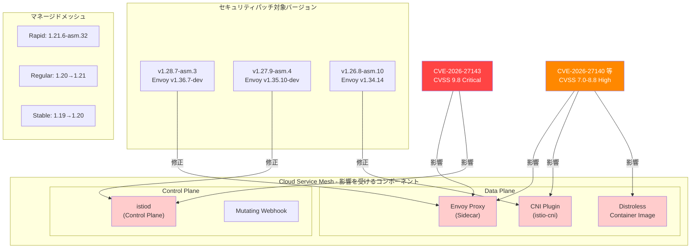

# Cloud Service Mesh: Security Patches (June 2026)

**リリース日**: 2026-06-03

**サービス**: Cloud Service Mesh

**機能**: Security Patches (June 2026)

**ステータス**: Security Update

📊 [このアップデートのインフォグラフィックを見る](https://takech9203.github.io/google-cloud-news-summary/20260603-cloud-service-mesh-security-patches-june-2026.html)

## 概要

Google Cloud は 2026年6月3日、Cloud Service Mesh の複数バージョンに対して重大なセキュリティパッチをリリースしました。このアップデートは、CVSS スコア 9.8（Critical）を含む合計16件以上の CVE に対応するものであり、Envoy プロキシ、コントロールプレーン、Distroless イメージ、CNI プラグインの全コンポーネントに影響します。

今回のセキュリティパッチは、インクラスタ版（1.28.x、1.27.x、1.26.x）およびマネージドメッシュの全チャネル（rapid、regular、stable）を対象としており、すべてのCloud Service Mesh ユーザーに対して即時適用が強く推奨されます。特に CVE-2026-27143（CVSS 9.8）は認証なしでリモートから悪用可能な脆弱性であり、対応の緊急度が極めて高い状況です。

影響を受けるユーザーは、マイクロサービスアーキテクチャを GKE 上で運用し、サービスメッシュによる mTLS 通信やトラフィック管理を行っているすべての組織です。

**アップデート前の課題**

- 複数の Critical/High レベルの脆弱性が Envoy プロキシおよびコントロールプレーンに存在し、認証バイパスやサービス拒否攻撃のリスクがあった
- Distroless コンテナイメージにも脆弱性が存在し、コンテナエスケープの可能性があった
- CNI プラグインの脆弱性により、ネットワークポリシーの迂回リスクが存在していた

**アップデート後の改善**

- CVE-2026-27143（Critical、CVSS 9.8）を含む16件以上の脆弱性が修正され、リモートコード実行のリスクが排除された
- Envoy プロキシが最新のセキュリティ修正版（v1.36.7-dev、v1.35.10-dev、v1.34.14）にアップデートされた
- マネージドメッシュ利用者は自動ローリングアップデートにより、手動介入なしでセキュリティ修正が適用される

## アーキテクチャ図



この図は、今回のセキュリティパッチで影響を受けるコンポーネント（Proxy、Control Plane、CNI、Distroless）と、各バージョンの修正対象を示しています。Critical レベルの CVE はデータプレーンとコントロールプレーンの両方に影響します。

## サービスアップデートの詳細

### 主要機能

1. **インクラスタ版セキュリティパッチ**
   - v1.28.7-asm.3（Envoy v1.36.7-dev）: 最新メジャーバージョン向けの修正
   - v1.27.9-asm.4（Envoy v1.35.10-dev）: 前バージョン向けの修正
   - v1.26.8-asm.10（Envoy v1.34.14）: LTS バージョン向けの修正

2. **マネージドメッシュ ローリングアップデート**
   - Rapid チャネル: 1.21.6-asm.32 へ更新
   - Regular チャネル: 1.20 から 1.21 へ自動アップグレード
   - Stable チャネル: 1.19 から 1.20 へ自動アップグレード

3. **対処済み CVE 一覧（Critical/High）**
   - CVE-2026-27143: Critical（CVSS 9.8）- リモートコード実行の可能性
   - CVE-2026-31789: Low severity 分類だが CVSS 9.8 - 特殊条件下での悪用リスク
   - CVE-2026-27140: High（CVSS 8.8）- 権限昇格の脆弱性
   - その他13件の High レベル CVE（CVSS 7.0-7.5）

## 技術仕様

### 対象バージョンと Envoy マッピング

| バージョン | Envoy バージョン | 対象チャネル | ステータス |
|------|------|------|------|
| 1.28.7-asm.3 | v1.36.7-dev | インクラスタ（最新） | 新規リリース |
| 1.27.9-asm.4 | v1.35.10-dev | インクラスタ | 新規リリース |
| 1.26.8-asm.10 | v1.34.14 | インクラスタ（LTS） | 新規リリース |
| 1.21.6-asm.32 | - | マネージド（rapid） | ローリング中 |
| 1.20→1.21 | - | マネージド（regular） | ローリング中 |
| 1.19→1.20 | - | マネージド（stable） | ローリング中 |

### CVE 詳細一覧

| CVE ID | CVSS スコア | 深刻度 | 影響コンポーネント |
|------|------|------|------|
| CVE-2026-27143 | 9.8 | Critical | Proxy, Control Plane |
| CVE-2026-31789 | 9.8 | Low (特殊条件) | Proxy |
| CVE-2026-27140 | 8.8 | High | Proxy, Control Plane |
| CVE-2026-29181 | 7.5 | High | Proxy |
| CVE-2026-32280 | 7.5 | High | Proxy, Distroless |
| CVE-2026-32281 | 7.5 | High | Proxy, Distroless |
| CVE-2026-32283 | 7.5 | High | Proxy, Distroless |
| CVE-2026-33811 | 7.5 | High | CNI |
| CVE-2026-33814 | 7.5 | High | CNI |
| CVE-2026-34986 | 7.5 | High | CNI |
| CVE-2026-39820 | 7.5 | High | Proxy |
| CVE-2026-39836 | 7.5 | High | Proxy |
| CVE-2026-42499 | 7.5 | High | Control Plane |
| CVE-2026-42501 | 7.5 | High | Control Plane |
| CVE-2026-27144 | 7.1 | High | Proxy |
| CVE-2026-39883 | 7.0 | High | Distroless |

## 設定方法

### 前提条件

1. GKE クラスタで Cloud Service Mesh がインストール済みであること
2. `asmcli` ツールまたは `gcloud` CLI が利用可能であること
3. クラスタに対する `container.admin` ロールを持つサービスアカウントまたはユーザー

### 手順

#### ステップ 1: 現在のバージョン確認

```bash
# インクラスタ版のバージョン確認
kubectl get pods -n istio-system -o jsonpath='{.items[*].spec.containers[*].image}' | tr ' ' '\n' | sort -u

# コントロールプレーンリビジョンの確認
kubectl get controlplanerevision -n istio-system
```

現在インストールされているバージョンを確認し、パッチ対象かどうかを判定します。

#### ステップ 2: asmcli のダウンロードと実行（インクラスタ版）

```bash
# asmcli のダウンロード
curl https://storage.googleapis.com/csm-artifacts/asm/asmcli > asmcli
chmod +x asmcli

# アップグレードの実行（例: GKE on Google Cloud）
./asmcli install \
  --project_id PROJECT_ID \
  --cluster_name CLUSTER_NAME \
  --cluster_location CLUSTER_LOCATION \
  --fleet_id FLEET_PROJECT_ID \
  --output_dir ./asm-output \
  --enable_all \
  --ca mesh_ca
```

`asmcli install` はカナリアアップグレードまたはインプレースアップグレードを自動判定します。

#### ステップ 3: ワークロードの再起動

```bash
# 名前空間内の全デプロイメントをローリング再起動
kubectl rollout restart deployment -n YOUR_NAMESPACE

# 再起動の進行確認
kubectl rollout status deployment -n YOUR_NAMESPACE
```

新しいサイドカーイメージを適用するため、ワークロードの再起動が必要です。

#### ステップ 4: マネージドメッシュの場合（自動適用）

```bash
# マネージドメッシュの場合、ローリングアップデートの進行状況を確認
kubectl get controlplanerevision -n istio-system -o yaml

# データプレーンの自動更新を有効化（未設定の場合）
kubectl annotate --overwrite controlplanerevision REVISION_TAG \
  mesh.cloud.google.com/proxy='{"managed":"true"}'
```

マネージドメッシュ利用者は自動でパッチが適用されますが、ワークロードの再起動は必要になる場合があります。

## メリット

### ビジネス面

- **コンプライアンス維持**: Critical レベルの CVE を迅速に修正することで、PCI DSS や SOC2 などのセキュリティ基準への準拠を維持
- **サービス継続性の確保**: リモートコード実行やサービス拒否攻撃のリスクを排除し、ビジネスの中断を防止

### 技術面

- **包括的な修正**: Proxy、Control Plane、CNI、Distroless の全レイヤーにわたる脆弱性を一括で修正
- **ゼロダウンタイム適用**: カナリアアップグレードまたはローリングアップデートにより、サービス中断なしでパッチ適用が可能
- **マルチバージョンサポート**: 3つのメジャーバージョン（1.26、1.27、1.28）すべてにパッチが提供され、段階的な移行が可能

## デメリット・制約事項

### 制限事項

- インクラスタ版はワークロードの手動再起動が必要（サイドカーの更新のため）
- マルチクラスタ環境では各クラスタで個別にアップグレードを実行する必要がある
- カナリアアップグレード中は一時的にリソース使用量が増加する（旧リビジョンと新リビジョンが並行稼働）

### 考慮すべき点

- CVE-2026-27143（CVSS 9.8）は認証なしでリモートから悪用可能であるため、パッチ適用まではネットワークレベルでのアクセス制限を検討すべき
- Envoy の dev バージョン（v1.36.7-dev、v1.35.10-dev）を使用しているため、安定版リリース前の修正であることに留意
- 大規模クラスタでのローリング再起動は計画的に実施し、Pod Disruption Budget（PDB）の設定を事前に確認すること

## ユースケース

### ユースケース 1: 本番環境の緊急パッチ適用

**シナリオ**: 金融サービス企業が GKE 上で決済マイクロサービスを Cloud Service Mesh v1.27 で運用しており、CVE-2026-27143 の影響を受ける。PCI DSS 準拠のため、Critical CVE は24時間以内の対応が求められる。

**実装例**:
```bash
# 1. 現在のバージョン確認
kubectl get pods -n istio-system -l app=istiod -o jsonpath='{.items[0].spec.containers[0].image}'

# 2. カナリアアップグレード実行
./asmcli install \
  --project_id payment-prod \
  --cluster_name payment-cluster \
  --cluster_location asia-northeast1 \
  --fleet_id payment-prod \
  --output_dir ./asm-upgrade \
  --enable_all \
  --ca mesh_ca

# 3. 段階的にワークロードを新リビジョンに移行
kubectl label namespace payment istio.io/rev=asm-1279-4 --overwrite
kubectl rollout restart deployment -n payment
```

**効果**: 24時間以内に Critical CVE の修正を適用し、PCI DSS コンプライアンスを維持。カナリアアップグレードにより、問題発生時の迅速なロールバックも可能。

### ユースケース 2: マネージドメッシュでの自動セキュリティ修正

**シナリオ**: SaaS プロバイダーがマネージド Cloud Service Mesh（rapid チャネル）を使用しており、自動的にセキュリティパッチが適用される環境。データプレーンの管理も Google に委任している。

**効果**: 運用チームの介入なしに、セキュリティパッチが自動適用される。rapid チャネルでは 1.21.6-asm.32 が即座にロールアウトされ、最短時間でリスクが軽減される。

## 料金

Cloud Service Mesh のセキュリティパッチ適用に追加料金は発生しません。

### 料金体系

| 項目 | 料金 |
|--------|-----------------|
| セキュリティパッチの適用 | 無料（Cloud Service Mesh 利用料に含む） |
| Cloud Service Mesh（GKE Enterprise 含む） | GKE Enterprise の料金体系に準拠 |
| マネージド Cloud Service Mesh | GKE クラスタの vCPU 単位で課金 |

## 利用可能リージョン

Cloud Service Mesh は GKE が利用可能なすべてのリージョンでセキュリティパッチが適用されます。マネージドメッシュのローリングアップデートは全リージョンで段階的にロールアウトされます。

## 関連サービス・機能

- **GKE (Google Kubernetes Engine)**: Cloud Service Mesh のベースとなるコンテナオーケストレーションプラットフォーム
- **Envoy Proxy**: Cloud Service Mesh のデータプレーンとして使用されるプロキシ。今回の CVE の多くが Envoy に起因
- **Cloud Service Mesh Certificate Authority**: mTLS 通信の証明書管理を担当し、セキュリティパッチ適用後も継続して利用可能
- **Binary Authorization**: パッチ適用後のコンテナイメージの整合性を検証するために活用可能
- **Security Command Center**: CVE の検出とパッチ適用状況のモニタリングに活用

## 参考リンク

- 📊 [インフォグラフィック](https://takech9203.github.io/google-cloud-news-summary/20260603-cloud-service-mesh-security-patches-june-2026.html)
- [公式リリースノート](https://docs.cloud.google.com/release-notes#June_03_2026)
- [Cloud Service Mesh セキュリティ速報](https://docs.cloud.google.com/service-mesh/docs/security-bulletins)
- [Cloud Service Mesh アップグレードガイド](https://docs.cloud.google.com/service-mesh/docs/upgrade/upgrade)
- [Cloud Service Mesh ドキュメント](https://docs.cloud.google.com/service-mesh/docs/overview)

## まとめ

今回の Cloud Service Mesh セキュリティパッチは、CVSS 9.8 の Critical レベル脆弱性（CVE-2026-27143）を含む16件以上の CVE に対応する極めて重要なアップデートです。Proxy、Control Plane、CNI、Distroless の全コンポーネントが影響を受けるため、すべての Cloud Service Mesh ユーザーは直ちにバージョンアップを実施してください。インクラスタ版は `asmcli install` によるカナリアアップグレードを、マネージドメッシュ利用者はローリングアップデートの完了とワークロード再起動を確認することを強く推奨します。

---

**タグ**: #CloudServiceMesh #Security #CVE #Envoy #GKE #ServiceMesh #CriticalPatch #mTLS #Istio #ContainerSecurity
