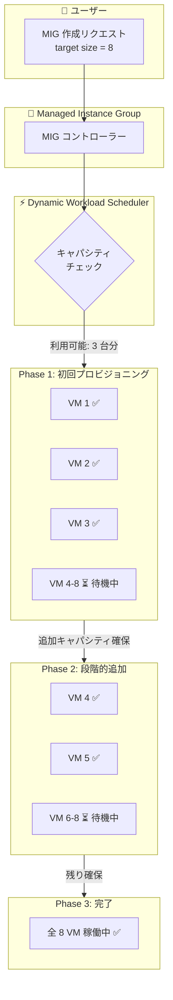

# Compute Engine: MIG での Flex-start VM の段階的作成が GA

**リリース日**: 2026-06-03

**サービス**: Compute Engine

**機能**: Managed Instance Group (MIG) での Flex-start VM 段階的プロビジョニング

**ステータス**: Generally Available (GA)

📊 [このアップデートのインフォグラフィックを見る](https://takech9203.github.io/google-cloud-news-summary/20260603-compute-engine-flex-start-mig-ga.html)

## 概要

Compute Engine の Managed Instance Group (MIG) において、Flex-start VM をキャパシティの空き状況に応じて段階的に作成する機能が GA (一般提供) になりました。従来の MIG リサイズリクエストでは全容量が確保されるまで VM が作成されませんでしたが、本機能では利用可能なキャパシティに応じて一部の VM を先に作成し、残りは後からキャパシティが確保でき次第追加します。

Flex-start VM は最大 7 日間連続稼働が可能で、Dynamic Workload Scheduler (DWS) を活用して GPU などの高需要リソースを割引価格で取得できます。A4、A3、A2、G4、H4D マシンタイプでは最大 53% の割引が適用されます。この段階的作成方式により、GPU クラスタの部分的な利用開始が可能になり、全リソースの確保を待つ必要がなくなります。

本機能は、モデルファインチューニング、バッチ推論、HPC シミュレーションなど、7 日以内で完了する短期ワークロードを実行する ML エンジニアやデータサイエンティストに最適です。

**アップデート前の課題**

- MIG リサイズリクエストでは、要求した全 VM のキャパシティが確保されるまで 1 台も VM が作成されなかった
- GPU などの高需要リソースでは全容量の確保に長時間待機する必要があった
- 部分的なキャパシティが利用可能でも、ワークロードを開始できなかった
- 全容量確保を待つ間、時間とコスト機会を損失していた

**アップデート後の改善**

- キャパシティが利用可能になった分から段階的に VM を作成できるようになった
- 部分的なリソースでも早期にワークロードを開始可能になった
- MIG が自動的に残りの VM をキャパシティ確保次第追加するため、手動管理が不要
- リサイズリクエスト方式 (一括作成) と段階的作成方式を用途に応じて選択可能になった

## アーキテクチャ図



MIG が Flex-start VM を段階的にプロビジョニングするフローを示しています。全容量を待たずに利用可能なリソースから順次 VM を作成し、最終的にターゲットサイズに到達します。

## サービスアップデートの詳細

### 主要機能

1. **段階的 VM プロビジョニング (Individual モード)**
   - MIG のターゲットサイズポリシーモードがデフォルトの Individual モードで動作
   - キャパシティが利用可能になった分から VM を自動作成
   - リサイズリクエストと異なり、部分的なキャパシティでも VM を作成開始
   - MIG が残りの VM をキャパシティ確保次第自動追加

2. **Flex-start プロビジョニングモデルとの統合**
   - DWS (Dynamic Workload Scheduler) による割引価格でのリソース取得
   - A4、A3、A2、G4 マシンシリーズで vCPU、メモリ、GPU が最大 53% 割引
   - H4D マシンシリーズでは vCPU とメモリが 25% 割引
   - Preemptible クォータを消費 (標準クォータがない場合のフォールバック)

3. **リージョナル MIG 対応**
   - ゾーナル MIG とリージョナル MIG の両方に対応
   - リージョナル MIG では `ANY` または `ANY_SINGLE_ZONE` のターゲット分散形状をサポート
   - `ANY` 指定で複数ゾーンにまたがる可用性ベースの分散が可能
   - `ANY_SINGLE_ZONE` 指定で単一ゾーン内での可用性ベース作成

4. **ワークロードポリシーによる配置制御**
   - ベストエフォートでの密集配置 (ネットワークレイテンシ最小化)
   - ワークロードポリシー (高スループットタイプ) による配置制御が可能
   - AI/ML ワークロードに適した低レイテンシ配置を実現

## 技術仕様

### MIG 作成時のパラメータ

| 項目 | 詳細 |
|------|------|
| ターゲットサイズポリシーモード | Individual (デフォルト) |
| VM 修復 | 無効化必須 (`default-action-on-vm-failure=do-nothing`) |
| オートスケーリング | 削除必須 |
| VM 最大稼働時間 | 最大 7 日間 (168 時間) |
| VM 終了アクション | Delete のみ (MIG 内の場合) |
| リージョナル MIG 分散形状 | `ANY` または `ANY_SINGLE_ZONE` |
| キャナリーアップデート | 非サポート |
| スタンバイプールモード | Manual のみ |

### サポートされるマシンタイプ

| マシンシリーズ | 割引率 | 用途 |
|---------------|--------|------|
| A4 (NVIDIA B200) | 53% | 大規模 AI/ML ワークロード |
| A3 Ultra/Mega/High (NVIDIA H100/H200) | 53% | 大規模学習・推論 |
| A2 (NVIDIA A100) | 53% | モデルファインチューニング |
| G4 (NVIDIA T4/L4) | 53% | バッチ推論・中規模 ML |
| H4D (AMD EPYC Turin) | 25% | HPC シミュレーション |

### 必要な IAM ロール

```json
{
  "role": "roles/compute.instanceAdmin.v1",
  "permissions": [
    "compute.instanceTemplates.create",
    "compute.instanceGroupManagers.create"
  ]
}
```

## 設定方法

### 前提条件

1. 十分な Preemptible クォータ (GPU、vCPU、メモリ) の確保
2. Compute Instance Admin (v1) IAM ロールの付与
3. Flex-start プロビジョニングモデルを指定したインスタンステンプレートの作成

### 手順

#### ステップ 1: インスタンステンプレートの作成

```bash
gcloud compute instance-templates create TEMPLATE_NAME \
    --machine-type=a2-highgpu-1g \
    --accelerator=type=nvidia-tesla-a100,count=1 \
    --provisioning-model=FLEX_START \
    --max-run-duration=604800s \
    --instance-termination-action=DELETE \
    --maintenance-policy=TERMINATE
```

Flex-start プロビジョニングモデルと最大稼働時間 (7 日 = 604800 秒)、終了アクション (DELETE) を指定します。

#### ステップ 2: ゾーナル MIG の作成

```bash
gcloud compute instance-groups managed create MIG_NAME \
    --default-action-on-vm-failure=do-nothing \
    --size=SIZE \
    --template=TEMPLATE_NAME \
    --zone=ZONE
```

`--default-action-on-vm-failure=do-nothing` で VM 修復を無効化し、`--size` でターゲットサイズを指定します。MIG はデフォルトの Individual モードで動作し、キャパシティに応じて段階的に VM を作成します。

#### ステップ 3: リージョナル MIG の作成 (複数ゾーン分散)

```bash
gcloud compute instance-groups managed create MIG_NAME \
    --default-action-on-vm-failure=do-nothing \
    --size=SIZE \
    --template=TEMPLATE_NAME \
    --region=REGION \
    --target-distribution-shape=ANY
```

`--target-distribution-shape=ANY` で複数ゾーンにまたがる可用性ベースの分散を有効にします。

## メリット

### ビジネス面

- **ワークロード開始までの時間短縮**: 全リソースの確保を待たずに部分的なキャパシティで作業を開始でき、プロジェクトのリードタイム短縮
- **コスト最適化**: DWS による最大 53% の GPU 割引と、部分キャパシティの即時活用によるコスト効率向上
- **GPU 取得率の向上**: 高需要リソースへのアクセスが改善され、GPU 不足によるプロジェクト遅延を軽減

### 技術面

- **自動キャパシティ管理**: MIG が残りの VM を自動的にプロビジョニングするため、手動での監視・リトライが不要
- **密集配置の最適化**: DWS によるベストエフォートでの密集配置で、AI/ML ワークロードのノード間通信レイテンシを最小化
- **柔軟なスケーリング戦略**: 段階的作成 (Individual) と一括作成 (リサイズリクエスト/Bulk) を用途に応じて選択可能

## デメリット・制約事項

### 制限事項

- VM 修復 (自動修復) を無効化する必要がある (`default-action-on-vm-failure=do-nothing`)
- オートスケーラーとの併用不可 (オートスケーリング設定の削除が必要)
- VM の終了アクションは DELETE のみ (MIG 内では STOP 不可)
- キャナリーアップデート非対応 (セカンドインスタンステンプレートの追加不可)
- 対応マシンタイプが限定的 (GPU、TPU、H4D のみ)
- A4X および A4X Max マシンタイプは非サポート
- Compact 配置ポリシーは MIG 内の Flex-start VM には適用不可 (ワークロードポリシーを使用)
- 予約 (Reservations) との併用不可

### 考慮すべき点

- 部分的なキャパシティで作成された VM にも課金が発生するため、ワークロードが全 VM を必要とする場合はリサイズリクエスト方式の方が適切
- VM は最大 7 日後に自動削除されるため、ワークロードのチェックポイント戦略が重要
- Preemptible クォータ不足の場合、リクエストは保留されるがクォータ確保まで VM は作成されない

## ユースケース

### ユースケース 1: GPU モデルファインチューニングの段階的実行

**シナリオ**: 複数のモデルバリアントのファインチューニングを 8 台の A100 GPU VM で並列実行したいが、即座に 8 台分のキャパシティが確保できない状況。

**実装例**:
```bash
# Flex-start インスタンステンプレート作成
gcloud compute instance-templates create ft-template \
    --machine-type=a2-highgpu-1g \
    --accelerator=type=nvidia-tesla-a100,count=1 \
    --provisioning-model=FLEX_START \
    --max-run-duration=259200s \
    --instance-termination-action=DELETE \
    --maintenance-policy=TERMINATE

# MIG 作成 (8 台ターゲット、段階的作成)
gcloud compute instance-groups managed create ft-mig \
    --default-action-on-vm-failure=do-nothing \
    --size=8 \
    --template=ft-template \
    --zone=us-central1-a
```

**効果**: 3 台のキャパシティが即座に確保できた場合、先に 3 つのファインチューニングジョブを開始し、残り 5 台は順次追加。全容量確保を待つ場合と比較して数時間のリードタイム短縮が可能。

### ユースケース 2: バッチ推論の柔軟なスケールアウト

**シナリオ**: 大量の推論リクエストを処理するために Flex-start VM を使用し、利用可能なキャパシティに応じて段階的にスループットを拡大。

**効果**: 推論キューの処理を部分キャパシティから開始でき、全リソース確保を待つことなく SLA を満たすための処理を早期に開始。GPU コストは通常価格から最大 53% 割引。

### ユースケース 3: HPC シミュレーションのリソース段階的確保

**シナリオ**: H4D マシンタイプを使用した HPC シミュレーションで、複数ノードを段階的に確保して並列計算を実行。

**効果**: H4D の 25% 割引を活用しつつ、部分的なノード確保で予備的な計算を開始し、全ノード揃い次第フル並列計算に移行。

## 料金

Flex-start VM は Dynamic Workload Scheduler (DWS) 料金に基づいて課金されます。

### 料金体系

- 従量課金 (PAYG) 方式
- 対象マシンタイプで vCPU、メモリ、GPU に割引適用
- MIG の段階的プロビジョニング自体には追加料金なし
- VM が作成された時点から課金開始、削除時点で課金終了

### 割引率

| マシンシリーズ | 割引率 | 割引対象 |
|---------------|--------|----------|
| A4, A3, A2, G4 | 最大 53% | vCPU、メモリ、GPU |
| H4D | 25% | vCPU、メモリ |
| その他対応マシンタイプ | 割引なし | - |

詳細な料金は [DWS 料金ページ](https://cloud.google.com/products/dws/pricing) を参照してください。

## 利用可能リージョン

DWS (Dynamic Workload Scheduler) 対応リージョンで利用可能です。推奨ゾーン:

| マシンシリーズ | 推奨ゾーン |
|---------------|-----------|
| A4 | asia-southeast1-b, us-central1-b, us-south1-b |
| A3 Ultra | asia-south1-b, europe-west1-b, europe-west4-a, us-central1-b, us-east4-b, us-south1-b |
| A3 Mega | europe-west1-c, europe-west4-b/c, us-central1-a/b/c, us-east4-b |
| A3 High | asia-east1-c, europe-west1-b, us-central1-a/b |

GPU マシンタイプの可用性はゾーンにより異なります。詳細は [GPU regions and zones](https://cloud.google.com/compute/docs/gpus/gpu-regions-zones) を参照してください。

## 関連サービス・機能

- **MIG リサイズリクエスト**: 全 VM を一括で作成する方式。全容量が確保されるまで待機し、揃った時点で一斉にプロビジョニング。部分課金を避けたい場合に最適。
- **MIG Bulk モード**: ターゲットサイズポリシーを BULK に設定し、インスタンスを一括作成。リサイズリクエストと類似だが異なるワークフロー。
- **Dynamic Workload Scheduler (DWS)**: Flex-start VM の基盤技術。キャパシティ認識型スケジューラーで GPU リソースの取得率を向上。
- **GKE Flex-start**: GKE クラスター内で Flex-start VM をノードプールとして使用。Kubernetes ワークロードでの GPU 段階的プロビジョニングに対応。
- **Vertex AI DWS 統合**: Vertex AI のサーバーレストレーニングジョブで Flex-start モードを使用し、GPU リソースの取得率を向上。
- **ワークロードポリシー**: MIG 内の VM 配置を制御し、AI/ML ワークロードに適した高スループット配置を実現。

## 参考リンク

- 📊 [インフォグラフィック](https://takech9203.github.io/google-cloud-news-summary/20260603-compute-engine-flex-start-mig-ga.html)
- [公式リリースノート](https://cloud.google.com/release-notes#June_03_2026)
- [MIG での Flex-start VM 作成ドキュメント](https://cloud.google.com/compute/docs/instance-groups/create-mig-with-flex-start-vms)
- [Flex-start VM 概要](https://cloud.google.com/compute/docs/instances/about-flex-start-vms)
- [プロビジョニングモデル比較](https://cloud.google.com/compute/docs/instances/provisioning-models)
- [MIG リサイズリクエスト](https://cloud.google.com/compute/docs/instance-groups/about-resize-requests-mig)
- [DWS 料金ページ](https://cloud.google.com/products/dws/pricing)

## まとめ

Compute Engine の MIG における Flex-start VM の段階的作成機能の GA により、GPU や TPU などの高需要リソースを部分的なキャパシティから利用開始できるようになりました。従来のリサイズリクエスト (一括作成) と今回の段階的作成を使い分けることで、ワークロードの特性に応じた最適なリソース取得戦略を実現できます。ML モデルのファインチューニングやバッチ推論など、部分実行可能なワークロードを運用している場合は、まずインスタンステンプレートの作成と小規模な MIG での検証を推奨します。

---

**タグ**: #ComputeEngine #FlexStartVM #MIG #GPU #DynamicWorkloadScheduler #AI #ML #HPC #GA
