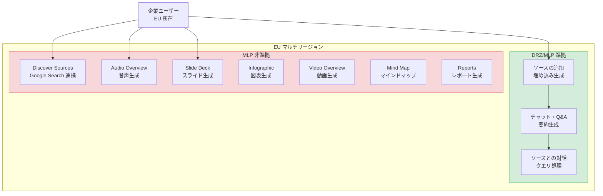

# Gemini Enterprise: NotebookLM Enterprise の EU における DRZ/MLP コンプライアンス対応

**リリース日**: 2026-06-03

**サービス**: Gemini Enterprise

**機能**: NotebookLM Enterprise DRZ/MLP Compliance in EU

**ステータス**: Feature

[このアップデートのインフォグラフィックを見る](https://takech9203.github.io/google-cloud-news-summary/20260603-gemini-enterprise-notebooklm-drz-mlp-eu.html)

## 概要

Gemini Enterprise が提供する NotebookLM Enterprise において、EU マルチリージョンでのデータレジデンシー (DRZ: Data Residency Zone) および機械学習処理 (MLP: Machine Learning Processing) のコンプライアンス対応が発表されました。これにより、EU 圏内の規制要件を持つ企業が NotebookLM Enterprise の基本機能を安心して利用できるようになります。

具体的には、ソースの追加とソースとの対話 (チャット) がDRZ および MLP に準拠しています。一方、Discover Sources 機能や Studio 機能 (Audio Overview、Slide Deck、Infographic、Video Overview、Mind Map、Reports) については MLP 非準拠のままとなっています。

このアップデートは、GDPR をはじめとする EU のデータ保護規制に対応する必要がある企業にとって重要な進展です。データが EU 内で処理・保存されることが保証されるため、コンプライアンス要件を満たしながら AI を活用したナレッジマネジメントが可能になります。

**アップデート前の課題**

- NotebookLM Enterprise の EU における DRZ/MLP 対応状況が限定的で、コンプライアンス要件を満たせないケースがあった
- EU の厳格なデータ保護規制により、データの処理場所が不明確な AI サービスの導入が困難だった
- 規制産業 (金融、医療、公共機関) では EU 外でのデータ処理を避ける必要があり、NotebookLM Enterprise の採用を見送るケースがあった

**アップデート後の改善**

- ソースの追加とチャット機能が EU マルチリージョンで DRZ/MLP 準拠となり、基本的なナレッジ管理ワークフローがコンプライアンス対応
- EU 内でデータが処理・保存されることが保証され、GDPR 等の規制要件を満たした状態で利用可能
- 規制産業の企業が NotebookLM Enterprise を導入する際のコンプライアンス障壁が大幅に低減

## アーキテクチャ図



この図は NotebookLM Enterprise の EU マルチリージョンにおける機能別の DRZ/MLP コンプライアンス対応状況を示しています。緑色の領域が準拠済み機能、赤色の領域が非準拠の Studio 機能を表しています。

## サービスアップデートの詳細

### 主要機能

1. **ソースの追加 (DRZ/MLP 準拠)**
   - Google Docs、Slides、PDF、テキスト、URL、YouTube 動画、音声ファイル、画像ファイル、DOCX、PPTX、XLSX のアップロードが EU 内で処理
   - 埋め込みベクトルの生成が EU マルチリージョン内で完結
   - ソースのコピーが EU 内の Google Cloud プロジェクトに保存

2. **ソースとの対話 - チャット (DRZ/MLP 準拠)**
   - チャットベースの Q&A がEU 内で ML 処理
   - 要約生成、クエリ処理が EU マルチリージョンで実行
   - ソースに基づいたコンテンツ生成が EU 内で完結

3. **Studio 機能 (MLP 非準拠)**
   - Audio Overview (音声概要): EU で利用可能だが MLP 非準拠
   - Video Overview (動画概要): EU で利用可能だが MLP 非準拠
   - Slide Deck (スライド生成): MLP 非準拠
   - Infographic (インフォグラフィック生成): MLP 非準拠
   - Mind Map (マインドマップ): MLP 非準拠
   - Reports (レポート生成): MLP 非準拠

4. **Discover Sources (DRZ/MLP 非準拠)**
   - Grounding with Google Search を使用するため、DRZ および MLP ともに非準拠
   - Google Search のサービス固有条項に基づく制限あり

## 技術仕様

### DRZ/MLP 対応状況の詳細

| 機能 | DRZ (データレジデンシー) | MLP (ML 処理) | 備考 |
|------|:---:|:---:|------|
| ソースの追加 | 準拠 | 準拠 | 埋め込み生成含む |
| チャット・Q&A | 準拠 | 準拠 | クエリ・要約含む |
| Discover Sources | 非準拠 | 非準拠 | Google Search 依存 |
| Audio Overview | - | 非準拠 | Studio 機能 |
| Video Overview | - | 非準拠 | Studio 機能 |
| Slide Deck | - | 非準拠 | Studio 機能 |
| Infographic | - | 非準拠 | Studio 機能 |
| Mind Map | - | 非準拠 | Studio 機能 |
| Reports | - | 非準拠 | Studio 機能 |

### リージョン別の対応状況

| リージョン | 基本機能 DRZ | 基本機能 MLP | Studio 機能 |
|------------|:---:|:---:|:---:|
| Global | 非対応 | 非対応 | 全機能利用可能 |
| US マルチリージョン | 準拠 | 準拠 | 利用可能 |
| EU マルチリージョン | 準拠 | 準拠 | 利用可能 (MLP 非準拠) |
| In-country (CA, IN) | 準拠 | 非準拠 | 一部利用不可 |

### API エンドポイントの設定

```json
{
  "endpoint": "https://eu-discoveryengine.googleapis.com/v1/projects/{PROJECT_ID}/locations/eu/",
  "notebooklm_url": "https://notebooklm.cloud.google.com/eu/?project={PROJECT_NUMBER}",
  "data_residency": "EU multi-region",
  "compliant_features": ["sources", "chat", "query", "summarization"],
  "non_compliant_features": ["discover_sources", "audio_overview", "slide_deck", "infographic", "video_overview", "mind_map", "reports"]
}
```

## 設定方法

### 前提条件

1. Google Cloud プロジェクトが有効であること
2. Gemini Enterprise Standard または Plus エディションのサブスクリプション (NotebookLM Enterprise を含む)
3. EU マルチリージョンでデータストアが作成されていること
4. ユーザーに適切な IAM ロールが付与されていること

### 手順

#### ステップ 1: EU マルチリージョンでデータストアを作成

```bash
# Google Cloud コンソールでアプリを作成する際に
# ロケーションとして "eu (multiple regions in the European Union)" を選択

# API 経由の場合は eu-discoveryengine エンドポイントを使用
curl -X POST \
  -H "Authorization: Bearer $(gcloud auth print-access-token)" \
  "https://eu-discoveryengine.googleapis.com/v1/projects/${PROJECT_NUMBER}/locations/eu/dataStores" \
  -d '{
    "displayName": "my-notebooklm-datastore",
    "solutionTypes": ["SOLUTION_TYPE_CHAT"]
  }'
```

管理者がデータストアを EU リージョンに作成することで、データレジデンシーが確保されます。

#### ステップ 2: NotebookLM Enterprise にアクセス

```bash
# EU リージョン用の NotebookLM Enterprise URL
# https://notebooklm.cloud.google.com/eu/?project={PROJECT_NUMBER}

# ユーザーにライセンスを付与
gcloud identity groups memberships add \
  --group-email="notebooklm-users@example.com" \
  --member-email="user@example.com"
```

ユーザーは EU リージョン専用の URL からアクセスすることで、データが EU 内で処理されることが保証されます。

#### ステップ 3: コンプライアンス設定の確認

```bash
# VPC Service Controls の設定を確認 (推奨)
gcloud access-context-manager perimeters describe my-perimeter \
  --policy=${POLICY_ID}

# CMEK の設定 (EU マルチリージョンで利用可能)
gcloud kms keys create notebooklm-key \
  --location=europe \
  --keyring=my-keyring \
  --purpose=encryption
```

VPC-SC と CMEK を組み合わせることで、さらに強固なデータ保護を実現できます。

## メリット

### ビジネス面

- **EU 規制への準拠**: GDPR、デジタルサービス法、AI 規制法などの EU 規制に対応した状態で AI ナレッジ管理ツールを利用可能
- **規制産業での導入促進**: 金融機関、医療機関、公共機関など厳格なデータ保護要件を持つ組織での導入障壁が低減
- **データ主権の確保**: 企業データが EU 外に転送されないことが保証され、データガバナンスポリシーに準拠

### 技術面

- **透明なデータフロー**: どの機能が DRZ/MLP 準拠かが明確に文書化されており、アーキテクチャ設計時の判断が容易
- **既存セキュリティ機能との統合**: VPC-SC、CMEK と組み合わせた多層防御が EU リージョンで利用可能
- **段階的な導入が可能**: 準拠済みの基本機能から利用を開始し、Studio 機能の準拠を待つ段階的アプローチが可能

## デメリット・制約事項

### 制限事項

- Studio 機能 (Audio Overview、Slide Deck、Infographic、Video Overview、Mind Map、Reports) は MLP 非準拠のため、厳格なコンプライアンス要件下では利用に注意が必要
- Discover Sources 機能は DRZ および MLP ともに非準拠であり、EU でのコンプライアンス利用は不可
- Global リージョンと比較して一部機能制限があり、全機能を EU 準拠で利用することはできない

### 考慮すべき点

- MLP 非準拠の Studio 機能を利用する場合、データが EU 外で処理される可能性があることをリスク評価に含める必要がある
- Google は Global リージョンの使用を推奨しており (レスポンス時間とフル機能セットの観点)、EU リージョンは規制要件がある場合のみ選択すべき
- 今後の Studio 機能の MLP 準拠対応のタイムラインは未公開のため、長期計画に含める際は注意が必要
- Grounding with Google Search は Customer Data を一時的にログする仕様があり、Discover Sources を含むワークフロー設計時に考慮が必要

## ユースケース

### ユースケース 1: EU 金融機関のコンプライアンスリサーチ

**シナリオ**: EU 圏内の金融機関が、規制文書や社内ポリシーを NotebookLM Enterprise に集約し、コンプライアンス担当者が AI を活用して迅速に規制要件を確認・分析する。

**実装例**:
```
1. EU マルチリージョンでデータストアを作成
2. GDPR、MiFID II、DORA 等の規制文書をソースとして追加 (DRZ/MLP 準拠)
3. チャット機能で規制要件の確認・比較分析を実施 (DRZ/MLP 準拠)
4. ※ Studio 機能での資料生成は MLP 非準拠のため社内規定に従い判断
```

**効果**: 規制文書の分析時間を大幅に短縮しつつ、データが EU 内で処理されることを保証。DPO (Data Protection Officer) の承認を得やすい構成。

### ユースケース 2: EU 公共機関のナレッジ共有

**シナリオ**: EU 加盟国の公共機関が、政策文書や法令をNotebookLM Enterprise で管理し、職員間で AI を活用した情報共有を行う。

**効果**: データ主権要件を満たしながら、AI によるナレッジ管理の恩恵を享受。市民データを含む文書も EU 内で安全に処理。

### ユースケース 3: EU 医療機関の研究文献管理

**シナリオ**: EU 圏内の大学病院・研究機関が、医学論文やクリニカルガイドラインを NotebookLM Enterprise で管理し、研究者が迅速に関連文献を検索・要約する。

**効果**: 患者データを含まない研究文献の管理において、EU データ保護要件を満たしながら研究効率を向上。

## 料金

NotebookLM Enterprise は Gemini Enterprise サブスクリプションに含まれています。

### 料金例

| エディション | 含まれる機能 | 備考 |
|--------|-----------------|------|
| Gemini Enterprise Standard | NotebookLM Enterprise 含む | 基本的な AI アシスタント機能 |
| Gemini Enterprise Plus | NotebookLM Enterprise 含む | 高度な機能とより大きなクォータ |
| NotebookLM Enterprise 単体 | スタンドアロン利用可能 | Gemini Enterprise なしでも購入可能 |

※ 具体的な料金は Google Cloud の営業チームにお問い合わせください。

## 利用可能リージョン

| リージョンタイプ | リージョン名 | DRZ/MLP 対応 |
|--------------|------------|-------------|
| Global | global | 非対応 (フル機能) |
| US マルチリージョン | us | DRZ/MLP 準拠 |
| EU マルチリージョン | eu | DRZ/MLP 準拠 (基本機能のみ) |
| In-country | ca (カナダ) | DRZ 準拠、MLP 非準拠 |
| In-country | in (インド) | DRZ 準拠、MLP 非準拠 |

※ In-country リージョンは GA with allowlist のステータスであり、利用には Google アカウントチームへの連絡が必要です。

## 関連サービス・機能

- **Gemini Enterprise**: NotebookLM Enterprise を含むエンタープライズ AI スイート。検索、アシスタント、コネクタ等を提供
- **VPC Service Controls**: NotebookLM Enterprise と組み合わせてデータ境界を設定し、データ漏洩を防止
- **Customer-Managed Encryption Keys (CMEK)**: EU マルチリージョンで利用可能な暗号化キーの顧客管理機能
- **Vertex AI**: Gemini モデルの基盤プラットフォーム。DRZ/MLP 対応はモデルごとに異なる
- **Grounding with Google Search**: Discover Sources 機能の基盤技術。グローバルリージョンでのみ DRZ/MLP 非準拠で利用可能

## 参考リンク

- [インフォグラフィック](https://takech9203.github.io/google-cloud-news-summary/20260603-gemini-enterprise-notebooklm-drz-mlp-eu.html)
- [公式リリースノート](https://docs.cloud.google.com/release-notes#June_03_2026)
- [Gemini Enterprise ロケーション](https://docs.cloud.google.com/gemini/enterprise/docs/locations)
- [NotebookLM Enterprise 概要](https://docs.cloud.google.com/gemini/enterprise/notebooklm-enterprise/docs/overview)
- [NotebookLM Enterprise 制限事項](https://docs.cloud.google.com/gemini/enterprise/docs/locations#limitations)

## まとめ

今回のアップデートにより、NotebookLM Enterprise の基本機能 (ソースの追加とチャット) が EU マルチリージョンで DRZ/MLP 準拠となり、EU のデータ保護規制に対応する企業が安心して利用できるようになりました。Studio 機能については引き続き MLP 非準拠のため、厳格なコンプライアンス要件を持つ組織は利用範囲を慎重に検討する必要があります。EU 圏内の規制産業に属する企業は、まず準拠済みの基本機能から導入を開始し、段階的に活用範囲を拡大していくアプローチを推奨します。

---

**タグ**: #GeminiEnterprise #NotebookLM #DataResidency #DRZ #MLP #EU #GDPR #コンプライアンス #データレジデンシー #エンタープライズAI
