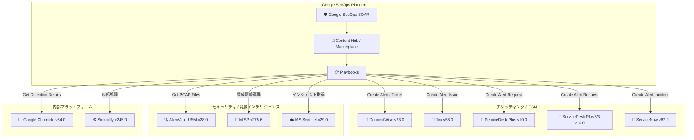

# Google SecOps Marketplace: 複数インテグレーション アップデート (2026年6月3日)

**リリース日**: 2026-06-03

**サービス**: Google SecOps Marketplace

**機能**: 複数インテグレーションのリファクタリングおよび機能強化

**ステータス**: Change (複数インテグレーション)

📊 [このアップデートのインフォグラフィックを見る](https://takech9203.github.io/google-cloud-news-summary/20260603-google-secops-marketplace-integration-updates.html)

## 概要

Google SecOps Marketplace において、2026年6月3日付で10件のインテグレーションが一斉にアップデートされた。今回のアップデートは、主にアラート作成アクションのコードリファクタリング、内部コード実行ロジックの改善、およびコネクタの機能強化に焦点を当てている。

対象となるインテグレーションは、AlienVault USM Appliance、ConnectWise、Google Chronicle、Jira、ServiceDesk Plus、ServiceDesk Plus V3、ServiceNow、Siemplify、MISP、Microsoft Sentinel Incident Tracking Connector の10製品で、SOC チームが日常的に使用するチケッティング、ITSM、脅威インテリジェンス、インシデント管理の各分野にわたる。これらのリファクタリングにより、コードの保守性向上、パフォーマンス改善、エラーハンドリングの強化が期待される。

特に注目すべきは、Microsoft Sentinel Incident Tracking Connector に新たに追加された「Incident Creation Time Filter (days)」パラメータと、MISP インテグレーションにおけるコア統合コンポーネントの最適化である。

**アップデート前の課題**

- アラート作成アクション (Create Alerts Ticket、Create Alert Issue、Create Alert Incident、Create Alert Request) のコードが旧来の設計パターンに基づいており、保守や拡張が困難だった
- Siemplify および MISP の内部コード実行ロジックが最適化されておらず、大規模環境でのパフォーマンスに影響する可能性があった
- Microsoft Sentinel Incident Tracking Connector では、インシデント作成日時による柔軟なフィルタリングができず、大量のバックログインシデントの取得制御が限定的だった

**アップデート後の改善**

- 8つのインテグレーションのアラート関連アクションがリファクタリングされ、コードの一貫性と保守性が向上
- Siemplify (v245.0) と MISP (v275.6) の内部コード実行ロジックが改善され、処理効率が向上
- MISP ではコア統合コンポーネントも最適化され、全体的なインテグレーション品質が向上
- Microsoft Sentinel Incident Tracking Connector (v29.0) に「Incident Creation Time Filter (days)」パラメータが追加され、取得対象インシデントの期間制御が可能に
- Microsoft Sentinel Incident Tracking Connector のエラーハンドリングロジックが最適化され、障害時の復旧性が向上

## アーキテクチャ図

Google SecOps SOAR プラットフォームから各インテグレーションへの連携フローを示す。今回のアップデートでは、Playbook から呼び出される各アクションのコードがリファクタリングされ、チケッティング/ITSM系、セキュリティ/脅威インテリジェンス系、内部プラットフォーム系の3カテゴリにわたるインテグレーションが改善された。

## サービスアップデートの詳細

### 主要機能

1. **アラート作成アクションのリファクタリング (6インテグレーション)**
   - ConnectWise v23.0: 「Create Alerts Ticket」アクションのコードリファクタリング
   - Jira v58.0: 「Create Alert Issue」アクションのコードリファクタリング
   - ServiceDesk Plus v10.0: 「Create Alert Request」アクションのコードリファクタリング
   - ServiceDesk Plus V3 v10.0: 「Create Alert Request」アクションのコードリファクタリング
   - ServiceNow v67.0: 「Create Alert Incident」アクションのコードリファクタリング
   - Google Chronicle v84.0: 「Get Detection Details」アクションのコードリファクタリング

2. **PCAP取得アクションのリファクタリング**
   - AlienVault USM Appliance v28.0: 「Get PCAP Files For Events」アクションのコードリファクタリング
   - ネットワークフォレンジック分析に使用されるPCAPファイル取得処理の改善

3. **内部コード実行ロジックの改善**
   - Siemplify v245.0: 内部コード実行ロジックのリファクタリング
   - MISP v275.6: 内部コード実行ロジックのリファクタリングおよびコア統合コンポーネントの最適化

4. **Microsoft Sentinel Incident Tracking Connector の機能強化 (v29.0)**
   - 「Incident Creation Time Filter (days)」詳細パラメータの追加
   - エラーハンドリングロジックの最適化
   - インシデント取得時の期間制御が柔軟に

## 技術仕様

### アップデート対象インテグレーション一覧

| インテグレーション | バージョン | 変更内容 | カテゴリ |
|---|---|---|---|
| AlienVault USM Appliance | v28.0 | 「Get PCAP Files For Events」リファクタリング | セキュリティ分析 |
| ConnectWise | v23.0 | 「Create Alerts Ticket」リファクタリング | ITSM |
| Google Chronicle | v84.0 | 「Get Detection Details」リファクタリング | SIEM |
| Jira | v58.0 | 「Create Alert Issue」リファクタリング | チケッティング |
| ServiceDesk Plus | v10.0 | 「Create Alert Request」リファクタリング | ITSM |
| ServiceDesk Plus V3 | v10.0 | 「Create Alert Request」リファクタリング | ITSM |
| ServiceNow | v67.0 | 「Create Alert Incident」リファクタリング | ITSM |
| Siemplify | v245.0 | 内部コード実行ロジック リファクタリング | プラットフォーム |
| MISP | v275.6 | 内部コード実行ロジック リファクタリング + コア最適化 | 脅威インテリジェンス |
| Microsoft Sentinel Incident Tracking Connector | v29.0 | 新パラメータ追加 + エラーハンドリング最適化 | SIEM連携 |

### Microsoft Sentinel Incident Tracking Connector 新パラメータ

| パラメータ名 | 型 | 説明 |
|---|---|---|
| Incident Creation Time Filter (days) | Integer (Advanced) | インシデント作成日時からのフィルタリング期間（日数）を指定。古いインシデントの取得を制限し、コネクタの処理負荷を軽減する |

## 設定方法

### 前提条件

1. Google SecOps プラットフォームへの管理者アクセス権限
2. Content Hub / Marketplace へのアクセス権限
3. 各インテグレーション先サービスの有効なクレデンシャル

### 手順

#### ステップ 1: Content Hub でのアップデート確認

Google SecOps コンソールの Content Hub にアクセスし、各インテグレーションの新バージョンが利用可能であることを確認する。

#### ステップ 2: インテグレーションのアップグレード

Content Hub から対象インテグレーションを選択し、最新バージョンにアップグレードする。アップグレード時のオントロジーマッピング処理について以下を選択する:

- **Override (replace mapping)**: 既存のマッピングルールを完全に置き換える。カスタムマッピングがない場合に推奨
- **Retain (keep existing mapping)**: 既存のマッピングを保持する。カスタムマッピングを維持したい場合に推奨

#### ステップ 3: Microsoft Sentinel コネクタの新パラメータ設定（該当する場合）

Microsoft Sentinel Incident Tracking Connector を使用している場合、新しい「Incident Creation Time Filter (days)」パラメータを環境に合わせて設定する。

#### ステップ 4: 動作確認

アップグレード後、各インテグレーションの Ping アクションで接続性を確認し、テストプレイブックで正常動作を検証する。

## メリット

### ビジネス面

- **運用安定性の向上**: リファクタリングにより、プレイブック実行時のエラー発生率が低下し、SOC チームの運用負荷が軽減される
- **インシデント対応時間の短縮**: 最適化されたコードにより、アラート作成からチケット発行までのレイテンシが改善される可能性がある
- **バックログ管理の効率化**: Microsoft Sentinel の新パラメータにより、必要なインシデントのみを効率的に取得でき、ノイズの削減につながる

### 技術面

- **コード保守性の向上**: リファクタリングにより、将来のバグ修正や機能追加が容易になる
- **パフォーマンス改善**: MISP のコア統合コンポーネント最適化により、大量の脅威インテリジェンスデータ処理時のリソース消費が改善
- **エラー回復力の強化**: Microsoft Sentinel コネクタのエラーハンドリング最適化により、一時的な接続障害からの自動復旧が改善
- **コード品質の統一**: 複数インテグレーションのアラート作成アクションが統一されたパターンでリファクタリングされ、予測可能な動作を実現

## デメリット・制約事項

### 制限事項

- リファクタリングはコードの内部構造の変更であるため、API インターフェースや既存の動作に影響はないが、カスタムコードを使用している場合は互換性確認が必要
- オントロジーマッピングの Override を選択した場合、カスタムマッピングが失われる可能性がある

### 考慮すべき点

- アップグレード前に既存のオントロジーマッピングルールをエクスポートしてバックアップすることを推奨
- 本番環境への適用前に、ステージング環境での検証を推奨
- Siemplify の「Response Integration & Connector Upgrade」ジョブを使用して自動アップグレードを設定している場合、`Integrations To Ignore` パラメータで段階的な展開を制御可能
- カスタムインテグレーション（商用版をエクスポートして再インポートしたもの）を使用している場合、`Overwrite Custom Integration` パラメータの設定に注意

## ユースケース

### ユースケース 1: SOC チームの自動チケッティングワークフロー最適化

**シナリオ**: 大規模企業の SOC チームが Google SecOps のプレイブックから ServiceNow と Jira の両方にアラートチケットを自動作成している環境で、リファクタリング後のアクションにアップグレードする。

**効果**: リファクタリングされたアクションにより、チケット作成処理の信頼性が向上し、プレイブック実行時のタイムアウトやエラーによるチケット作成失敗が減少する。

### ユースケース 2: Microsoft Sentinel と Google SecOps のハイブリッド SIEM 運用

**シナリオ**: Microsoft Sentinel と Google SecOps を併用している組織で、Sentinel から大量のインシデントを取得してSOAR で処理しているが、古いインシデントの再取得によりコネクタの処理が圧迫されている。

**効果**: 新しい「Incident Creation Time Filter (days)」パラメータを設定することで、例えば過去7日間のインシデントのみに限定し、コネクタの処理効率を大幅に改善できる。

### ユースケース 3: 脅威インテリジェンス統合の高速化

**シナリオ**: MISP サーバーと Google SecOps を連携し、大量の IOC (Indicators of Compromise) を定期的に同期・エンリッチメントしている環境。

**効果**: MISP v275.6 のコア統合コンポーネント最適化により、大量のイベント処理やアトリビュート検索のレスポンスが改善され、脅威ハンティングワークフローの実行時間が短縮される。

## 料金

Google SecOps Marketplace のインテグレーションアップデートは、Google SecOps のサブスクリプションに含まれており、追加料金は発生しない。ただし、各連携先サービス（ServiceNow、Jira、MISP など）の利用には、それぞれのサービスのライセンスが必要。

- [Google SecOps 料金ページ](https://cloud.google.com/chronicle/pricing)

## 関連サービス・機能

- **Google SecOps SOAR**: プレイブックの自動実行基盤。今回リファクタリングされたアクションはすべてプレイブックから呼び出される
- **Google SecOps SIEM (Chronicle)**: セキュリティイベントの検出・分析基盤。Google Chronicle v84.0 の「Get Detection Details」アクションはSIEM 検出結果の詳細取得に使用
- **Content Hub**: インテグレーションの管理・配信プラットフォーム。アップデートの適用はContent Hub経由で実施
- **Microsoft Sentinel**: Microsoft のクラウドネイティブ SIEM。Incident Tracking Connector で双方向のインシデント同期を実現
- **MISP (Malware Information Sharing Platform)**: オープンソースの脅威インテリジェンス共有プラットフォーム。IOC のエンリッチメントやイベント作成に使用

## 参考リンク

- 📊 [インフォグラフィック](https://takech9203.github.io/google-cloud-news-summary/20260603-google-secops-marketplace-integration-updates.html)
- [公式リリースノート](https://docs.cloud.google.com/release-notes#June_03_2026)
- [Google SecOps Marketplace リリースノート](https://docs.cloud.google.com/chronicle/docs/soar/marketplace-integrations/release-notes)
- [Content Hub の使用方法](https://docs.cloud.google.com/chronicle/docs/soar/marketplace/using-the-marketplace)
- [インテグレーションの設定](https://docs.cloud.google.com/chronicle/docs/soar/respond/integrations-setup/configure-integrations)
- [バージョンロールバック](https://docs.cloud.google.com/chronicle/docs/soar/respond/integrations-setup/version-rollback)
- [Jira インテグレーション](https://docs.cloud.google.com/chronicle/docs/soar/marketplace-integrations/jira)
- [ServiceNow インテグレーション](https://docs.cloud.google.com/chronicle/docs/soar/marketplace-integrations/servicenow)
- [MISP インテグレーション](https://docs.cloud.google.com/chronicle/docs/soar/marketplace-integrations/misp)
- [Microsoft Azure Sentinel インテグレーション](https://docs.cloud.google.com/chronicle/docs/soar/marketplace-integrations/microsoft-azure-sentinel)
- [Siemplify インテグレーション](https://docs.cloud.google.com/chronicle/docs/soar/marketplace-integrations/siemplify)

## まとめ

今回のアップデートは、Google SecOps Marketplace の主要インテグレーション10件に対する包括的なコード品質向上施策である。直接的な新機能追加は Microsoft Sentinel Incident Tracking Connector の新パラメータに限定されるが、リファクタリングによるコードベースの改善は、今後の機能追加やバグ修正の基盤となる重要な変更である。SOC チームは、ステージング環境で動作確認を行った上で、順次本番環境にアップグレードを適用することを推奨する。

---

**タグ**: #GoogleSecOps #SOAR #Marketplace #Integration #Refactoring #ServiceNow #Jira #MISP #MicrosoftSentinel #Siemplify #ConnectWise #AlienVault #Chronicle #ServiceDeskPlus #SecurityOperations
