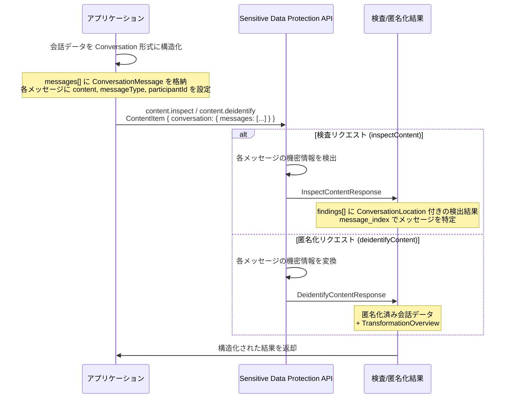

# Sensitive Data Protection: 会話コンテンツの検査・匿名化機能

**リリース日**: 2026-06-03

**サービス**: Sensitive Data Protection (旧 Cloud DLP)

**機能**: Conversational Content Inspection and De-identification

**ステータス**: Feature

📊 [このアップデートのインフォグラフィックを見る](https://takech9203.github.io/google-cloud-news-summary/20260603-sensitive-data-protection-conversational-content.html)

## 概要

Google Cloud の Sensitive Data Protection に、会話コンテンツを直接検査・匿名化できる新しい `Conversation` タイプが ContentItem に追加されました。これにより、チャットログや LLM との対話データに含まれる機密情報を、会話の構造（話者、メッセージ順序、メッセージ種別）を保持したまま検出・保護することが可能になります。

従来、会話データを検査するには各メッセージを個別のテキストとして処理するか、全体を一つの文字列に結合する必要がありました。新しい Conversation 型を使用することで、API が会話の文脈を理解し、検出結果に正確なメッセージインデックスを含めることができます。これは LLM アプリケーションにおけるプロンプトや応答の安全性確保、カスタマーサポートチャットの PII 保護、コンプライアンス要件への対応において重要な進展です。

対象ユーザーは、チャットボット開発者、LLM アプリケーション開発者、カスタマーサポートプラットフォーム運営者、およびコンプライアンス担当者です。

**アップデート前の課題**

従来、会話データに含まれる機密情報を保護する際には以下の課題がありました。

- 会話の各メッセージを個別に処理する必要があり、文脈に基づく検出精度が低下していた
- 話者情報（ユーザー vs AI）を保持したまま匿名化処理を行う標準的な方法がなかった
- 会話全体を単一テキストとして処理すると、検出結果のどのメッセージに該当するか特定が困難だった
- LLM アプリケーションのプロンプト/レスポンスパイプラインに組み込むための専用インターフェースが存在しなかった

**アップデート後の改善**

今回のアップデートにより、以下の改善が実現されました。

- ContentItem に `conversation` フィールドが追加され、会話構造をネイティブに表現可能になった
- ConversationMessage で話者 ID (`participantId`) とメッセージ種別 (`messageType`) を指定でき、文脈を保持した処理が可能になった
- 検出結果に `ConversationLocation` が含まれ、どのメッセージで機密情報が検出されたか正確に特定できるようになった
- 1回の API コールで最大 50,000 メッセージの会話を一括処理できるようになった

## アーキテクチャ図



この図は、アプリケーションが会話データを Conversation 形式で構造化し、Sensitive Data Protection API に送信する際のフローを示しています。検査と匿名化の両方のパスで、会話構造が保持されたまま処理が行われます。

## サービスアップデートの詳細

### 主要機能

1. **Conversation 型 (ContentItem の新しいデータ型)**
   - ContentItem の `data_item` union フィールドに `conversation` が追加された
   - 会話全体またはスライス（部分的な会話）を表現可能
   - メッセージは時系列順に格納され、最大 50,000 メッセージをサポート

2. **ConversationMessage 構造体**
   - `content`: メッセージの本文テキスト
   - `messageType`: メッセージの種別 (CONTENT または CONTEXT)
   - `participantId`: 話者の識別子 (例: "user", "gemini", "support-agent")
   - CONTEXT 型のメッセージは検査対象外だが、文脈情報として活用される

3. **ConversationLocation (検出結果の位置情報)**
   - `message_index`: 検出が発生したメッセージのインデックス
   - `all_messages`: 会話全体に該当する検出結果を示すフラグ
   - 従来の DocumentLocation や RecordLocation と同様に、正確な位置特定が可能

4. **MessageType 列挙型**
   - `CONTENT`: 検査対象のメッセージ。機密情報の検出・匿名化が適用される
   - `CONTEXT`: 文脈情報のみ。検査対象外で、匿名化も適用されない
   - `MESSAGE_TYPE_UNSPECIFIED`: 未指定（非推奨）

## 技術仕様

### API エンドポイント

| 項目 | 詳細 |
|------|------|
| 検査 API | `POST /v2/projects/{project}/locations/{location}/content:inspect` |
| 匿名化 API | `POST /v2/projects/{project}/locations/{location}/content:deidentify` |
| 最大メッセージ数 | 50,000 メッセージ/会話 |
| participantId 形式 | `^[a-z]([a-z0-9-]{0,61}[a-z0-9])?$` (最大 63 文字) |
| サポートされる操作 | inspectContent, deidentifyContent |

### Conversation JSON 構造

```json
{
  "item": {
    "conversation": {
      "messages": [
        {
          "content": "こんにちは、田中太郎です。予約を確認したいのですが。",
          "messageType": "CONTENT",
          "participantId": "customer"
        },
        {
          "content": "田中太郎様、ご連絡ありがとうございます。ご本人確認のため、電話番号をお教えいただけますか？",
          "messageType": "CONTENT",
          "participantId": "support-agent"
        },
        {
          "content": "090-1234-5678 です。",
          "messageType": "CONTENT",
          "participantId": "customer"
        }
      ]
    }
  },
  "inspectConfig": {
    "infoTypes": [
      {"name": "PERSON_NAME"},
      {"name": "PHONE_NUMBER"}
    ],
    "includeQuote": true
  }
}
```

### 検出結果のレスポンス例

```json
{
  "result": {
    "findings": [
      {
        "quote": "田中太郎",
        "infoType": {"name": "PERSON_NAME"},
        "likelihood": "LIKELY",
        "location": {
          "conversationLocation": {
            "messageIndex": 0
          }
        }
      },
      {
        "quote": "090-1234-5678",
        "infoType": {"name": "PHONE_NUMBER"},
        "likelihood": "VERY_LIKELY",
        "location": {
          "conversationLocation": {
            "messageIndex": 2
          }
        }
      }
    ]
  }
}
```

## 設定方法

### 前提条件

1. Google Cloud プロジェクトで Sensitive Data Protection API (DLP API) が有効化されていること
2. 適切な IAM ロール (`roles/dlp.user` または `roles/dlp.admin`) が付与されていること
3. サービスアカウントまたはユーザー認証が設定されていること

### 手順

#### ステップ 1: API の有効化

```bash
gcloud services enable dlp.googleapis.com --project=YOUR_PROJECT_ID
```

Sensitive Data Protection API を有効化します。

#### ステップ 2: 会話データの検査リクエスト送信

```bash
curl -X POST \
  "https://dlp.googleapis.com/v2/projects/YOUR_PROJECT_ID/locations/global/content:inspect" \
  -H "Authorization: Bearer $(gcloud auth print-access-token)" \
  -H "Content-Type: application/json" \
  -d '{
    "item": {
      "conversation": {
        "messages": [
          {
            "content": "私のメールアドレスは user@example.com です",
            "messageType": "CONTENT",
            "participantId": "user"
          },
          {
            "content": "承知しました。user@example.com にご連絡いたします。",
            "messageType": "CONTENT",
            "participantId": "assistant"
          }
        ]
      }
    },
    "inspectConfig": {
      "infoTypes": [{"name": "EMAIL_ADDRESS"}, {"name": "PHONE_NUMBER"}],
      "includeQuote": true
    }
  }'
```

会話データに含まれるメールアドレスや電話番号を検出します。

#### ステップ 3: 会話データの匿名化リクエスト送信

```bash
curl -X POST \
  "https://dlp.googleapis.com/v2/projects/YOUR_PROJECT_ID/locations/global/content:deidentify" \
  -H "Authorization: Bearer $(gcloud auth print-access-token)" \
  -H "Content-Type: application/json" \
  -d '{
    "item": {
      "conversation": {
        "messages": [
          {
            "content": "私のクレジットカード番号は 4111-1111-1111-1111 です",
            "messageType": "CONTENT",
            "participantId": "user"
          }
        ]
      }
    },
    "inspectConfig": {
      "infoTypes": [{"name": "CREDIT_CARD_NUMBER"}]
    },
    "deidentifyConfig": {
      "infoTypeTransformations": {
        "transformations": [{
          "infoTypes": [{"name": "CREDIT_CARD_NUMBER"}],
          "primitiveTransformation": {
            "replaceConfig": {
              "newValue": {"stringValue": "[CREDIT_CARD]"}
            }
          }
        }]
      }
    }
  }'
```

クレジットカード番号を置換トークンに変換して匿名化します。

## メリット

### ビジネス面

- **コンプライアンス対応の効率化**: GDPR、CCPA、個人情報保護法などの規制に対応するチャットデータの保護が、単一 API コールで実現可能
- **LLM アプリケーションの安全性向上**: Generative AI アプリケーションにおけるユーザー入力の機密情報漏洩リスクを低減
- **運用コストの削減**: 会話データの前処理・後処理のカスタムコードが不要になり、開発・保守コストを削減

### 技術面

- **文脈を考慮した高精度検出**: 会話の流れを理解した上での検出により、偽陽性・偽陰性が減少
- **正確な位置情報**: message_index による精確な検出位置特定で、後続処理やログ分析が容易
- **スケーラブルな処理**: 1リクエストで最大 50,000 メッセージを処理可能で、長い会話履歴にも対応
- **Model Armor との統合**: LLM のプロンプト/レスポンスフィルタリングに Sensitive Data Protection の高度な検出機能を活用可能

## デメリット・制約事項

### 制限事項

- 1会話あたり最大 50,000 メッセージまでの制限がある
- participantId は小文字英数字とハイフンのみ使用可能（最大 63 文字）
- CONTEXT タイプのメッセージは検査対象外のため、意図せず機密情報が残る可能性がある
- 画像やファイル添付を含むマルチモーダルな会話メッセージには対応していない（テキストのみ）

### 考慮すべき点

- 大量の会話データを処理する場合、インライン API のレイテンシとスループットの制限を考慮する必要がある
- リアルタイムチャットに組み込む場合、API レスポンス時間がユーザー体験に影響する可能性がある
- 匿名化後のデータが分析目的に十分な有用性を保持しているか、変換ルールの設計が重要

## ユースケース

### ユースケース 1: LLM チャットアプリケーションの PII フィルタリング

**シナリオ**: Gemini を活用した社内ヘルプデスクチャットボットで、ユーザーが意図せず個人情報（社員番号、電話番号、住所など）を入力した場合に、その情報を検出してログに記録される前に匿名化する。

**実装例**:
```python
import google.cloud.dlp_v2

dlp = google.cloud.dlp_v2.DlpServiceClient()

conversation = {
    "messages": [
        {
            "content": "システムプロンプト: あなたはヘルプデスクアシスタントです。",
            "message_type": "CONTEXT",
            "participant_id": "system"
        },
        {
            "content": "パスワードをリセットしてほしいです。社員番号は EMP-12345、電話番号は 03-1234-5678 です。",
            "message_type": "CONTENT",
            "participant_id": "user"
        }
    ]
}

response = dlp.deidentify_content(
    request={
        "parent": "projects/my-project/locations/global",
        "item": {"conversation": conversation},
        "deidentify_config": {
            "info_type_transformations": {
                "transformations": [{
                    "primitive_transformation": {
                        "replace_with_info_type_config": {}
                    }
                }]
            }
        },
        "inspect_config": {
            "info_types": [
                {"name": "PHONE_NUMBER"},
                {"name": "EMAIL_ADDRESS"}
            ]
        }
    }
)
```

**効果**: ユーザーの PII がログやモデルの学習データに漏洩することを防止し、コンプライアンス要件を満たしながら LLM サービスを提供できる。

### ユースケース 2: カスタマーサポートチャットログの監査・保護

**シナリオ**: カスタマーサポートのチャットログを BigQuery に保存する前に、クレジットカード番号、社会保障番号、医療情報などの機密情報を検出し、トークン化して保存する。会話構造を保持したまま処理することで、後続の分析（応対品質分析、FAQ 改善など）に活用可能な形式を維持する。

**効果**: 規制準拠を確保しつつ、匿名化されたチャットデータをビジネスインテリジェンスに活用できる。ConversationLocation により、どのメッセージに機密情報が含まれていたかの統計も取得可能。

### ユースケース 3: Model Armor との連携による LLM セーフティ

**シナリオ**: Model Armor の Advanced SDP (Sensitive Data Protection) 設定を使用して、LLM へのプロンプトおよびレスポンスに含まれる機密情報をリアルタイムでフィルタリングする。Conversation 型を使用することで、マルチターンの会話全体の文脈を考慮した保護が実現される。

**効果**: LLM アプリケーションのセキュリティレイヤーとして機能し、プロンプトインジェクションやデータ漏洩のリスクを軽減しつつ、会話の自然さを損なわない保護を実現。

## 料金

Sensitive Data Protection の会話コンテンツ検査・匿名化は、既存のインライン処理の料金体系に基づきます。

### 料金例

| 使用量 | 月額料金 (概算) |
|--------|-----------------|
| 最初の 1 GB | 無料 |
| インライン検査 (1 GB 以降) | $3/GB から (大量利用で割引) |
| インライン匿名化 (1 GB 以降) | $2/GB から (大量利用で割引) |
| ハイブリッド検査 | $3/GB から (大量利用で割引) |

※ 会話データの処理量は、全メッセージのテキストバイト数の合計で計算されます。

## 利用可能リージョン

Sensitive Data Protection のインラインコンテンツメソッドは `global` エンドポイントおよび各リージョンエンドポイントで利用可能です。会話コンテンツの検査・匿名化も同様に、既存の Sensitive Data Protection がサポートする全リージョンで利用できます。主なリージョンには US、EU、Asia Pacific（東京 `asia-northeast1` を含む）が含まれます。

## 関連サービス・機能

- **Model Armor**: LLM のプロンプト/レスポンスに対する Sensitive Data Protection フィルタリングを統合的に提供。Advanced SDP 設定で Conversation 型の活用が可能
- **Dialogflow CX**: カスタマーサポートチャットボットのログから PII を除去するユースケースで Sensitive Data Protection と連携
- **Vertex AI**: LLM アプリケーション開発において、ユーザー入力の安全性確保に活用
- **Cloud Logging**: 検査結果のログ出力と監視に利用
- **BigQuery**: 大規模な会話ログの保存・分析前の匿名化処理と連携

## 参考リンク

- 📊 [インフォグラフィック](https://takech9203.github.io/google-cloud-news-summary/20260603-sensitive-data-protection-conversational-content.html)
- [公式リリースノート](https://docs.google.com/release-notes#June_03_2026)
- [ContentItem API リファレンス](https://docs.cloud.google.com/sensitive-data-protection/docs/reference/rest/v2/ContentItem)
- [Sensitive Data Protection ドキュメント](https://cloud.google.com/sensitive-data-protection/docs)
- [料金ページ](https://cloud.google.com/sensitive-data-protection/pricing)
- [Model Armor 概要](https://docs.cloud.google.com/model-armor/overview)

## まとめ

Sensitive Data Protection に追加された Conversation 型は、チャットデータや LLM 対話ログの機密情報保護において大きな前進です。会話の構造を保持したまま検査・匿名化を行えるため、AI アプリケーション開発者やコンプライアンス担当者は、より少ないコードでより正確な機密情報保護を実現できます。特に生成 AI の普及に伴い、LLM との対話データの安全性確保は急務であり、本機能の早期導入を推奨します。

---

**タグ**: #SensitiveDataProtection #DLP #セキュリティ #プライバシー #LLM #会話データ保護 #匿名化 #PII #ModelArmor #GenerativeAI
