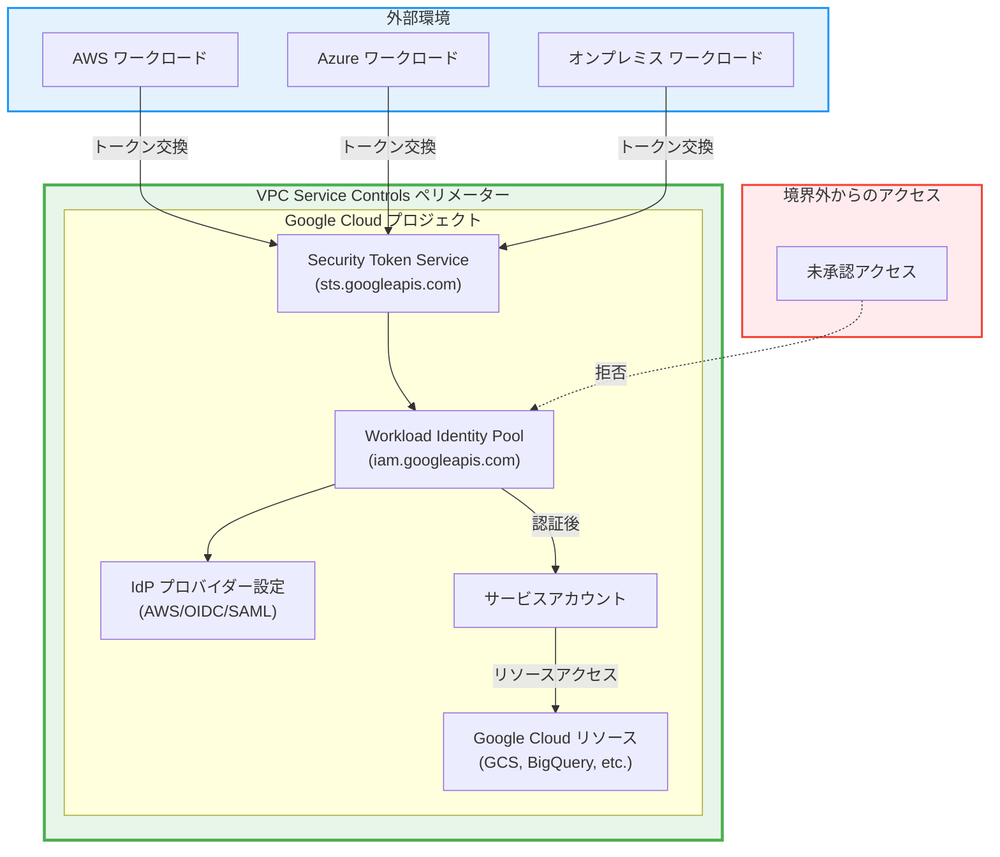

# VPC Service Controls: Workload Identity API サポート (Preview)

**リリース日**: 2026-06-03

**サービス**: VPC Service Controls

**機能**: Workload Identity API サポート (Preview)

**ステータス**: Preview

📊 [このアップデートのインフォグラフィックを見る](https://takech9203.github.io/google-cloud-news-summary/20260603-vpc-service-controls-workload-identity-api.html)

## 概要

VPC Service Controls が Workload Identity API との統合を Preview ステージでサポートするようになりました。これにより、Workload Identity API（`iam.googleapis.com` 内の workload identity pool 関連操作）に対して、VPC Service Controls のサービス境界（ペリメーター）による保護を適用できるようになります。

Workload Identity Federation は、外部ワークロード（AWS、Azure、オンプレミスなど）が Google Cloud リソースにアクセスするためのキーレス認証メカニズムです。今回のアップデートにより、workload identity pool の管理操作（作成、更新、削除、プロバイダー設定）をサービス境界内に制限することで、マルチクラウド環境におけるアイデンティティ管理のセキュリティが大幅に強化されます。

このアップデートは、規制要件の厳しい業界（金融、医療、公共機関）や、マルチクラウド戦略を採用している組織にとって特に重要です。外部 IdP との連携設定を VPC Service Controls で保護することにより、不正なアイデンティティプール設定の変更を防止し、データ流出リスクを低減できます。

**アップデート前の課題**

- Workload Identity Pool の管理操作（作成・更新・削除）が VPC Service Controls のサービス境界では十分に保護されていなかった
- 外部 IdP プロバイダーの設定変更に対して、ネットワークレベルのアクセス制御を適用することが困難だった
- マルチクラウド環境でのアイデンティティ連携設定に対する境界防御が不十分で、設定ミスやなりすましによるリスクが存在した

**アップデート後の改善**

- Workload Identity API の操作がサービス境界内に制限され、境界外からの管理操作を拒否できるようになった
- Ingress/Egress ルールを使用して、workload identity pool 管理操作への細粒度なアクセス制御が可能になった
- マルチクラウド環境における workload identity の設定を、組織のセキュリティ境界内で一元管理できるようになった

## アーキテクチャ図



VPC Service Controls のサービス境界が Workload Identity API を保護し、承認されたネットワークとアイデンティティからの管理操作のみを許可します。外部ワークロードからのトークン交換は Security Token Service を経由し、境界内の workload identity pool による検証を受けます。

## サービスアップデートの詳細

### 主要機能

1. **Workload Identity Pool のペリメーター保護**
   - workload identity pool の作成・更新・削除操作をサービス境界内に制限
   - IdP プロバイダーの追加・変更・削除操作の保護
   - workload identity pool 内の namespace およびマネージド ID の管理操作保護

2. **Ingress/Egress ルールによる細粒度制御**
   - workload identity 操作に対する送信元 IP ベースの制限
   - デバイスポリシーとの組み合わせによるコンテキストアウェアアクセス
   - 特定のメソッドセレクターを使用した操作レベルの制御

3. **マルチクラウド ID フェデレーション保護**
   - AWS、Azure、OIDC、SAML プロバイダーとの連携設定を保護
   - 外部 IdP 設定の不正な変更の防止
   - 属性条件と属性マッピングの設定変更に対する境界防御

## 技術仕様

### 保護対象の API メソッド

| API メソッド | 説明 |
|------|------|
| `workloadIdentityPools.create` | workload identity pool の作成 |
| `workloadIdentityPools.update` | workload identity pool の更新 |
| `workloadIdentityPools.delete` | workload identity pool の削除 |
| `workloadIdentityPools.get` | workload identity pool の取得 |
| `workloadIdentityPools.list` | workload identity pool の一覧 |
| `workloadIdentityPoolProviders.create` | プロバイダーの作成 |
| `workloadIdentityPoolProviders.update` | プロバイダーの更新 |
| `workloadIdentityPoolProviders.delete` | プロバイダーの削除 |

### サービス名とスコープ

| 項目 | 詳細 |
|------|------|
| サービス名 | `iam.googleapis.com` |
| ステータス | Preview |
| ペリメーター保護 | 対応 |
| 保護対象 | Workload Identity Pool、プロバイダー設定 |
| 対象外 | Workforce Pool（組織レベルリソースのため） |

### アクセスレベル設定例

```yaml
# サービスペリメーターでの Workload Identity API 保護設定
- status:
    resources:
      - projects/PROJECT_NUMBER
    restrictedServices:
      - iam.googleapis.com
    ingressPolicies:
      - ingressFrom:
          identityType: ANY_IDENTITY
          sources:
            - accessLevel: accessPolicies/POLICY_ID/accessLevels/TRUSTED_NETWORK
        ingressTo:
          operations:
            - serviceName: iam.googleapis.com
              methodSelectors:
                - method: google.iam.v1.WorkloadIdentityPools.*
          resources:
            - '*'
```

## 設定方法

### 前提条件

1. VPC Service Controls が有効な Google Cloud 組織
2. Access Context Manager の管理者権限（`roles/accesscontextmanager.policyAdmin`）
3. 対象プロジェクトに Workload Identity Pool が存在する（または作成予定である）こと

### 手順

#### ステップ 1: サービスペリメーターの作成（または更新）

```bash
# 新規ペリメーターの作成
gcloud access-context-manager perimeters create PERIMETER_NAME \
  --title="Workload Identity Protection" \
  --resources="projects/PROJECT_NUMBER" \
  --restricted-services="iam.googleapis.com" \
  --policy=POLICY_ID
```

既存のペリメーターに `iam.googleapis.com` を制限対象サービスとして追加します。

#### ステップ 2: Ingress ルールの設定

```bash
# ingress-policy.yaml を作成
cat > ingress-policy.yaml << 'EOF'
- ingressFrom:
    identityType: ANY_IDENTITY
    sources:
      - accessLevel: accessPolicies/POLICY_ID/accessLevels/CORP_NETWORK
  ingressTo:
    operations:
      - serviceName: iam.googleapis.com
        methodSelectors:
          - method: "*"
    resources:
      - "*"
EOF

# ペリメーターに Ingress ルールを適用
gcloud access-context-manager perimeters update PERIMETER_NAME \
  --set-ingress-policies=ingress-policy.yaml \
  --policy=POLICY_ID
```

信頼されたネットワークからの Workload Identity API アクセスを許可する Ingress ルールを設定します。

#### ステップ 3: Dry-run モードでの検証

```bash
# Dry-run モードで設定をテスト
gcloud access-context-manager perimeters dry-run create PERIMETER_NAME \
  --resources="projects/PROJECT_NUMBER" \
  --restricted-services="iam.googleapis.com" \
  --policy=POLICY_ID
```

本番適用前に Dry-run モードで設定を検証し、既存のワークロードに影響がないことを確認します。

## メリット

### ビジネス面

- **コンプライアンス強化**: NIST SP 800-53、FedRAMP High、ITAR などの規制フレームワークにおけるアイデンティティ管理のセキュリティ要件への対応が容易になる
- **マルチクラウドセキュリティの統一管理**: 複数クラウド環境からの認証連携設定を Google Cloud のセキュリティ境界内で一元的に保護・管理できる

### 技術面

- **境界防御の強化**: IAM のアイデンティティベースの制御に加えて、ネットワークレベルのコンテキストベースの制御を重ねることで多層防御を実現
- **設定変更の制御**: 承認されたネットワークからのみ workload identity pool の設定変更を許可し、不正アクセスによる設定改ざんを防止
- **監査ログとの連携**: VPC Service Controls のポリシー違反がログに記録されるため、不正な管理操作の試行を検知可能

## デメリット・制約事項

### 制限事項

- Preview ステージのため、本番環境での完全なサポートは保証されていない
- Workforce Pool（組織レベルリソース）は VPC Service Controls のペリメーターに直接追加できないため保護対象外
- Security Token Service API のトークン交換は別途制限設定が必要（`sts.googleapis.com` として個別に設定）
- IAM Policy Simulator API および IAM Policy Troubleshooter API はペリメーターで制限されない

### 考慮すべき点

- 既存の CI/CD パイプラインから workload identity pool の設定変更を行っている場合、Ingress ルールの適切な設定が必要
- Terraform や gcloud CLI による自動化ワークフローがペリメーター外から実行される場合、アクセスレベルの設計を事前に検討する必要がある
- Dry-run モードでの十分なテストなしに Enforced モードに移行すると、既存のフェデレーション認証フローが中断するリスクがある

## ユースケース

### ユースケース 1: マルチクラウド環境でのアイデンティティ保護

**シナリオ**: AWS 上で稼働するワークロードが Workload Identity Federation を使用して Google Cloud の BigQuery にアクセスしている。セキュリティチームは workload identity pool の設定変更を企業ネットワーク内からのみに制限したい。

**実装例**:
```yaml
# 企業ネットワークからのみ管理操作を許可
- ingressFrom:
    identityType: IDENTITY_TYPE_UNSPECIFIED
    sources:
      - accessLevel: accessPolicies/POLICY/accessLevels/CORP_ADMIN_NETWORK
  ingressTo:
    operations:
      - serviceName: iam.googleapis.com
        methodSelectors:
          - method: google.iam.v1.WorkloadIdentityPools.CreateWorkloadIdentityPool
          - method: google.iam.v1.WorkloadIdentityPools.UpdateWorkloadIdentityPool
          - method: google.iam.v1.WorkloadIdentityPools.DeleteWorkloadIdentityPool
          - method: google.iam.v1.WorkloadIdentityPoolProviders.CreateWorkloadIdentityPoolProvider
          - method: google.iam.v1.WorkloadIdentityPoolProviders.UpdateWorkloadIdentityPoolProvider
    resources:
      - '*'
```

**効果**: workload identity pool の管理操作が企業ネットワーク内に限定され、外部からの不正な設定変更が防止される。

### ユースケース 2: 規制対応環境での ID フェデレーション

**シナリオ**: 金融機関が FedRAMP High 準拠環境を Assured Workloads で構築しており、外部パートナーのワークロードとの連携に Workload Identity Federation を使用。規制要件に基づき、アイデンティティ管理の設定変更を厳密に制御する必要がある。

**効果**: VPC Service Controls による境界防御と IAM の権限管理を組み合わせることで、NIST SC-7（Boundary Protection）要件への適合を実証できる。Assured Workloads フォルダ内のプロジェクトでペリメーターを構成することで、規制対象データへのアクセスに使用される認証連携設定を保護する。

## 料金

VPC Service Controls 自体に追加料金は発生しません。Workload Identity Federation および IAM API の使用量に応じた標準的な課金が適用されます。

### 料金例

| 項目 | 料金 |
|--------|-----------------|
| VPC Service Controls | 追加料金なし（Access Context Manager の一部） |
| Workload Identity Pool | 無料 |
| トークン交換（STS） | 無料 |
| Cloud Audit Logs（データアクセスログ） | ログ量に応じた Cloud Logging 料金 |

## 利用可能リージョン

VPC Service Controls はグローバルサービスであり、すべての Google Cloud リージョンで利用可能です。Workload Identity Pool もグローバルリソース（`locations/global`）として作成されるため、リージョンの制限はありません。

## 関連サービス・機能

- **Workload Identity Federation**: 外部ワークロードの認証連携を提供するコアサービス。今回 VPC-SC による保護対象に追加
- **Security Token Service (STS) API**: トークン交換を処理する API。別途 VPC-SC での保護が可能
- **Access Context Manager**: VPC Service Controls のポリシーとアクセスレベルを管理するサービス
- **Assured Workloads**: 規制準拠環境の構築。VPC-SC と組み合わせて使用
- **Organization Policy Service**: `constraints/iam.workloadIdentityPoolProviders` 制約により許可する IdP を制限可能

## 参考リンク

- 📊 [インフォグラフィック](https://takech9203.github.io/google-cloud-news-summary/20260603-vpc-service-controls-workload-identity-api.html)
- [公式リリースノート](https://docs.cloud.google.com/release-notes#June_03_2026)
- [VPC Service Controls でサポートされるプロダクト](https://docs.cloud.google.com/vpc-service-controls/docs/supported-products)
- [IAM と VPC Service Controls の連携](https://docs.cloud.google.com/iam/docs/secure-iam-vpc-sc)
- [Workload Identity Federation ドキュメント](https://docs.cloud.google.com/iam/docs/workload-identity-federation)
- [VPC Service Controls の Ingress/Egress ルール](https://docs.cloud.google.com/vpc-service-controls/docs/ingress-egress-rules)
- [VPC Service Controls でサポートされるアイデンティティ](https://docs.cloud.google.com/vpc-service-controls/docs/supported-identities)

## まとめ

VPC Service Controls による Workload Identity API の Preview サポートは、マルチクラウド環境におけるアイデンティティ管理のセキュリティを大幅に強化する重要なアップデートです。外部 IdP との連携設定をサービス境界で保護することにより、不正な設定変更やアイデンティティプールの悪用を防止できます。特に規制準拠が求められる環境では、Dry-run モードでの十分なテストを経て導入を検討することを推奨します。

---

**タグ**: #VPCServiceControls #WorkloadIdentity #WorkloadIdentityFederation #Security #IAM #MultiCloud #Preview #IdentityManagement #ZeroTrust
