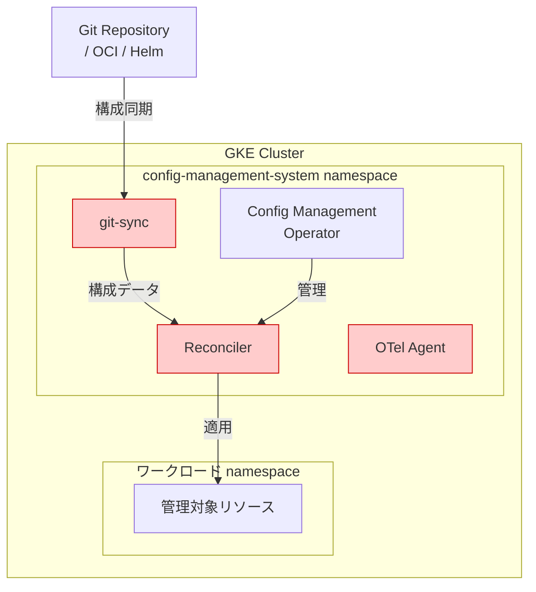

# Anthos Config Management: セキュリティアップデート (CVE 対応)

**リリース日**: 2026-06-04

**サービス**: Anthos Config Management (Config Sync)

**機能**: 依存関係更新による CVE 対応

**ステータス**: GA

📊 [このアップデートのインフォグラフィックを見る](https://takech9203.github.io/google-cloud-news-summary/20260604-anthos-config-management-cve-june.html)

## 概要

Anthos Config Management (Config Sync) において、複数の Common Vulnerabilities and Exposures (CVE) に対応するため、依存関係の更新が実施された。これは定期的なセキュリティメンテナンスの一環であり、サードパーティライブラリやコンテナイメージに含まれる既知の脆弱性を解消するものである。

Config Sync は GKE クラスタの構成管理を担う重要なコンポーネントであり、Git リポジトリ、OCI イメージ、Helm チャートからクラスタ構成を同期する役割を持つ。依存関係に脆弱性が存在する場合、クラスタのセキュリティポスチャ全体に影響を与える可能性があるため、迅速な対応が求められる。

**アップデート前の課題**

- 依存関係に含まれる既知の CVE により、潜在的なセキュリティリスクが存在していた
- セキュリティスキャンツールによる脆弱性レポートで警告が表示される状態であった

**アップデート後の改善**

- 依存関係の更新により既知の CVE が解消された
- コンプライアンス要件を満たすセキュリティポスチャが維持される
- セキュリティスキャンにおける脆弱性検出数が減少する

## アーキテクチャ図

赤色で示されたコンポーネントが今回の依存関係更新の対象となる主要コンテナである。git-sync、Reconciler、OTel Agent のそれぞれが依存するライブラリが更新されている。

## サービスアップデートの詳細

### セキュリティ修正

1. **依存関係の更新**
   - Config Sync コンテナイメージで使用されるサードパーティライブラリの更新
   - 既知の CVE に対するパッチ適用

2. **対象コンポーネント**
   - Config Sync の各コンテナ (reconciler, git-sync, otel-agent 等)
   - Go 言語の依存モジュール
   - コンテナベースイメージ

過去のリリースパターンから、以下のような依存関係が更新対象となることが多い:

| カテゴリ | 例 |
|---------|-----|
| コンテナランタイム | ベースイメージのセキュリティパッチ |
| Go モジュール | golang.org/x/net, golang.org/x/crypto 等 |
| 監視系 | OpenTelemetry Collector |
| Git 操作 | git-sync イメージ |
| テンプレートエンジン | Helm ライブラリ |

## メリット

- **セキュリティリスクの低減**: 既知の脆弱性が解消され、攻撃対象面 (Attack Surface) が縮小される
- **コンプライアンス維持**: PCI DSS、SOC 2 等のセキュリティ基準における脆弱性管理要件を満たす
- **運用負担の軽減**: Google がマネージドで依存関係を更新するため、ユーザー側での個別対応が不要

## デメリット・制約事項

- 具体的にどの CVE が修正されたかの詳細は公開されていない
- アップデート適用にはクラスタ上の Config Sync コンポーネントの再起動が発生する可能性がある
- GKE Enterprise ライセンスまたは GKE Standard での Config Sync 有効化が必要

## 関連サービス・機能

- **GKE Enterprise**: Config Sync を含む統合プラットフォーム
- **Policy Controller**: 構成ポリシーの適用と監査
- **Config Controller**: マネージド型の Config Sync 環境
- **Security Command Center**: クラスタの脆弱性スキャンと可視化

## 参考リンク

- 📊 [インフォグラフィック](https://takech9203.github.io/google-cloud-news-summary/20260604-anthos-config-management-cve-june.html)
- [公式リリースノート](https://docs.cloud.google.com/release-notes#June_04_2026)
- [Config Sync リリースノート](https://cloud.google.com/kubernetes-engine/enterprise/config-sync/docs/release-notes)
- [Anthos Config Management ドキュメント](https://cloud.google.com/anthos-config-management/docs)

## まとめ

今回のアップデートは、Anthos Config Management (Config Sync) の定期的なセキュリティメンテナンスとして、依存関係に含まれる複数の CVE を解消するものである。機能的な変更はないが、セキュリティポスチャの維持のために早期のアップデート適用が推奨される。GKE クラスタで Config Sync を利用している場合は、最新バージョンへの更新を計画的に実施すべきである。

---

**タグ**: #AnthosConfigManagement #ConfigSync #Security #CVE #GoogleCloud #GKE
