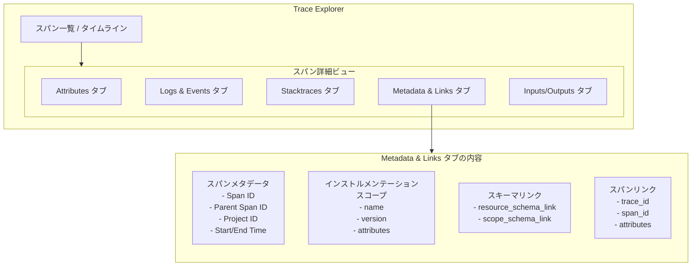

# Cloud Trace: スパン詳細ビューにメタデータ & リンクタブ追加

**リリース日**: 2026-06-04

**サービス**: Cloud Trace

**機能**: スパン詳細ビューでインストルメンテーションスコープとスキーマの確認が可能に

**ステータス**: GA

📊 [このアップデートのインフォグラフィックを見る](https://takech9203.github.io/google-cloud-news-summary/20260604-cloud-trace-span-metadata-links.html)

## 概要

Cloud Trace の Trace Explorer において、スパンの詳細ビュー (Details flyout) に「Metadata & Links」タブが追加されました。このタブでは、スパンに関連するインストルメンテーションスコープ (instrumentation scope) やスキーマ情報、他のスパンへのリンクなど、トレースデータの構造的なメタデータを一覧で確認できます。

この機能は、OpenTelemetry 標準に準拠したトレースデータを扱う開発者やSREチームにとって、スパンの発信元ライブラリやコンポーネントの特定、トレース間の関連性の把握を容易にするものです。マイクロサービスアーキテクチャにおけるトレースの可観測性が大幅に向上します。

**アップデート前の課題**

- スパンがどのライブラリやアプリケーションコンポーネントから生成されたかを UI 上で直接確認する手段が限られていた
- スパン間のリンク情報 (非同期処理やバッチ処理での関連付け) を視覚的に確認することが困難だった
- OpenTelemetry のスキーマ情報 (resource_schema_link, scope_schema_link) をコンソール上で参照できなかった

**アップデート後の改善**

- Metadata & Links タブからインストルメンテーションスコープ (名前、バージョン、属性) を直接確認可能になった
- スパンリンクのテーブル表示により、関連するスパンのトレース ID やキーバリューペアを一覧で確認できるようになった
- スパン ID、親スパン ID、プロジェクト ID、開始/終了時刻などの基本メタデータが整理されて表示されるようになった

## アーキテクチャ図

この図は、Trace Explorer のスパン詳細ビューにおけるタブ構成と、Metadata & Links タブで確認できる情報の全体像を示しています。

## サービスアップデートの詳細

### 主要機能

1. **インストルメンテーションスコープの表示**
   - スパンを生成したライブラリまたはアプリケーションコンポーネントを特定できる
   - スコープの名前 (例: `com.google.cloud.datastore`)、バージョン、属性が表示される
   - OpenTelemetry の Instrumentation Scope 概念に準拠した情報を提供

2. **スキーマ情報の参照**
   - `resource_schema_link`: リソースのスキーマファイルを返す URL
   - `scope_schema_link`: スコープのスキーマファイルを返す URL
   - OpenTelemetry Schemas 仕様に基づいたデータ構造の検証に利用可能

3. **スパンリンクの可視化**
   - 他のスパンへのリンクをテーブル形式で表示
   - 各リンクについてトレース ID、スパン ID、属性 (キーバリューペア) を確認可能
   - 同一トレース内のリンクは「Current trace」として表示される

4. **基本メタデータの一元表示**
   - Span ID (64ビット整数)
   - Parent Span ID
   - Project ID
   - 開始時刻と終了時刻

## 技術仕様

### インストルメンテーションスコープのフィールド

| フィールド | 型 | 説明 |
|------|------|------|
| name | string | ライブラリまたはコンポーネントの名前 |
| version | string | ライブラリのバージョン |
| attributes | JSON | キーバリューペアの属性 (OpenTelemetry 標準) |
| dropped_attributes_count | integer | 破棄された属性の数 |

### スパンリンクのフィールド

| フィールド | 型 | 説明 |
|------|------|------|
| trace_id | string | リンク先スパンのトレース ID (必須) |
| span_id | string | リンク先スパンのスパン ID (必須) |
| trace_state | string | トレース状態情報 |
| attributes | JSON | リンクに付与された属性 |
| dropped_attributes_count | integer | 破棄された属性の数 |

### スキーマリンクのフィールド

| フィールド | 型 | 説明 |
|------|------|------|
| resource_schema_link | string (URL) | リソースのスキーマファイル URL |
| scope_schema_link | string (URL) | スコープのスキーマファイル URL |

## 設定方法

### 前提条件

1. Google Cloud プロジェクトで Cloud Trace API が有効化されていること
2. OpenTelemetry SDK を使用してアプリケーションが計装されていること
3. Trace Explorer へのアクセス権限 (IAM ロール `roles/cloudtrace.user` 以上) を持っていること

### 手順

#### ステップ 1: Trace Explorer でスパンを選択

Google Cloud コンソールで Trace Explorer ページを開き、調査対象のスパンをタイムラインまたはスパンテーブルから選択します。Details flyout が表示されます。

#### ステップ 2: Metadata & Links タブを選択

Details flyout の右側パネルで「Metadata & Links」タブをクリックします。以下の情報が表示されます:

- スパンの基本メタデータ (Span ID、Parent Span ID、Project ID、Start/End Time)
- インストルメンテーションスコープ情報
- スキーマリンク
- 他スパンへのリンクテーブル

#### ステップ 3: リンク先スパンの調査 (必要に応じて)

リンクテーブルに表示されたスパンをクリックすることで、関連するスパンの詳細を確認できます。「Current trace」と表示されている場合は同一トレース内のスパンです。

## メリット

### ビジネス面

- **トラブルシューティング時間の短縮**: スパンの発信元コンポーネントを即座に特定でき、問題の切り分けが高速化される
- **運用効率の向上**: 非同期処理やバッチ処理での関連トレースを追跡しやすくなり、複雑なシステムの可観測性が向上

### 技術面

- **OpenTelemetry 互換性の強化**: OpenTelemetry 標準のインストルメンテーションスコープとスキーマ情報がネイティブに表示される
- **マイクロサービスデバッグの改善**: スパンリンクにより、サービス間の非同期的な因果関係を UI 上で追跡可能
- **計装ライブラリの管理**: どのバージョンのライブラリがスパンを生成しているかを確認でき、計装の一貫性を検証できる

## ユースケース

### ユースケース 1: 非同期処理のトレース追跡

**シナリオ**: ECサイトで注文処理が非同期的に複数のマイクロサービスにまたがって実行される場合。注文受付スパンから支払い処理スパン、在庫更新スパンへのリンクを Metadata & Links タブで確認し、処理全体のフローを把握する。

**効果**: 非同期メッセージキュー経由で実行される処理でも、スパンリンクを通じて因果関係を追跡でき、ボトルネックの特定や障害原因の調査が容易になる。

### ユースケース 2: 計装ライブラリのバージョン管理

**シナリオ**: 複数のマイクロサービスが異なるバージョンの OpenTelemetry SDK を使用している環境で、各スパンのインストルメンテーションスコープを確認し、古いバージョンを使用しているサービスを特定する。

**効果**: 計装ライブラリのバージョン不整合による問題を早期に発見し、組織全体での計装標準化を促進できる。

### ユースケース 3: スキーマ準拠の検証

**シナリオ**: Telemetry API を使用してトレースデータを送信している環境で、resource_schema_link や scope_schema_link を確認し、データが宣言されたスキーマに準拠しているかを検証する。

**効果**: テレメトリデータの品質と一貫性を維持し、ダッシュボードやアラートの信頼性を向上させる。

## 関連サービス・機能

- **Cloud Logging**: Logs & Events タブとの連携により、同一スパンに関連するログエントリとメタデータを横断的に確認可能
- **OpenTelemetry Collector**: OTLP エクスポーターから送信されたインストルメンテーションスコープ情報が Metadata & Links タブに反映される
- **App Hub**: Application Monitoring と連携し、apphub フィールドによるアプリケーション・サービス・ワークロード情報の表示にも対応
- **BigQuery (トレーススキーマ)**: BigQuery にエクスポートされたトレースデータでも同様の instrumentation_scope フィールドやリンク情報を SQL で分析可能

## 参考リンク

- 📊 [インフォグラフィック](https://takech9203.github.io/google-cloud-news-summary/20260604-cloud-trace-span-metadata-links.html)
- [公式リリースノート](https://docs.cloud.google.com/release-notes#June_04_2026)
- [ドキュメント: View attributes, log entries, and events](https://docs.cloud.google.com/trace/docs/finding-traces#attributes-events)
- [OpenTelemetry: Instrumentation Scope](https://opentelemetry.io/docs/concepts/instrumentation-scope/)
- [OpenTelemetry: Schemas](https://opentelemetry.io/docs/specs/otel/schemas/)
- [Cloud Trace API: Links リファレンス](https://docs.cloud.google.com/trace/docs/reference/v2/rest/v2/Links)

## まとめ

Cloud Trace の Metadata & Links タブにより、OpenTelemetry のインストルメンテーションスコープとスキーマ情報が Google Cloud コンソール上で直接確認できるようになりました。これは特にマイクロサービスアーキテクチャにおける分散トレーシングのデバッグと可観測性の向上に貢献します。OpenTelemetry を利用して計装を行っているチームは、Trace Explorer でスパンの詳細ビューを開き、Metadata & Links タブを活用することで、トレースデータの構造的理解とサービス間の関連性の把握を効率化できます。

---

**タグ**: #CloudTrace #Observability #Monitoring #OpenTelemetry #DistributedTracing #GoogleCloud
