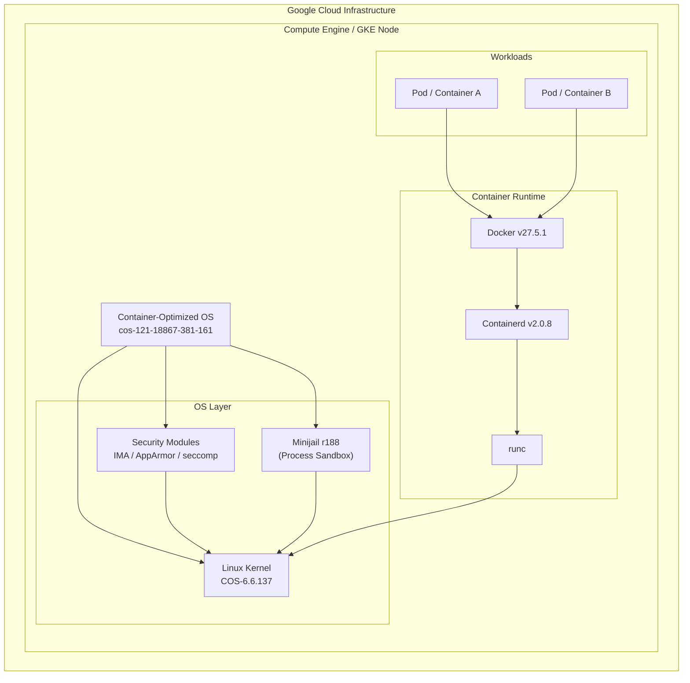

# Container-Optimized OS: セキュリティアップデート (2026年6月)

**リリース日**: 2026-06-04

**サービス**: Container-Optimized OS (COS)

**機能**: セキュリティパッチ・依存関係更新

**ステータス**: GA

📊 [このアップデートのインフォグラフィックを見る](https://takech9203.github.io/google-cloud-news-summary/20260604-container-optimized-os-security-june.html)

## 概要

Container-Optimized OS (COS) の cos-121 マイルストーンにおいて、重要なセキュリティアップデート cos-121-18867-381-161 がリリースされました。本リリースでは Linux カーネルが COS-6.6.137 に更新され、多数の Linux カーネル CVE が修正されています。また、コンテナランタイムとして Docker v27.5.1 および Containerd v2.0.8 が搭載され、サンドボックスツールの minijail が r188 に更新されました。

このアップデートは、Google Kubernetes Engine (GKE) や Compute Engine で COS ベースのノードを運用しているユーザーに直接影響する重要なセキュリティリリースです。CVE-2026-43303、CVE-2026-43499、CVE-2026-43503、CVE-2026-45838、CVE-2026-45839、CVE-2026-45841、CVE-2026-45842 を含む多数のカーネル脆弱性が修正されており、速やかな適用が推奨されます。

**アップデート前の課題**

- Linux カーネルに複数の既知の脆弱性 (CVE) が存在し、特権昇格やサービス拒否攻撃のリスクがあった
- minijail の旧バージョンではサンドボックスの保護範囲に制限があった
- Containerd の旧バージョン (v2.0.7 以前) に CVE-2026-35469 が存在していた

**アップデート後の改善**

- カーネルを COS-6.6.137 に更新し、CVE-2026-43303 を含む多数のカーネル脆弱性を解消
- minijail を r188 に更新し、プロセスサンドボックスの堅牢性が向上
- Containerd v2.0.8 により CVE-2026-35469 が修正され、コンテナランタイムの安全性が向上

## アーキテクチャ図

COS はイミュータブルなルートファイルシステムとセキュリティ強化カーネルの上に、Docker/Containerd コンテナランタイムを提供する構成です。minijail によるプロセスサンドボックスと seccomp/AppArmor による多層防御が実現されています。

## サービスアップデートの詳細

### バージョン情報

| コンポーネント | バージョン |
|---|---|
| イメージ名 | cos-121-18867-381-161 |
| マイルストーン | cos-121 (LTS) |
| Linux カーネル | COS-6.6.137 |
| Docker | v27.5.1 |
| Containerd | v2.0.8 |
| minijail | r188 |

### 主要セキュリティ修正

1. **Linux カーネル CVE 修正**
   - CVE-2026-43303、CVE-2026-43499、CVE-2026-43503: カーネルのメモリ管理やドライバ関連の脆弱性修正
   - CVE-2026-45838、CVE-2026-45839、CVE-2026-45841、CVE-2026-45842: ネットワークスタックおよびファイルシステム関連の脆弱性修正
   - その他多数のカーネル CVE を包括的に修正

2. **Containerd セキュリティ更新**
   - v2.0.8 へのアップグレードにより CVE-2026-35469 を修正 (前回の cos-121-18867-381-95 リリースで適用)

3. **minijail 更新 (r188)**
   - プロセスサンドボックス機能のセキュリティ強化
   - コンテナ外部のシステムプロセスの隔離能力を向上

## 技術仕様

### COS セキュリティアーキテクチャ

| セキュリティ機能 | 説明 |
|---|---|
| イミュータブルルートFS | 読み取り専用でマウント、起動時にカーネルが整合性を検証 |
| Verified Boot | ブート時にルートファイルシステムのチェックサムを検証 |
| セキュリティ強化カーネル | IMA、Audit、KPTI、Chromium OS 由来の LSM を有効化 |
| 自動更新 | セキュリティパッチの自動配信 (GKE ではノード自動アップグレードで管理) |
| 最小フットプリント | コンテナ実行に不要なパッケージを排除し攻撃面を最小化 |

### カーネル更新の変遷 (cos-121-18867-381 系列)

| 日付 | カーネルバージョン | Containerd |
|---|---|---|
| 2026-03-10 | COS-6.6.122 | v2.0.7 |
| 2026-05-04 | COS-6.6.122 | v2.0.8 |
| 2026-05-21 | COS-6.6.137 | v2.0.8 |
| 2026-06-01 | COS-6.6.137 | v2.0.8 |
| 2026-06-04 | COS-6.6.137 | v2.0.8 |

## メリット

### セキュリティ面

- **包括的な CVE 修正**: 複数のカーネル脆弱性を一括して解消し、攻撃面を大幅に削減
- **多層防御の強化**: minijail r188 への更新により、システムプロセスのサンドボックス保護が向上
- **コンテナランタイムの安全性**: Containerd v2.0.8 により、コンテナエスケープのリスクを低減

### 運用面

- **LTS サポート**: cos-121 は LTS (Long Term Supported) マイルストーンとして 2 年間のセキュリティパッチが保証される
- **自動適用**: GKE ノード自動アップグレードにより、手動介入なしで最新のセキュリティパッチを適用可能
- **安定性**: LTS リリースでは破壊的変更が導入されないため、ワークロードへの影響を最小限に抑えられる

## デメリット・制約事項

### 制限事項

- UEFI Secure Boot が有効な COS VM ではインプレース自動更新がサポートされない
- ARM ベースの COS イメージではインプレース更新がサポートされない
- cos-121 マイルストーン 117 以降、自動更新はデフォルトで無効化されており、明示的な有効化が必要

### 考慮すべき点

- カーネル更新に伴い、ワークロードによっては互換性テストが必要
- COS-6.6.137 へのカーネルアップグレードにより、一部のワークロードでパフォーマンス特性が変化する可能性がある
- 本番環境への適用前に、ステージング環境での検証を推奨

## 関連サービス・機能

- **Google Kubernetes Engine (GKE)**: COS はGKE のデフォルトノード OS イメージとして使用され、ノード自動アップグレード機能と連携
- **Compute Engine**: COS イメージは cos-cloud プロジェクトから利用可能で、コンテナワークロードに最適化
- **Cloud SQL**: マネージドサービスの基盤として COS を使用 (サービス側で自動管理)
- **Artifact Registry / Container Registry**: COS ノード上で実行されるコンテナイメージの保存・配信

## 参考リンク

- 📊 [インフォグラフィック](https://takech9203.github.io/google-cloud-news-summary/20260604-container-optimized-os-security-june.html)
- [公式リリースノート](https://docs.google.com/release-notes#June_04_2026)
- [COS ドキュメント](https://cloud.google.com/container-optimized-os/docs)
- [COS セキュリティ概念](https://cloud.google.com/container-optimized-os/docs/concepts/security)
- [cos-121 リリースノート](https://cloud.google.com/container-optimized-os/docs/release-notes/m121)
- [COS サポートポリシー](https://cloud.google.com/container-optimized-os/docs/resources/support-policy)

## まとめ

本アップデートは、Container-Optimized OS の cos-121 LTS マイルストーンにおける重要なセキュリティリリースです。Linux カーネル COS-6.6.137 への更新により多数の CVE が修正され、minijail r188 への更新でプロセスサンドボックスが強化されています。GKE や Compute Engine で COS ベースのノードを運用しているユーザーは、ノード自動アップグレードの有効化を確認し、速やかに最新イメージへの更新を検討してください。

---

**タグ**: #ContainerOptimizedOS #Security #CVE #GoogleCloud #GKE #LinuxKernel #Containerd #Docker
