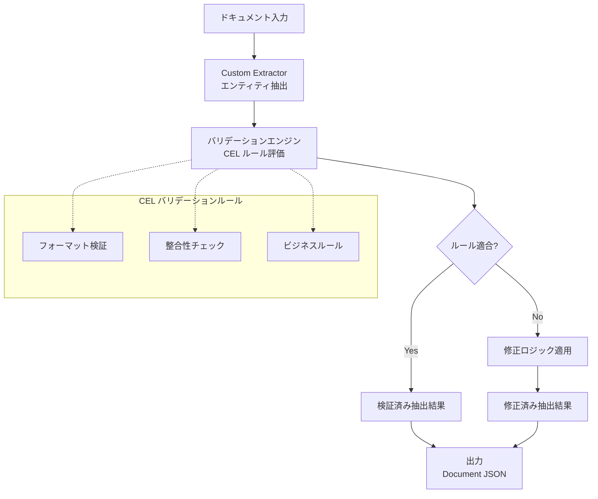

# Document AI: Custom Extractor にドキュメントバリデーションと修正機能が追加

**リリース日**: 2026-06-04

**サービス**: Document AI

**機能**: Custom Extractor - Document Validation and Correction

**ステータス**: Preview

📊 [このアップデートのインフォグラフィックを見る](https://takech9203.github.io/google-cloud-news-summary/20260604-document-ai-custom-extractor-validation.html)

## 概要

Google Cloud Document AI の Custom Extractor に、ドキュメントバリデーション（検証）と修正機能が Preview として追加されました。この機能により、Common Expression Language（CEL）方言を使用してバリデーションルールを定義し、抽出結果の精度を向上させることが可能になります。

Custom Extractor は、事前トレーニング済みプロセッサが利用できないドキュメントタイプからカスタムエンティティを抽出するためのプロセッサです。今回のアップデートでは、抽出後のデータに対してビジネスルールに基づいた検証と自動修正を適用できるようになり、データ品質の大幅な向上が期待できます。

この機能は、請求書、契約書、申請書などの業務文書を大量に処理する企業において特に有用であり、抽出データの整合性チェックや業務ルールへの準拠を自動化できます。

**アップデート前の課題**

- 抽出結果のバリデーションは別途カスタムロジックを実装する必要があった
- 抽出精度の問題を検出するためにはヒューマンレビュー（HITL）に頼る部分が大きかった
- ビジネスルール（合計値の整合性チェック、フォーマット検証など）をプロセッサ内で定義する手段がなかった

**アップデート後の改善**

- CEL 方言を使用してバリデーションルールをプロセッサ内に直接定義可能
- 抽出データに対する自動修正ロジックを組み込むことが可能に
- ビジネスルールに基づいた検証を抽出パイプライン内で完結できるようになった

## アーキテクチャ図



この図は、Custom Extractor がドキュメントからエンティティを抽出した後、CEL ベースのバリデーションルールで検証し、必要に応じて修正を適用するフローを示しています。

## サービスアップデートの詳細

### 主要機能

1. **CEL 方言によるバリデーションルール定義**
   - Common Expression Language（CEL）の Document AI 専用方言を使用してバリデーションルールを記述
   - 抽出されたエンティティの値、型、フォーマットに対する条件式を定義可能
   - 複合条件（AND / OR / NOT）や関数呼び出しをサポート

2. **ドキュメントデータを活用した検証**
   - 抽出されたフィールド間の相互参照による整合性チェック
   - ドキュメント全体のコンテキストを考慮したバリデーション
   - フィールド間の依存関係に基づくルール定義が可能

3. **自動修正機能**
   - バリデーションルールに違反した場合の修正アクションを定義
   - フォーマット変換、デフォルト値の適用などの修正パターンをサポート
   - 修正の信頼度スコアを含む結果出力

## 技術仕様

### CEL 方言の特徴

| 項目 | 詳細 |
|------|------|
| ベース言語 | Common Expression Language (CEL) |
| 用途 | ドキュメントバリデーション |
| 式の評価結果 | Boolean（検証の合否判定） |
| サポートする演算子 | 比較、論理、算術、文字列操作 |
| マクロサポート | `all`, `exists`, `exists_one`, `filter` |
| ステータス | Preview |

### CEL の概要

CEL（Common Expression Language）はオープンソースの非チューリング完全言語で、式の評価に使用されます。Google Cloud 内では Certificate Authority Service、Security Command Center、Eventarc Advanced などでも活用されており、Document AI でもドキュメントバリデーションのための専用方言が導入されました。

## 設定方法

### 前提条件

1. Document AI API が有効化されていること
2. 以下の IAM ロールが付与されていること：
   - `roles/documentai.admin`（Document AI Administrator）
   - `roles/storage.admin`（Storage Admin）
3. Custom Extractor プロセッサが作成済みであること

### 手順

#### ステップ 1: Custom Extractor プロセッサの作成（未作成の場合）

```bash
# Google Cloud コンソールで Document AI セクション > Workbench に移動
# Custom Extractor を選択して「Create processor」をクリック
# プロセッサ名とリージョンを指定して作成
```

Google Cloud コンソールの Document AI Workbench ページから Custom Extractor を作成します。

#### ステップ 2: バリデーションルールの設定

```
# CEL バリデーションルールの例

# 金額フィールドが正の値であることを検証
entity.total_amount > 0

# 日付フィールドが正しいフォーマットであることを検証
entity.invoice_date.matches('[0-9]{4}-[0-9]{2}-[0-9]{2}')

# 小計と税額の合計が合計金額と一致することを検証
entity.subtotal + entity.tax == entity.total_amount
```

CEL 方言を使用して、抽出結果に対するバリデーションルールを定義します。詳細は公式ドキュメント「CEL dialect for document validation」を参照してください。

## メリット

### ビジネス面

- **データ品質の向上**: 抽出結果に対する自動検証により、下流のビジネスプロセスに渡るデータの信頼性が向上
- **運用コストの削減**: ヒューマンレビューの必要性が低減し、大量文書処理のコスト効率が改善
- **コンプライアンス対応**: ビジネスルールへの準拠を自動的にチェックすることで、規制要件への対応を支援

### 技術面

- **パイプライン簡素化**: 抽出後のバリデーションロジックを外部に実装する必要がなくなり、アーキテクチャが簡素化
- **CEL の汎用性**: CEL は Google Cloud 全体で広く採用されている言語であり、学習コストが低く既存の知見を活用可能
- **信頼度スコアとの連携**: Custom Extractor の既存の信頼度スコア機能と組み合わせて、多層的な品質管理が可能

## デメリット・制約事項

### 制限事項

- 現在 Preview ステータスのため、本番環境での使用にはSLA が適用されない
- CEL 方言の仕様は変更される可能性がある
- Preview 段階ではドキュメントや機能の範囲が制限される場合がある

### 考慮すべき点

- CEL の式記述にはある程度の学習が必要
- 複雑なバリデーションルールはパフォーマンスに影響を与える可能性がある
- 既存のカスタムバリデーションロジックからの移行計画が必要

## ユースケース

### ユースケース 1: 請求書処理の整合性チェック

**シナリオ**: 大量の請求書をCustom Extractor で処理する際、品目の小計・税額・合計金額の整合性を自動検証する。

**実装例**:
```
# 合計金額の整合性チェック
entity.line_items.all(item, item.quantity * item.unit_price == item.line_total)
  && entity.subtotal == entity.line_items.map(item, item.line_total).sum()
  && entity.subtotal + entity.tax_amount == entity.total
```

**効果**: 計算ミスや OCR エラーによる金額の不整合を自動検出し、ヒューマンレビューの対象を限定できる。

### ユースケース 2: 本人確認書類のフォーマット検証

**シナリオ**: ID カードや運転免許証から抽出した番号が所定のフォーマットに合致するかを検証する。

**効果**: フォーマット不正な抽出結果を自動検出し、再処理やヒューマンレビューへのルーティングを自動化できる。

## 料金

Document AI Custom Extractor の料金は処理ページ数に基づきます。バリデーション機能の追加料金については、Preview 段階のため今後発表される可能性があります。

### 料金例

| 使用量 | 月額料金 (概算) |
|--------|-----------------|
| Custom Extractor: 1,000 ページ/月 | $30 |
| Custom Extractor: 10,000 ページ/月 | $300 |
| Custom Extractor: 100,000 ページ/月 | $3,000 |

※ 料金は 1,000 ページあたり $30（Custom Extractor 標準料金）。バリデーション機能固有の追加料金は Preview 期間中の公式発表を確認してください。

## 利用可能リージョン

Custom Extractor with GenAI は以下のリージョンで利用可能です：

| リージョン | ML 処理 | ファインチューニング |
|------------|---------|---------------------|
| us（米国マルチリージョン） | 対応 | 対応 |
| eu（欧州マルチリージョン） | 対応 | 対応（Preview） |
| asia-south1（ムンバイ） | 対応 | Preview |
| asia-southeast1（シンガポール） | 対応 | Preview |
| australia-southeast1（シドニー） | 対応 | Preview |
| europe-west2（ロンドン） | 対応 | Preview |
| europe-west3（フランクフルト） | 対応 | 対応 |
| northamerica-northeast1（モントリオール） | 対応 | Preview |

## 関連サービス・機能

- **Document AI Custom Extractor**: エンティティ抽出のベースとなるプロセッサ。Foundation model（Generative AI）と Custom model の両方をサポート
- **Document AI Workbench**: プロセッサの作成・トレーニング・評価を行うコンソール UI
- **Document-level Prompts**: ドキュメント全体に対するプロンプトで抽出品質を向上させる機能（2026年1月リリース）
- **Derived Fields**: 推論によりエンティティを導出する機能（署名検出含む）
- **Common Expression Language (CEL)**: Google が開発したオープンソースの式評価言語

## 参考リンク

- 📊 [インフォグラフィック](https://takech9203.github.io/google-cloud-news-summary/20260604-document-ai-custom-extractor-validation.html)
- [公式リリースノート](https://docs.cloud.google.com/release-notes#June_04_2026)
- [Custom Extractor ドキュメント](https://docs.cloud.google.com/document-ai/docs/ce-with-genai)
- [Custom Extractor メカニズム](https://docs.cloud.google.com/document-ai/docs/ce-mechanisms)
- [Document AI 料金ページ](https://cloud.google.com/document-ai/pricing)
- [CEL 言語仕様](https://github.com/google/cel-spec)

## まとめ

Document AI Custom Extractor のドキュメントバリデーションと修正機能は、CEL 方言を活用して抽出結果の品質を自動的に検証・修正する重要なアップデートです。大量文書処理のワークフローにおいて、ヒューマンレビューの負荷を軽減しながらデータ品質を向上させることが期待できます。Preview 段階のため、本番適用前に公式ドキュメント「CEL dialect for document validation」を参照し、ルールの設計と検証を十分に行うことを推奨します。

---

**タグ**: #DocumentAI #CustomExtractor #Validation #CEL #Preview #データ品質 #ドキュメント処理
