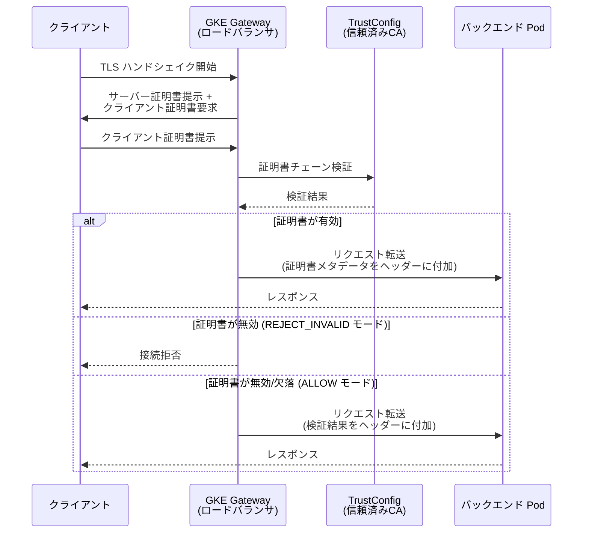

# Google Kubernetes Engine (GKE): Gateway フロントエンド mTLS (クライアント証明書検証) サポート

**リリース日**: 2026-06-04

**サービス**: Google Kubernetes Engine (GKE)

**機能**: Gateway フロントエンド mTLS (クライアント証明書検証)

**ステータス**: GA (一般提供)

📊 [このアップデートのインフォグラフィックを見る](https://takech9203.github.io/google-cloud-news-summary/20260604-gke-gateway-frontend-mtls.html)

## 概要

GKE Gateway がフロントエンド mTLS (mutual TLS) をサポートしました。この機能により、Gateway がクライアントから提示された証明書を検証し、認証を行うことが可能になります。フロントエンド mTLS は、クライアントとロードバランサ間の通信において、サーバー側がクライアントの身元を暗号的に検証するセキュリティメカニズムです。

この機能は、ゼロトラストアーキテクチャやコンプライアンス要件の厳しい環境において、API やアプリケーションへのアクセスを証明書ベースで制御する必要があるエンタープライズユーザーを対象としています。金融、医療、政府機関など、強力なクライアント認証が必要な業界で特に有用です。

対応する GatewayClass は `gke-l7-global-external-managed`、`gke-l7-regional-external-managed`、`gke-l7-rilb` の 3 種類です。

**アップデート前の課題**

- GKE Gateway でフロントエンドのクライアント証明書検証を行うためには、別途カスタムソリューションやサードパーティ製品の導入が必要だった
- Gateway API のネイティブ機能としてクライアント認証を統合的に管理する手段がなかった
- フロントエンドでの mTLS を実現するには、ロードバランサの設定を手動で直接操作する必要があった

**アップデート後の改善**

- GKE Gateway リソースを通じて、宣言的にフロントエンド mTLS を設定可能になった
- ServerTLSPolicy リソースと TrustConfig リソースを使用して、Kubernetes ネイティブなワークフローでクライアント証明書検証を構成できるようになった
- クライアント検証モード (ALLOW_INVALID_OR_MISSING_CLIENT_CERT / REJECT_INVALID) を選択できるようになり、柔軟なセキュリティポリシーの適用が可能になった

## アーキテクチャ図



この図は、GKE Gateway でのフロントエンド mTLS フローを示しています。クライアントが証明書を提示し、Gateway が TrustConfig に基づいて検証を行い、設定されたポリシー (REJECT_INVALID または ALLOW_INVALID_OR_MISSING_CLIENT_CERT) に従って処理を決定します。

## サービスアップデートの詳細

### 主要機能

1. **クライアント証明書検証 (Client Authentication)**
   - ServerTLSPolicy リソースを使用してクライアント認証ポリシーを定義
   - TrustConfig リソースで信頼済みの CA 証明書チェーンを管理
   - GKE Gateway コントローラがロードバランサへの設定を自動的に反映

2. **クライアント検証モード**
   - `ALLOW_INVALID_OR_MISSING_CLIENT_CERT`: 証明書が無効または未提示でもリクエストをバックエンドに転送 (証明書情報はヘッダーで伝達)
   - `REJECT_INVALID`: 有効な証明書を提示したクライアントのみアクセスを許可

3. **証明書メタデータのヘッダー転送**
   - クライアント証明書の情報をカスタムリクエストヘッダーとしてバックエンドに転送可能
   - `X-Client-Cert-Present`、`X-Client-Cert-Chain-Verified`、`X-Client-Cert-Hash` などの変数を利用可能
   - SPIFFE ID、SAN、発行者情報なども含めることが可能

## 技術仕様

### 対応 GatewayClass

| GatewayClass | ロードバランサタイプ | スコープ |
|------|------|------|
| `gke-l7-global-external-managed` | グローバル外部アプリケーションロードバランサ | グローバル |
| `gke-l7-regional-external-managed` | リージョナル外部アプリケーションロードバランサ | リージョナル |
| `gke-l7-rilb` | リージョナル内部アプリケーションロードバランサ | リージョナル |

### クライアント証明書メタデータ変数

| 変数名 | 説明 |
|------|------|
| `{client_cert_present}` | クライアント証明書の有無 |
| `{client_cert_chain_verified}` | 証明書チェーンの検証結果 |
| `{client_cert_error}` | 検証エラー情報 |
| `{client_cert_sha256_fingerprint}` | 証明書の SHA-256 フィンガープリント |
| `{client_cert_serial_number}` | 証明書のシリアル番号 |
| `{client_cert_spiffe_id}` | SPIFFE ID |
| `{client_cert_uri_sans}` | URI SAN |
| `{client_cert_dnsname_sans}` | DNS Name SAN |
| `{client_cert_issuer_dn}` | 発行者 DN |
| `{client_cert_subject_dn}` | サブジェクト DN |

### ServerTLSPolicy 設定例

```yaml
name: my-frontend-mtls-policy
mtlsPolicy:
  clientValidationMode: REJECT_INVALID
  clientValidationTrustConfig: projects/PROJECT_ID/locations/global/trustConfigs/my-trust-config
```

## 設定方法

### 前提条件

1. GKE クラスタが稼働していること
2. Gateway API が有効化されていること
3. Certificate Manager API が有効化されていること
4. Network Security API が有効化されていること

### 手順

#### ステップ 1: TrustConfig リソースの作成

信頼済み CA 証明書を含む TrustConfig リソースを作成します。

```bash
# TrustConfig YAML を作成
cat << EOF > trust_config.yaml
name: my-trust-config
trustStores:
- trustAnchors:
  - pemCertificate: |
      -----BEGIN CERTIFICATE-----
      # ルート CA 証明書の内容
      -----END CERTIFICATE-----
EOF

# TrustConfig をインポート (グローバル)
gcloud certificate-manager trust-configs import my-trust-config \
  --source=trust_config.yaml \
  --location=global
```

#### ステップ 2: ServerTLSPolicy (Client Authentication) リソースの作成

```bash
# ServerTLSPolicy YAML を作成
cat << EOF > server_tls_policy.yaml
name: my-frontend-mtls-policy
mtlsPolicy:
  clientValidationMode: REJECT_INVALID
  clientValidationTrustConfig: projects/PROJECT_ID/locations/global/trustConfigs/my-trust-config
EOF

# ServerTLSPolicy をインポート
gcloud network-security server-tls-policies import my-frontend-mtls-policy \
  --source=server_tls_policy.yaml \
  --location=global
```

#### ステップ 3: Gateway リソースの設定

Gateway リソースに ServerTLSPolicy を関連付けます。

```yaml
kind: Gateway
apiVersion: gateway.networking.k8s.io/v1
metadata:
  name: my-gateway
spec:
  gatewayClassName: gke-l7-global-external-managed
  listeners:
  - name: https
    protocol: HTTPS
    port: 443
    tls:
      mode: Terminate
      certificateRefs:
      - name: my-tls-secret
```

#### ステップ 4: 証明書メタデータヘッダーの設定 (オプション)

URLMap を編集して、クライアント証明書情報をバックエンドに転送するカスタムヘッダーを設定します。

```yaml
headerAction:
  requestHeadersToAdd:
  - headerName: "X-Client-Cert-Present"
    headerValue: "{client_cert_present}"
  - headerName: "X-Client-Cert-Chain-Verified"
    headerValue: "{client_cert_chain_verified}"
  - headerName: "X-Client-Cert-Hash"
    headerValue: "{client_cert_sha256_fingerprint}"
```

## メリット

### ビジネス面

- **コンプライアンス対応の強化**: PCI DSS、HIPAA、FedRAMP などの規制要件で求められるクライアント認証を Kubernetes ネイティブに実現
- **セキュリティ態勢の向上**: ゼロトラストモデルにおいて、ネットワーク境界でのクライアント認証レイヤーを追加
- **運用コストの削減**: サードパーティの mTLS ソリューションを導入する必要がなくなり、GKE Gateway の統合管理で完結

### 技術面

- **宣言的設定**: Kubernetes リソースとして mTLS ポリシーを管理でき、GitOps ワークフローとの統合が容易
- **柔軟な検証モード**: 段階的なロールアウトが可能 (まず ALLOW モードで監視し、問題がなければ REJECT モードに移行)
- **豊富な証明書メタデータ**: クライアント証明書の詳細情報をヘッダー経由でバックエンドに伝達でき、アプリケーション層での認可判断に活用可能

## デメリット・制約事項

### 制限事項

- 対応する GatewayClass は 3 種類 (`gke-l7-global-external-managed`、`gke-l7-regional-external-managed`、`gke-l7-rilb`) に限定される
- TrustConfig リソースは Gateway と同じロケーション (グローバルまたは同一リージョン) に作成する必要がある
- Certificate Manager の TrustConfig リソースにはサイズ制限 (クォータ) が存在する

### 考慮すべき点

- クライアント証明書の配布・管理・失効処理は別途検討が必要 (Private CA や外部 PKI との連携)
- mTLS はクライアント側にも証明書の管理負担を課すため、利用者 (開発者、パートナー) への影響を事前に評価すべき
- REJECT_INVALID モードに移行する前に、ALLOW モードでの十分なテストと監視を推奨

## ユースケース

### ユースケース 1: API ゲートウェイでのパートナー認証

**シナリオ**: B2B プラットフォームで、外部パートナーからの API アクセスをクライアント証明書で認証したい。パートナーごとに異なる証明書を発行し、アクセス元を暗号的に特定する。

**実装例**:
```yaml
# ServerTLSPolicy: パートナー証明書の検証 (厳格モード)
name: partner-api-mtls
mtlsPolicy:
  clientValidationMode: REJECT_INVALID
  clientValidationTrustConfig: projects/my-project/locations/global/trustConfigs/partner-trust-config
```

**効果**: IP アドレスベースのフィルタリングよりも堅牢なクライアント認証が実現し、証明書の失効管理により即時のアクセス無効化も可能。

### ユースケース 2: マイクロサービス間通信のゼロトラスト化

**シナリオ**: クラスタ外部から内部サービスにアクセスする場合に、VPN 接続に加えてクライアント証明書による多層的な認証を適用したい。

**効果**: VPN 突破時にも証明書がない限りサービスへのアクセスが拒否されるため、多層防御が実現する。

## 料金

フロントエンド mTLS 自体には追加料金は発生しません。ただし、以下の関連リソースにはそれぞれの料金体系が適用されます。

### 料金例

| リソース | 料金 |
|--------|-----------------|
| GKE Gateway (ロードバランサ) | Application Load Balancer の標準料金に準ずる |
| Certificate Manager (TrustConfig) | Certificate Manager の料金に準ずる |
| Private CA (証明書発行) | CA Service の料金に準ずる |

## 利用可能リージョン

- **グローバル**: `gke-l7-global-external-managed` を使用する場合、全リージョンから利用可能
- **リージョナル**: `gke-l7-regional-external-managed` および `gke-l7-rilb` を使用する場合、Application Load Balancer がサポートされている全リージョンで利用可能

## 関連サービス・機能

- **Certificate Manager**: TrustConfig リソースを管理し、信頼済み CA 証明書を保持
- **Network Security API**: ServerTLSPolicy リソースの作成・管理に使用
- **Certificate Authority Service (CA Service)**: クライアント証明書の発行に活用可能
- **Backend TLS (BackendTLSPolicy)**: バックエンド方向の TLS 検証機能。フロントエンド mTLS と組み合わせることでエンドツーエンドの mTLS を実現
- **Google Cloud Armor**: フロントエンド mTLS と組み合わせてセキュリティポリシーを多層化

## 参考リンク

- 📊 [インフォグラフィック](https://takech9203.github.io/google-cloud-news-summary/20260604-gke-gateway-frontend-mtls.html)
- [公式リリースノート](https://docs.cloud.google.com/release-notes#June_04_2026)
- [GKE Gateway セキュリティ設定ドキュメント](https://docs.cloud.google.com/kubernetes-engine/docs/how-to/secure-gateway)
- [Application Load Balancer mTLS 設定 (Private CA 使用)](https://docs.cloud.google.com/load-balancing/docs/https/setting-up-mtls-ca-ccm)
- [Application Load Balancer mTLS 設定 (ユーザー提供証明書)](https://docs.cloud.google.com/load-balancing/docs/https/setting-up-mtls-ccm)
- [GKE GatewayClass 機能一覧](https://docs.cloud.google.com/kubernetes-engine/docs/how-to/gatewayclass-capabilities)
- [mTLS の概要](https://docs.cloud.google.com/load-balancing/docs/mtls)

## まとめ

GKE Gateway のフロントエンド mTLS サポートにより、Kubernetes ネイティブな宣言的設定でクライアント証明書検証が可能になりました。ゼロトラストアーキテクチャの導入やコンプライアンス要件への対応が容易になるため、セキュリティ要件の高いワークロードを GKE で運用している組織は、この機能の導入を検討することを推奨します。まずは ALLOW_INVALID_OR_MISSING_CLIENT_CERT モードでテスト環境から導入を開始し、段階的に本番環境へ展開するアプローチが有効です。

---

**タグ**: #GKE #Gateway #mTLS #セキュリティ #証明書認証 #ゼロトラスト #KubernetesGatewayAPI #フロントエンドセキュリティ
