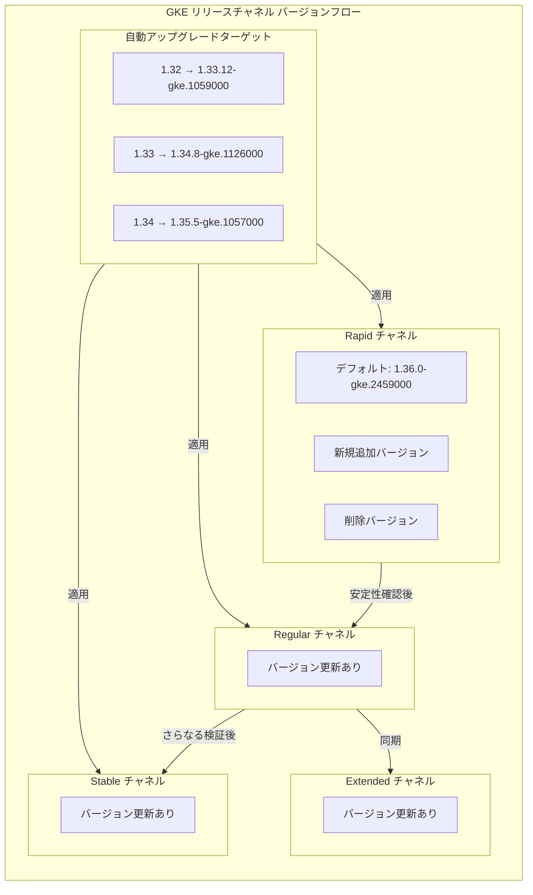

# Google Kubernetes Engine: バージョンアップデート (2026-R22)

**リリース日**: 2026-06-04

**サービス**: Google Kubernetes Engine (GKE)

**機能**: クラスタバージョン更新 (2026-R22)

**ステータス**: GA

📊 [このアップデートのインフォグラフィックを見る](https://takech9203.github.io/google-cloud-news-summary/20260604-gke-version-updates-2026-r22.html)

## 概要

Google Kubernetes Engine (GKE) のリリースチャネル全体にわたるクラスタバージョンの定期更新 2026-R22 が公開されました。今回のアップデートでは、Rapid チャネルにおいて新しいデフォルトバージョン 1.36.0-gke.2459000 が設定され、複数のマイナーバージョン (1.33, 1.34, 1.35, 1.36) に対する新しいパッチバージョンが利用可能になっています。

本アップデートにはセキュリティ修正が含まれており、既知の脆弱性への対応が行われています。自動アップグレードターゲットも更新されており、1.32 から 1.35 までの各マイナーバージョンを使用しているクラスタに対して、新しいアップグレードパスが設定されています。

**アップデート前の課題**

- 以前のデフォルトバージョン (1.36.0-gke.2253000 等) には既知のセキュリティ脆弱性が含まれている可能性があった
- 古いパッチバージョンを使用しているクラスタでは、最新のバグ修正や安定性改善が適用されていなかった
- 自動アップグレードターゲットが古いバージョンを指しており、段階的なバージョン移行が停滞していた

**アップデート後の改善**

- Rapid チャネルのデフォルトが 1.36.0-gke.2459000 に更新され、新規クラスタ作成時に最新の安定バージョンが適用される
- セキュリティ修正を含む新しいパッチバージョンが各マイナーバージョンで利用可能になった
- 自動アップグレードターゲットが更新され、クラスタが順次新しいバージョンへ移行可能になった

## アーキテクチャ図



GKE のリリースチャネルは Rapid から Regular、Stable の順にバージョンが伝播します。各チャネルで十分な使用実績と安定性が確認された後、次のチャネルに昇格する仕組みです。

## サービスアップデートの詳細

### バージョン情報

#### Rapid チャネル

| 項目 | バージョン |
|------|-----------|
| 新デフォルトバージョン | 1.36.0-gke.2459000 |
| 新規追加 (1.33系) | 1.33.12-gke.1116000 |
| 新規追加 (1.34系) | 1.34.8-gke.1218000 |
| 新規追加 (1.35系) | 1.35.5-gke.1163000 |
| 新規追加 (1.36系) | 1.36.0-gke.2684000 |

#### Rapid チャネルから削除されたバージョン

| マイナーバージョン | 削除されたバージョン |
|-------------------|---------------------|
| 1.33 | 1.33.12-gke.1000000 |
| 1.34 | 1.34.8-gke.1000000 |
| 1.35 | 1.35.5-gke.1000000 |
| 1.36 | 1.36.0-gke.2253000 |

### 自動アップグレードターゲット

自動アップグレードターゲットは、GKE がクラスタを段階的にアップグレードする際の目標バージョンです。十分な使用実績により安定性が確認されたバージョンが選定されます。

| 現在のマイナーバージョン | アップグレードターゲット |
|--------------------------|--------------------------|
| 1.32.x | 1.33.12-gke.1059000 |
| 1.33.x | 1.34.8-gke.1126000 |
| 1.34.x | 1.35.5-gke.1057000 |

**注意**: 自動アップグレードはメンテナンスウィンドウやメンテナンス除外の設定を考慮します。10 日以上アップグレードが開始されない場合は、メンテナンスポリシーや除外設定を確認してください。

## 技術仕様

### リリースチャネルの特性

| チャネル | バージョン入手タイミング | 自動アップグレードターゲット設定 | 推奨用途 |
|----------|--------------------------|----------------------------------|----------|
| Rapid | upstream GA 後 1-2 週間 | リリース後 1-2 ヶ月 | プレプロダクション環境、最新機能の早期検証 |
| Regular | Rapid リリース後約 2 ヶ月 | Regular リリース後約 3 ヶ月 | 本番環境（推奨） |
| Stable | Regular リリース後 3-4 ヶ月 | Stable リリース後約 2 ヶ月 | 安定性最優先の環境 |
| Extended | Regular と同期 | Regular と同期 | 長期サポートが必要な環境 (最大 24 ヶ月) |

### バージョン確認コマンド

```bash
# 利用可能なバージョンの確認
gcloud container get-server-config \
  --zone=ZONE \
  --format="yaml(channels)"

# 特定クラスタのアップグレード情報取得
gcloud container clusters describe CLUSTER_NAME \
  --zone=ZONE \
  --format="yaml(currentMasterVersion,currentNodeVersion)"

# クラスタのアップグレードターゲット確認
gcloud container clusters describe CLUSTER_NAME \
  --zone=ZONE \
  --format="yaml(upgradeInfo)"
```

## メリット

### セキュリティ面

- **脆弱性への迅速な対応**: セキュリティ修正が含まれており、既知の脆弱性に対するパッチが適用される
- **段階的なロールアウト**: チャネルごとの段階的展開により、セキュリティパッチの安定性が確認された上で適用される

### 運用面

- **自動アップグレードによる運用負荷軽減**: 手動でのバージョン管理が不要で、GKE が自動的にクラスタを最新の安定バージョンに維持
- **メンテナンスウィンドウとの連携**: 自動アップグレードはメンテナンスウィンドウの設定を尊重するため、業務影響を最小化
- **バージョンの一貫性**: 全チャネルで更新が行われることで、環境間のバージョン差異が適切に管理される

### 技術面

- **最新 Kubernetes 機能の利用**: 新しいマイナーバージョン (1.36) のデフォルト化により、最新の Kubernetes API や機能が利用可能
- **パフォーマンス改善**: 新パッチバージョンにはバグ修正とパフォーマンス最適化が含まれる

## デメリット・制約事項

### 制限事項

- Rapid チャネルのバージョンは GKE SLA の対象外であり、既知の回避策のない問題が含まれる可能性がある
- 自動アップグレードにより、特定のバージョンに依存するワークロードに影響が出る可能性がある
- 削除されたバージョン (1.33.12-gke.1000000 等) を使用しているクラスタは、新しいバージョンへのアップグレードが必要

### 考慮すべき点

- **アップグレード前のテスト**: 本番環境のアップグレード前に、ステージング環境で互換性を確認することを推奨
- **非推奨 API の確認**: マイナーバージョンアップグレードでは Kubernetes API の廃止が伴う場合があるため、事前に非推奨警告を確認する必要がある
- **メンテナンスウィンドウの設定**: 自動アップグレードのタイミングを制御するため、適切なメンテナンスウィンドウの設定を推奨
- **ロールバック不可**: GKE のアップグレードはロールバックできないため、問題発生時は新しいパッチバージョンでの修正を待つ必要がある

## 関連サービス・機能

- **GKE リリースチャネル**: クラスタのバージョン管理ポリシーを制御する仕組み。Rapid/Regular/Stable/Extended から選択可能
- **GKE メンテナンスウィンドウ**: 自動アップグレードが実行される時間枠を制御する機能
- **GKE メンテナンス除外**: 特定期間中の自動アップグレードを防止する設定
- **Container-Optimized OS**: GKE ノードの基盤 OS。Extended チャネルではマイルストーンの変更に注意が必要
- **GKE セキュリティ速報**: セキュリティ修正に関する詳細情報が公開される通知チャネル

## 参考リンク

- 📊 [インフォグラフィック](https://takech9203.github.io/google-cloud-news-summary/20260604-gke-version-updates-2026-r22.html)
- [公式リリースノート](https://docs.google.com/release-notes#June_04_2026)
- [GKE バージョニングとサポート](https://cloud.google.com/kubernetes-engine/versioning)
- [GKE リリースチャネルの概要](https://cloud.google.com/kubernetes-engine/docs/concepts/release-channels)
- [GKE クラスタアップグレード](https://cloud.google.com/kubernetes-engine/docs/concepts/cluster-upgrades)
- [GKE リリーススケジュール](https://cloud.google.com/kubernetes-engine/docs/release-schedule)

## まとめ

2026-R22 バージョンアップデートは、GKE の全リリースチャネルにわたるセキュリティ修正を含む定期更新です。Rapid チャネルでは 1.36.0-gke.2459000 が新デフォルトとなり、各マイナーバージョンの自動アップグレードターゲットも更新されました。本番環境で Regular または Stable チャネルを使用しているユーザーは、自動アップグレードが適切に動作するようメンテナンスウィンドウの設定を確認し、非推奨 API の使用状況をモニタリングすることを推奨します。

---

**タグ**: #GKE #Kubernetes #VersionUpdate #ReleaseChannel #Security #AutoUpgrade #GoogleCloud
