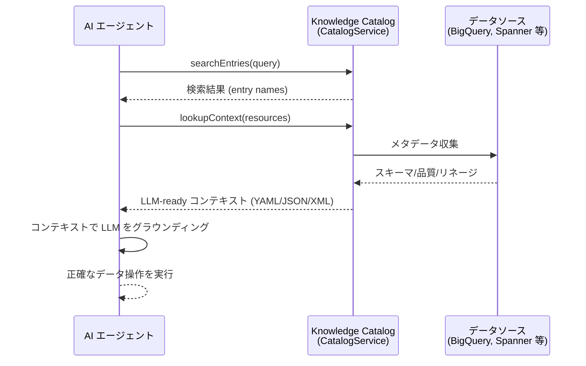

# Knowledge Catalog: lookupContext メソッドによるエージェント向けデータアセットコンテキスト取得

**リリース日**: 2026-06-04

**サービス**: Knowledge Catalog (旧 Dataplex Universal Catalog)

**機能**: lookupContext メソッドによるエージェントワークフロー向けコンテキスト取得

**ステータス**: Preview

📊 [このアップデートのインフォグラフィックを見る](https://takech9203.github.io/google-cloud-news-summary/20260604-knowledge-catalog-lookup-context-agentic.html)

## 概要

Google Cloud Knowledge Catalog に、新しい `lookupContext` メソッドがプレビューとして追加されました。このメソッドは、データアセットに関する事前フォーマット済みのコンテキストバンドルを取得し、インタラクティブなエージェントワークフローに最適化された形式で提供します。

この機能により、AI エージェントはエンタープライズデータの包括的なコンテキスト（スキーマ、説明、ビジネスアノテーション、データ品質インサイト、リレーションシップなど）を即座に取得でき、LLM のグラウンディング（事実に基づく回答の生成）に活用できます。エージェントがデータアセットを正確に理解し活用するための基盤を提供することで、ハルシネーションの低減と信頼性の高い自律的データ操作を実現します。

対象ユーザーは、LangChain や Agent Development Kit (ADK) を使用してカスタムエージェントを構築する AI 開発者、エンタープライズデータとの対話を必要とするエージェントビルダー、および MCP（Model Context Protocol）対応ツールを活用するデータプラットフォームチームです。

**アップデート前の課題**

- エージェントがデータアセットのメタデータを取得する際、複数の API 呼び出しを組み合わせてスキーマ、説明、品質情報を個別に収集する必要があった
- 取得したメタデータを LLM が理解しやすい形式に手動で変換・整形する必要があった
- エージェントがデータアセット間のリレーションシップやビジネスコンテキストを把握するための統一された方法がなかった

**アップデート後の改善**

- 単一の API 呼び出しで、LLM に最適化された事前フォーマット済みのコンテキストを取得可能になった
- スキーマ、説明、ビジネスアノテーション、データ品質インサイト、リレーションシップが統合されたコンテキストとして一括取得できるようになった
- MCP ツールおよび REST API/gcloud CLI から統一的にアクセス可能になり、エージェント統合が大幅に簡素化された

## アーキテクチャ図



AI エージェントが Knowledge Catalog の searchEntries で関連データアセットを発見し、lookupContext で LLM に最適化されたコンテキストを取得する一連のフローを示しています。

## サービスアップデートの詳細

### 主要機能

1. **LLM-ready コンテキストの一括取得**
   - 単一の API 呼び出しで最大 10 リソースのコンテキストを同時に取得可能
   - スキーマ、説明文、ビジネスアノテーション、データ品質インサイト、リレーションシップを包括的に含むコンテキストを返却
   - 出力フォーマットは YAML（デフォルト）、JSON、XML から選択可能

2. **コンテキストバジェット制御**
   - `context_budget` オプションにより、出力の文字数を概算で制御可能
   - LLM のトークン制限に合わせてコンテキストをインテリジェントに切り詰め
   - `all_schema_fields` オプションで全スキーマフィールドの返却を強制可能

3. **複数のアクセス方法に対応**
   - REST API (`dataplex/v1`) 経由での直接呼び出し
   - MCP ツール (`lookup_context`) 経由でのエージェント統合
   - gcloud CLI (`gcloud alpha dataplex context lookup`) 経由での操作
   - Remote MCP Server (`https://dataplex.googleapis.com/mcp`) 経由でのサーバーレス環境からのアクセス

## 技術仕様

### API 仕様

| 項目 | 詳細 |
|------|------|
| RPC メソッド | `LookupContext` |
| サービス | `google.cloud.dataplex.v1.CatalogService` |
| エンドポイント | `dataplex.googleapis.com` |
| 最大リソース数 | 1 リクエストあたり 10 リソース |
| 出力フォーマット | YAML (デフォルト), JSON, XML |
| ステータス | Preview |

### リクエスト形式 (LookupContextRequest)

```json
{
  "name": "projects/{project}/locations/{location}",
  "resources": [
    "projects/{project}/locations/{location}/entryGroups/{entry_group}/entries/{entry}"
  ],
  "options": {
    "format": "yaml",
    "context_budget": "4000",
    "all_schema_fields": "true"
  }
}
```

### レスポンス形式 (LookupContextResponse)

```json
{
  "context": "事前フォーマット済みのコンテキストテキスト（YAML/JSON/XML 形式）"
}
```

### 認証スコープ

| スコープ | 説明 |
|----------|------|
| `https://www.googleapis.com/auth/cloud-platform` | フルアクセス |
| `https://www.googleapis.com/auth/cloud-platform.read-only` | 読み取り専用 |
| `https://www.googleapis.com/auth/dataplex.read-write` | Dataplex 読み書き |
| `https://www.googleapis.com/auth/dataplex.readonly` | Dataplex 読み取り専用 |

### MCP ツール仕様

| 項目 | 値 |
|------|------|
| ツール名 | `lookup_context` |
| Destructive Hint | No |
| Idempotent Hint | Yes |
| Read Only Hint | Yes |
| Open World Hint | Yes |

## 設定方法

### 前提条件

1. Google Cloud プロジェクトで Dataplex API が有効化されていること
2. 適切な IAM ロール（`roles/dataplex.catalogViewer` 以上）が付与されていること
3. 対象データアセットが Knowledge Catalog に登録済みであること

### 手順

#### ステップ 1: gcloud CLI を使用したコンテキスト取得

```bash
gcloud alpha dataplex context lookup \
  --location=us-central1 \
  --project=my-project \
  --resources=projects/my-project/locations/us-central1/entryGroups/@bigquery/entries/bigquery.googleapis.com/projects/my-project/datasets/my_dataset/tables/my_table
```

デフォルトでは YAML 形式でコンテキストが返却されます。

#### ステップ 2: Python SDK を使用したエージェント統合

```python
from google.cloud import dataplex_v1

# CatalogService クライアントの初期化
client = dataplex_v1.CatalogServiceClient(
    client_options={"api_endpoint": "dataplex.googleapis.com"}
)

# LookupContext リクエストの実行
parent_name = "projects/my-project/locations/us-central1"
lookup_request = {
    "name": parent_name,
    "resources": [
        "projects/my-project/locations/us-central1/entryGroups/@bigquery/entries/bigquery.googleapis.com/projects/my-project/datasets/sales/tables/orders"
    ]
}

response = client.lookup_context(request=lookup_request)

# LLM にコンテキストを提供
llm_context = response.context
```

エージェントフレームワーク（LangChain、ADK 等）から呼び出す際は、このコードをツールとしてラップして使用します。

#### ステップ 3: MCP 経由でのアクセス（Remote MCP Server）

```bash
curl --location 'https://dataplex.googleapis.com/mcp' \
  --header 'content-type: application/json' \
  --header 'accept: application/json, text/event-stream' \
  --header 'Authorization: Bearer $(gcloud auth print-access-token)' \
  --data '{
    "method": "tools/call",
    "params": {
      "name": "lookup_context",
      "arguments": {
        "projectId": "my-project",
        "location": "us-central1",
        "resources": [
          "projects/my-project/locations/us-central1/entryGroups/@bigquery/entries/bigquery.googleapis.com/projects/my-project/datasets/sales/tables/orders"
        ]
      }
    },
    "jsonrpc": "2.0",
    "id": 1
  }'
```

MCP 対応ツール（Gemini CLI、Claude Code、Cursor、VS Code 等）からも直接呼び出し可能です。

## メリット

### ビジネス面

- **エージェント開発の迅速化**: データコンテキスト取得のための複雑なロジック構築が不要になり、エージェント開発のリードタイムを短縮
- **データガバナンスの維持**: IAM パーミッションに基づいたアクセス制御により、エージェントが権限のあるデータのみにアクセスすることを保証
- **信頼性の向上**: LLM のグラウンディングにより、ハルシネーションを低減し、エンタープライズデータに基づく正確な回答を実現

### 技術面

- **統一された API**: REST API、gcloud CLI、MCP の 3 つのアクセスパターンにより、あらゆるアーキテクチャに対応
- **最適化されたフォーマット**: LLM が直接消費可能な形式で提供されるため、前処理が不要
- **コンテキストバジェット制御**: トークン制限を考慮したインテリジェントな切り詰めにより、効率的なコンテキスト利用が可能

## デメリット・制約事項

### 制限事項

- 現時点では Preview ステータスであり、GA（一般提供）前に API の変更が発生する可能性がある
- 1 リクエストあたりの最大リソース数は 10 に制限されている
- `context_budget` は概算値であり、正確な文字数制御は保証されない

### 考慮すべき点

- ソースシステム（BigQuery 等）の権限に基づいてコンテキストが返却されるため、エージェントのサービスアカウントに適切な権限設定が必要
- Preview 段階のため、本番ワークロードでの使用は SLA の観点で慎重に判断する必要がある
- コンテキストの鮮度はメタデータハーベスティングの頻度に依存する

## ユースケース

### ユースケース 1: SQL クエリ生成エージェント

**シナリオ**: データアナリストが自然言語で「国別のユーザー数を集計して」と依頼した場合、エージェントが適切なテーブルを特定し正確な SQL を生成する。

**実装例**:
```python
# 1. セマンティック検索でテーブルを発見
search_response = client.search_entries(
    request={
        "name": parent_name,
        "query": "users country",
        "semantic_search": True,
    }
)

# 2. lookupContext で詳細コンテキストを取得
for result in search_response.results:
    context_response = client.lookup_context(
        request={
            "name": parent_name,
            "resources": [result.dataplex_entry.name]
        }
    )
    # 3. LLM にコンテキストを提供して SQL 生成
    sql = llm.generate(
        prompt=f"Context:\n{context_response.context}\n\nGenerate SQL to count users by country."
    )
```

**効果**: テーブル名、カラム名、データ型を正確に把握した上での SQL 生成により、実行エラーやハルシネーションを大幅に低減。

### ユースケース 2: データパイプライン構築支援エージェント

**シナリオ**: データエンジニアが「products テーブルのクリーニングパイプラインを作成して」と依頼した場合、テーブルのスキーマ、品質ルール、リネージを考慮したパイプラインコードを生成する。

**効果**: データ品質ルールやビジネスアノテーションを考慮した、ガバナンスに準拠したパイプラインの自動生成が可能。

## 料金

Knowledge Catalog の lookupContext API の料金は、Knowledge Catalog (Dataplex) の標準的な API 呼び出し料金体系に従います。Preview 期間中の料金については、公式の料金ページを確認してください。

### 料金例

| 項目 | 詳細 |
|------|------|
| API 呼び出し | Knowledge Catalog API コール料金に準拠 |
| Preview 期間 | 料金体系は変更の可能性あり |

## 利用可能リージョン

Knowledge Catalog の lookupContext は `global` ロケーションおよび Knowledge Catalog がサポートする各リージョンで利用可能です。gcloud CLI では `--location` フラグでリージョンを指定します。

## 関連サービス・機能

- **Knowledge Catalog SearchEntries**: セマンティック検索によるデータアセット発見。lookupContext と組み合わせて使用することでエージェントの完全なデータ探索ワークフローを構築
- **Knowledge Catalog MCP Server**: MCP プロトコルを通じた AI エージェントとの統合インターフェース
- **Knowledge Catalog Discovery Agent**: 複雑な自然言語クエリの検索精度を向上させる AI アシスタント。内部的に lookupContext を使用
- **Agent Development Kit (ADK)**: Google のエージェント開発フレームワーク。lookupContext をツールとして統合可能
- **Gemini CLI Extension for Knowledge Catalog**: ターミナルから Knowledge Catalog を自然言語で操作するための拡張機能

## 参考リンク

- 📊 [インフォグラフィック](https://takech9203.github.io/google-cloud-news-summary/20260604-knowledge-catalog-lookup-context-agentic.html)
- [公式リリースノート](https://docs.cloud.google.com/release-notes#June_04_2026)
- [Knowledge Catalog AI 概要](https://docs.cloud.google.com/dataplex/docs/ai-overview)
- [MCP ツールリファレンス - lookup_context](https://docs.cloud.google.com/dataplex/docs/reference/mcp/tools_list/lookup_context)
- [gcloud dataplex context lookup リファレンス](https://docs.cloud.google.com/sdk/gcloud/reference/alpha/dataplex/context/lookup)
- [Discovery Agent の使用](https://docs.cloud.google.com/dataplex/docs/use-discovery-agent)
- [ローカル MCP サーバーの使用](https://docs.cloud.google.com/dataplex/docs/pre-built-tools-with-mcp-toolbox)
- [リモート MCP サーバーの使用](https://docs.cloud.google.com/dataplex/docs/use-remote-mcp)

## まとめ

Knowledge Catalog の lookupContext メソッドは、AI エージェントがエンタープライズデータを正確に理解し活用するための重要な基盤機能です。単一の API 呼び出しで LLM に最適化されたコンテキストを取得できるため、エージェント開発の複雑さを大幅に軽減し、グラウンディングによる信頼性の高いデータ操作を実現します。Preview 段階ですが、エージェント開発を進めているチームは早期に評価を開始し、データガバナンスとの統合パターンを検討することを推奨します。

---

**タグ**: #KnowledgeCatalog #Dataplex #AI #エージェント #MCP #lookupContext #データガバナンス #LLM #グラウンディング #Preview
