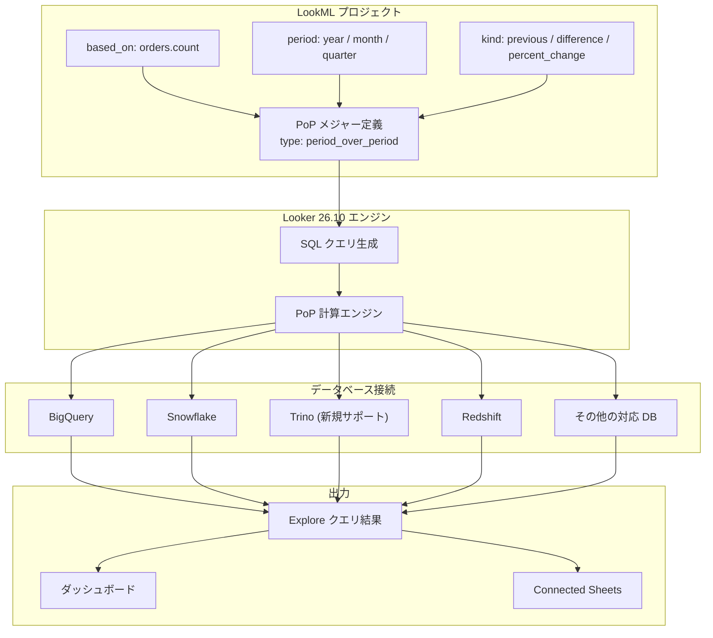

# Looker: Looker 26.10 リリース

**リリース日**: 2026-06-04

**サービス**: Looker

**機能**: Looker 26.10 Release

**ステータス**: Announcement

📊 [このアップデートのインフォグラフィックを見る](https://takech9203.github.io/google-cloud-news-summary/20260604-looker-26-10-release.html)

## 概要

Looker 26.10 は 2026 年 6 月 7 日からデプロイが開始され、6 月 21 日までに全インスタンスへの展開が完了する予定のメジャーリリースです。本リリースの最大の新機能は、Trino データベース接続における Period-over-Period (PoP) メジャーのサポートです。

PoP メジャーは、現在の期間のデータを過去の同等期間と比較する分析パターンを LookML で簡潔に定義できる機能です。これまで Trino ユーザーは PoP メジャーを利用できず、カスタム SQL やテーブル計算で代替する必要がありましたが、今回のリリースで正式にサポートされました。

また、本リリースには 20 件以上のバグ修正が含まれており、ダッシュボードの操作性、フィルター機能、PDT (Persistent Derived Tables)、ビジュアライゼーション表示など広範囲にわたる安定性の向上が実現されています。

**アップデート前の課題**

- Trino データベースを使用している場合、PoP メジャーが利用できず、前年比較・前月比較などの分析を LookML ネイティブに記述できなかった
- ダッシュボードのスクロールやタイルのリサイズに不具合があり、ユーザー体験が損なわれるケースがあった
- Save and Schedule ダイアログ、フィルターバーの幅、ドリルダウンメニューなど UI 操作に複数の問題があった
- Denodo 接続や BigQuery PDT Quickstart に技術的な問題が存在していた

**アップデート後の改善**

- Trino 接続で PoP メジャーが使用可能になり、前期比較分析を LookML で直接定義できるようになった
- ダッシュボードの操作性が大幅に改善され、スクロール・リサイズ・フィルター表示が正常に動作するようになった
- 20 件以上のバグ修正により、プラットフォーム全体の安定性と信頼性が向上した
- SSH ポート設定、Denodo 接続、BigQuery PDT Quickstart など基盤レベルの問題が解決された

## アーキテクチャ図



LookML で定義された PoP メジャーが Looker エンジンにより各データベース向けの SQL に変換され、Trino を含む対応データベースでクエリ実行される流れを示しています。

## サービスアップデートの詳細

### 主要機能

1. **Trino データベースにおける Period-over-Period (PoP) メジャーサポート**
   - Trino 接続で `type: period_over_period` メジャーが利用可能に
   - 前年比、前月比、前四半期比などの比較分析を LookML でネイティブに定義可能
   - `kind` パラメータで `previous`（前期値）、`difference`（差分）、`percent_change`（変化率）を指定可能
   - `value_to_date` サブパラメータにも対応し、期間途中の比較も正確に算出

2. **ダッシュボード操作性の改善（バグ修正群）**
   - Save and Schedule ダイアログの表示修正
   - クロスフィルターの表示修正
   - ダッシュボードスクロールの修正
   - タイルリサイズの修正
   - フィルターバーの幅の修正
   - ダッシュボードフィルターのハイライト表示修正
   - ビジュアライゼーションのオーバーフロー修正

3. **データベース接続・クエリの修正**
   - Denodo 接続の修正
   - カスタムカレンダーフィルターの SQL 修正
   - SSH ポート設定の修正
   - 結合クエリの修正
   - PoP メジャーの null-to-zero 修正
   - BigQuery PDT Quickstart の修正

4. **開発者ツール・その他の修正**
   - Markdown ファイルの保存修正
   - 派生テーブルの SQL Runner 修正
   - LookML バリデーターの修正
   - PDT Override ラベルの修正
   - Advanced Vis Config の修正

## 技術仕様

### PoP メジャーのパラメータ構成

| パラメータ | 説明 | 指定可能な値 |
|------|------|------|
| `type` | メジャータイプ | `period_over_period` |
| `based_on` | 基準メジャー | count, sum, average, min, max, median 等 |
| `based_on_time` | 基準時間ディメンション | dimension_group の timeframe |
| `period` | 比較期間 | year, quarter, month, week, day |
| `kind` | 比較種別 | previous, difference, percent_change |
| `value_to_date` | 期間途中の日付補正 | yes / no |
| `custom_calendar_period` | カスタムカレンダー期間 | custom_year, custom_quarter 等 |

### Trino で PoP メジャーを定義する LookML 例

```lookml
# Trino 接続でのPoP メジャー定義例
measure: revenue_last_year {
  type: period_over_period
  description: "前年同期の売上"
  based_on: total_revenue
  based_on_time: orders.created_year
  period: year
  kind: previous
}

measure: revenue_yoy_change {
  type: period_over_period
  description: "前年同期比の売上変化率"
  based_on: total_revenue
  based_on_time: orders.created_year
  period: year
  kind: percent_change
}

measure: revenue_ytd_last_year {
  type: period_over_period
  description: "前年同日までの累計売上"
  based_on: total_revenue
  based_on_time: orders.created_year
  period: year
  kind: previous
  value_to_date: yes
}
```

## 設定方法

### 前提条件

1. Looker インスタンスが 26.10 にアップデートされていること（デプロイ開始: 2026/6/7）
2. Trino データベースへの接続が設定済みであること
3. LookML プロジェクトが New LookML Runtime を使用していること

### 手順

#### ステップ 1: Trino 接続の確認

```
# Looker Admin パネルで確認
Admin > Database > Connections > [Trino 接続名] > Test
```

Trino 接続が正常に動作していることを確認します。Looker 26.10 へのアップデート後、PoP メジャー機能が自動的に有効になります。

#### ステップ 2: LookML で PoP メジャーを定義

```lookml
# views/orders.view.lkml に追加
view: orders {
  measure: order_count_last_month {
    type: period_over_period
    description: "前月の注文数"
    based_on: count
    based_on_time: created_month
    period: month
    kind: previous
  }

  measure: order_count_mom_change {
    type: period_over_period
    description: "前月比注文数変化率"
    based_on: count
    based_on_time: created_month
    period: month
    kind: percent_change
  }
}
```

LookML バリデーターでエラーがないことを確認し、プロジェクトをデプロイします。

#### ステップ 3: Explore でクエリを実行

Explore から PoP メジャーを選択し、時間ディメンション（`period` 以下の粒度）と組み合わせてクエリを実行します。

## メリット

### ビジネス面

- **迅速な前期比較分析**: Trino ユーザーが LookML のみで前年比・前月比分析を実現でき、カスタム SQL 開発が不要に
- **意思決定の高速化**: ダッシュボード上で直接 PoP メトリクスを確認でき、トレンド把握が容易に
- **プラットフォーム安定性**: 20 件以上のバグ修正により日常業務での摩擦が低減

### 技術面

- **LookML のシンプル化**: 複雑な Liquid テンプレートやテーブル計算を PoP メジャーに置き換え可能
- **クエリ最適化**: Looker エンジンが Trino の SQL 方言に最適化された PoP クエリを生成
- **保守性向上**: PoP ロジックが LookML レベルで一元管理され、再利用性が向上

## デメリット・制約事項

### 制限事項

- PoP メジャーは集約メジャー（count, sum, average 等）にのみ基づくことが可能で、非集約メジャーには非対応
- Aggregate Awareness、Row Totals、Subtotals、Totals とは併用不可
- コホート分析やローリング計算には非対応
- 任意の期間比較（例: 今年 5 月 vs 昨年 12 月）は不可。常に現在期間と直前期間の比較のみ

### 考慮すべき点

- New LookML Runtime が有効なプロジェクトでのみ利用可能（レガシーランタイムでは使用不可）
- PoP メジャーの `period` よりも大きい粒度の時間ディメンションとは組み合わせ不可
- Liquid パラメータは PoP メジャーのパラメータ内では直接使用不可（`based_on` 先のフィールドでは使用可能）
- デプロイは段階的に行われるため、全インスタンスで利用可能になるのは 6 月 21 日以降

## ユースケース

### ユースケース 1: EC サイトの売上前年比ダッシュボード

**シナリオ**: Trino に接続された EC プラットフォームのデータウェアハウスで、月次売上の前年比較を自動化したい。

**実装例**:
```lookml
measure: monthly_revenue_last_year {
  type: period_over_period
  description: "前年同月の売上"
  based_on: total_revenue
  based_on_time: order_created_month
  period: year
  kind: previous
}

measure: monthly_revenue_yoy_percent {
  type: period_over_period
  description: "前年同月比（%）"
  based_on: total_revenue
  based_on_time: order_created_month
  period: year
  kind: percent_change
}
```

**効果**: カスタム SQL なしで前年比較ダッシュボードを構築でき、データチームの開発工数を大幅に削減。経営層がリアルタイムで前年比のトレンドを把握可能に。

### ユースケース 2: SaaS メトリクスの MoM 分析

**シナリオ**: Trino 上の SaaS プロダクトデータベースで、アクティブユーザー数や収益の前月比較をチームダッシュボードに組み込みたい。

**実装例**:
```lookml
measure: active_users_last_month {
  type: period_over_period
  description: "前月のアクティブユーザー数"
  based_on: active_user_count
  based_on_time: activity_month
  period: month
  kind: previous
}

measure: active_users_mom_diff {
  type: period_over_period
  description: "前月比アクティブユーザー増減"
  based_on: active_user_count
  based_on_time: activity_month
  period: month
  kind: difference
}
```

**効果**: プロダクトチームが月次の成長率を即座に確認でき、施策の効果測定サイクルが短縮される。

## 料金

Looker 26.10 のアップデートは既存の Looker ライセンスに含まれており、追加料金は発生しません。

### 料金体系

| プラン | 説明 |
|--------|------|
| Looker (Google Cloud core) | Google Cloud の料金体系に準拠。PoP メジャー機能は追加費用なし |
| Looker (original) | 既存ライセンスに含まれる。PoP メジャー機能は追加費用なし |

なお、Trino への接続やクエリ実行に伴うインフラコスト（Trino クラスタの稼働費用等）は別途発生します。

## 利用可能リージョン

Looker 26.10 は全ての Looker デプロイメントに段階的に展開されます。

- **デプロイ開始**: 2026 年 6 月 7 日（日曜日）
- **最終デプロイ完了**: 2026 年 6 月 21 日（日曜日）

Looker (Google Cloud core) インスタンスは、ホストされているリージョンに関係なく順次アップデートされます。

## 関連サービス・機能

- **Trino**: オープンソースの分散 SQL クエリエンジン。大規模データレイクやデータウェアハウスへのクエリに使用
- **Looker PoP メジャー**: type: period_over_period で定義する LookML メジャータイプ。GA (一般提供) 機能
- **BigQuery**: PoP メジャーを既にサポートする Google Cloud のデータウェアハウス
- **Connected Sheets**: Looker の PoP メジャーを Google Sheets 上で利用可能にする連携機能
- **New LookML Runtime**: PoP メジャーの利用に必要な新しい LookML 実行環境

## 参考リンク

- 📊 [インフォグラフィック](https://takech9203.github.io/google-cloud-news-summary/20260604-looker-26-10-release.html)
- [公式リリースノート](https://docs.cloud.google.com/release-notes#June_04_2026)
- [Period-over-Period ドキュメント](https://docs.cloud.google.com/looker/docs/period-over-period)
- [Trino 接続設定ドキュメント](https://docs.cloud.google.com/looker/docs/db-config-prestodb-and-trino)
- [Looker 料金ページ](https://cloud.google.com/looker/pricing)

## まとめ

Looker 26.10 は Trino ユーザーにとって待望の PoP メジャーサポートをもたらすリリースです。これにより、Trino をデータ基盤として使用する組織は、カスタム SQL を書くことなく前年比・前月比などの時系列比較分析を LookML で簡潔に定義できるようになります。加えて、20 件以上のバグ修正によりプラットフォーム全体の安定性が向上しており、6 月 7 日のデプロイ開始後は速やかに新機能の活用を検討することを推奨します。

---

**タグ**: #Looker #PoP #Period-over-Period #Trino #LookML #BI #データ分析 #バグ修正 #26.10
