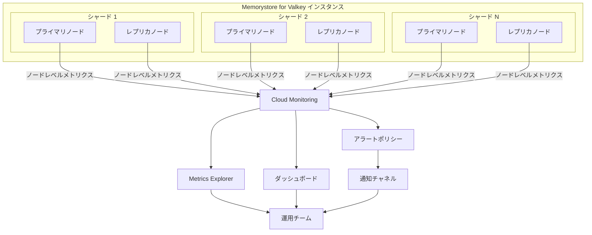

# Memorystore for Valkey: ノードレベルメトリクスの追加

**リリース日**: 2026-06-04

**サービス**: Memorystore for Valkey

**機能**: ノードレベルメトリクス (Node-Level Metrics)

**ステータス**: Preview

📊 [このアップデートのインフォグラフィックを見る](https://takech9203.github.io/google-cloud-news-summary/20260604-memorystore-valkey-node-level-metrics.html)

## 概要

Memorystore for Valkey に Cloud Monitoring 向けの追加ノードレベルメトリクスが導入されました。これらのメトリクスにより、インスタンス内の個々のノードの健全性とパフォーマンスに関する詳細なインサイトが得られます。ノードの問題をトラブルシューティングし、パフォーマンスを最適化するために使用できます。

従来の Memorystore for Valkey のモニタリングでは、インスタンスレベルの集約メトリクス（平均値や最大値）が中心でした。今回のアップデートにより、CPU 使用率、メモリ使用量、接続数、コマンド統計、永続化ステータス、レプリケーション状態など、個々のノード単位できめ細かい監視が可能になります。

この機能は、マルチシャード構成やレプリカを持つ大規模なインスタンスを運用するチームに特に有用で、ホットスポットの特定やノード単位のキャパシティプランニングを実現します。

**アップデート前の課題**

- インスタンスレベルの集約メトリクスのみが利用可能で、個々のノードのパフォーマンス問題を特定するのが困難だった
- シャード間のデータ偏りやホットスポットの検出に外部ツールや手動調査が必要だった
- 特定ノードのメモリ圧迫やレプリケーション遅延の原因特定に時間がかかっていた

**アップデート後の改善**

- 個々のノードの CPU、メモリ、接続数、コマンド統計を直接 Cloud Monitoring で確認可能になった
- ノード間のリソース使用量を比較してホットスポットを即座に特定できるようになった
- 永続化（RDB/AOF）の状態やレプリケーションのオフセットをノード単位で監視し、データ整合性の問題を早期検出できるようになった

## アーキテクチャ図



各ノードが個別にメトリクスを Cloud Monitoring に送信し、Metrics Explorer やダッシュボード、アラートポリシーを通じてノード単位の詳細なモニタリングが可能になります。

## サービスアップデートの詳細

### 主要機能

1. **クライアント接続メトリクス**
   - `instance/node/clients/connected_clients`: アクティブなクライアント接続数（レプリカ接続を除く）
   - `instance/node/clients/blocked_clients`: ブロックされたクライアント接続数
   - `instance/node/clients/tracking_clients`: サーバーサイドトラッキングに登録されたクライアント数
   - `instance/node/clients/maxclients`: 許可される最大同時接続数
   - `instance/node/clients/pubsub_clients`: Pub/Sub クライアント数（Valkey 8.0 以降）

2. **CPU・メモリメトリクス**
   - `instance/node/cpu/utilization`: CPU 使用率（0.0 - 1.0）
   - `instance/node/memory/utilization`: メモリ使用率（0.0 - 1.0）
   - `instance/node/memory/usage`: 総メモリ使用量
   - `instance/node/memory/rss_usage`: RSS（物理メモリ割り当て量）
   - `instance/node/memory/peak_usage`: ピークメモリ使用量
   - `instance/node/memory/dataset_usage`: データセットメモリ使用量

3. **コマンド統計メトリクス**
   - `instance/node/commandstats/usec_count`: コマンドごとの合計実行時間
   - `instance/node/commandstats/calls_count`: コマンドごとの呼び出し回数/分
   - `instance/node/commandstats/rejected_calls_count`: 拒否されたコマンド数
   - `instance/node/commandstats/failed_calls_count`: 失敗したコマンド数

4. **永続化メトリクス**
   - `instance/node/persistence/rdb_bgsave_in_progress`: RDB バックグラウンド保存の実行状態
   - `instance/node/persistence/rdb_last_bgsave_status`: 最後の BGSAVE の成否
   - `instance/node/persistence/aof_fsync_lag`: AOF の fsync 遅延時間
   - `instance/node/persistence/aof_last_write_status`: 最後の AOF 書き込みの成否

5. **レプリケーションメトリクス**
   - `instance/node/replication/offset`: レプリケーションオフセット（バイト）
   - `instance/node/replication/primary_sync_in_progress`: プライマリ同期の進行状態
   - `instance/node/replication/sync_full_count`: 完全再同期の回数

6. **キースペース・ネットワークメトリクス**
   - `instance/node/keyspace/total_keys`: ノードに格納されているキーの総数
   - `instance/node/stats/keyspace_hits_count`: 成功したキー検索数
   - `instance/node/stats/keyspace_misses_count`: 失敗したキー検索数
   - `instance/node/stats/net_input_bytes_count`: 受信ネットワークバイト数
   - `instance/node/stats/net_output_bytes_count`: 送信ネットワークバイト数

## 技術仕様

### メトリクスカテゴリ一覧

| カテゴリ | メトリクス数 | 主な用途 |
|---------|-------------|---------|
| クライアント (clients) | 8 | 接続管理、負荷分散分析 |
| サーバー (server) | 2 | 稼働状態の監視 |
| CPU | 1 | 処理負荷の監視 |
| メモリ (memory) | 14 | キャパシティプランニング、OOM 防止 |
| キースペース (keyspace) | 2 | データ分散の可視化 |
| 統計 (stats) | 17+ | トラフィック分析、エビクション監視 |
| コマンド統計 (commandstats) | 4 | スロークエリ特定、ボトルネック分析 |
| レプリケーション (replication) | 5 | データ整合性の確保 |
| 永続化 (persistence) | 20+ | バックアップ・復旧の健全性監視 |
| Bloom フィルター | 2 | Bloom フィルターのリソース監視 |
| JSON | 2 | JSON ドキュメントのリソース監視 |
| エラー統計 (errorstats) | 1 | エラー傾向の分析 |

### メトリクスのプレフィックス

```
memorystore.googleapis.com/instance/node/{category}/{metric_name}
```

全てのノードレベルメトリクスは `instance/node/` プレフィックスで統一されており、インスタンスレベルメトリクス（`instance/` 直下）と明確に区別されます。

## 設定方法

### 前提条件

1. Memorystore for Valkey インスタンスが作成済みであること
2. Cloud Monitoring API が有効化されていること
3. 適切な IAM 権限（`monitoring.viewer` ロール以上）が付与されていること

### 手順

#### ステップ 1: Cloud Console でメトリクスを確認する

```bash
# Memorystore for Valkey インスタンスの一覧を確認
gcloud memorystore instances list --location=us-central1
```

Google Cloud Console で Monitoring > Metrics Explorer に移動し、リソースタイプとして「Memorystore Instance」を選択します。

#### ステップ 2: Metrics Explorer でノードレベルメトリクスを表示する

```bash
# gcloud CLI でメトリクスディスクリプターを確認
gcloud monitoring metrics-descriptors list \
  --filter='metric.type=starts_with("memorystore.googleapis.com/instance/node/")'
```

Metrics Explorer で以下の手順でノードレベルメトリクスを選択します:
1. リソースタイプ: 「Memorystore Instance」を選択
2. メトリクスカテゴリ: 「Node」を選択
3. メトリクス: 目的のメトリクス（例: CPU Utilization）を選択

#### ステップ 3: アラートポリシーを作成する

```bash
# gcloud CLI でアラートポリシーを作成する例（CPU 使用率 80% 超過）
gcloud alpha monitoring policies create \
  --display-name="Valkey Node CPU Alert" \
  --condition-display-name="Node CPU > 80%" \
  --condition-filter='metric.type="memorystore.googleapis.com/instance/node/cpu/utilization" AND resource.type="memorystore.googleapis.com/Instance"' \
  --condition-threshold-value=0.8 \
  --condition-threshold-comparison=COMPARISON_GT \
  --condition-threshold-duration=300s \
  --notification-channels=projects/PROJECT_ID/notificationChannels/CHANNEL_ID
```

## メリット

### ビジネス面

- **運用コスト削減**: ノード単位の問題特定が迅速化され、MTTR（平均復旧時間）が短縮される
- **サービス品質向上**: ホットスポットを早期検出し、ユーザー影響を最小化できる
- **キャパシティプランニングの精度向上**: ノード単位のリソース使用傾向から、適切なスケーリング判断が可能になる

### 技術面

- **ホットスポット検出**: シャード間のデータ偏りやトラフィック集中を定量的に把握できる
- **詳細なトラブルシューティング**: AOF/RDB 永続化の問題やレプリケーション遅延をノード単位で診断可能
- **プロアクティブ監視**: メモリ圧迫やコネクション飽和を事前検知し、障害を未然に防止できる

## デメリット・制約事項

### 制限事項

- 現在 Preview ステータスであり、GA（一般提供）時に仕様が変更される可能性がある
- Preview 機能には SLA が適用されない
- 一部メトリクス（`pubsub_clients`、`watching_clients` など）は Valkey 8.0 以降でのみ利用可能

### 考慮すべき点

- ノードレベルメトリクスの増加により、Cloud Monitoring のメトリクス取り込み量が増加する可能性がある（ただし Google Cloud システムメトリクスは通常無料）
- 大規模インスタンス（多数のシャード・レプリカ）では、ダッシュボードのクエリ設計を適切に行う必要がある
- アラートポリシーの閾値は、ノードタイプや用途に応じて個別に調整が必要

## ユースケース

### ユースケース 1: シャード間のホットスポット検出

**シナリオ**: 6 シャード構成のインスタンスで、特定のキーパターンにアクセスが集中し、一部のシャードでレイテンシが増加している。

**実装例**:
```
# Metrics Explorer で以下を比較
リソースタイプ: Memorystore Instance
メトリクス: instance/node/cpu/utilization

# 全ノードの CPU 使用率を表示し、突出しているノードを特定
# 追加でキースペースメトリクスを確認
メトリクス: instance/node/keyspace/total_keys
# ノード間のキー分散を確認
```

**効果**: average_cpu_utilization と maximum_cpu_utilization の差が大きい場合、特定ノードに負荷が集中していることを即座に把握でき、キー設計の見直しやシャード数の調整を迅速に判断できる。

### ユースケース 2: レプリカ昇格前のデータ整合性確認

**シナリオ**: メンテナンスやフェイルオーバーの際に、レプリカノードをプライマリに昇格させる前にデータの同期状態を確認したい。

**実装例**:
```
# レプリケーションオフセットを監視
メトリクス: instance/node/replication/offset

# プライマリとレプリカのオフセット差分を確認
# sync_full_count が増加していないか確認
メトリクス: instance/node/replication/sync_full_count
```

**効果**: レプリカがプライマリと完全に同期していることを確認してから昇格を実行でき、データ損失リスクを排除できる。

### ユースケース 3: メモリ圧迫の早期検知とエビクション防止

**シナリオ**: キャッシュとして利用しているインスタンスで、特定ノードのメモリ使用率が急増し、意図しないキーエビクションが発生する前にアラートを受けたい。

**実装例**:
```
# メモリ使用率のアラートを設定
メトリクス: instance/node/memory/utilization
閾値: 0.75（75% 超過で警告）

# エビクション数の監視
メトリクス: instance/node/stats/evicted_keys_count
# 増加傾向を検知
```

**効果**: メモリ使用率 75% 超過時点で通知を受け、シャード追加やデータ整理を事前に実行することでサービス影響を回避できる。

## 料金

ノードレベルメトリクスは Cloud Monitoring のシステムメトリクスとして提供されます。Google Cloud のシステムメトリクス（`memorystore.googleapis.com/` プレフィックスのメトリクス）は、通常 Cloud Monitoring の無料枠に含まれます。

### Cloud Monitoring の料金体系

| 項目 | 料金 | 無料枠 |
|------|------|--------|
| Google Cloud システムメトリクス | 無料（非課金対象メトリクス） | 全量無料 |
| カスタムメトリクス・外部メトリクス | $0.2580/MiB（最初の 100,000 MiB） | 最初の 150 MiB/請求アカウント |
| Monitoring API 読み取り | $0.50/100 万タイムシリーズ返却 | 最初の 100 万タイムシリーズ/請求アカウント |

### Memorystore for Valkey インスタンスの料金例

| 構成 | ノード時間単価（us-central1） | 月額料金概算 |
|------|-------------------------------|-------------|
| 3 シャード, レプリカ 1（6 ノード） | $0.15384/ノード/時間 | 約 $674/月 |
| 10 シャード, レプリカ 2（30 ノード） | $0.15384/ノード/時間 | 約 $3,374/月 |

※ ノードレベルメトリクスの利用自体には追加料金は発生しません。上記はインスタンス自体の利用料金です。

## 利用可能リージョン

ノードレベルメトリクスは Memorystore for Valkey が利用可能な全リージョンで使用できます。主要なリージョン:

- **アジア太平洋**: asia-northeast1（東京）、asia-northeast2（大阪）、asia-southeast1（シンガポール）、australia-southeast1（シドニー）
- **北米**: us-central1（アイオワ）、us-east1（サウスカロライナ）、us-west1（オレゴン）
- **ヨーロッパ**: europe-west1（ベルギー）、europe-west3（フランクフルト）、europe-west4（オランダ）

※ 全 40 以上のリージョンで利用可能です。詳細は[ロケーションページ](https://docs.cloud.google.com/memorystore/docs/valkey/locations)を参照してください。

## 関連サービス・機能

- **Cloud Monitoring**: ノードレベルメトリクスの収集・可視化・アラート設定の基盤サービス
- **Cloud Logging**: Memorystore のログと組み合わせてトラブルシューティングに活用
- **Memorystore for Valkey インスタンスレベルメトリクス**: 集約メトリクス（average/maximum）による全体概要の把握
- **Memorystore for Valkey Backup/Persistence**: 永続化メトリクスと連携したデータ保護の監視

## 参考リンク

- 📊 [インフォグラフィック](https://takech9203.github.io/google-cloud-news-summary/20260604-memorystore-valkey-node-level-metrics.html)
- [公式リリースノート](https://docs.cloud.google.com/release-notes#June_04_2026)
- [サポートされるモニタリングメトリクス](https://docs.cloud.google.com/memorystore/docs/valkey/supported-monitoring-metrics)
- [インスタンスの監視ガイド](https://docs.cloud.google.com/memorystore/docs/valkey/monitor-instances)
- [料金ページ](https://cloud.google.com/memorystore/valkey/pricing)
- [Cloud Monitoring 料金](https://cloud.google.com/products/observability/pricing)

## まとめ

Memorystore for Valkey のノードレベルメトリクスにより、マルチシャード・マルチレプリカ環境における個々のノードの詳細な監視が可能になりました。ホットスポットの検出、レプリケーション状態の確認、メモリ圧迫の早期検知など、運用品質を大幅に向上させる機能です。Preview ステータスのため本番環境への全面適用には注意が必要ですが、早期に検証を開始し、GA 時にスムーズに移行できるよう準備することを推奨します。

---

**タグ**: #Memorystore #Valkey #CloudMonitoring #NodeMetrics #Preview #Observability #パフォーマンス監視
