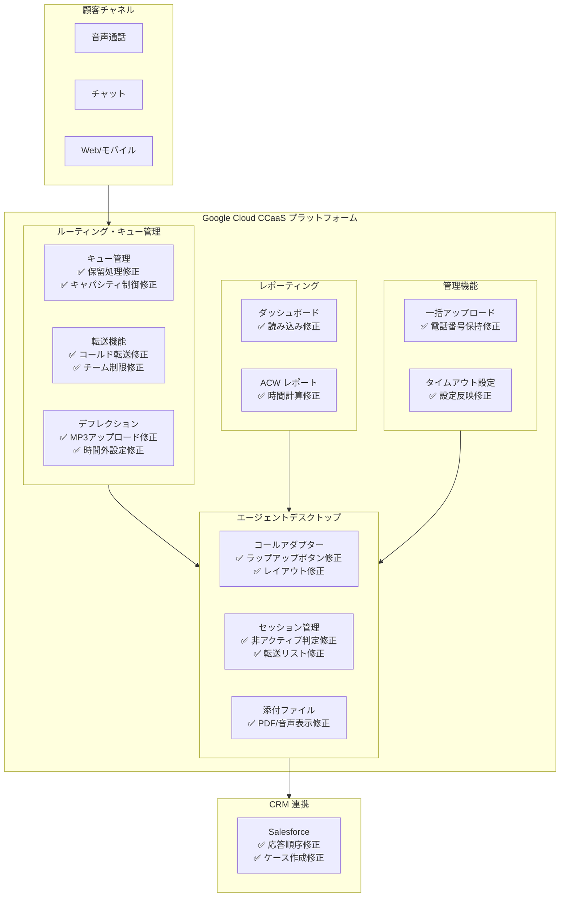

# Google Cloud CCaaS: プレリリースノート (2026年6月)

**リリース日**: 2026-06-05

**サービス**: Google Cloud Contact Center as a Service (CCaaS)

**機能**: バグ修正・改善

**ステータス**: Prerelease

📊 [このアップデートのインフォグラフィックを見る](https://takech9203.github.io/google-cloud-news-summary/20260605-ccaas-prerelease-june.html)

## 概要

Google Cloud Contact Center as a Service (CCaaS) の次期バージョンに向けたプレリリースノートが公開されました。今回のリリースでは、16件のバグ修正が含まれており、Salesforce 連携、エージェントデスクトップ、通話処理、レポーティング、キュー管理など、プラットフォーム全体にわたる安定性と信頼性の向上が図られています。

CCaaS は Google Cloud 上にネイティブに構築されたエンタープライズグレードのオムニチャネルコンタクトセンターソリューションであり、AI 駆動のルーティング、バーチャルエージェント、Agent Assist、カスタマーエクスペリエンスインサイトなどの機能を統合的に提供しています。今回の修正は、日常的なコンタクトセンター運用において発生していた重要な問題を解消するものであり、エージェントの生産性向上と顧客体験の改善に直結します。

特に注目すべきは、エージェントがアクティブな通話やチャット中にも関わらず非アクティブと判定されログアウトされてしまう問題や、保留操作後も音声が聞こえ続ける問題など、コンタクトセンター運用に深刻な影響を与えていたバグが修正された点です。

**アップデート前の課題**

- Salesforce 連携時にバーチャルエージェントの応答がトランスクリプトで順序不同に表示されていた
- エージェントがアクティブな通話中に非アクティブとしてログアウトされることがあった
- 保留操作後もエージェントと発信者の間で音声が聞こえ続けていた
- チャット転送後に PDF や音声添付ファイルがエージェントに表示されなかった
- レポーティングダッシュボードが読み込まれない場合があった
- 一括ユーザーアップロード時に既存の電話番号割り当てが解除されることがあった

**アップデート後の改善**

- Salesforce 連携の安定性が向上し、トランスクリプトの順序とケース作成が正常に動作するようになった
- エージェントのセッション管理が改善され、アクティブな通話中の誤ったログアウトが解消された
- 通話保留機能が正しく動作し、音声の分離が適切に行われるようになった
- チャット転送時の添付ファイル表示が修正された
- レポーティング機能の信頼性が向上した
- ユーザー管理の一括操作における安全性が改善された

## アーキテクチャ図

上図は CCaaS プラットフォームの主要コンポーネントと、今回のリリースで修正が適用された箇所を示しています。修正はルーティング・キュー管理、エージェントデスクトップ、レポーティング、管理機能、CRM 連携の各レイヤーに跨っています。

## サービスアップデートの詳細

### 主要修正内容

#### 1. Salesforce 連携の修正

| 修正内容 | 影響 |
|----------|------|
| バーチャルエージェント応答がトランスクリプトで順序不同に表示される問題 | 顧客とバーチャルエージェントのやり取りが正しい時系列で記録される |
| バーチャルエージェントが通話に接続した際にケースが作成されない問題 | Salesforce 上で適切にケースが自動作成され、追跡が可能になる |

CCaaS の Salesforce 連携では、セッション開始時にケースを自動作成し、トランスクリプトやアクション履歴を記録する機能が提供されています。今回の修正により、バーチャルエージェント経由の通話でもこの一連のフローが正常に動作するようになりました。

#### 2. エージェントデスクトップの修正

| 修正内容 | 影響 |
|----------|------|
| アクティブな通話/チャット中に非アクティブとしてログアウトされる問題 | エージェントが対応中に切断されることがなくなる |
| 通話転送後のレイアウト不整合 | 転送操作後もデスクトップが正しく表示される |
| アウトバウンド通話後にラップアップボタンが表示されない問題 | エージェントが通話後処理を正常に完了できる |
| チャット転送後に PDF/音声添付ファイルが表示されない問題 | 転送先エージェントが完全な情報にアクセスできる |

#### 3. 通話処理・転送の修正

| 修正内容 | 影響 |
|----------|------|
| コールド転送後にエンドユーザーが誤って保留状態になる問題 | 転送完了後に顧客が即座にエージェントと通話できる |
| 保留操作後もエージェントと発信者に音声が聞こえ続ける問題 | 保留機能が正しく動作し、音声が適切にミュートされる |
| 転送制限のあるチームのエージェントがチーム未割当のエージェントに転送できない問題 | 組織のルーティングルールに基づいた柔軟な転送が可能になる |
| 利用不可のエージェントが転送リストに表示され転送が失敗する問題 | 転送先選択時に正確なエージェント可用性が反映される |

#### 4. レポーティングの修正

| 修正内容 | 影響 |
|----------|------|
| 高度なレポーティングダッシュボードが読み込まれない問題 | 管理者がリアルタイムにコンタクトセンターのパフォーマンスを監視できる |
| 第三者転送時の After Call Work (ACW) 時間が不正に高く報告される問題 | KPI レポートの正確性が向上し、適切なパフォーマンス評価が可能になる |

#### 5. キュー管理・デフレクションの修正

| 修正内容 | 影響 |
|----------|------|
| エージェントコールデフレクション用 MP3 音声ファイルがアップロードできない問題 | カスタム音声メッセージの設定が正常に行える |
| オーバーキャパシティデフレクション設定が時間外デフレクションに干渉し、通話が誤ってキューされる問題 | デフレクション設定が設計通りに独立して動作する |

#### 6. 管理機能の修正

| 修正内容 | 影響 |
|----------|------|
| 電話番号列が空白の一括ユーザーアップロードで既存の直通番号が割り当て解除される問題 | 一括操作時に既存の設定が意図せず変更されることがなくなる |
| 非アクティブタイムアウトが設定通りに機能しない問題 | タイムアウト設定が管理者の意図通りに適用される |

## メリット

### ビジネス面

- **顧客体験の向上**: 保留処理や転送処理の修正により、顧客が不要な待機やオーディオの問題に遭遇することがなくなり、CX スコアの改善が期待できる
- **エージェント生産性の向上**: アクティブ通話中の誤ログアウト解消や、ラップアップボタンの正常表示により、エージェントの業務フローが中断されなくなる
- **レポーティング精度の向上**: ACW 時間の正確な計測とダッシュボード読み込みの修正により、データに基づいた意思決定の信頼性が高まる

### 技術面

- **Salesforce 連携の安定性**: ケース作成やトランスクリプト記録が正常に動作し、CRM データの整合性が保たれる
- **転送機能の信頼性**: チーム制限やエージェント可用性の判定が正確になり、転送失敗が削減される
- **管理操作の安全性**: 一括アップロード時のデータ保護が強化され、意図しない設定変更のリスクが排除される

## デメリット・制約事項

### 制限事項

- 本リリースはプレリリース段階であり、一般提供 (GA) までに追加の変更が行われる可能性がある
- SLA はプレリリース機能には適用されない (Google Cloud CCaaS SLA のポリシーに基づく)

### 考慮すべき点

- プレリリースノートのため、正式リリース日は別途アナウンスされる
- 本番環境への適用前にステージング環境でのテストを推奨
- Salesforce 連携の修正を最大限に活用するには、CCAI Platform Salesforce パッケージが最新バージョンであることを確認する必要がある

## 関連サービス・機能

- **Gemini Enterprise for CX**: CCaaS を含む包括的な顧客体験プラットフォーム。Dialogflow CX、Agent Assist、Customer Experience Insights を統合
- **Dialogflow CX (Conversational Agents)**: バーチャルエージェントの構築・管理に使用。今回の Salesforce 連携修正はバーチャルエージェント経由の通話に影響
- **Agent Assist**: エージェントへのリアルタイム支援機能。エージェントデスクトップの修正により Agent Assist の利用体験も向上
- **Customer Experience Insights**: コンタクトセンターのインタラクション分析。レポーティング修正により、より正確なデータが Insights に供給される

## 参考リンク

- 📊 [インフォグラフィック](https://takech9203.github.io/google-cloud-news-summary/20260605-ccaas-prerelease-june.html)
- [公式リリースノート](https://docs.cloud.google.com/release-notes#June_05_2026)
- [CCaaS ドキュメント](https://cloud.google.com/contact-center/ccai-platform/docs)
- [Salesforce 連携ガイド](https://docs.cloud.google.com/contact-center/ccai-platform/docs/salesforce-integration-guide)
- [CCaaS ソリューション概要](https://cloud.google.com/solutions/contact-center-as-a-service)

## まとめ

今回の CCaaS プレリリースは、コンタクトセンター運用の信頼性を大幅に向上させる16件のバグ修正を含んでいます。特に、エージェントのアクティブセッション中のログアウト問題や保留機能の不具合は、日常運用に直接的な影響を与える重大な問題であり、その解消は現場のオペレーターと顧客双方にとって大きな改善となります。CCaaS を利用中の組織は、正式リリース後の早期適用を検討し、ステージング環境での動作確認を計画することを推奨します。

---

**タグ**: #CCaaS #ContactCenter #BugFix #GoogleCloud #Salesforce #CCAI #Prerelease
